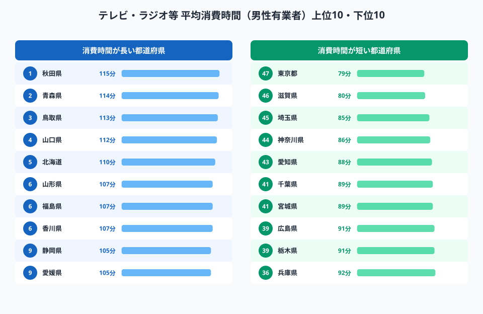
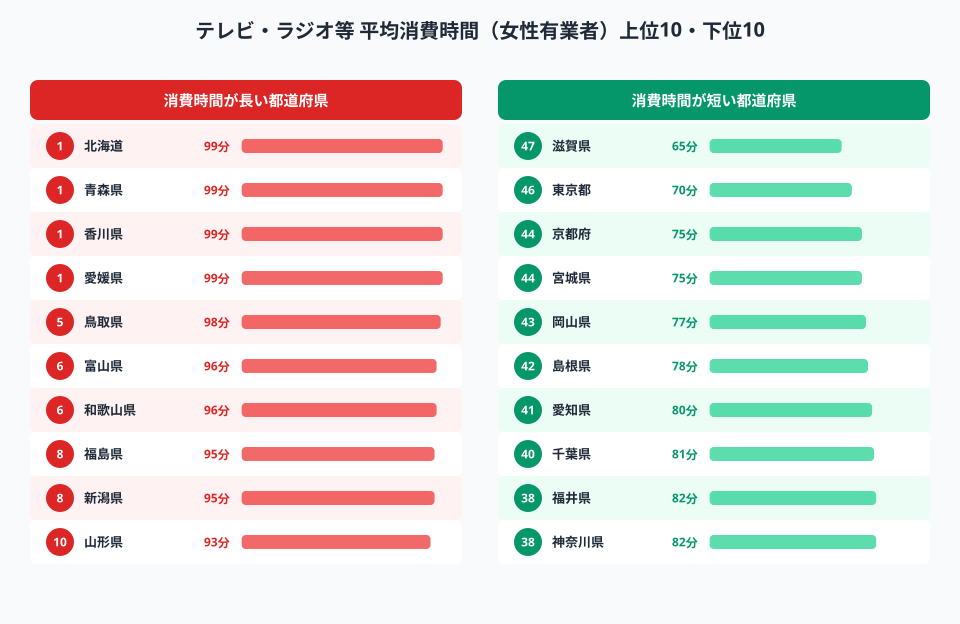
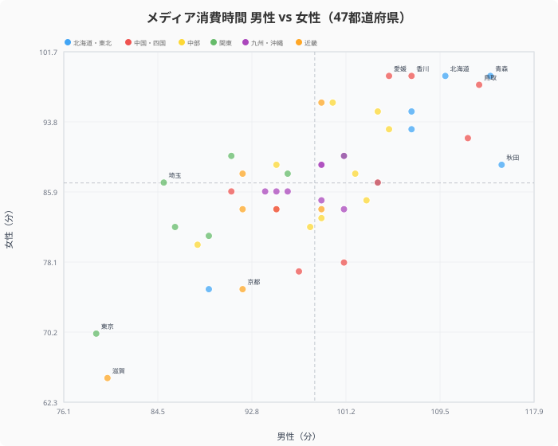
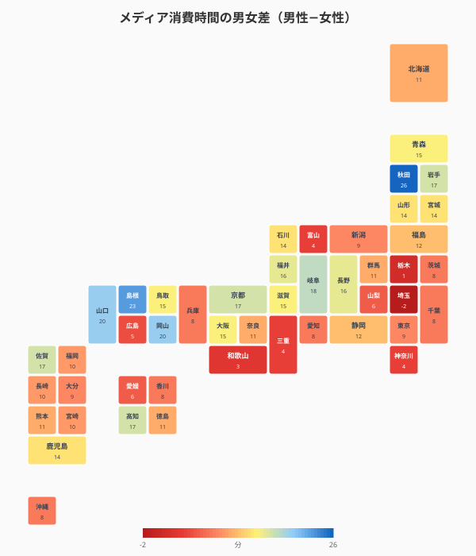
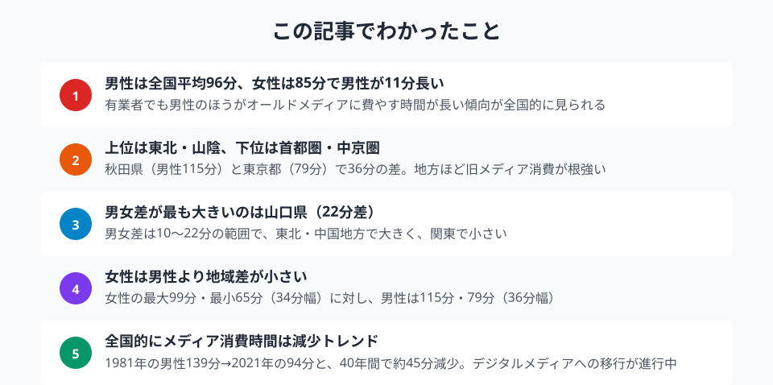

「テレビ離れ」が叫ばれて久しい現在、有業者（仕事をしている人）は1日のうち何分をテレビ・ラジオ・新聞・雑誌といった旧来型メディアに費やしているのでしょうか。

2021年の社会生活基本調査によると、全国平均は **男性96分・女性85分** 。しかし都道府県別に見ると、最も長い[秋田県](/areas/05000)の男性は **115分** に対し、最も短い東京都は **79分** と、実に36分もの開きがあります。さらに男女差も県によって大きく異なり、秋田県では男性115分・女性89分と **26分差** に及びます。

> [!NOTE]
> この統計は「テレビ・ラジオ・新聞・雑誌」の合計消費時間です。インターネット経由の動画視聴やSNSは含まれません。「有業者」は15歳以上で仕事をしている人を指します。

## 男性ランキング──上位は東北・山陰、下位は首都圏

<data-source url="https://www.e-stat.go.jp/dbview?sid=0000010213" label="e-Stat 社会生活基本調査"></data-source>

男性有業者のメディア消費時間は、秋田県（115分）、青森県（114分）、鳥取県（113分）が上位を占めます。いずれも高齢化率が高く、第一次産業の比率が比較的高い県です。農林漁業従事者は自営的な時間配分が可能なため、朝夕のテレビ視聴時間が長くなる傾向があります。

下位は東京都（79分）、[滋賀県](/areas/25000)（80分）、埼玉県（85分）と首都圏・中京圏が占めます。通勤時間が長く、可処分時間の中でテレビに割ける時間が構造的に短いことが背景にあります。

<source-link href="/ranking/average-broadcast-media-consumption-time-employed-man">47都道府県のテレビ等消費時間（男性）ランキングをもっと見る</source-link>

## 女性ランキング──北海道が1位、滋賀が最下位

<data-source url="https://www.e-stat.go.jp/dbview?sid=0000010213" label="e-Stat 社会生活基本調査"></data-source>

女性は[北海道](/areas/01000)（99分）、青森県（99分）、香川県（99分）、愛媛県（99分）が同率上位です。男性のランキングと比較すると、四国（香川・愛媛）が上位に入っている点が特徴的です。

最下位は滋賀県（65分）で、2位の東京都（70分）を大きく引き離しています。滋賀県は共働き率が全国上位にあり、女性の就労時間が長いことがメディア消費時間を短くしている可能性があります。

また、女性全体の消費時間の幅（65〜99分）は男性（79〜115分）より狭く、地域による差が男性ほど大きくないことも特徴です。

<source-link href="/ranking/average-broadcast-media-consumption-time-employed-woman">47都道府県のテレビ等消費時間（女性）ランキングをもっと見る</source-link>

<ad-slot></ad-slot>

## 男女差の地域分布──秋田県26分差、滋賀県15分差

<data-source url="https://www.e-stat.go.jp/dbview?sid=0000010213" label="e-Stat 社会生活基本調査"></data-source>

散布図で47都道府県の男性・女性の消費時間をプロットすると、ほとんどの県で **男性のほうが長い** ことがわかります。点は概ね対角線の右下側（男性＞女性）に分布しています。

男女差が最も大きいのは秋田県（男性115分、女性89分、差26分）で、島根県（男性101分、女性78分、差23分）、山口県（男性112分、女性92分、差20分）なども20分前後の差があります。一方、滋賀県（男性80分、女性65分、差15分）や東京都（男性79分、女性70分、差9分）は差が小さい県です。

<data-source url="https://www.e-stat.go.jp/dbview?sid=0000010213" label="e-Stat 社会生活基本調査"></data-source>

タイルマップで男女差の分布を見ると、東北（秋田・青森）や中国地方（島根・山口）で差が大きく、関東・近畿で差が小さい傾向が読み取れます。第一次産業比率が高い地域で男性のメディア消費がより長くなる一方、女性は就労パターンの違いにより地域差が緩和されているためと考えられます。

## デジタルメディアへの移行──40年間で45分減少

社会生活基本調査の時系列データを見ると、男性の全国平均は1981年の139分から2021年の94分へと **40年間で約45分（32%）減少** しています。女性も119分から84分へと35分減少しました。

スマートフォンの普及により、通勤時間や休憩時間にSNSや動画を視聴するライフスタイルが定着し、テレビ・新聞・雑誌の消費時間が年々短縮されています。ただし、減少幅は地方よりも都市部で大きく、メディア接触の二極化が進んでいる状況です。

> [!TIP]
> 男性トップの秋田県（115分）と最下位の東京都（79分）の差は36分。通勤時間が長く可処分時間の少ない首都圏ほどテレビ視聴時間が短くなる傾向がある。自地域のランキングは47都道府県のデータで確認できる。

<ad-slot></ad-slot>

## まとめ

有業者のオールドメディア消費時間から見えてきたポイントを整理します。

地域メディア戦略を考えるうえで、都道府県・男女別のメディア接触パターンの違いは重要な示唆を与えます。地方の高齢男性層には依然としてテレビ・新聞が強力なリーチ手段であり、都市部の若年層にはデジタルメディアが主戦場です。広告出稿やコンテンツ配信の最適化には、こうした「消費時間の地域差・男女差」のデータ活用が求められます。

## データ出典

本記事のデータはe-Stat（政府統計の総合窓口）を基に作成しています。
