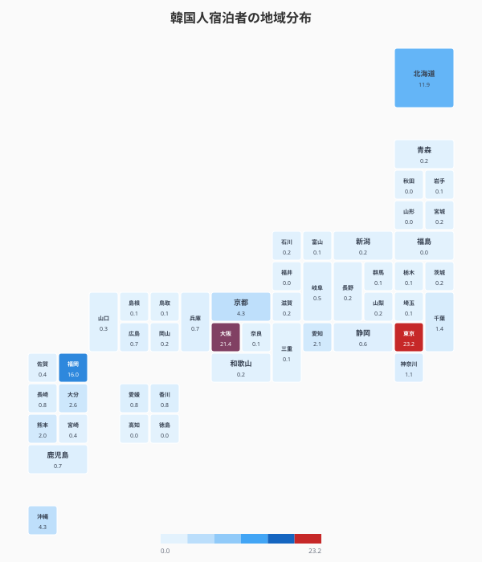
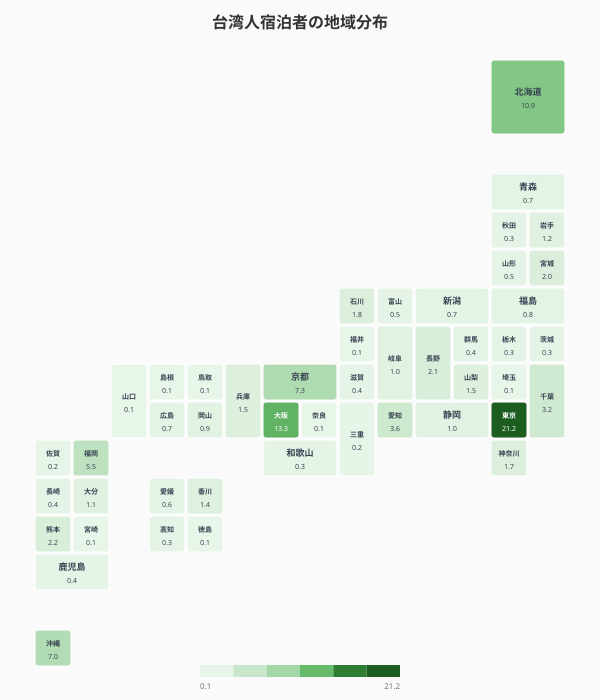
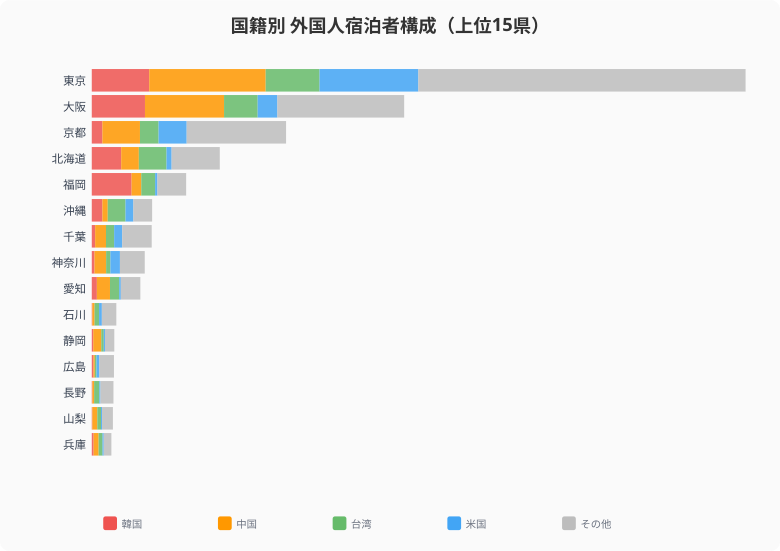
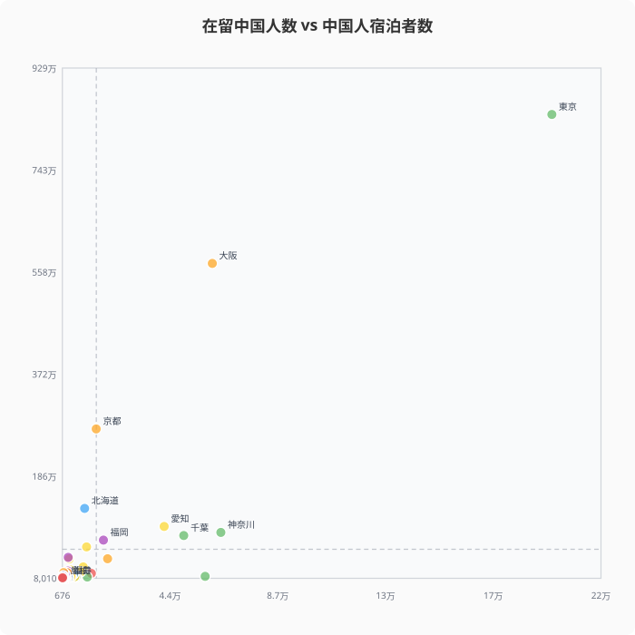
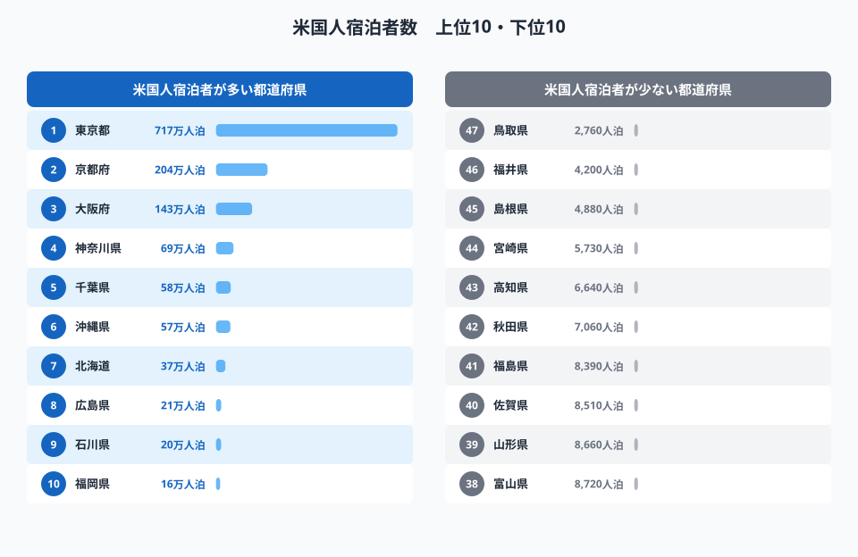
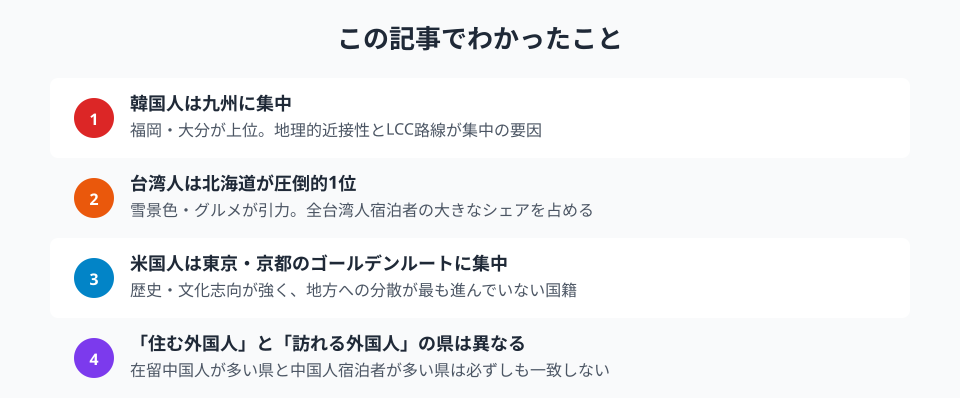

「インバウンド」と一括りにされがちな外国人観光客ですが、国籍別に宿泊先を見ると、韓国人・台湾人・中国人・米国人でまったく異なる「お気に入りの県」が浮かび上がります。韓国人は九州、台湾人は北海道、米国人は京都というように、同じ「外国人」でも引きつけられる地方はバラバラです。2024年の宿泊旅行統計調査をもとに、国籍別の宿泊パターンを分解してみると、「どの国の人を狙うか」で地方が打つべき施策がまるで変わることが見えてきます。

外国人全体で見れば、延べ宿泊者数は東京都(約4,743万人泊)・大阪府(約2,266万人泊)・京都府(約1,409万人泊)の三大都市圏が上位を独占します。けれども、その内訳を国籍ごとにほどいていくと、地方都市が特定の国の観光客にとっては「主役」になっている構図が見えてきます。本記事ではこの「国籍ごとの推し県」を、全国シェアのマップと国籍別の構成で読み解いていきます。

## 韓国人は福岡・大阪に集中──地理的近接性が生む偏り

韓国人宿泊者の地域分布を全国シェアで見ると、東京都(シェア23.2%)と大阪府(同21.4%)で大きなシェアを占めるのは他の国籍と同様ですが、特徴的なのは福岡県の存在感です。韓国人宿泊者の全国シェアで福岡県は16.0%と全国3位に入り、約289万人泊という規模を持ちます。これは東京(約417万人泊)、大阪(約386万人泊)に次ぐ水準で、福岡という一地方都市が韓国人にとっては東京・大阪と並ぶ主要目的地になっていることを意味します。

この集中を支えているのは、何よりも地理的な近さです。韓国の主要都市から福岡へはLCCで約1.5時間というアクセスの良さがあり、週末の小旅行が成立する距離感が、他の国籍では見られない福岡への厚いシェアを生んでいます。福岡に続いて大分県(温泉)、長崎県(対馬への近接性)も韓国人の人気が比較的高く、九州全体が韓国人観光客の「裏庭」のような位置づけになっています。逆に言えば、九州の自治体にとって韓国市場は最も取り込みやすいインバウンド層であり、ハングル対応や直行便の維持がそのまま集客に直結する関係にあります。

<source-link href="/ranking/total-overnight-guests-foreign">47都道府県の外国人延べ宿泊者数ランキングをもっと見る</source-link>

> [!NOTE]
> ここでの「全国シェア」は、その国籍の延べ宿泊者数を全国合計で割った構成比です。県ごとの絶対値ではなく「その国の旅行者がどの県に偏って泊まっているか」を示す指標なので、人口や面積の大きさとは別に「嗜好の集中度」が読み取れます。

## 台湾人は北海道が圧倒的──「雪」と「食」が引力に

台湾人宿泊者の分布を見ると、東京(全国シェア21.2%)と大阪(同13.3%)に次いで[北海道](/areas/01000)が全国シェア10.9%で3位に入り、約201万人泊という規模になります。[沖縄県](/areas/47000)(全国シェア7.0%・約129万人泊)も上位に食い込んでおり、台湾人は「雪の北海道」と「ビーチの沖縄」という気候の両極を同時に好む、独特の地方嗜好を示します。

なぜ北海道がここまで強いのか。台湾は亜熱帯気候で雪がほとんど降らないため、雪景色そのものが強い観光資源になります。冬のニセコや旭川のパウダースノー、雪まつりといった「台湾では絶対に体験できない冬」が、台湾人を北海道へ引き寄せる最大の引力です。さらに北海道の海産物・乳製品・果物といった「食」のブランドも台湾で高く認知されており、雪と食の二本柱が北海道への厚いシェアを支えています。一方の沖縄は、台湾本島から最短の「海外ビーチ」という近接性が効いています。北海道と沖縄という正反対の県が同じ国籍の上位に並ぶのは、台湾市場ならではの構造です。

<source-link href="/ranking/total-overnight-guests-foreign">47都道府県の外国人延べ宿泊者数ランキングをもっと見る</source-link>

> [!TIP]
> 台湾人の北海道・沖縄志向は「季節」と強く結びついています。北海道は冬(雪)に、沖縄は通年(海)にピークが立つため、同じ台湾市場でも狙う季節で訴求すべき県が入れ替わります。年間の集客を平準化したい地方なら、台湾向けには「冬は雪、夏は別の体験」と季節で打ち分ける発想が有効です。

<ad-slot></ad-slot>

## 国籍ミックスで見る各県の「インバウンド体質」

外国人宿泊者数の上位県について、韓国・中国・台湾・米国の国籍別構成を見ると、県ごとにまったく異なるミックスが浮かび上がります。同じ「インバウンドの多い県」でも、誰が来ているかは大きく違うのです。

- **東京都**:中国人(約845万人泊)と米国人(約717万人泊)が突出し、多国籍がバランスよく集まる「総合型」です
- **大阪府**:韓国人(約386万人泊)の比率が東京より高く、関西空港に集まるLCC路線の影響が色濃く出ています
- **京都府**:米国人(約204万人泊)の比率が他県より高く、歴史・文化志向の旅行者を強く引きつけています
- **福岡県**:韓国人(約289万人泊)が突出し、特定国への依存度が際立つ「韓国特化型」です
- **北海道**:台湾人(約201万人泊)と韓国人(約214万人泊)がバランスよく集まり、アジア各国の自然志向を吸収しています

このように、県ごとの「インバウンド体質」は一様ではありません。多国籍をバランスよく集める東京・北海道のような県もあれば、福岡のように特定国に大きく依存する県もあります。依存度が高い県は、その国の景気や為替、地政学リスクの影響を受けやすいという弱点も抱えます。自県の宿泊者がどの国籍に偏っているかを知ることは、リスク分散の観点からも重要です。

## 「住む外国人」と「訪れる外国人」は別の県が好き

在留中国人数(2020年国勢調査)と中国人宿泊者数(2024年)の関係を散布図で見ると、東京都は両方で突出して高いものの、それ以外の県では必ずしも強い相関は見られません。例えば在留中国人が多い埼玉県・千葉県は宿泊者数では上位に入らず、逆に京都府は在留中国人が少ないにもかかわらず宿泊者数は多いという、ねじれた関係が現れます。

このズレは、「住む」場所と「訪れる」場所が別の論理で選ばれていることを示しています。住む県は雇用・家賃・既存コミュニティの有無といった生活コストで選ばれるのに対し、訪れる県は観光資源の魅力で選ばれます。京都が好例で、生活拠点としては選ばれにくくても、寺社や町並みといった観光資源が中国人旅行者を強く引きつけます。逆に首都圏近郊のベッドタウンは、住むには合理的でも観光目的地としては選ばれません。つまり在留外国人の分布をそのまま観光誘致のターゲット地図として使うと判断を誤る、という実務的な教訓がここにあります。

> [!WARNING]
> この散布図は在留データ(2020年国勢調査)と宿泊データ(2024年)で集計年が4年ずれているため、厳密な相関分析ではなく傾向の参考として読んでください。また、相関の弱さは「住む論理と訪れる論理が違う」ことを示唆するものであって、因果関係を断定するものではありません。

<ad-slot></ad-slot>

## 米国人は東京・京都のゴールデンルートに集中

米国人宿泊者のランキングを見ると、東京都(約717万人泊)が圧倒的で、2位の京都府(約204万人泊)との間にも大きな差があります。3位の大阪府(約143万人泊)まで含めた「ゴールデンルート」3都府で米国人宿泊者の大部分を占めており、地方分散が4カ国籍のなかで最も進んでいない国籍です。下位には鳥取県(約2,760人泊)・福井県(約4,200人泊)・島根県(約4,880人泊)が並び、上位と下位で2,000倍を超える極端な差が開いています。

米国人がゴールデンルートに集中する背景には、日本までの飛行時間が長く滞在日数も限られるなかで、「初来日で外せない定番」を効率よく回るパッケージ志向が働いています。東京の都市体験と京都の歴史・文化が、英語圏の旅行者にとって最も認知度の高い「日本らしさ」であり、まずはここを押さえたいという需要が地方分散を抑えています。裏を返せば、米国市場で地方に客を呼び込むには、ゴールデンルートに匹敵する強い物語性と英語での情報発信が不可欠だということです。歴史・自然・食といった地方独自の資源を「定番の次に行く価値がある場所」として翻訳できるかが、米国インバウンドの地方分散のカギになります。

<source-link href="/ranking/total-overnight-guests-foreign">47都道府県の外国人延べ宿泊者数ランキングをもっと見る</source-link>

## まとめ

国籍別の宿泊データから読み取れる主なポイントを整理します。

「インバウンド対策」を考えるとき、「どの国からの観光客を狙うか」で打つべき施策は大きく変わります。韓国人をターゲットにするなら九州のアクセス強化、台湾人なら北海道・沖縄の自然体験、米国人なら歴史文化コンテンツと英語発信の充実といったように、国籍別のデータを読み解くことが、効果的な地方インバウンド戦略の第一歩になります。自県を訪れているのがどの国の人々かを知り、その国の嗜好に合わせて資源を磨くことが、限られた予算で成果を出す近道です。より広い文脈は[国際カテゴリの統計](/category/international)も合わせてご覧ください。

**データ出典:**
- [宿泊旅行統計調査（e-Stat）](https://www.e-stat.go.jp/stat-search/files?stat_infid=000040199338)（2024年）
- [国勢調査（e-Stat）](https://www.e-stat.go.jp/stat-search/files?stat_infid=000032142404)（2020年・在留外国人）

## データ出典

本記事のデータはe-Stat（政府統計の総合窓口）を基に作成しています。
