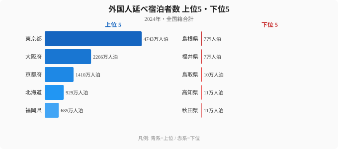

「インバウンド」とひと括りにされがちな外国人観光客ですが、国籍別に宿泊先を見ると様相は一変します。韓国人・台湾人・中国人・米国人で、まったく異なる「お気に入りの県」が存在するのです。同じ外国人観光客でも、どの国から来たかによって滞在する地域が大きく変わる──このパターンを知っているかどうかで、地方の集客戦略は根本から変わります。2024年の宿泊旅行統計調査をもとに、国籍別の宿泊パターンを読み解いていきます。

## 全国籍を合わせると東京・大阪・京都に集中する

まず全国籍を合計した外国人延べ宿泊者数で、47都道府県の地図を描いてみます。最上位は東京都で、大阪府・京都府・北海道・福岡県がそれに続きます。一方で下位には日本海側や四国の県が並び、上位と下位では桁が大きく異なります。

上位がこの顔ぶれになる理由は明快です。東京都と大阪府は国際線の発着拠点であり、到着したその日に泊まる「ゲートウェイ需要」を一手に引き受けています。京都府は歴史・文化資源、北海道は自然と食、福岡県はアジアからの近接性と、それぞれ別の引力で外国人を呼び込んでいます。逆に下位に沈むのは、国際線の直行便が乏しく、宿泊施設の規模も限られる県です。観光資源そのものではなく「外国人が泊まる動線に乗っているか」が、宿泊者数を分けているのです。ただし、この全国籍合計の順位は、あくまで4カ国籍を含むさまざまな国の合算であり、国籍ごとに分解すると景色が一変します。

> [!NOTE]
> 延べ宿泊者数とは「宿泊した人数 × 泊数」で数える指標です。3泊した1人は3人泊とカウントされます。したがって滞在日数の長い旅行者が多い県ほど数字が膨らみやすく、来訪した「実人数」とは必ずしも一致しません。

<source-link href="/ranking/total-overnight-guests-foreign">47都道府県の外国人延べ宿泊者数ランキングをもっと見る</source-link>

## 韓国人は福岡・大阪に集中──地理的近接性が生む偏り

韓国人宿泊者の地域分布を見ると、東京都と大阪府で大きなシェアを占めるのは他の国籍と同様ですが、特徴的なのは福岡県の存在感です。韓国人宿泊者数で福岡県は約289万人泊と全国3位に入り、東京（約417万人泊）、大阪（約386万人泊）に次ぐ規模を持ちます。全国籍合計では福岡が上位5位グループの最後尾だったことを思い出すと、韓国人にとっての福岡の重みが際立ちます。

この集中を支えているのは、韓国から福岡へLCCで約1.5時間というアクセスの良さです。週末の「ちょっと福岡へ」という近距離旅行が成立する距離感が、宿泊者数を押し上げています。さらに大分県（温泉）、長崎県（対馬の近接性）も韓国人の人気が比較的高く、九州全体が韓国人にとっての裏庭のような位置づけになっています。韓国人をターゲットにするなら、東京・大阪よりもまず九州の受け入れ態勢を磨くほうが効率的だ、という戦略上の含意がここから読み取れます。

> [!TIP]
> 国籍別の地方嗜好は「距離」と「気候」のどちらが効くかで読み分けると見通しが良くなります。韓国は距離が、台湾は気候が、米国は文化が主要因です。同じ「人気の県」でも、引力の正体は国籍ごとに別物なのです。

## 台湾人は北海道が圧倒的──「雪」と「食」が引力に

台湾人宿泊者の分布を見ると、東京（約391万人泊）と大阪（約244万人泊）に次いで[北海道](/areas/01000)（約201万人泊）が3位に入ります。[沖縄県](/areas/47000)（約129万人泊）も上位で、台湾人は「雪の北海道」と「ビーチの沖縄」という両極を好む傾向があります。距離だけで決まるなら台湾に近い沖縄・九州に偏りそうですが、実際には遠い北海道が上位に来る点に、台湾人の嗜好の特徴が表れています。

その背景にあるのは気候への憧れです。台湾は亜熱帯気候のため雪に対する憧れが強く、冬の北海道ニセコや旭川が人気を集めています。粉雪のスキー場と海鮮・乳製品といった「食」が組み合わさり、台湾人にとって北海道は特別な目的地になっています。京都（約135万人泊）も台湾人には根強い人気があり、雪・海・古都という多彩な目的地を使い分けているのが台湾人旅行者の姿です。北海道や沖縄の観光地にとって、台湾は最優先で口説くべき市場だと言えます。

## 国籍ミックスで見る各県の「インバウンド体質」

外国人宿泊者数の上位の県について、韓国・中国・台湾・米国の国籍別構成を見ると、県ごとにまったく異なるミックスが浮かび上がります。同じ「インバウンドが多い県」でも、その中身は国籍によって大きく異なるのです。

- **東京都**：中国人（約845万人泊）と米国人（約717万人泊）が突出し、多国籍がバランスよく集まります
- **大阪府**：韓国人（約386万人泊）の比率が東京より高く、LCC路線の影響が色濃く出ています
- **京都府**：米国人（約204万人泊）の比率が他県より高く、歴史・文化志向の旅行者を引き寄せています
- **福岡県**：韓国人（約289万人泊）が突出し、韓国依存度の高さが際立ちます
- **北海道**：台湾人（約201万人泊）と韓国人（約214万人泊）がバランスよく集まります

この構成の違いは、各県が「どの国の景気や為替、航空路線に左右されやすいか」を示しています。韓国依存度の高い福岡は韓国の景気変動の影響を受けやすく、米国比率の高い京都は円ドル相場の影響を受けやすい、といった具合に、インバウンドの「体質」は県ごとに異なります。一つの国に偏った県ほど、その国の事情が変わったときの振れ幅が大きくなる点には注意が必要です。

> [!WARNING]
> 国籍別の比率が高いことは、裏を返せばその国への依存リスクが高いことを意味します。福岡のように特定国籍への集中度が高い県は、相手国の経済情勢・為替・路線運休といった外的要因で宿泊者数が大きく変動しやすく、好調なときの数字だけで安定性を判断するのは禁物です。

## 「住む外国人」と「訪れる外国人」は別の県が好き

在留中国人数と中国人宿泊者数の関係を見ると、東京都は両方で突出して高いものの、それ以外の県では必ずしも関係が強くありません。例えば、在留中国人が多い埼玉・千葉は宿泊者数では上位に入らず、逆に京都は在留中国人は少ないものの宿泊者数は多いという、ねじれた関係が見られます。

これは「住む」場所は雇用や生活コストで選ばれ、「訪れる」場所は観光資源で選ばれるという、異なる要因が働いていることを意味します。在留外国人が多いからといって、その県が観光地として外国人に人気とは限りません。地方が在留外国人コミュニティを観光誘客に活かそうとする場合、この二つの動機の違いを踏まえないと施策が空振りに終わります。「住む理由」と「訪れる理由」は別物だという前提が、地方インバウンド戦略の出発点になります。

> [!NOTE]
> 在留外国人データは2020年国勢調査、宿泊者データは2024年の統計に基づきます。両者には4年の差があるため、厳密な対応ではなく傾向を読む参考として扱ってください。コロナ禍を挟んでいる点にも留意が必要です。

## 米国人は東京・京都のゴールデンルートに集中

米国人宿泊者を見ると、東京都（約717万人泊）が圧倒的で、2位の京都府（約204万人泊）との間にも大きな差があります。さらに3位の大阪府（約143万人泊）まで含めた「ゴールデンルート」3都府で米国人宿泊者の大部分を占めており、地方分散が最も進んでいない国籍だと言えます。

米国人がこの3都府に集中する理由は、初来日が多く「定番ルート」を選びがちなこと、そして滞在日数が長く東京・京都・大阪を周遊しやすいことにあります。歴史・文化コンテンツへの関心が高い一方で、未知の地方へ足を伸ばすには情報や交通のハードルが残っています。逆に言えば、英語対応の整った歴史文化コンテンツを地方が用意できれば、米国人を3都府の外へ誘導できる伸びしろが大きい、ということでもあります。国籍ごとに「すでに分散している市場」と「これから分散させる市場」を見分けることが、効果的な誘客の鍵になります。

## まとめ

国籍別の宿泊データから読み取れる主なポイントを整理します。

- 全国籍合計では東京・大阪・京都・北海道・福岡が上位を占め、国際線の動線に乗る県が強い
- 韓国人は福岡（約289万人泊・全国3位）など九州に集中し、距離の近さが効いている
- 台湾人は北海道（約201万人泊・3位）を強く好み、雪と食という気候・文化が引力になっている
- 米国人は東京・京都・大阪のゴールデンルート3都府に集中し、地方分散が最も遅れている
- 「住む外国人」と「訪れる外国人」は別の県を好み、在留分布から観光人気は読めない

「インバウンド対策」を考えるとき、「どの国からの観光客を狙うか」で打つべき施策は大きく変わります。韓国人をターゲットにするなら九州のアクセス強化、台湾人なら北海道・沖縄の自然体験、米国人なら歴史文化コンテンツの充実といったように、国籍別のデータを読み解くことが、効果的な地方インバウンド戦略の第一歩になります。各県のインバウンド体質を知ることが、限られた予算を最も効く市場に振り向ける近道なのです。

## データ出典

本記事のデータはe-Stat（政府統計の総合窓口）を基に作成しています。

- 宿泊旅行統計調査（観光庁、e-Stat 経由整備）2024年
- 国勢調査（総務省、e-Stat 経由整備）2020年・在留外国人
- 対象データのカテゴリ一覧: [国際カテゴリ](/category/international)
