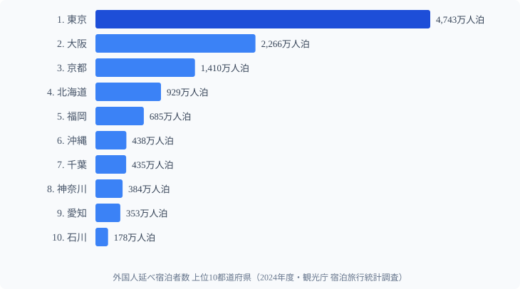
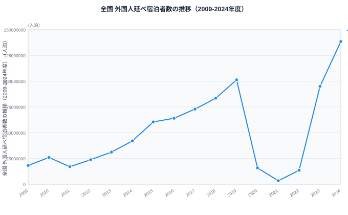

「インバウンドは戻った」――2024年、街なかで外国人観光客を見ない日はなくなった。実際、**外国人延べ宿泊者数は全国で1億3,852万人泊（2024年度）と過去最多**を記録し、コロナ前の2019年度（1億130万人泊）すら37%上回った。

だが「戻った」のは日本全体の話だ。**戻った先がどこか**は、まったく別の問題である。

外国人延べ宿泊者数を都道府県別に並べると、1位の**東京都が4,743万人泊**なのに対し、最下位の**島根県はわずか6.8万人泊**。その差は**700.9倍**にのぼる。同じ「インバウンド回復」でも、見ている景色は県によって700倍違う。本記事では、V字回復の裏で進んだ「回復の一極集中」を、都道府県データから読み解く。

> [!NOTE]
> 本記事の数値は観光庁「宿泊旅行統計調査」（e-Stat 経由で整備）の**外国人延べ宿泊者数**を用いる。「延べ宿泊者数」は「宿泊した人数 × 泊数」で数える指標で、単位は**人泊**（1人が2泊すれば2人泊）。実人数ではない点に注意。

## 外国人延べ宿泊者数 上位10都道府県（2024年度）

| 順位 | 都道府県 | 外国人延べ宿泊者数 |
|---|---|---|
| 1 | 東京都 | 4,743万人泊 |
| 2 | 大阪府 | 2,266万人泊 |
| 3 | 京都府 | 1,410万人泊 |
| 4 | 北海道 | 929万人泊 |
| 5 | 福岡県 | 685万人泊 |
| 6 | 沖縄県 | 438万人泊 |
| 7 | 千葉県 | 435万人泊 |
| 8 | 神奈川県 | 384万人泊 |
| 9 | 愛知県 | 353万人泊 |
| 10 | 石川県 | 178万人泊 |

上位の顔ぶれは「玄関口（東京・千葉＝成田）」「西の二大都市（大阪・京都）」「広域観光地（北海道・沖縄）」「九州のハブ（福岡）」に整理できる。注目すべきは**集中度**だ。**東京・大阪・京都の上位3都府県だけで全国の60.8%**を占め、東京単独でも全国の34.2%を吸い上げている。インバウンドは「47都道府県に薄く広がる」のではなく、ごく一部の都市に深く積み上がる構造になっている。

<source-link href="/ranking/total-overnight-guests-foreign">外国人延べ宿泊者数ランキングの全47都道府県を見る</source-link>

10位の石川県（178万人泊）は人口規模に対して突出している。同じく京都府が日本人を含む総宿泊では大都市圏に及ばないのに外国人宿泊では3位に入るように、**「都市の規模」より「ブランド化された観光地かどうか」**が訪日客の行き先を分けていることが上位の並びから読み取れる。

## 最下位グループ：なぜ地方は「インバウンド空白地帯」なのか

| 順位 | 都道府県 | 外国人延べ宿泊者数 |
|---|---|---|
| 43 | 秋田県 | 10.8万人泊 |
| 44 | 高知県 | 10.7万人泊 |
| 45 | 鳥取県 | 9.8万人泊 |
| 46 | 福井県 | 7.3万人泊 |
| 47 | 島根県 | 6.8万人泊 |

最下位5県は、**山陰（鳥取・島根）・北陸の一部（福井）・日本海側／太平洋側の地方（秋田・高知）**に集中する。共通点は「国際線が就航する大空港から遠い」「広域に知られた目的地ブランドが弱い」「夜行・周遊ルートの幹線から外れている」ことだ。

最下位の島根県6.8万人泊は、1位東京（4,743万人泊）の**約700分の1**でしかない。出雲大社をはじめ観光資源は豊富だが、訪日客の「初回・2回目」の周遊ルート（ゴールデンルートや北海道・沖縄）に組み込まれにくく、アクセスの壁が宿泊数に直結している。

> [!WARNING]
> 「延べ宿泊者数」は宿泊施設に泊まった人泊数であり、**日帰り客やクルーズ船の寄港**は基本的に含まれない。港湾を持つ県では実際の訪問者数より宿泊指標が小さく出る場合がある。また山陰・四国は近隣の大都市（大阪・福岡・広島など）に宿泊して日帰りで訪れる「通過観光」が起きやすく、宿泊者数が訪問実態を過小評価している可能性がある。

<source-link href="/ranking/total-overnight-guests">延べ宿泊者数（日本人含む全体）ランキングと比べる</source-link>

## V字回復の正体：97%消えて、過去最多まで戻った

インバウンド宿泊のこの5年は、統計史でも稀な乱高下だった。全国の外国人延べ宿泊者数の推移を見てみよう。

- **2019年度**：1億130万人泊（コロナ前のピーク）
- **2021年度**：344万人泊（**ピーク比 ▲96.6%**、ほぼ消滅）
- **2024年度**：1億3,852万人泊（**過去最多・2019年比 +36.7%**）

国境がほぼ閉じた2021年度には、外国人宿泊はピークの3.4%まで落ち込んだ。それがわずか3年で過去最多を更新した。この「97%消えて、ピーク超えまで戻る」振れ幅の大きさこそ、インバウンド市場の不安定さと爆発力の両面を象徴している。

> [!TIP]
> V字回復の主因は需要だけではない。円安（為替）による割安感が、滞在日数と1人あたり消費を押し上げた。同じ「客数」でも、円安局面では人泊・消費額が膨らみやすい。回復のドライバーが「来訪意欲」なのか「為替」なのかで、今後の持続性は変わる。

## 発見：回復は均一ではなく「勝ち組」と「取り残された県」を生んだ

全国がピークを超えても、**すべての県がピークを超えたわけではない**。2019年度と2024年度を比べると、回復の度合いは県ごとに大きく割れた。

**回復の勝ち組（2019年度比で大きく伸びた県）**

- 石川県：92.7万 → 178.2万人泊（**1.92倍**、順位も17位 → 10位へ上昇）
- 福岡県：378.8万 → 685.0万人泊（**1.81倍**、7位 → 5位）
- 東京都：2,796万 → 4,743万人泊（**1.70倍**）

**取り残された県（2019年度を下回ったままの県）**

- 沖縄県：542.3万 → 438.0万人泊（**0.81倍**、5位 → 6位へ後退）
- 島根県：7.1万 → 6.8万人泊（**0.95倍**、47位のまま）

東京・大阪・京都・福岡といった「都市・空港ハブ」がコロナ前を大きく超える一方、**沖縄のような航空依存・国際チャーター便依存の観光地は、便数回復の遅れがそのまま宿泊数の伸び悩みに直結した**と読める。上位3都府県の全国シェアは2015年度の49.8%から2024年度の60.8%へ上昇しており、**回復過程でむしろ集中が進んだ**ことがデータから確認できる。

> [!NOTE]
> **[仮説]** 沖縄が2019年度を下回るのは、国際線（とくにチャーター・LCC）の便数・路線の回復が大都市空港より遅れたことが一因の可能性がある。**検証方法**：国土交通省の空港別国際線旅客便数（路線別）と沖縄県の月次宿泊統計を突き合わせ、便数回復率と宿泊回復率の相関を確認する。便数が2019年水準に戻っていなければ仮説を支持、戻っているのに宿泊が低いなら別要因（クルーズ転換・1人あたり泊数の変化など）を探る。

<source-link href="/ranking/room-utilization-rate">客室稼働率ランキングで「泊まれているか」を確認する</source-link>

## まとめ：数字で見る「インバウンド回復の地図」

- **1位は東京都（4,743万人泊）**。全国の34.2%を1都だけで占める
- **最下位は島根県（6.8万人泊）**。東京との差は**700.9倍**
- 上位3都府県（東京・大阪・京都）で全国の**60.8%**。回復は大都市に一極集中
- 全国は**2021年度に344万人泊（ピーク比▲96.6%）まで激減**し、**2024年度に1億3,852万人泊で過去最多**へV字回復
- 回復は不均一。**石川（1.92倍）・福岡（1.81倍）が躍進**する一方、**沖縄（0.81倍）は2019年度を下回ったまま**

「インバウンドが戻った」という言葉は正しい。だがその恩恵がどの県に落ちたかを見ると、回復は地域格差を縮めるどころか広げていた。次の論点は「いかに地方へ波及させるか」である。

## データ出典

- 観光庁「宿泊旅行統計調査」（外国人延べ宿泊者数、e-Stat 経由で整備）
- 集計年度：2024年度（推移は2009〜2024年度）
- 単位：人泊（宿泊人数 × 泊数）

## 関連ランキング

- [外国人延べ宿泊者数ランキング（47都道府県）](/ranking/total-overnight-guests-foreign)
- [延べ宿泊者数（日本人含む全体）ランキング](/ranking/total-overnight-guests)
- [客室稼働率ランキング](/ranking/room-utilization-rate)
- [ホテル・旅館の客室数ランキング](/ranking/number-of-hotel-rooms)
- [観光資源数ランキング](/ranking/tourism-resource-count)
- [観光・運輸カテゴリの全ランキング](/category/tourism)
- 上位・下位県の横顔：[東京都のプロフィール](/areas/13000) ／ [京都府のプロフィール](/areas/26000) ／ [石川県のプロフィール](/areas/17000) ／ [島根県のプロフィール](/areas/32000)
