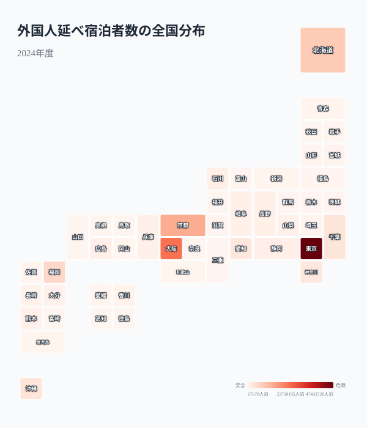

訪日外国人数が過去最高を更新し続けるなかで、外国人の宿泊先は本当に地方へ分散しているのでしょうか。2024年度の宿泊旅行統計調査を都道府県別に分析すると、上位4都府道県だけで全体の約67.5%を占める「インバウンドの偏在」がくっきりと浮かび上がります。さらに外国人宿泊比率で見ると、東京や京都では宿泊者の半数前後が外国人という、絶対数とは別のオーバーツーリズム問題が見えてきます。本記事では、絶対数・比率・推移の3つの角度から、地方分散がなぜ進まないのかを読み解きます。

## 外国人延べ宿泊者数ランキング -- 圧倒的な東京・大阪と、伸び悩む地方県

2024年度の外国人延べ宿泊者数は全国合計で約1.39億人泊でした。都道府県別に見ると、[東京都](/areas/13000)が約4,743万人泊で圧倒的な1位を占めます。2位の大阪府（約2,266万人泊）、3位の京都府（約1,410万人泊）、4位の北海道（約929万人泊）と続き、この上位4都府道県だけで全国合計の約67.5%に達します。

上位の顔ぶれは、国際線ハブ空港（成田・羽田・関西）と新幹線の結節点に重なります。東京・大阪・京都は「ゴールデンルート」と呼ばれる定番周遊コースを形成し、北海道・福岡・沖縄は直行国際線とLCC路線が太い玄関口です。つまり上位県は「外国人が自力でたどり着きやすい県」であり、空港アクセスと交通網の太さがそのまま宿泊数に直結しているのです。

一方、下位に目を向けると[島根県](/areas/32000)（約7万人泊）、福井県（約7万人泊）、鳥取県（約10万人泊）など、上位との差は数百倍にもなります。1位東京都（約4,743万人泊）と最下位島根県（約7万人泊）の差は約700倍です。これらの県は国際線の直行便が乏しく、周遊ルートからも外れているため、外国人にとって「乗り継ぎの先のさらに先」になりがちです。地方分散が長く叫ばれていますが、データは依然として一部の都市圏への集中構造を示しています。

<source-link href="/ranking/total-overnight-guests-foreign">47都道府県の外国人延べ宿泊者数ランキングをもっと見る</source-link>

> [!WARNING]
> 「延べ宿泊者数」は宿泊施設側が報告する宿泊人泊数で、日帰り客や親族宅・民泊の一部は含まれません。絶対数だけで地方の「伸び代」を判断すると、日帰り周遊で実は多くの外国人が訪れている県を過小評価する恐れがあります。

## 全国分布で見るインバウンドの偏在

タイルグリッドマップで全47都道府県を俯瞰すると、三大都市圏（東京・大阪・京都）と北海道・福岡・沖縄に色が集中し、東北・北陸・四国は淡い色にとどまっています。

色の濃淡は、太平洋ベルトと札幌・福岡・那覇という空港都市に沿って分布しています。地図で見ると一目瞭然なのは、外国人の宿泊が「点」で起きていることです。隣接県であっても、福岡（約685万人泊）と佐賀（約22万人泊）のように30倍以上の差が生じます。これは外国人観光が、県境を越えて広がる「面」ではなく、知名度と交通拠点を持つ特定都市に集中する「点」の現象であることを物語っています。地方が恩恵を受けるには、この「点」を周辺県へ波及させる広域連携が課題になります。

<source-link href="/ranking/total-overnight-guests-foreign">外国人延べ宿泊者数ランキングをもっと見る</source-link>

> [!TIP]
> 下位の島根県（約7万人泊）と1位東京都（約4,743万人泊）の差は約700倍です。絶対数の地図だけでなく、次に示す「外国人宿泊比率」と組み合わせて見ると、各県の観光構造の違いがより立体的に把握できます。

<ad-slot></ad-slot>

## 「外国人宿泊比率」で見ると景色が変わる

絶対数では東京が圧倒的ですが、全宿泊者数に占める外国人の比率で見ると別の問題が見えてきます。外国人宿泊比率（外国人延べ宿泊者数 ÷ 延べ宿泊者数全体）を計算すると、東京都は51.8%と全宿泊者の半数以上が外国人です。京都府（49.4%）、大阪府（45.3%）も高く、これらの都市では宿泊施設のおよそ半分が外国人で埋まっている計算になります。

散布図の右上に位置する東京・大阪・京都は、宿泊者数が多く外国人比率も高いゾーンです。宿泊需要が外国人に強く依存しているため、為替や国際情勢の変動を受けやすく、また地元住民の生活圏と観光客が密集してオーバーツーリズムのリスクが最も高い領域といえます。一方、福岡（32.2%）や北海道（25.4%）は宿泊者数こそ多いものの比率は中程度で、国内客と外国人客のバランスが取れています。これは需要が偏っていない分、まだ外国人客の受入余力が残っていることを示唆します。比率が高い県は外国人需要が一気に引けば宿泊業が大きく揺らぐ脆さを抱える一方、比率が中程度の県は国内需要というクッションを持ち、外国人客の増減に耐えやすい構造です。地方誘客の現実的な受け皿として、こうした「規模はあるが比率は中程度」の大都市圏外エリアが注目されます。

> [!NOTE]
> 外国人宿泊比率は本記事が `total-overnight-guests-foreign` と `total-overnight-guests` の2指標から算出した派生指標です。比率が高いほど観光業の外国人依存度が高いことを意味し、観光収入の安定性とオーバーツーリズムの両面で読み解く必要があります。

<source-link href="/ranking/total-overnight-guests">47都道府県の延べ宿泊者数（全体）ランキングをもっと見る</source-link>

<ad-slot></ad-slot>

## 経年推移で見るV字回復 -- コロナ前を大きく超える過去最高

全国の外国人延べ宿泊者数の推移を見ると、2019年に約1.01億人泊だったものがコロナ禍の2020年に約0.16億人泊まで急落しました。さらに2021年には約0.03億人泊まで落ち込みましたが、その後V字回復し、2024年度には約1.39億人泊とコロナ前を約37%上回る過去最高を記録しています。

注目すべきは、回復が単なる「コロナ前への復帰」ではなく、過去最高を更新した点です。円安による割安感とビザ緩和が追い風となり、2023年度の約0.95億人泊から2024年度には1.4倍近くまで一気に伸びました。ただし、この回復は全国一律ではなく、空港アクセスの良い三大都市圏への集中がむしろ加速した側面があります。回復のスピードが速いほど、宿泊施設の不足や混雑が集中エリアで先鋭化するため、量の拡大と分散の遅れが同時に進行しているのが現状です。

## まとめ

インバウンド宿泊者のデータから見えてくる主なポイントを整理します。

2030年に訪日客数6,000万人を目標とするなかで、オーバーツーリズム対策と地方分散は表裏一体の課題です。データが示すのは、集中の進んだ東京・京都では受入余力が限界に近づく一方、福岡・北海道のように規模と余力を併せ持つ大都市圏外エリアにこそ次の伸び代がある、という構造です。東京・大阪・京都に偏った現状を変えるには、各県が自県の強みと交通アクセスを明確にし、周辺県と連携した広域周遊ルートを設計していく必要があります。観光に関連する他の指標は[観光カテゴリ](/category/tourism)からも確認できます。

## データ出典

本記事のデータはe-Stat（政府統計の総合窓口）の宿泊旅行統計調査（観光庁）を基に作成しています。外国人宿泊比率および全国推移は、外国人延べ宿泊者数と延べ宿泊者数（全体）の都道府県値から算出した派生指標です。
