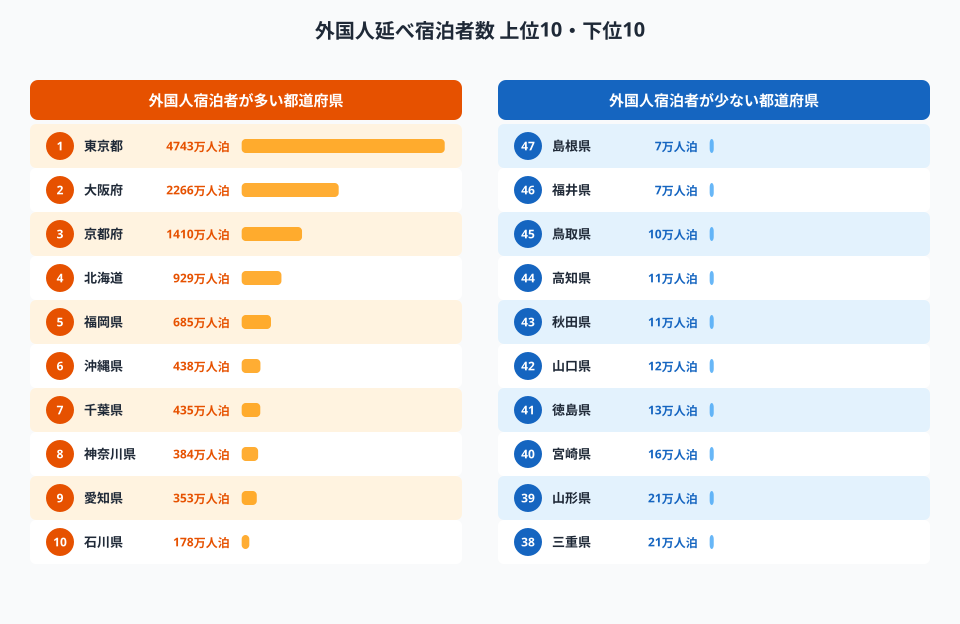
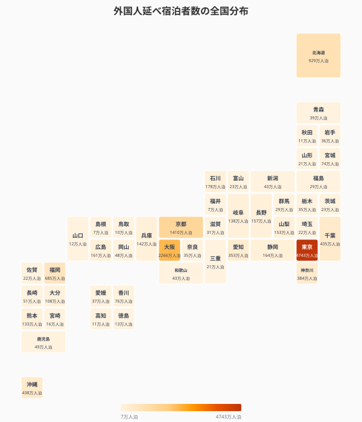
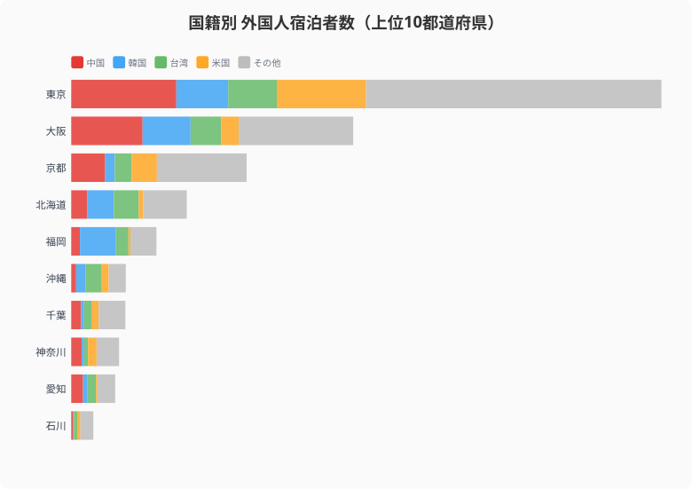
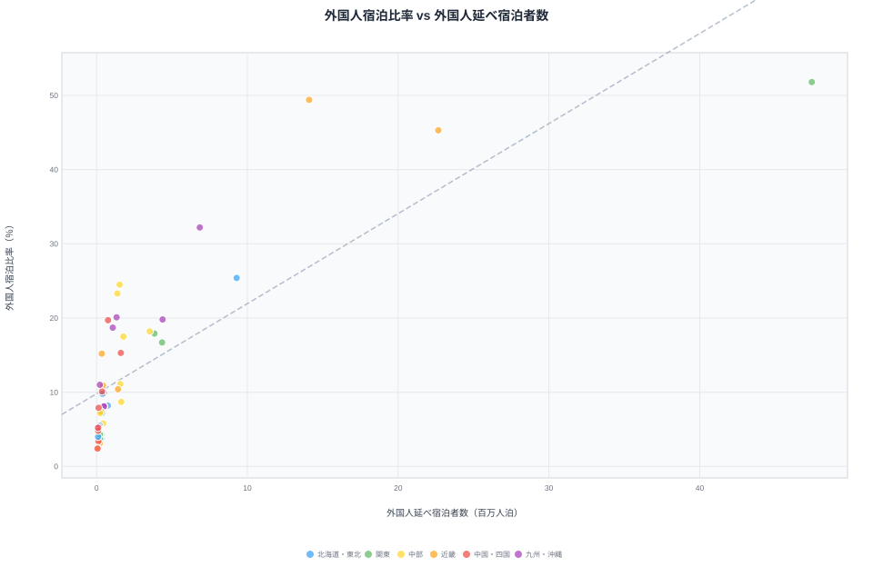
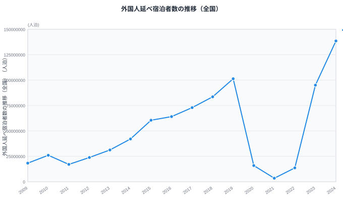
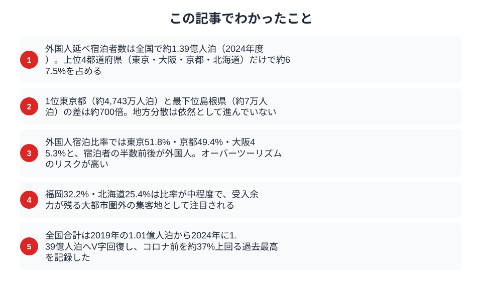

訪日外国人数が過去最高を更新し続ける中、外国人の宿泊先は本当に地方に分散しているのか。2024年の宿泊旅行統計調査を都道府県別に分析すると、上位4都道府県だけで全体の約67%を占める「インバウンドの偏在」がくっきりと浮かび上がる。

## 外国人延べ宿泊者数ランキング -- 圧倒的な東京・大阪と、急成長する地方県

2024年の外国人延べ宿泊者数は全国合計で約1.39億人泊。都道府県別に見ると、[東京都](/areas/13000)が約4,743万人泊で圧倒的な1位を占める。2位の大阪府（約2,266万人泊）、3位の京都府（約1,410万人泊）、4位の北海道（約929万人泊）と続き、この上位4都道府県だけで全国合計の約67.5%に達する。

一方、下位に目を向けると[島根県](/areas/32000)（約7万人泊）、福井県（約7万人泊）、鳥取県（約10万人泊）など、上位との差は数百倍にもなる。

<source-link href="/ranking/total-overnight-guests-foreign">47都道府県の外国人延べ宿泊者数ランキングをもっと見る</source-link>

## 全国分布で見るインバウンドの偏在

タイルグリッドマップで全47都道府県を俯瞰すると、三大都市圏（東京・大阪・京都）と北海道・福岡・沖縄に色が集中し、東北・北陸・四国は淡い色にとどまっている。

地方分散が叫ばれて久しいが、データは依然として一部の都市圏への集中構造を示している。

> [!TIP]
> 下位の島根県（約7万人泊）・福井県（約7万人泊）と1位東京都（約4,743万人泊）の差は約700倍。絶対数だけで地方の「伸び代」を判断すると現状を見誤る。比率指標（外国人宿泊比率）との組み合わせで実態を把握することが重要。

<ad-slot></ad-slot>

## 国籍で見る宿泊先の違い -- 韓国は九州、台湾は北海道

外国人宿泊者数の上位10都道府県について国籍別の内訳を見ると、地域ごとに異なるパターンが浮かぶ。

- **中国**は東京に約845万人泊と突出しており、大都市集中が顕著
- **韓国**は東京・大阪に加え福岡に約289万人泊。地理的近接性とLCC路線が背景にある
- **台湾**は北海道に約201万人泊と、東京・大阪に次ぐ規模。雪景色とグルメが集客力となっている
- **米国**は東京（約717万人泊）と京都（約204万人泊）に集中し、「ゴールデンルート」志向が明確

国籍別の嗜好の違いは、地方誘客の戦略を考える上で重要な手がかりとなる。韓国からの誘客なら九州、台湾なら北海道・東北のように、ターゲットを絞ったプロモーションが有効だろう。

<source-link href="/ranking/total-overnight-guests-foreign-china">47都道府県の外国人延べ宿泊者数（中国）ランキングをもっと見る</source-link>

## 「外国人宿泊比率」で見ると景色が変わる

絶対数では東京が圧倒的だが、全宿泊者数に占める外国人の比率で見ると別の問題が見えてくる。東京都は51.8%と全宿泊者の半数以上が外国人。京都府（49.4%）、大阪府（45.3%）も高く、これらの都市では宿泊施設の約半分が外国人で埋まっている計算だ。

> [!NOTE]
> 外国人宿泊比率 = 外国人延べ宿泊者数 / 延べ宿泊者数（全体）。比率が高いほど観光業の外国人依存度が高いことを意味する。

散布図の右上に位置する東京・大阪・京都は、宿泊者数が多く外国人比率も高い。オーバーツーリズムのリスクが最も高いゾーンといえる。一方、福岡（32.2%）や北海道（25.4%）は比率が中程度で、まだ受入余力がある可能性を示している。

<source-link href="/ranking/total-overnight-guests">47都道府県の延べ宿泊者数ランキングをもっと見る</source-link>

<ad-slot></ad-slot>

## 経年推移で見るV字回復 -- コロナ前を大幅に超える過去最高

全国の外国人延べ宿泊者数の推移を見ると、2019年に約1.01億人泊だったものがコロナ禍の2020年に約0.16億人泊まで急落した。その後V字回復し、2024年には約1.39億人泊とコロナ前を約38%上回る過去最高を記録した。

ただし、この回復は全国一律ではなく、三大都市圏への集中がさらに加速した側面がある。地方がインバウンドの恩恵を受けるには、国籍別の嗜好に合わせた戦略的な誘客と受入体制の整備が不可欠だ。

## まとめ

インバウンド宿泊者のデータから見えてくる主なポイントを整理する。

2030年に訪日客数6,000万人を目標とする中で、オーバーツーリズム対策と地方分散は表裏一体の課題だ。データは、国籍別の嗜好の違いを活かした地方誘客が鍵であることを示している。東京・大阪・京都に偏った現状を変えるには、各県が自県の強みとターゲット国籍を明確にし、「刺さるコンテンツ」を発信していく必要がある。

## データ出典

本記事のデータはe-Stat（政府統計の総合窓口）を基に作成しています。

本記事の対象データ: [関連カテゴリ](/category/tourism)
