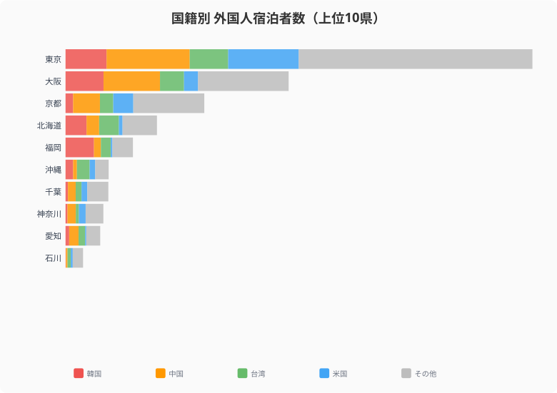
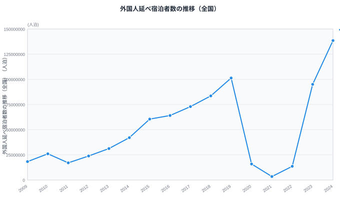
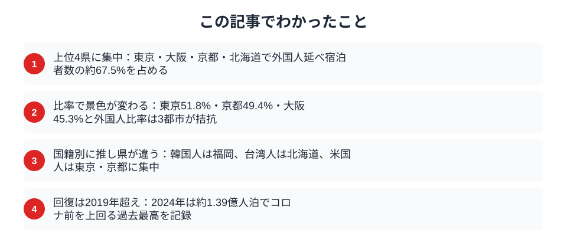

2024年の訪日外国人数は過去最高を更新し、日本各地でインバウンド需要が話題になっている。しかし外国人の宿泊者数を都道府県別に見ると、上位4県だけで全体の約67%を占めるという極端な偏りがある。あなたの県はインバウンドの恩恵を受けているのか、それとも「蚊帳の外」なのか。データで確かめてみよう。

## 外国人宿泊者数ランキング──東京・大阪・京都は別格

2024年の外国人延べ宿泊者数（人泊）を都道府県別にランキングすると、[東京都](/areas/13000)が約4,743万人泊で圧倒的な1位。2位の大阪府（約2,266万人泊）、3位の京都府（約1,410万人泊）、4位の北海道（約929万人泊）と続く。この上位4都道府県だけで全国合計の約67.5%を占める。

一方、下位を見ると[島根県](/areas/32000)（約6.8万人泊）、福井県（約7.3万人泊）、鳥取県（約9.8万人泊）など、上位との差は数百倍にも及ぶ。

<source-link href="/ranking/total-overnight-guests-foreign">47都道府県の外国人延べ宿泊者数ランキングをもっと見る</source-link>

## 「外国人宿泊者比率」で見ると景色が変わる

絶対数では東京が圧倒的だが、全宿泊者数に占める外国人の比率で見ると異なる順位が浮かび上がる。東京都は51.8%と全宿泊者の半数以上が外国人で、京都府（49.4%）、大阪府（45.3%）と続く。これらの都市では宿泊施設の約半分が外国人で埋まっている計算だ。

一方、地方でも[福岡県](/areas/40000)（32.2%）や北海道（25.4%）は比較的高い比率を示しており、一定のインバウンド集積が進んでいることがわかる。

> [!NOTE]
> 外国人宿泊者比率＝外国人延べ宿泊者数/延べ宿泊者数（全体）。比率が高いほど観光業の外国人依存度が高いことを意味する。

<source-link href="/ranking/total-overnight-guests">47都道府県の延べ宿泊者数ランキングをもっと見る</source-link>

<ad-slot></ad-slot>

## 韓国人は九州、台湾人は北海道──国籍別に異なる「お気に入りの県」

外国人宿泊者数の上位10県について国籍別の内訳を見ると、地域ごとに大きな違いがある。

- **韓国人**は東京・大阪のほか福岡に多く、地理的近接性とLCC路線の充実が背景にある
- **中国人**は東京に約845万人泊と突出しており、大都市集中が顕著
- **台湾人**は北海道に約201万人泊と、東京・大阪に次ぐ規模。雪景色とグルメが集客力となっている
- **米国人**は東京（約717万人泊）と京都（約204万人泊）に極端に集中し、「ゴールデンルート」志向が明確

## コロナ前と現在の時系列比較──V字回復を超えた過去最高

> [!WARNING]
> 上位と下位の格差は非常に大きい。2024年データでは1位・東京都（47,432,720人泊）と最下位・島根県（67,670人泊）の比率は約700倍。単純な「全国平均」で政策効果を論じると実態を見誤る。都道府県単位での個別分析が不可欠だ。

全国の外国人延べ宿泊者数の推移を見ると、2019年に約1.01億人泊だったものがコロナ禍の2020年には約0.16億人泊まで急落。しかし2024年には約1.39億人泊と、コロナ前を大幅に上回る過去最高を記録した。

この回復は全国一律ではなく、東京・大阪・京都への集中がさらに加速した側面がある。地方がインバウンド恩恵を受けるには、国籍別の嗜好に合わせた戦略的な誘客が鍵になる。

<ad-slot></ad-slot>

## まとめ

インバウンド宿泊者のデータから見えてくる主なポイントを整理する。

2030年に訪日客数6,000万人を目標とする中で、オーバーツーリズム対策と地方分散は表裏一体の課題だ。データは、国籍別の嗜好の違いを活かした地方への誘客戦略がカギであることを示している。東京・大阪・京都だけでなく、各県が自県の強みを活かしたインバウンド戦略を練る上で、まず「現在地」を確認するところから始めてみてはどうだろうか。

集中の構造は単純に「東京が独り勝ち」とは言えない面もある。外国人宿泊者比率で見ると東京51.8%・京都49.4%・大阪45.3%と3都市が拮抗しており、旅程分散（東京→京都→大阪）は既にある程度起きている。一方、北海道（25.4%）や福岡（32.2%）が一定の比率を確保しているのは、スキーリゾートや九州の温泉など特化型コンテンツの成果といえる。下位県が地方誘客を増やすには、「何を目的に来てもらうか」という明確な訴求軸を設定することが出発点となる。

## データ出典

本記事のデータはe-Stat（政府統計の総合窓口）を基に作成しています。宿泊旅行統計調査（2024年）、社会・人口統計体系 都道府県データを利用しています。観光庁宿泊旅行統計調査に基づく。
