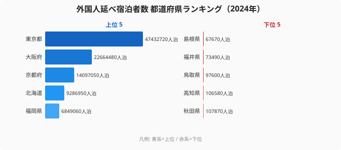
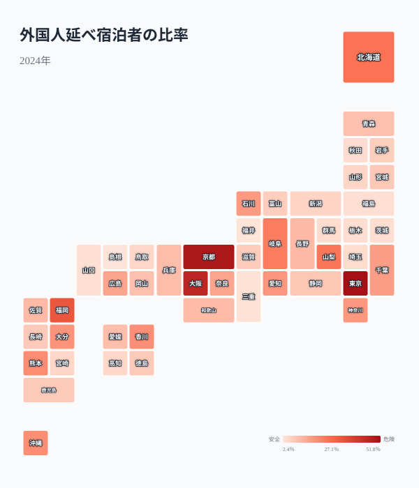
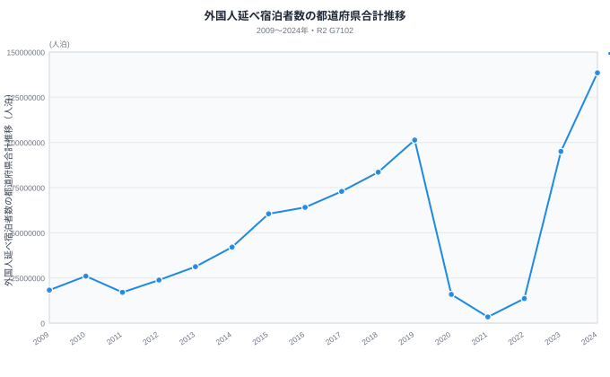

外国人の宿泊は回復していますが、増加分は全国へ均等に広がっているのでしょうか。R2に収録した社会・人口統計体系の同一系列を使い、都道府県別の件数、全宿泊に占める構成比、2009年からの推移を分けて確認します。

## まず押さえたい3つの数字

2024年表示の外国人延べ宿泊者数は、47都道府県の合計で138,527,600人泊です。このうち[東京都](/areas/13000)、大阪府、京都府、北海道の上位4都道府県は93,481,200人泊で、合計の67.5%を占めます。同じ方法で集計した2019年の上位4都道府県の比率は60.0%でした。全国計は増えましたが、宿泊先の集中度も7.5ポイント上がっています。

> [!NOTE]
> 人泊は、1人が1泊すると1人泊、2泊すると2人泊として数える延べ人数です。旅行者の実人数とは異なります。
> 本記事のG7101・G7102は、従業者数10人以上の宿泊施設を集計した系列です。全施設の外国人延べ宿泊者数とは集計範囲が異なります。

この結果は、訪日客全体の行き先や観光消費額を示すものではありません。ここで比較しているのは、同じR2系列に収録された外国人延べ宿泊者数です。宿泊数の規模と、地域経済への効果や混雑の程度は分けて読む必要があります。

## 上位4都道府県で3分の2を占めます

都道府県別では東京都が47,432,720人泊で1位です。大阪府が22,664,480人泊、京都府が14,097,050人泊、北海道が9,286,950人泊で続きます。5位の福岡県は6,849,060人泊で、上位4都道府県とそれ以外の間にも差があります。

下位は島根県が67,670人泊で47位、福井県が73,490人泊で46位、鳥取県が97,600人泊で45位です。ただし、順位が低いことだけで観光の成否は判断できません。国内客の比重、宿泊施設の規模、日帰り旅行、季節変動などは、このランキングに含まれていないためです。

<source-link href="/ranking/total-overnight-guests-foreign">47都道府県の外国人延べ宿泊者数ランキングを見る</source-link>

件数の差を確認したら、次は各都道府県の宿泊市場の中で外国人宿泊が占める割合を見ます。件数と割合を分けると、大都市の規模だけに引っ張られずに地域差を読めます。

## 構成比では京都と大阪の位置が入れ替わります

外国人延べ宿泊者数を延べ宿泊者数で割った構成比は、東京都が51.8%で最も高く、京都府が49.4%、大阪府が45.3%で続きます。件数ランキングでは大阪府が京都府を上回りますが、構成比では京都府が上回ります。これは宿泊施設の稼働率ではなく、R2にある延べ宿泊者数のうち外国人分が占める割合です。

福岡県は32.2%、北海道は25.4%です。一方、島根県は2.4%、福井県は2.5%、三重県は3.1%でした。構成比は外国人宿泊の存在感を比較する指標ですが、値が高いほど望ましい、または依存度が高いと直ちに評価するものではありません。

> [!TIP]
> 件数は受け入れ規模を、構成比は各地域の宿泊全体に占める位置を示します。二つを併読すると、規模が大きい地域と外国人比率が高い地域を区別できます。

<source-link href="/ranking/total-overnight-guests">構成比の分母となる延べ宿泊者数ランキングを見る</source-link>

<ad-slot></ad-slot>

## 全国計は回復し、集中度も上がりました

同じ系列の47都道府県合計は2019年に101,306,460人泊でした。2020年は15,892,600人泊、2021年は3,438,380人泊まで減少し、2023年は95,027,710人泊、2024年は138,527,600人泊となりました。2024年は2019年より36.7%多く、2009年から2024年までの掲載期間では最も大きい値です。集中度は各年の上位4都道府県合計を47都道府県合計で割って算出し、2019年は60,752,760÷101,306,460で60.0%、2024年は93,481,200÷138,527,600で67.5%です。

2019年と2024年を比べると、全国計が増えただけではありません。上位4都道府県の合計比率も60.0%から67.5%へ上がりました。この比較から確認できるのは、同一系列内で地域的な集中が強まったという事実までです。交通網、宿泊供給、旅行目的などの原因は、このデータだけでは特定できません。

> [!WARNING]
> 宿泊旅行統計調査は2010年に調査全体の対象範囲や母集団の扱いが変更された時期です。本記事の図は従業者数10人以上施設の系列ですが、2009年と2010年の差を実需の変化だけで説明せず、調査設計の変更にも留意してください。

## この数字を使うときの注意点

この記事の都道府県値と構成比は、サイトのR2スナップショットにある社会・人口統計体系 G7102 と G7101 を使っています。R2では年コード2024を「2024年度」と表示していますが、上流の宿泊旅行統計調査は2024年1月から12月の年間値です。本記事では図の年表示はR2に合わせ、本文の期間説明は上流資料に合わせています。

また、R2のG7102都道府県値を足した138,527,600人泊は、観光庁の2024年確定値にある国籍・出身地別表の合計138,527,580人泊と20人泊異なります。この表は従業者数10人以上の施設で作成されています。一方、観光庁が公表する全施設の外国人延べ宿泊者数の確定値は164,462,600人泊です。集計表と集計範囲が異なるため、これらを同じ母数として混ぜてはいけません。

> [!WARNING]
> 本記事の構成比はG7102をG7101で割ったR2内の比較値です。観光庁の全施設確定値や別の速報値を分子または分母へ入れ替えると、同じ構成比にはなりません。

## 読み取りの結論

2024年表示値では、外国人延べ宿泊者数の67.5%が上位4都道府県に集まっています。構成比では東京都、京都府、大阪府の順になり、単純な件数順位とは異なります。さらに、全国計は2019年を上回りましたが、上位4都道府県の比率も同時に上がりました。

したがって、全国計の回復だけで地域への広がりを評価するのは十分ではありません。[観光カテゴリ](/category/tourism)で関連指標を確認しながら、都道府県別の件数と構成比を同じ年、同じ集計範囲で比較することが重要です。[東京都の地域ページ](/areas/13000)や[島根県の地域ページ](/areas/32000)では、ほかの統計と並べて地域の状況を確認できます。

## データ出典

- e-Stat「社会・人口統計体系 都道府県データ 基礎データ0000010107」G7101、G7102
- 総務省統計局「社会生活統計指標」G7101、G7102の定義
- 観光庁「宿泊旅行統計調査」2024年1月から12月の確定値、訂正資料

数値はR2スナップショットと対応するJSONから再計算し、順位、上位4都道府県の比率、構成比、時系列を照合しています。原因を示す説明変数は含まれないため、因果関係は述べていません。
