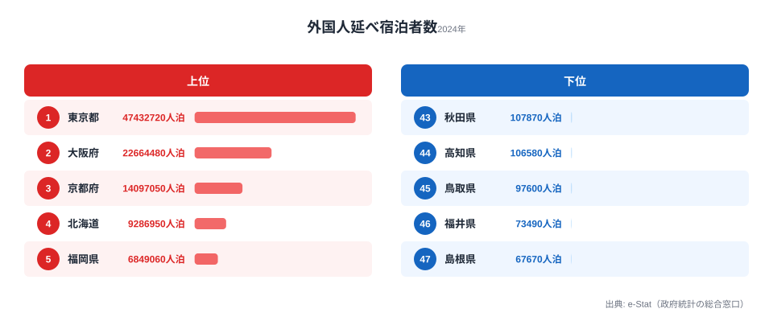

2024年の訪日外国人数は過去最高を更新し、日本各地でインバウンド需要が話題になっています。しかし外国人の延べ宿泊者数を都道府県別に見ると、上位4県だけで全国合計の約67.5%を占めるという極端な偏りがあります。さらに1位と最下位の差は約700倍にまで開いています。あなたの県はインバウンドの恩恵を受けているのか、それとも「蚊帳の外」なのか。この記事では、なぜ恩恵が一部の県に集中してしまうのかをデータで確かめていきます。

## 外国人宿泊者数ランキング──東京・大阪・京都は別格です

2024年の外国人延べ宿泊者数（人泊）を都道府県別にランキングすると、[東京都](/areas/13000)が約4,743万人泊で圧倒的な1位です。2位の大阪府（約2,266万人泊）、3位の京都府（約1,410万人泊）、4位の北海道（約929万人泊）と続きます。この上位4都道府県だけで全国合計の約67.5%を占めています。さらに5位の福岡県（約685万人泊）までを加えると、いわゆる「ゴールデンルート」と九州の玄関口だけで全体の大半が説明できてしまうことになります。

一方、下位を見ると最下位の[島根県](/areas/32000)（約6.8万人泊）、46位の福井県（約7.3万人泊）、45位の鳥取県（約9.8万人泊）と続き、上位との差は数百倍にも及びます。最上位の東京都と最下位の島根県を比べると、その差は約700倍に達します。同じ「訪日ブーム」の只中にありながら、泊まってもらえる県とそうでない県の間にこれほどの隔たりがあるのです。

なぜ上位がここまで突出するのでしょうか。第一に、国際線が集中する空港の立地です。羽田・成田を抱える首都圏、関西国際空港を擁する大阪・京都、新千歳空港の北海道、福岡空港の福岡県は、いずれも外国人が「最初に降り立ち、最初に泊まる」拠点になっています。第二に、外国人が事前に名前を知っている観光資源の有無です。東京・京都・大阪はガイドブックの定番であり、初訪日客の旅程に必ずと言ってよいほど組み込まれます。逆に下位に並ぶ島根・福井・鳥取・高知・秋田は、いずれも直行の国際線が乏しく、知名度の高い「世界的アイコン」となる観光地も限られます。つまり順位の偏りは、観光地としての魅力だけでなく「玄関口があるかどうか」という交通インフラの構造を色濃く反映しているのです。

<source-link href="/ranking/total-overnight-guests-foreign">47都道府県の外国人延べ宿泊者数ランキングをもっと見る</source-link>

> [!NOTE]
> 「延べ宿泊者数（人泊）」は、宿泊した人数に泊数を掛け合わせた値です。1人が3泊すれば3人泊と数えます。観光庁「宿泊旅行統計調査」に基づく値で、従業員10人以上の宿泊施設が主な調査対象となるため、民泊や小規模旅館の一部はこの数字に含まれない点に注意してください。

## 「外国人宿泊者比率」で見ると景色が変わります

絶対数では東京が圧倒的ですが、全宿泊者数に占める外国人の比率で見ると、また異なる順位が浮かび上がります。東京都は51.8%と全宿泊者の半数以上が外国人で占められており、京都府（49.4%）、大阪府（45.3%）と続きます。これらの都市では、宿泊施設の客室のおよそ半分が外国人で埋まっている計算になります。日本人客の動きとは別に、外国人客の需要だけで地域の宿泊市場が大きく左右される段階に入っているのです。

一方、地方でも福岡県（32.2%）や北海道（25.4%）は比較的高い比率を示しており、一定のインバウンド集積が進んでいることがわかります。これは単なる通過地点ではなく、スキーリゾートや温泉、グルメといった「目的地そのもの」として外国人を惹きつけている証拠だといえるでしょう。比率という物差しを使うと、絶対数では中位に沈む県でも「観光業の中でインバウンドがどれだけ重みを持つか」という別の顔が見えてきます。

> [!WARNING]
> 比率（外国人/全体）と絶対数は別の指標です。比率が高い県は外国人依存度が高い一方、母数となる総宿泊者数が小さいと比率は大きく振れます。逆に、絶対数で上位でも国内客が多い県は比率が低く出ます。「比率が高い＝外国人が多い」と短絡せず、必ず絶対数とあわせて読んでください。本記事の比率は外国人延べ宿泊者数を延べ宿泊者数（全体）で割った値です。

<source-link href="/ranking/total-overnight-guests">47都道府県の延べ宿泊者数ランキングをもっと見る</source-link>

<ad-slot></ad-slot>

## 韓国は九州、台湾は北海道──国籍で異なる「お気に入りの県」

外国人宿泊者を国籍別に見ると、地域ごとに大きな違いがあらわれます。韓国からの宿泊者は東京・大阪のほか福岡に多く、地理的な近さとLCC路線の充実がその背景にあります。中国からの宿泊者は東京に約845万人泊と突出しており、大都市集中が際立っています。台湾からの宿泊者は北海道に約201万人泊と、東京・大阪に次ぐ規模で、雪景色とグルメが強い集客力となっています。米国からの宿泊者は東京（約717万人泊）と京都（約204万人泊）に極端に集中しており、定番周遊ルートを志向する傾向が明確です。

ここから読み取れるのは、「外国人」とひとくくりにすると見えなくなる嗜好の多様性です。地方が誘客を増やすうえで、すべての国籍に等しく訴求するのは現実的ではありません。むしろ、北海道が台湾客を、福岡が韓国客を取り込んでいるように、自県の強みと相性のよい国籍を見定め、その層に届く言語・チャネル・コンテンツで集中的にアプローチすることが、限られた予算で成果を出す近道になります。国籍別の嗜好の違いは、地方分散を考えるうえで最も実務的なヒントを与えてくれます。

> [!TIP]
> 自県のインバウンド戦略を考えるときは、まず「絶対数の順位」「外国人比率」「主要国籍」の3つの物差しで現在地を確認するのが有効です。3つは一致しないことが多く、たとえば絶対数は中位でも特定国籍の比率だけが突出しているケースがあります。どの層に強いのかを把握できれば、訴求すべき相手が自然に絞り込めます。

## コロナ前を超えた過去最高──ただし回復は均一ではありません

全国の外国人延べ宿泊者数の推移を見ると、2019年に約1.01億人泊だったものが、コロナ禍の2020年には約0.16億人泊まで急落しました。しかし2024年には約1.39億人泊と、コロナ前を大幅に上回る過去最高を記録しています。市場全体としては力強いV字回復を超えて、新たな高みに到達したといえます。

ただし、この回復は全国一律ではありません。東京・大阪・京都への集中がコロナ後にむしろ加速した側面があり、戻ってきた需要の多くが定番都市に吸い寄せられています。市場が拡大しても、その果実が47都道府県に均等に配分されるわけではないのです。だからこそ、単純な「全国平均」や「過去最高」という言葉だけで政策効果を語ると、恩恵から取り残された地方の実態を見誤ります。地方がこの拡大局面を取り込むには、国籍別の嗜好に合わせた戦略的な誘客が鍵を握ります。

<ad-slot></ad-slot>

## まとめ

インバウンド宿泊者のデータから見えてきた主なポイントを整理します。

- 2024年の外国人延べ宿泊者数は[東京都](/areas/13000)が約4,743万人泊で1位、最下位の[島根県](/areas/32000)は約6.8万人泊で、その差は約700倍に達します。
- 上位4都道府県（東京・大阪・京都・北海道）だけで全国合計の約67.5%を占め、集中度はきわめて高い水準です。
- 絶対数と外国人比率は別の顔を見せます。東京51.8%・京都49.4%・大阪45.3%と、3都市は比率でも拮抗しています。
- 国籍によって「お気に入りの県」は異なり、台湾は北海道、韓国は福岡といった相性が明確です。
- 市場は過去最高を更新しましたが、回復は均一ではなく、定番都市への集中がむしろ加速しています。

集中の構造は、単純に「東京の独り勝ち」とは言い切れない面もあります。外国人宿泊者比率で見ると東京51.8%・京都49.4%・大阪45.3%と3都市が拮抗しており、旅程の分散（東京→京都→大阪）はある程度すでに起きています。一方で、北海道（25.4%）や福岡（32.2%）が一定の比率を確保しているのは、スキーリゾートや九州の温泉など特化型コンテンツの成果といえるでしょう。下位の県が地方誘客を増やすには、「何を目的に来てもらうか」という明確な訴求軸を設定することが出発点になります。2030年に訪日客数6,000万人を目標とするなかで、オーバーツーリズム対策と地方分散は表裏一体の課題です。まずは自県の「現在地」を確認するところから始めてみてはいかがでしょうか。

## データ出典

本記事のデータはe-Stat（政府統計の総合窓口）を基に作成しています。観光庁「宿泊旅行統計調査」（2024年）、社会・人口統計体系 都道府県データを利用しています。
