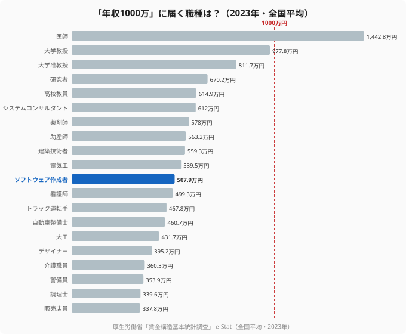

「年収1000万円」は、多くの会社員にとって一つの大きな目標だ。だが、職種別の平均年収を見ると、その大台がいかに高い壁かがわかる。厚生労働省「賃金構造基本統計調査」の2023年データで主要な専門職の平均年収を並べると、平均で1000万円を超えるのは医師（1,442.8万円）など、ごく一握りの職種に限られる。大学教授でも977.8万円、システムコンサルタントは612.0万円、ソフトウェア作成者にいたっては507.9万円だ。

つまり「年収1000万」は、職種の平均値の延長線上にはほとんど存在しない。本記事では、どの職種が大台に近いのかを可視化し、エンジニアが1000万円を狙うには何が必要なのかを、データをもとに現実的に考える。

> [!NOTE]
> データは厚生労働省「賃金構造基本統計調査」の職種別平均年収（2023年・全国平均、推計値）です。あくまで職種ごとの平均であり、同じ職種でも個人差は大きく、平均を大きく上回る高年収者も存在します。

## 平均年収で1000万に届く職種はごくわずか

まず現実を直視しよう。主要20職種の中で平均年収が1000万円を超えるのは医師（1,442.8万円）のみ。次点の大学教授（977.8万円）でも大台にはわずかに届かない。大学准教授811.7万円、研究者670.2万円、高校教員614.9万円、システムコンサルタント612.0万円と続き、ソフトウェア作成者は507.9万円で20職種中の中位にある。

<source-link href="/ranking/doctor-annual-income">医師など高年収職の都道府県別ランキングを見る</source-link>

この図が示すのは、1000万円という水準が「職種の平均」ではめったに到達できない高みにあるという事実だ。医師のような長期の養成と資格を要する職種を除けば、平均値で大台に乗る職種は存在しないに等しい。

## 地域を変えても1000万には届かない

「では年収の高い県に移れば？」と考えるかもしれないが、地域移動でも大台には届かない。たとえばソフトウェア作成者の年収は、最も高い都道府県でも平均で約600万円台にとどまる。都道府県間の差は1.5倍程度で、地域を変えるだけで1000万円に到達するのは非現実的だ。

<source-link href="/ranking/software-engineer-annual-income">ソフトウェアエンジニアの都道府県別年収ランキングを見る</source-link>

> [!WARNING]
> 「住む場所を変えれば年収が大きく上がる」という発想には限界がある。地域差は1.5倍前後にすぎず、平均500万円台の職種が地域移動だけで1000万円になることはない。年収を本質的に変えるのは、地域ではなく「職種・ポジション・市場価値」だ。

## エンジニアが1000万を狙う3つの道筋

平均では届かないとしても、エンジニアが1000万円を狙う道筋は存在する。重要なのは「平均」ではなく「分布の上位」に入ることだ。

1. **上流職へのシフト**：開発職からシステムコンサルタント・アーキテクト・PM・テックリードへ。職種を変えるだけで年収帯が100万円以上動く。
2. **高単価領域への専門特化**：クラウド・データ基盤・セキュリティ・AIなど、需要が供給を上回る領域に専門性を寄せる。
3. **評価される市場への移動**：同じスキルでも、評価してくれる企業（外資・メガベンチャー等）に移れば年収レンジは跳ね上がる。

> [!TIP]
> いずれの道筋も共通するのは「いまの職場の給与テーブルの外に出る」ことだ。1000万円を狙うなら、現職で昇給を待つより、自分のスキルが上位レンジで評価される場所を探す方が近道になる。エンジニア専門の転職エージェントなら、年収1000万円クラスの求人や、そこに至るキャリアパスを具体的に提示してくれる。

## 「平均」ではなく「上位」を目指す

職種別年収データが突きつけるのは、1000万円は平均の延長では到達できない、という現実だ。だが裏を返せば、職種・ポジション・市場を意識的に選べば、平均500万円台のエンジニアでも上位レンジを狙えるということでもある。

まずは「自分のスキルが、どの職種・どの企業で、いくらで評価されるのか」を知ることだ。市場価値を客観的に把握したうえで、上流職・高単価領域・好条件の企業へと動く。エンジニアという需要の高い職種だからこそ、戦略次第で1000万円は現実的な射程に入る。

## 「平均」の裏にある分布を読む

職種別の平均年収を見て「エンジニアは508万円か」と落胆する必要はない。平均値は分布の中心にすぎず、その裏には大きなばらつきが隠れている。同じソフトウェア作成者でも、年収300万円台の人もいれば、1000万円を超える人も確かに存在する。平均を押し下げているのは、低単価の受託や経験の浅い層だ。

年収1000万円を狙うとは、この分布の「上位」に自分を位置づけることにほかならない。平均に引きずられて「この職種では無理」と考えるのではなく、「同じ職種の中で、どうすれば上位レンジに入れるか」を考える方が建設的だ。上流職へのシフト、高単価領域への特化、好条件の企業への移動——いずれも分布の右側へ移動するための手段である。

重要なのは、平均値を自分の上限だと思い込まないことだ。職種の平均が508万円でも、上位レンジには手が届く。まずは「同じスキルが、より評価される場所ではいくらになるか」を知ること。分布の存在を意識した瞬間から、1000万円は“別世界の話”ではなく“射程内の目標”に変わる。

そして分布の上位を目指す過程は、年収という結果だけでなく、技術力やキャリアの幅という資産も同時に育てる。高単価領域への挑戦や上流職へのシフトは、市場価値そのものを底上げするからだ。1000万円という目標は、そこへ向かう過程で身につくものすべてを含めて、追う価値がある。

### 関連記事・次に読むデータ

- [職種別の平均年収比較](/ranking/doctor-annual-income) — どの職種が高年収帯か
- [システムコンサルタントの年収ランキング](/ranking/system-consultant-annual-income) — 上流IT職の年収
- [ソフトウェアエンジニアの年収ランキング](/ranking/software-engineer-annual-income) — 開発職の年収と地域差
- [世帯あたり年間収入ランキング](/ranking/annual-income-per-household) — 世帯年収の地域差
- [労働・賃金カテゴリの統計一覧](/category/laborwage) — 年収・職業の関連ランキング

## データ出典

- 厚生労働省「賃金構造基本統計調査」（e-Stat 統計データ、2023年）
- 各職種の平均年収は、きまって支給する現金給与額×12＋年間賞与から算出した全国平均の推計値（企業規模10人以上）
