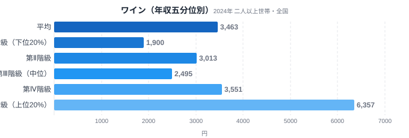
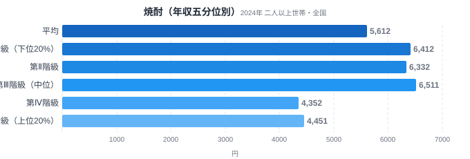
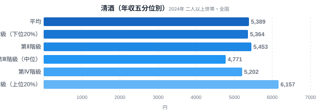
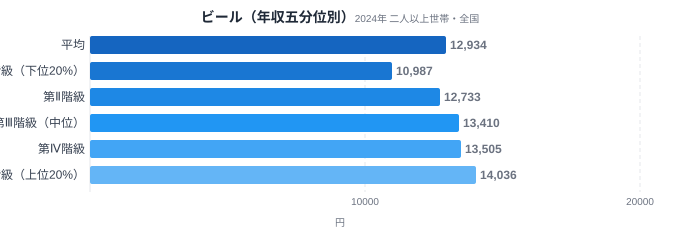
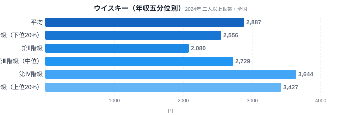

同じ「お酒を飲む」という行為でも、選ぶ酒の種類は世帯の年収によってはっきり分かれます。総務省の家計調査には、全国の世帯を年間収入で5つの階級に分けて支出を比較する「年間収入五分位階級」というデータがあります。この記事では、その五分位データを使って清酒・ワイン・ビール・焼酎・ウイスキーの5品目を比較し、どの酒が「所得が上がるほど支出が伸びる」贅沢財で、どの酒が逆に「所得が低いほど支出が多い」財なのかを見ていきます。

結論から言うと、最も所得格差が大きかったのはワインで、上位20%世帯の支出は下位20%世帯の3.35倍でした。逆に焼酎だけは唯一「逆進」的な動きを見せ、下位20%世帯の支出が上位20%世帯を上回っています。[県民所得の地域差](/blog/per-capita-income-gap)は都道府県間の格差でしたが、同じ「所得」という軸でも、世帯の年収階級別に見ると酒類消費にこれほど明確な違いが表れます。

> [!NOTE]
> このデータは総務省統計局「家計調査（年間収入五分位階級別・二人以上の世帯）」の2024年分です。都道府県別の統計ではなく、全国の二人以上世帯を年間収入で低い方から高い方へ5等分し、各階級（第Ⅰ階級=下位20%〜第Ⅴ階級=上位20%）の1世帯あたり平均支出額（月額）を比較しています。e-Stat（政府統計の総合窓口）経由で取得しました。

## ワイン — 所得が上がるほど支出が伸びる代表格

<source-link href="/category/economy">家計・経済カテゴリの他の記事を見る</source-link>

ワインの月間支出は、第Ⅰ階級（下位20%）が1,900円、第Ⅴ階級（上位20%）が6,357円で、V/I比は3.35倍にのぼります。今回比較した5品目の中で最大の格差です。しかも支出額は第Ⅰ階級から第Ⅴ階級までほぼ一直線に増える傾向で、第Ⅱ階級3,013円→第Ⅲ階級2,495円と一時的な凹みはあるものの、第Ⅳ階級3,551円→第Ⅴ階級6,357円と上位層で急激に伸びています。

この形は典型的な「所得弾力性が高い財」の動きです。ワインは日常の必需品というより、外食や特別な機会、あるいは趣味として楽しむ位置づけの酒であることが多く、可処分所得に余裕がある世帯ほど本数や単価の高いボトルを選ぶ余地が生まれます。輸入ワインは価格帯の幅が広く、高価格帯を選択できるかどうかが所得によって左右されやすい点も、格差を押し上げる要因と考えられます。

## 焼酎 — 唯一の逆進財、低所得層ほど支出が多い

<source-link href="/category/economy">家計・経済カテゴリの他の記事を見る</source-link>

焼酎は今回の5品目の中で唯一、所得と支出が逆方向に動きました。第Ⅰ階級（下位20%）は6,412円、第Ⅴ階級（上位20%）は4,451円で、V/I比は0.69倍。下位層の支出が上位層より約1.4倍多いという結果です。第Ⅰ階級から第Ⅲ階級までは6,300〜6,500円台で高止まりし、第Ⅳ階級で4,352円へ急落、第Ⅴ階級も4,451円にとどまっています。

焼酎が逆進的になる背景には、酒税制度と価格帯の両方が関係していると考えられます。焼酎はビールや清酒に比べて酒税率が低く、同じアルコール度数を得るコストが小さい酒です。また量販店やディスカウントストアで大容量パックが安価に流通しており、「コストパフォーマンスを重視した晩酌」の選択肢になりやすい構造があります。[ビールと発泡酒の税制シフト](/blog/beer-vs-happoshu-shift)でも触れたように、酒税は家計の酒選びに直接影響する変数であり、焼酎の逆進性もこの延長線上にあると見られます。

## 清酒 — 格差はあるが比較的小さい

<source-link href="/category/economy">家計・経済カテゴリの他の記事を見る</source-link>

清酒の支出は第Ⅰ階級5,364円、第Ⅴ階級6,157円で、V/I比は1.15倍とワインに比べるとかなり小さな格差です。階級間の推移も単調ではなく、第Ⅲ階級で4,771円まで落ち込んだあと第Ⅳ階級5,202円、第Ⅴ階級6,157円と持ち直す動きを見せています。

清酒は地域の食文化や年齢層による嗜好の影響が強く、所得よりも「日常的に飲む習慣があるかどうか」で支出が左右されやすい酒だと考えられます。高級な純米大吟醸から普段使いの紙パック酒まで価格帯が非常に広いため、上位層が高価格帯を選んでも、下位層が全く飲まないわけではなく、支出額の差が縮まりやすいと言えるでしょう。

## ビールとウイスキー — 中間的な格差

<source-link href="/category/economy">家計・経済カテゴリの他の記事を見る</source-link>

ビールは第Ⅰ階級10,987円、第Ⅴ階級14,036円でV/I比1.28倍。5品目中でも最も金額規模が大きい酒類ですが、格差は中程度にとどまります。第Ⅰ階級から第Ⅳ階級（13,505円）まで階級が上がるごとにほぼ一貫して支出が増え、第Ⅴ階級でわずかに伸びが鈍化する形です。ビールは晩酌の定番として幅広い所得層に浸透しているため、「飲む・飲まない」の差より「本数や銘柄の差」が支出額に表れやすいと考えられます。

<source-link href="/category/economy">家計・経済カテゴリの他の記事を見る</source-link>

ウイスキーは第Ⅰ階級2,556円、第Ⅴ階級3,427円でV/I比1.34倍。ただし推移は単調ではなく、第Ⅱ階級で2,080円まで下がったあと第Ⅳ階級3,644円まで急伸し、第Ⅴ階級でわずかに落ち着くという波型を描いています。ハイボールブームで比較的手頃な価格帯の商品が広がった一方、シングルモルトなど高価格帯の商品も存在するため、階級ごとの支出額が単純な右肩上がりになりにくい構造がうかがえます。

> [!WARNING]
> 家計調査の数値は「支出金額」であり、消費量（本数・リットル数）そのものではありません。同じ本数を飲んでいても、選ぶ銘柄の単価が違えば支出額の差になります。また世帯構成（人数・年齢層）や地域による価格差も支出額に影響するため、五分位間の差がそのまま「飲む頻度の差」を意味するわけではない点に注意してください。

## データが示すもの

5品目を並べると、酒類の中にも明確な「贅沢財」と「逆進財」の軸があることが分かります。

- **贅沢財の代表: ワイン（3.35倍）** — 所得が上がるほど支出が大きく伸びる。外食・嗜好品としての性格が強い
- **逆進財: 焼酎（0.69倍）** — 唯一、低所得層の方が支出が多い。低価格帯の流通と酒税の低さが背景と考えられる
- **中間的な財: ビール（1.28倍）・ウイスキー（1.34倍）・清酒（1.15倍）** — 所得による差はあるが、幅広い層に浸透しているため格差は小さめ

この分類軸で見ると、「所得が上がるほど高い酒を飲む」という単純な図式は必ずしも正しくなく、酒の種類ごとに価格帯の広さや流通構造、税制が異なるために、所得との関係も品目ごとに大きく違うことが分かります。焼酎のように低所得層で支出が多い品目があることは、家計における酒類消費の多様性を示す興味深い結果です。

> [!TIP]
> 所得階級別の支出データを読むときは、V/I比（第Ⅴ階級÷第Ⅰ階級）だけでなく、階級間の推移の形にも注目すると発見があります。ワインのように単調に増える品目もあれば、ウイスキーのように波型を描く品目もあり、後者は「価格帯の分散が大きい財」である可能性を示しています。

## まとめ

- ワインは年収五分位でV/I比3.35倍と、今回比較した酒類の中で最大の所得格差
- 焼酎は唯一の逆進財で、下位20%世帯の支出が上位20%世帯より約1.4倍多い
- 清酒（1.15倍）・ビール（1.28倍）・ウイスキー（1.34倍）は中間的な格差にとどまる
- 酒類の所得格差は「飲む頻度」よりも価格帯の広さ・流通構造・酒税制度の違いを反映している可能性が高い

家計・経済に関する他のデータは[経済カテゴリ一覧](/category/economy)でも確認できます。都道府県別の食文化に興味がある方は[47都道府県の食卓の違い](/blog/tokyo-food-culture)も参考にしてください。

## データ出典

総務省統計局「家計調査（年間収入五分位階級別・全国・二人以上世帯）」2024年。e-Stat（政府統計の総合窓口）経由で取得。
