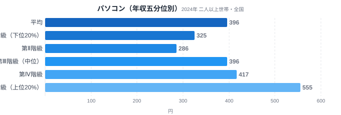
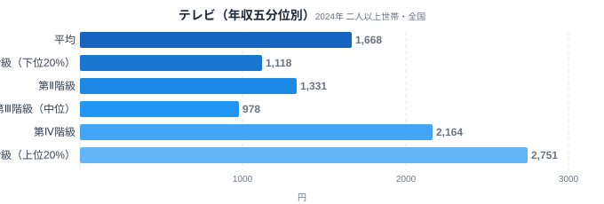
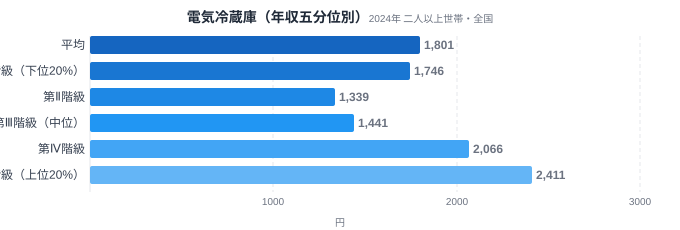

家電の買い替えは、生活に欠かせない出費でありながら「いつ・どの機種を買うか」に大きな自由度がある支出でもあります。総務省の家計調査には、全国の世帯を年収順に5つの層に分けて支出額を比較できるデータがあります。これを「年収五分位階級」と呼びます。

このデータでパソコン・テレビ・電気冷蔵庫の支出額を比べると、同じ「家電」という括りでも所得層による差の大きさがまったく違うことがわかります。テレビは上位20%が下位20%の2.46倍を支出している一方、冷蔵庫は1.38倍にとどまります。壊れたら買い替えざるを得ない「必需品性」の強さが、この差を生んでいます。

> [!NOTE]
> このデータは総務省統計局「家計調査（年間収入五分位階級別・全国・二人以上世帯）」2024年分を、e-Stat経由で取得したものです。都道府県別の格差ではなく、全国の世帯を年収順に5等分した各層（第Ⅰ階級=下位20%〜第Ⅴ階級=上位20%）の平均支出額を示しています。

## パソコン — 中位が平均と並ぶ緩やかな格差

パソコンの月間支出額は、第Ⅰ階級（下位20%）が325円、第Ⅴ階級（上位20%）が555円です。差は1.71倍で、家賃負担のような住居費ほどではありませんが、はっきりとした傾きがあります。第Ⅲ階級（中位）は396円で、これは全国平均の396円とちょうど一致しており、パソコン支出は中間層が全体の相場を形作っていることがわかります。

パソコンは仕事・学習・通信のインフラとして必需品化が進んだ一方、性能や価格帯の選択肢が広い製品でもあります。低所得層でも「無いと困る」ため一定額は支出しますが、高所得層は上位モデルへの買い替えや複数台保有によって支出額を押し上げます。第Ⅳ階級417円から第Ⅴ階級555円への伸びが、第Ⅰ〜第Ⅲ階級の緩やかな動きに比べてやや大きいのも、この「上位モデル選択」の効果とみられます。

## テレビ — 家電の中で最も所得差が大きい

テレビの月間支出額は、第Ⅰ階級（下位20%）が1,118円、第Ⅴ階級（上位20%）が2,751円です。差は2.46倍で、今回取り上げる3品目の中で最大の開きになりました。全国平均は1,668円で、第Ⅰ・第Ⅱ階級はこれを下回り、第Ⅳ・第Ⅴ階級が押し上げている構図です。

テレビは壊れれば買い替えが必要という点では必需品ですが、画面サイズや画質による価格差が非常に大きい製品でもあります。低所得層は「映れば十分」という選択をしやすく、高所得層は大画面・高画質モデルへの支出を厭いません。この価格帯の広さが、必需品でありながら格差が大きくなる理由です。第Ⅲ階級（中位）が978円と第Ⅰ・第Ⅱ階級より低い点は一見不自然に見えますが、これは後述する「単年データのブレ」の典型例でもあります。

> [!TIP]
> [仮説] テレビは自室に置かれることが多く、自動車のように「外見」で所有者の経済力を示す機会が少ない家電です。そのため高所得層でも必ずしも最高級モデルの単価にこだわるとは限らず、支出額格差は画面サイズという「単価」の選択だけでなく、買い替え頻度や保有台数という「数量」の差からも生まれている可能性があります。今回のデータには支出金額しか含まれず、数量と単価を分けた内訳が無いため、この記事だけではどちらの影響が大きいかを切り分けられません。検証には数量・単価を分離した集計が必要です。

## 電気冷蔵庫 — 家電の中で最も所得差が小さい

電気冷蔵庫の月間支出額は、第Ⅰ階級（下位20%）が1,746円、第Ⅴ階級（上位20%）が2,411円です。差は1.38倍で、今回の3品目では最も所得差が小さい結果になりました。注目すべきは、第Ⅰ階級の1,746円が全国平均1,801円に迫るほど高い水準にあることです。

冷蔵庫は生鮮食品の保存に直結し、故障すればほぼ即座に買い替えが必要になる「純粋な必需品」です。所得にかかわらず一定の支出が発生するため、階級間の差が縮まります。[仮説] 第Ⅱ階級1,339円が第Ⅰ階級より低いのも、テレビと同様に単年データの買い替え世帯比率のブレによるものと考えられ、複数年の同一品目データで同じ逆転が再現するかを見れば判別できます。冷蔵庫のように買い替え周期が10年前後と長い耐久財は、その年にたまたま壊れた世帯の比率で平均値が大きく動きます。

[仮説] 冷蔵庫は容量や省エネ性能による価格差はあるものの、テレビの画面サイズ・画質ほど価格帯の幅が広くありません。選べる贅沢の余地自体が小さいことも、必需品性の強さとあわせて階級間の格差を小さくしている一因と考えられます。検証には容量・機能別など品目内の価格帯を分けた集計が必要です。

> [!WARNING]
> 家計調査は「支出金額」を示すデータであり、購入台数や使用年数などの消費量そのものではありません。特にパソコン・テレビ・冷蔵庫のような耐久財は毎月買うものではないため、単年の平均支出額はその年にたまたま買い替えた世帯の割合や、選んだ機種の価格帯に強く左右されます。第Ⅲ階級・第Ⅱ階級が周辺の階級より低くなる逆転が起きるのはこのためで、複数年のデータで傾向を確認することが望ましい点に注意してください。単価や世帯人数の違いも支出額に影響します。

## データが示すもの

3品目を並べると、家電の所得格差は「必需品性の強さ」という仮説と整合します。ただし3品目・単年の比較であり、複数年でV/I比の順序が安定するかは別途確認が必要です。

- **必需品性が強い（格差が小さい）**: 電気冷蔵庫（V/I比1.38倍）。生鮮食品保存に直結し、故障すれば所得を問わず買い替えざるを得ません。
- **必需品性と選択性が拮抗（中間）**: パソコン（V/I比1.71倍）。無いと困る一方、性能・台数の選択幅が支出差を生みます。
- **選択性が強い（格差が大きい）**: テレビ（V/I比2.46倍）。壊れれば買い替えるという点では必需品ですが、画面サイズや画質という「選べる贅沢」の幅が広く、所得差がそのまま支出差に反映されます。

この並びは、[エンゲル係数ランキング](/blog/engel-coefficient-prefecture-ranking)で示される「食費という必需品は所得に対する割合が下がる」という構図とも整合します。必需性の高い支出ほど所得による絶対額の差が縮み、選択の余地が大きい支出ほど所得差が拡大するという傾向は、家電に限らず家計全体に共通する構造といえます。

> [!TIP]
> 家電の支出額を比較するときは、V/I比（第Ⅴ階級÷第Ⅰ階級）だけでなく、第Ⅲ階級（中位）が全国平均に近いかどうかも見る視点が役立ちます。パソコンのように中位が平均とほぼ一致する品目は、相場が安定した支出構造とみられます。一方でテレビや冷蔵庫のように中位が上下に振れている年は、その年の買い替え世帯比率がたまたま偏っている可能性を疑い、複数年のデータで同じ傾向が続くかを確認するのが望ましいです。

## まとめ

- テレビ2.46倍・パソコン1.71倍・冷蔵庫1.38倍と、V/I比は品目によって大きく異なりました
- 家電の所得格差は「必需品性の強さ」という仮説と整合しますが、3品目・単年の比較であり複数年での確認が必要です
- 自分の家計で家電支出を見るときは、冷蔵庫のような必需品は所得によらず一定額を見込み、テレビのように選択の幅が大きい品目は予算設定次第で支出額の差が出やすいと捉えると計画しやすくなります
- 耐久財は買い替え周期が長いため、単年の平均支出額は買い替え世帯の比率に左右される点に注意が必要です

<source-link href="/category/economy">家計・経済カテゴリの他の記事を見る</source-link>

家計の支出構造をさらに詳しく知りたい方は、同じ家計調査を都道府県別の切り口でまとめた[食の県民性を比較した記事](/blog/food-consumption-prefecture-battle)や[東京の食卓の特異性を扱った記事](/blog/tokyo-food-culture)もあわせてご覧ください。

## データ出典

総務省統計局「家計調査（年間収入五分位階級別・全国・二人以上世帯）」2024年。e-Stat（政府統計の総合窓口）経由で取得。
