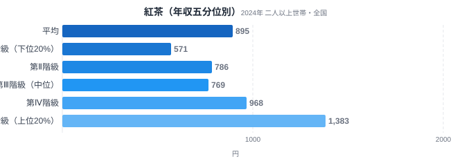
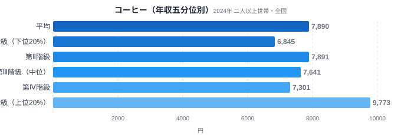
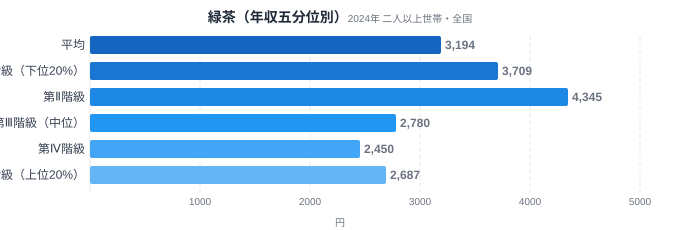

「紅茶はコーヒーより贅沢品で、年収が上がるほど支出が伸びやすい」――ある家計消費の解説書にこう書かれているのを見かけたことはないでしょうか。年収による支出の伸び方の違いは「所得弾性」と呼ばれ、生活必需品は伸びが緩やかで、贅沢品ほど年収に敏感に反応するとされています。この記事では、その主張を総務省の家計調査「年間収入五分位階級別」の2024年データで実際に確かめてみます。

先に結論を言うと、紅茶は年収上位層が下位層の2.42倍を消費しており、コーヒー(1.43倍)よりも所得への反応がはっきりしています。ところが緑茶は逆に、年収が低い層のほうが多く買うという結果になりました。3つの飲み物を並べることで、「所得が上がるほど何にお金を使うようになるのか」という消費の質の違いが見えてきます。

> [!NOTE]
> この記事のデータは、総務省統計局「家計調査」の「年間収入五分位階級別 二人以上の世帯」を使っています。都道府県別のランキングではなく、全国の二人以上世帯を年間収入の低い順に5等分し、下位20%を第Ⅰ階級、上位20%を第Ⅴ階級として、各階級の1年間あたりの平均支出額を比較したものです。

## 紅茶 — 年収差が最もはっきり出る飲み物

<source-link href="/category/economy">家計・経済カテゴリの他の記事を見る</source-link>

紅茶の年間支出額は、第Ⅰ階級(下位20%)が571円であるのに対し、第Ⅴ階級(上位20%)は1383円でした。V/I比(上位÷下位)は2.42倍で、3品目の中で最も大きな差です。中間層を見ても、第Ⅱ階級786円・第Ⅲ階級769円・第Ⅳ階級968円と、階級が上がるにつれておおむね支出が増える傾向が続いています。

紅茶が年収に敏感な理由として考えられるのは、日常的な飲み物というより「選択的な嗜好品」としての性格です。緑茶や麦茶のように食卓に当たり前に置かれる存在ではなく、専門店の茶葉やティーバッグを買う、あるいは喫茶店やカフェで紅茶メニューを選ぶといった行動は、家計に余裕がある層ほど選びやすい消費です。[紅茶消費支出額ランキング](/blog/black-tea-expenditure-ranking)では県別の差も港町・大都市圏に集中しており、可処分所得と紅茶消費の結びつきを裏づける結果になっています。

## コーヒー — 紅茶ほどではないが緩やかに増える

<source-link href="/category/economy">家計・経済カテゴリの他の記事を見る</source-link>

コーヒーは第Ⅰ階級6845円・第Ⅴ階級9773円で、V/I比は1.43倍でした。紅茶の2.42倍と比べると、年収による差はかなり緩やかです。興味深いのは中間層の動きで、第Ⅱ階級7891円・第Ⅲ階級7641円・第Ⅳ階級7301円と、必ずしも階級順にきれいに増えているわけではありません。

これは、コーヒーがすでに幅広い所得層に浸透した日常必需品に近い立ち位置にあることを示しています。缶コーヒーやインスタントコーヒーのような手頃な選択肢から、豆から挽く専門店のコーヒーまで価格帯が広く、どの年収層でも「自分に合った形」で購入できる飲み物になっているためと考えられます。書籍で紹介される「紅茶はコーヒーより所得弾性が高い」という主張は、この2024年データでは支持される形になりました。

## 緑茶 — 逆に低所得層のほうが多い

<source-link href="/category/economy">家計・経済カテゴリの他の記事を見る</source-link>

緑茶は3品目の中で唯一、年収と支出の関係が逆転しています。第Ⅰ階級(下位20%)は3709円、第Ⅴ階級(上位20%)は2687円で、V/I比は0.72倍です。第Ⅱ階級では4345円とさらに高く、階級が上がるにつれてむしろ支出額が下がる、いわゆる逆進的な消費パターンになっています。

緑茶がこうした動きを見せる背景には、緑茶が「贅沢な選択」ではなく「習慣的な家庭内飲料」として定着していることがあります。急須で淹れる茶葉、ペットボトルの緑茶飲料のいずれも比較的安価で、世帯の人数や在宅時間の長さといった生活スタイルの影響を受けやすい消費です。年収が低めの世帯ほど外食やカフェでの飲料購入を控え、自宅での緑茶消費に置き換えている可能性が考えられます。

> [!WARNING]
> 家計調査が示すのは「支出金額」であり「消費量」ではありません。紅茶やコーヒーは価格帯が広いため、支出額の差には「量を多く買っている」だけでなく「高い商品を選んでいる」効果も混ざっています。また、世帯人数や在宅時間の違いも支出額に影響するため、この記事の数値だけで所得と嗜好の因果関係を断定することはできません。

## データが示すもの

紅茶・コーヒー・緑茶を年収五分位で比べると、同じ「お茶・飲み物」というくくりでも、所得との結びつき方がまったく異なることがわかります。

紅茶は年収が上がるほど支出が大きく伸びる「選択的な嗜好品」型で、V/I比2.42倍という結果は、日常必需品というより贅沢品に近い消費パターンを示しています。コーヒーは1.43倍とやや緩やかな伸びにとどまり、すでに幅広い層に浸透した準必需品的な立ち位置にあると考えられます。緑茶にいたっては0.72倍と逆転し、年収が低い層ほど多く消費する「生活に根づいた定番飲料」型でした。

同じ飲料でもこれだけ違う所得弾性を持つのは、それぞれの飲み物が家計の中でどんな役割を担っているかの違いを映し出しているとも言えます。[47都道府県の県民の食卓](/blog/tokyo-food-culture)で見た地域差と同様に、消費データの背後には生活スタイルや価値観の違いが隠れています。

> [!TIP]
> V/I比が1倍を大きく超える品目は「贅沢財」、1倍付近は「必需品」、1倍を下回れば「逆進的な消費」とざっくり分類できます。他の食品でも同じ考え方で年収との関係を確認すると、その品目が家計の中でどんな位置づけにあるかが見えてきます。[コーヒーは北国が一番?](/blog/coffee-consumption-prefecture-gap)のような都道府県別ランキングとあわせて読むと、地域差と所得差の両方の視点から消費パターンを立体的に理解できます。

## まとめ

- 紅茶の年収五分位別支出は第Ⅰ階級571円・第Ⅴ階級1383円で、V/I比は2.42倍と3品目中もっとも所得差が大きい
- コーヒーは第Ⅰ階級6845円・第Ⅴ階級9773円で、V/I比1.43倍と緩やかな伸びにとどまる
- 緑茶は第Ⅰ階級3709円・第Ⅴ階級2687円で、V/I比0.72倍と唯一逆転している
- 「紅茶はコーヒーより所得弾性が高い」という主張は、2024年の家計調査データで支持される結果になった
- 同じ飲料でも所得との結びつき方は大きく異なり、必需品か贅沢品かの判断材料になる

## データ出典

総務省統計局「家計調査」年間収入五分位階級別 二人以上の世帯（2024年）。e-Stat（政府統計の総合窓口）経由で取得した数値を使用しています。
