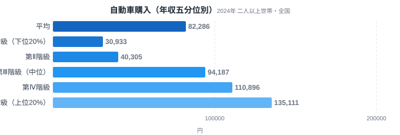
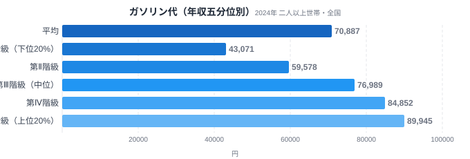
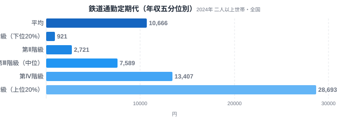

移動にかかるお金は、誰にとっても避けられない支出です。しかし総務省の家計調査を年収別に見ると、同じ「移動費」というくくりの中でも、品目によって所得階級ごとの支出のばらつきがまったく違うことがわかります。全国の世帯を年間収入で5つの階級に分ける「年間収入五分位階級」というデータを使い、自動車購入・ガソリン代・鉄道通勤定期代の3品目を比較すると、所得が上がるほど支出が急激に伸びる品目と、所得にかかわらず一定額がかかり続ける品目がはっきり分かれます。

結論から言うと、鉄道通勤定期代は上位20%世帯が下位20%世帯の31.15倍という、今回比較した3品目の中で圧倒的に大きな格差を見せました。一方で自動車購入は4.37倍、ガソリン代は2.09倍と、鉄道定期に比べると格差は小さめです。これは「自動車は生活必需品として広い所得層が持たざるを得ない一方、都市部の鉄道通勤という選択肢そのものが高所得層に偏っている」という構造を示しています。[47都道府県の車社会マップ](/blog/gasoline-car-society-map)や[鉄道通勤者の県別ギャップ](/blog/train-commuters-prefecture-gap)と合わせて読むと、地域差と所得差がどちらも移動費に影響していることが見えてきます。

> [!NOTE]
> このデータは総務省統計局「家計調査（年間収入五分位階級別・二人以上の世帯）」の2024年分です。都道府県別の統計ではなく、全国の二人以上世帯を年間収入で低い方から高い方へ5等分し、各階級（第Ⅰ階級=下位20%〜第Ⅴ階級=上位20%）の1世帯あたり平均支出額（月額）を比較しています。e-Stat（政府統計の総合窓口）経由で取得しました。

## 自動車購入 — 所得が上がるほど支出が伸びるが、下位層もゼロではない

<source-link href="/category/economy">家計・経済カテゴリの他の記事を見る</source-link>

自動車購入費は、第Ⅰ階級（下位20%）が30,933円、第Ⅴ階級（上位20%）が135,111円で、V/I比は4.37倍です。階級ごとの推移を見ると、第Ⅰ階級30,933円→第Ⅱ階級40,305円までは緩やかな伸びですが、第Ⅲ階級94,187円で急に跳ね上がり、第Ⅳ階級110,896円、第Ⅴ階級135,111円と上位層でさらに伸びています。全体の平均は82,286円で、第Ⅲ階級がその平均に近い水準に達しています。

この形が示しているのは、自動車購入が「一括で大きな金額が動く」買い物である一方、下位20%世帯であっても月換算で3万円台の支出が発生している事実です。つまり自動車そのものは所得階級を問わず広く保有・購入されている必需品に近い財ですが、購入する車種や買い替え頻度、新車か中古車かといった選択の幅が所得によって大きく変わるため、支出額には明確な差が出ます。地方では鉄道網が薄く自動車が生活の足として不可欠なため、下位層でも購入をゼロにはできない構造がうかがえます。

## ガソリン代 — 3品目の中で最も格差が小さい必需的支出

<source-link href="/category/economy">家計・経済カテゴリの他の記事を見る</source-link>

ガソリン代は第Ⅰ階級（下位20%）が43,071円、第Ⅴ階級（上位20%）が89,945円で、V/I比は2.09倍と、今回の3品目の中で最も所得差が小さい結果になりました。第Ⅰ階級43,071円→第Ⅱ階級59,578円→第Ⅲ階級76,989円→第Ⅳ階級84,852円→第Ⅴ階級89,945円と、階級が上がるごとに着実に増えてはいますが、自動車購入や鉄道定期に比べると伸び方は緩やかです。

ガソリン代の格差が小さい理由は、この支出が「車を持っている限り、日常的な移動のために避けられない」性質を持つためだと考えられます。所得が低い世帯でも通勤・通院・買い物のために一定の走行距離は必要であり、高所得世帯が特別に燃費の悪い車に乗り換えて支出を増やすインセンティブも大きくはありません。[ガソリン支出額ランキング](/blog/gasoline-expenditure-ranking)で見た地域差と合わせると、ガソリン代は所得よりも「住んでいる地域でどれだけ車に依存しているか」の方が支出額を左右しやすい品目だとわかります。

## 鉄道通勤定期代 — 31倍という圧倒的な所得格差

<source-link href="/category/economy">家計・経済カテゴリの他の記事を見る</source-link>

鉄道通勤定期代は、第Ⅰ階級（下位20%）がわずか921円、第Ⅴ階級（上位20%）は28,693円で、V/I比は31.15倍にのぼります。これは自動車購入の4.37倍、ガソリン代の2.09倍と比べても桁違いの格差です。階級ごとの推移も単調増加で、第Ⅰ階級921円→第Ⅱ階級2,721円→第Ⅲ階級7,589円→第Ⅳ階級13,407円→第Ⅴ階級28,693円と、階級を追うごとに支出額がほぼ倍近くに増え続けています。

この極端な格差の背景には、鉄道通勤という選択肢そのものが都市部の高所得層に偏っている構造があります。鉄道が生活インフラとして機能しているのは主に大都市圏であり、そうした地域は平均年収や共働き世帯の比率も高い傾向にあります。逆に地方では鉄道網が薄く、通勤の主な手段が自動車になるため、鉄道定期代という支出自体が発生しません。つまりこの31.15倍という数字は「所得が上がると鉄道定期代を多く払うようになる」という単純な消費行動の差ではなく、「高所得層は都市部に集中し、都市部は鉄道通勤が主流」という地理的な構造が所得統計に現れたものと見るべきでしょう。[東京の食文化](/blog/tokyo-food-culture)でも触れたように、都市部の生活様式は地方と大きく異なり、移動手段の選択もその一部です。

> [!WARNING]
> 家計調査の数値はあくまで「支出金額」であり、走行距離や利用回数といった消費量そのものではありません。単価の変動（ガソリン価格の変化や車種の違い）や世帯構成（勤務先までの距離、通勤の有無）の影響も含まれるため、金額差がそのまま「利用量の差」を意味するわけではない点に注意が必要です。

## データが示すもの — 必需品と贅沢品を分けるのは「選択の幅」

3品目を並べると、V/I比は鉄道通勤定期代31.15倍、自動車購入4.37倍、ガソリン代2.09倍という順に並びます。この差を生んでいるのは、単純な「高いか安いか」ではなく、その支出を避けられるかどうかという選択の幅の広さです。ガソリン代は車を持つ世帯であれば所得階級を問わずほぼ確実に発生する支出であり、格差が小さくなります。自動車購入は一括で大きな金額が動くため、買い替え頻度や車種の選択によって差が生まれますが、それでも地方では下位層でも避けられない出費です。鉄道通勤定期代は、そもそも鉄道通勤という選択肢自体が都市部の高所得層に偏っているため、格差が極端に大きくなります。

この構造は、地方では自動車が「生活必需品」であり、都市部では鉄道通勤という選択肢が「高所得層に偏った贅沢品的な移動手段」になっているとも言い換えられます。逆に言えば、都市部で暮らす人にとっては自動車を持たない生活が経済合理的な選択肢になり得る一方、地方で暮らす人にとっては自動車の保有・維持費が所得階級を問わず固定費としてのしかかっているということです。

> [!TIP]
> 移動費の格差を読むときは、V/I比の大小だけでなく「その支出を避けられる代替手段があるかどうか」を合わせて見ると理解が深まります。代替手段が乏しい支出ほど格差が小さくなり、代替手段（この場合は鉄道か自動車か）の選択自体が所得や居住地域に左右される支出ほど格差が大きくなる傾向があります。

## まとめ

- 自動車購入費は第Ⅰ階級30,933円・第Ⅴ階級135,111円でV/I比4.37倍。地方の必需品的性格から下位層でも一定額の支出が発生する
- ガソリン代は第Ⅰ階級43,071円・第Ⅴ階級89,945円でV/I比2.09倍。3品目中もっとも格差が小さく、車を持つ世帯なら所得を問わず避けにくい支出
- 鉄道通勤定期代は第Ⅰ階級921円・第Ⅴ階級28,693円でV/I比31.15倍。鉄道通勤という選択肢自体が都市部の高所得層に偏っていることが極端な格差を生む
- 移動費の格差は「所得が高いほど贅沢な移動手段を選ぶ」という単純な話ではなく、地方の車依存と都市部の鉄道インフラという地理的構造が背景にある

## データ出典

総務省統計局「家計調査（年間収入五分位階級別・全国・二人以上世帯）」2024年。e-Stat（政府統計の総合窓口）経由で取得しました。
