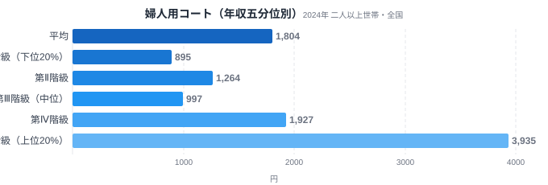
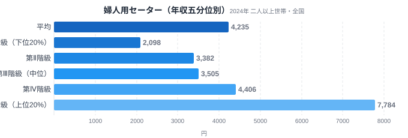
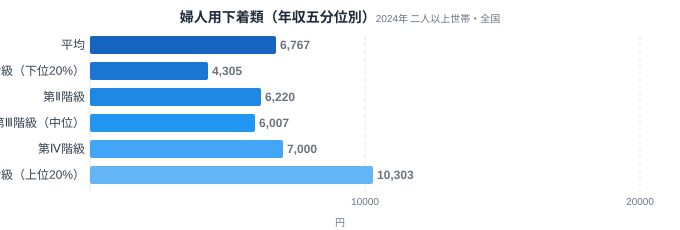
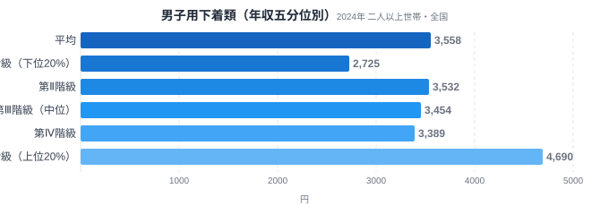
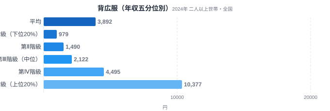

同じ「服」でも、コートと下着では年収による支出の差がまるで違います。総務省の家計調査には、全国の世帯を年収順に5等分した「年間収入五分位階級別」のデータがあります。これで衣料品を見ると、外側に着る服ほど所得差が大きく、内側に着る服ほど差が小さいという、はっきりした傾向が浮かび上がります。

婦人用コートは上位20%の世帯が下位20%の4.4倍を支出する一方、下着になるとその差は2.4倍まで縮まります。「人目にさらす服ほど、お金をかける余裕が表れる」——書籍『マーケティングに使える「家計調査」』が指摘したこの構図を、2024年の最新データで確かめてみましょう。

> [!NOTE]
> この記事のデータは総務省「家計調査」の年間収入五分位階級別（全国・二人以上世帯）です。都道府県別ではなく、全国の世帯を年収順に5等分した各層（第Ⅰ階級＝下位20%〜第Ⅴ階級＝上位20%）の平均支出額を示します。

## 婦人用コート — 外側の服は4.4倍差

婦人用コートの年間支出額は、第Ⅰ階級（下位20%）が895円、第Ⅴ階級（上位20%）が3,935円。その差は4.4倍にのぼります。コートは冬に必ず人目にさらす、いわば「外見の看板」となる衣料です。所得に余裕がある世帯ほど、素材やブランドにお金をかける傾向がはっきり表れています。

コートのように高価で、かつ他人の目に触れる品目は、選択的支出（生活必需度が低く、余裕があるほど増やす支出）の典型です。第Ⅳ階級（1,927円）から第Ⅴ階級（3,935円）にかけて支出が倍増している点に、上位層の「見せる消費」への傾斜が読み取れます。

ただし第Ⅱ階級（1,264円）から第Ⅲ階級（997円）にかけては支出が下がっており、右肩上がりの単調な増加ではありません。V/I比の4.4倍は下位20%と上位20%という両端だけを取り出した指標であり、中間層での増減までは説明していない点に注意が必要です。

## 婦人用セーター — 中間の服は3.7倍差

婦人用セーターの支出額は、第Ⅰ階級が2,098円、第Ⅴ階級が7,784円で、その差は3.7倍です。セーターはコートほど「よそ行き」ではありませんが、それでも人前で着る中間的な衣料です。所得差はコートよりやや小さいものの、依然として大きな開きがあります。

コート（4.4倍）とセーター（3.7倍）を比べると、「より外側・よりフォーマルな服ほど所得差が大きい」という順序が見えてきます。衣料品の所得弾性は、その服がどれだけ「人目にさらされるか」と結びついているのです。

## 婦人用下着 — 内側の服は2.4倍差

婦人用下着類の支出額は、第Ⅰ階級が4,305円、第Ⅴ階級が10,303円で、差は2.4倍。コートやセーターに比べると、上位層と下位層の開きが明らかに小さくなっています。下着は他人の目に触れにくく、機能性が重視される品目です。そのため「見せるための上乗せ」が働きにくく、所得による差が縮まると考えられます。

ここでも第Ⅱ階級（6,220円）から第Ⅲ階級（6,007円）にかけてはわずかに下がっており、コートと同じく途中に凹みを含む推移です。婦人用の3品目（コート4.4倍→セーター3.7倍→下着2.4倍）を並べると、外側から内側へ向かって所得差が縮んでいく傾向が見えます。

## 男子用下着 — 男性衣料でも同じ傾向は再現するか

男子用下着類の支出額は、第Ⅰ階級2,725円・第Ⅴ階級4,690円で、V/I比は1.7倍。ここまで見た婦人用3品目よりもさらに小さい値です。ただし途中の推移は単調ではなく、第Ⅱ階級3,532円→第Ⅲ階級3,454円→第Ⅳ階級3,389円と3階級連続でわずかに下がってから、第Ⅴ階級で跳ね上がる形をしています。

男子用下着（1.7倍）を婦人用3品目の並びに加えると数値としてはさらに小さくなりますが、注意が必要です。男子用下着は婦人用下着より「もう一段内側にある品目」ではなく、性別の異なる別カテゴリであり、被服費の水準そのものが男女で異なります。この1.7倍が「より内側だから」小さいのか「男性用品目だから」小さいのかを、この4品目だけから切り分けることはできません。外側から内側への縮小傾向は婦人用3品目を主な根拠とし、男子用下着は「男性衣料でも似た傾向が見られるかどうか」を確かめる補助的な検証として読むのが妥当です。

> [!WARNING]
> 家計調査は支出金額の調査であり、購入した枚数（数量）そのものではありません。高所得層が「高い服を少数」買っても、低所得層が「安い服を多数」買っても支出額は近づくことがあり、金額差がそのまま枚数差を意味しない点にご注意ください。また、年間収入五分位階級は所得だけでなく世帯人員や世帯主の年齢などの世帯属性も階級間で異なりうるため、支出差のすべてを所得の効果として読むことはできません。

## 背広服 — 最もフォーマルな服は10.6倍差

背広服の年間支出額は、第Ⅰ階級（下位20%）979円に対し第Ⅴ階級（上位20%）10,377円で、V/I比は10.6倍。今回見た5品目のなかで最大の開きです。コート（4.4倍）やセーター（3.7倍）よりもさらに大きく、物理的な「外側・内側」だけでなく、「改まった場でどれだけきちんとした格好をするか」という基準でも所得差が開くことがわかります。第Ⅲ階級（2,122円）まではゆるやかに増え、第Ⅳ階級（4,495円）から第Ⅴ階級（10,377円）にかけて2倍以上に跳ね上がっており、上位層への支出の集中がコート以上にはっきりしています。

書籍『マーケティングに使える「家計調査」』は、こうした冬物衣料の売れ行きを読む別の視点として、冬物バーゲンの成否が翌月の購入価格に表れると指摘していますが、年単位の集計であるこの記事のデータだけでは確かめられません。

## データが示すもの

衣料品の所得格差は、その服が「どれだけ人目にさらされるか」で決まります。外側のコートは4.4倍、内側の下着は1.7〜2.4倍。同じ被服費でも、見せる服には余裕が上乗せされ、見せない服は必需品に近づく。マーケティングの観点では、高所得層に売り込むなら「人目にさらされる品目」ほど価格帯を上げる戦略が有効だと、このデータは示しています。

衣料品以外の所得格差は[年収五分位シリーズの総論](/blog/income-quintile-overview)や[贅沢財ランキング](/blog/income-quintile-luxury-ranking)でも扱っています。都道府県別の消費傾向は[47都道府県の県民の食卓シリーズ](/blog/tokyo-food-culture)からご覧いただけます。

> [!TIP]
> 品目の所得弾性（年収が上がると支出がどれだけ増えるか）は、「その品目が他人に見えるかどうか」と相関します。装飾品・外着・外食など「見せる消費」は所得差が大きく、下着・光熱費など「見せない消費」は所得差が小さい、という視点で家計を眺めると発見があります。

## まとめ

- 婦人用コートは上位20%が下位20%の4.4倍、外側の服ほど所得差が大きい
- 婦人用3品目はコート4.4倍→セーター3.7倍→下着2.4倍と、外側から内側へ向かって差が縮む
- 背広服は10.6倍で今回見た5品目のなかで最大、男子用下着は1.7倍で最小だが性別が異なるため単純比較はできない
- 見せる消費と見せない消費で所得弾性が異なるのは、衣料品に限らない普遍的な構図

家計消費の地域差は[経済カテゴリ一覧](/category/economy)からご覧いただけます。

## データ出典

総務省統計局「家計調査（年間収入五分位階級別・全国・二人以上世帯）」（2024年）。e-Stat（政府統計の総合窓口）経由で取得したデータを使用しています。
