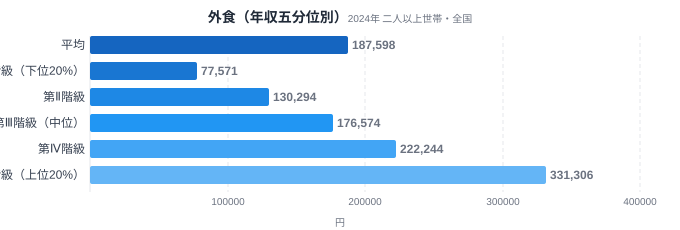
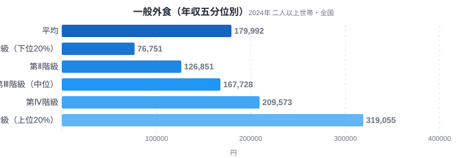
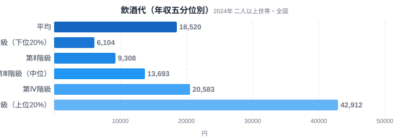

「外食は贅沢だから、お金に余裕がある人ほど頻繁に行く」——そう感じたことがある人は多いはずです。しかし、この直感は本当にデータで裏付けられるのでしょうか。

総務省の家計調査には、全国の二人以上世帯を年間収入で5つの階級に分けた「年間収入五分位階級」という区分があります。このデータを使うと、年収が高い世帯ほど支出が増える品目（贅沢財）と、年収に関わらず支出があまり変わらない品目（必需品）を数字で見分けることができます。今回は外食・一般外食・飲酒代の3品目を比較し、年収による支出の伸び方の違いを確認します。結論から言うと、外食は年収差が支出額に強く反映される品目で、なかでも飲酒代の格差は外食本体よりもさらに大きいという結果が出ました。

> [!NOTE]
> 「年間収入五分位階級」とは、総務省家計調査が全国の二人以上世帯を年間収入の低い順に5等分した区分です。第Ⅰ階級が年収下位20%の世帯、第Ⅴ階級が年収上位20%の世帯を指します。都道府県別の集計ではなく、全国の世帯を所得順に並べ替えた区分である点に注意してください。

## 外食全体 — 支出額は4.27倍の開き

<source-link href="/category/economy">経済カテゴリの他の記事を見る</source-link>

外食への年間支出額は、第Ⅰ階級（下位20%）が77,571円であるのに対し、第Ⅴ階級（上位20%）は331,306円でした。倍率にすると4.27倍で、平均の187,598円を境に、第Ⅰ〜第Ⅲ階級は平均を下回り、第Ⅳ・第Ⅴ階級が平均を大きく押し上げる構図になっています。

この差が生まれる背景には、外食が「時間を買う」側面と「余暇を楽しむ」側面の両方を持つことがあります。所得が低い世帯では自炊で食費を抑える選択肢が優先されやすく、外食は特別な機会に限られがちです。一方で所得が高い世帯は、外食を日常的な選択肢として使える余地が大きく、頻度そのものが増えます。結果として、外食支出は年収の伸びに対して支出も比例的に伸びる「贅沢財」的な性質を持つことが、この五分位比較から見て取れます。

## 一般外食 — 学校給食を除いてもほぼ同じ傾向

<source-link href="/category/economy">経済カテゴリの他の記事を見る</source-link>

「一般外食」は外食のうち学校給食を除いた区分です。第Ⅰ階級は76,751円、第Ⅴ階級は319,055円で、V/I比は4.16倍となりました。外食全体（4.27倍）とほぼ同水準の格差です。

学校給食は世帯の子どもの人数や就学状況に左右される支出で、必ずしも年収と連動しません。一般外食で見てもほぼ同じ倍率が出たということは、外食支出の格差が「学校給食を除いた純粋な外食機会（レストラン・喫茶・居酒屋など）」の利用頻度の違いに由来していることを示しています。子育て世帯の給食費という固定的な支出を除いても、外食そのものの格差構造は変わらないという結果です。

## 飲酒代 — 4品目中もっとも急な傾き、V/I比は7倍超

<source-link href="/category/economy">経済カテゴリの他の記事を見る</source-link>

飲酒代（外食に含まれる飲酒代とは別枠の、家計調査における「飲酒代」区分）は、第Ⅰ階級が6,104円、第Ⅴ階級が42,912円で、V/I比は7.03倍に達しました。外食（4.27倍）や一般外食（4.16倍）よりも明確に大きい格差です。

飲酒代がここまで急な傾きを見せるのは、飲酒という行為自体が「生活必需」から最も遠い支出だからだと考えられます。食事は所得の多寡に関わらず一定量が必要ですが、飲酒（特に外での飲酒）は完全に選択的な支出であり、可処分所得に余裕がある世帯ほど頻度・単価ともに上振れしやすい性質を持ちます。第Ⅰ階級の月あたり飲酒代はおよそ500円程度に過ぎず、外食に伴う飲酒がほぼ発生していない世帯が多いことがうかがえます。

> [!WARNING]
> 家計調査の数値は「支出金額」であり、飲食の「回数」や「量」そのものではありません。単価の高い店を選ぶか、同じ店でも高い商品を選ぶかによっても金額は変わります。また世帯人数・世帯構成の違いも支出額に影響するため、今回の数値は世帯あたりの平均支出として読む必要があります。

## データが示すもの

3品目を比較すると、支出の伸び方に明確な序列が見えてきます。

- **飲酒代（V/I比7.03倍）**が最も所得弾力性が高く、最も「贅沢財」的な性質を持つ
- **外食全体（4.27倍）**と**一般外食（4.16倍）**はほぼ同水準で、いずれも所得が増えるほど支出が伸びる傾向が明確
- 3品目とも第Ⅰ階級から第Ⅴ階級にかけて単調に支出が増加しており、途中で頭打ちになる品目はない
- 食事そのもの（外食）よりも、そこに付随する飲酒の方が所得差の影響を強く受ける

この序列は、「生活に不可欠かどうか」という軸で整理すると理解しやすくなります。外食は「自炊で代替できるが便利さや娯楽性がある」品目、飲酒はさらに一歩進んで「なくても生活に支障がない」品目です。生活への必要度が下がるほど、所得に応じた支出の伸び方（弾力性）が大きくなるという、経済学でいう「必需品と贅沢品」の構図が、家計調査の実データではっきりと確認できました。

> [!TIP]
> 同じ「食」に関する支出でも、主食や調味料といった必需的な品目は五分位間の差が外食ほど大きくないと考えられます。今回のデータだけでは断定できませんが、[47都道府県の食文化を比較した記事](/blog/tokyo-food-culture)や[外食費の都道府県格差を扱った記事](/blog/dining-out-expenditure-ranking)と合わせて読むと、「地域差」と「所得差」という2つの軸から外食支出の全体像がつかめます。

## まとめ

- 外食への年間支出は第Ⅰ階級77,571円・第Ⅴ階級331,306円で、V/I比4.27倍
- 一般外食（学校給食除く）も同水準の4.16倍で、外食格差は給食費の有無に左右されない
- 飲酒代は6,104円→42,912円でV/I比7.03倍と、外食本体より格差が大きい
- 所得が高い世帯ほど「必需性の低い支出」に多く配分する傾向が、今回の3品目すべてで確認できた
- 外食・飲酒はいずれも年収の増加に対して支出が比例以上に伸びる「贅沢財」的な性質を持つ

[経済カテゴリ一覧](/category/economy)では、所得・支出に関する他の統計データも確認できます。都道府県ごとの家計事情に関心がある場合は、[全国各地の食卓を比較した記事シリーズ](/blog/food-culture-prefecture-map)も参考になります。

## データ出典

総務省統計局「家計調査（年間収入五分位階級別・全国・二人以上世帯）」2024年。e-Stat経由で取得しています。
