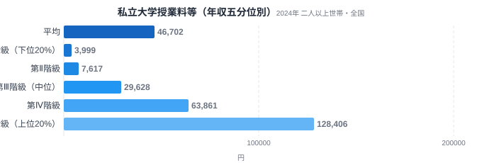
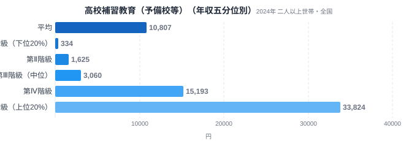
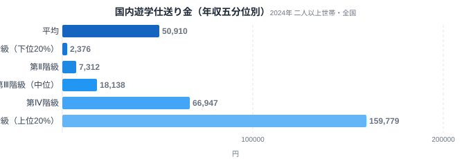
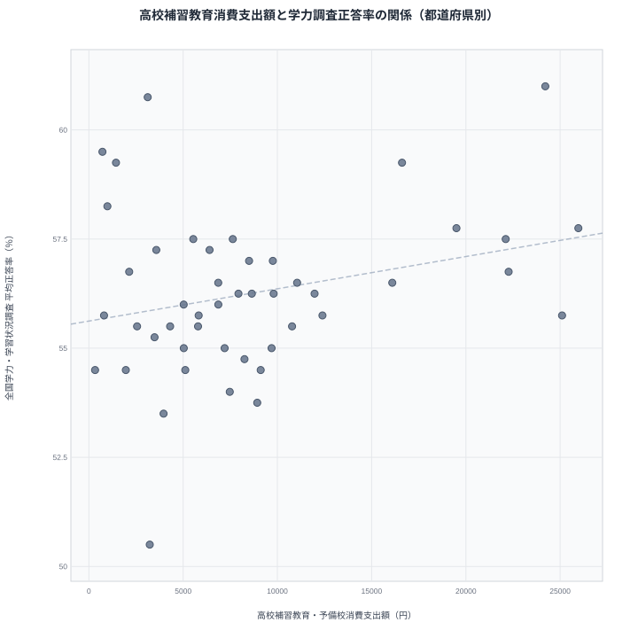

同じ日本に住んでいても、子どもにどれだけ教育費をかけられるかは家庭の年収で大きく変わります。総務省の家計調査には、全国の世帯を年収順に5つの層に分けて支出額を比較できるデータがあります。これを「年収五分位階級」と呼びます。

このデータで教育関連の支出を見ると、家計の中でも教育費だけが突出して所得格差が大きいことがわかります。私立大学の授業料等は上位20%が下位20%の32倍、高校の補習教育(予備校等)は101倍、子どもの下宿・遊学先への仕送り金は67倍にのぼります。教育費には、[公立小学校の教育費は都道府県で1.7倍違う](/blog/education-cost-per-child)という地域差の軸もありますが、今回見ていく年収による格差はそれとは別に、同じ地域の中でも所得の差そのものから生じているものです。なぜこれほどまでに差が出るのか、品目ごとの性質から見ていきます。

> [!NOTE]
> このデータは総務省統計局「家計調査(年間収入五分位階級別・全国・二人以上世帯)」2024年分を、e-Stat経由で取得したものです。都道府県別の格差ではなく、全国の世帯を年収順に5等分した各層(第Ⅰ階級=下位20%〜第Ⅴ階級=上位20%)の平均支出額を示しています。

## 私立大学授業料等 — 32倍の壁

<source-link href="/ranking/private-university-consumption-expenditure">私立大学消費支出額ランキングを見る</source-link>

私立大学の授業料等にかかる年間支出額は、第Ⅰ階級(下位20%)が3,999円、第Ⅴ階級(上位20%)が128,406円です。差は32.11倍にのぼります。第Ⅰ階級の3,999円は、私立大学の授業料としてはほぼ計上されていない水準に近く、進学そのものを選ばない、あるいは選べない世帯が多いことを示唆しています。一方、第Ⅴ階級の128,406円はあくまで世帯平均の年間支出額であり、実際に子どもを私立大学へ通わせている世帯に限れば、この何倍もの学費を負担していると考えられます。

階級ごとの伸び方を見ると、第Ⅰ階級から第Ⅲ階級(中位)までは3,999円→7,617円→29,628円と緩やかに増えますが、第Ⅳ階級で63,861円、第Ⅴ階級で128,406円と、後半にかけて跳ね上がる形です。これは私立大学進学が「一定の年収を超えて初めて現実的な選択肢になる」性質を持つことを表しています。国公立大学であれば授業料の負担は相対的に軽くなりますが、この統計が示す「私立大学」という枠組み自体が、選べる世帯とそうでない世帯を分ける境界線として機能しているとみられます。なお全世帯の平均は46,702円で、第Ⅲ階級(29,628円)と第Ⅳ階級(63,861円)のほぼ中間に位置しており、平均値だけを見ても上位階級の高い支出額に引っ張られていることがわかります。

## 高校補習教育(予備校等) — 格差はさらに開き101倍

<source-link href="/ranking/high-school-tutoring-consumption-expenditure">高校補習教育・予備校消費支出額ランキングを見る</source-link>

高校生の補習教育、いわゆる予備校や塾にかかる支出は、第Ⅰ階級が334円、第Ⅴ階級が33,824円で、差は101.27倍です。私立大学の32倍をさらに上回り、今回取り上げた3品目の中で最大の格差になっています。

第Ⅰ階級の334円は、予備校をほぼ利用していないに等しい水準です。対して第Ⅴ階級の33,824円も世帯平均の年間支出額なので、実際に大学受験対策の予備校へ通わせている世帯の年間負担額はこれを大きく上回るとみられます。予備校は大学進学のための「準備段階」の支出であり、私立大学の授業料そのものよりもさらに手前の投資にあたります。この手前の投資段階でこれほどの格差が生じているということは、大学進学の可否そのものが、高校時代の学習環境の差によってすでに固定されつつある可能性を示しています。なお全世帯の平均は10,807円で、これは第Ⅳ階級の15,193円よりも低い水準です。上位2階級だけが突出して高い支出をしているために、5階級を均した平均が中位よりも下に沈む形になっており、分布が上位層に強く偏っていることを裏付けています。階級別の推移も第Ⅰ〜第Ⅲ階級では334円→1,625円→3,060円とゆるやかですが、第Ⅳ階級で15,193円、第Ⅴ階級で33,824円と急激に増えており、私立大学と同じく「一定の年収を超えて初めて予備校という選択肢が現実化する」パターンが繰り返されています。

## 国内遊学仕送り金 — 67倍が示す「地元を離れる」ハードル

<source-link href="/ranking/domestic-student-remittance-consumption-expenditure">国内遊学仕送り金消費支出額ランキングを見る</source-link>

子どもが下宿や進学のために親元を離れる際の仕送り金は、第Ⅰ階級が2,376円、第Ⅴ階級が159,779円で、差は67.25倍です。私立大学の32倍より大きく、予備校の101倍よりは小さい、ちょうど中間の格差水準になります。

仕送り金は、地元に希望する進学先がない場合に発生する「地理的な選択の自由」にかかるコストと言えます。第Ⅰ階級の2,376円ではほとんど仕送りが発生しておらず、進学先を自宅から通える範囲に限定せざるを得ない世帯が多いと考えられます。対して第Ⅴ階級の159,779円も世帯平均の年間支出額であり、実際に東京や大都市圏へ子どもを送り出している世帯の年間の家賃・生活費負担はこれを上回る規模になっているとみられます。全世帯の平均は50,910円で、第Ⅲ階級(18,138円)と第Ⅳ階級(66,947円)の間に位置しており、こちらも上位階級の支出額が平均を押し上げている構図です。階級別では第Ⅰ階級2,376円から第Ⅱ階級7,312円、第Ⅲ階級18,138円と緩やかに増えたあと、第Ⅳ階級66,947円、第Ⅴ階級159,779円と後半で急伸しており、私立大学・予備校と同じ「後半跳躍型」のパターンをたどっています。地元を離れて学ぶという選択肢自体が、所得の高い層に偏っていることがこの数字からうかがえます。

> [!WARNING]
> 家計調査は「支出金額」を集計したものであり、進学者数や利用者数そのものではありません。第Ⅰ階級の支出額が低いのは、そもそも該当する支出をしている世帯の割合が少ないことも反映しています。また世帯人数や子どもの人数の違いも支出額に影響するため、1人あたりの教育機会の差はこの数字よりも大きい、あるいは小さい可能性があります。

## 都道府県別に見る「投資の型」— 秋田と東京・奈良の対比

年収五分位のデータは全国を1つの集団として見たものですが、家計調査には都道府県庁所在市ごとの消費支出額も別にあります。以下で扱う補習教育(幼児・小学校/中学校/高校)や国公立大学の消費支出額は、いずれも都道府県庁所在市の二人以上世帯を対象にした値です。ここで補習教育への支出額と学力調査の結果を都道府県別に突き合わせると、同じ「教育投資」でも中身が対照的な2つの型が見えてきます。

秋田県は幼児・小学校の補習教育消費支出額が全国46位、中学校の補習教育消費支出額が全国45位、高校の補習教育消費支出額が全国43位と、3つの学齢段階すべてで最下位圏に沈んでいます。それにもかかわらず、文部科学省・国立教育政策研究所の全国学力・学習状況調査を基にした平均正答率は59.25%で全国4位です。塾や予備校への支出額の低さと学力調査の順位の高さが両立している県ということになります。

対して東京都は高校の補習教育消費支出額が24,214円で全国3位と突出して高く、学力調査の平均正答率も61%で全国1位です。支出額・正答率がともにトップ層にある県といえます。奈良県は幼児・小学校の補習教育消費支出額が16,644円で全国5位に入るなど早い段階からの支出が目立ちますが、学力調査の平均正答率は56.25%で全国21位にとどまり、東京都ほど正答率の順位には表れていません。

[全国学力テスト平均正答率ランキング](/ranking/academic-achievement-test-average-rate)では都道府県別の全順位を、[国公立大学消費支出額ランキング](/ranking/public-university-consumption-expenditure)では県庁所在市別の国公立大学納付額を確認できます。後者を見ると秋田は0円で43位、東京は2,112円で37位、奈良は3,523円で33位といずれも全国下位圏で、塾・予備校への依存度ほど地域差がはっきり出る指標ではありません。

> [!NOTE]
> 補習教育・国公立大学の消費支出額はいずれも都道府県庁所在市の二人以上世帯が対象です。特に国公立大学消費支出額は対象世帯数が少ないぶん、その年にたまたま大学納付金を支払った世帯が含まれたかどうかで数値が大きく振れます。補習教育のように毎年一定数の家庭が支出する費目とは性質が異なるため、単年の順位だけで「秋田は国公立大学志向」と結論づけるのは早計です。

47都道府県全体で高校補習教育消費支出額と学力調査の平均正答率の関係を見ると、相関係数はr=0.27で、弱い正の相関にとどまります。支出額が多い県ほど正答率がやや高い傾向はあるものの、支出額だけで正答率のばらつきの大半を説明できるほどの強い関係ではありません。秋田県・東京都・奈良県の3県は、この弱い相関の中でも際立った位置にある事例で、47都道府県の分布全体で見れば、支出額と正答率の組み合わせにはこの3県以外にも様々なパターンが存在します。

> [!WARNING]
> 支出額と学力調査の順位の対応関係は相関であって、支出額が学力を高めるという因果関係を示すものではありません。家庭の学習習慣、学校教育の内容、地域の教育環境など、この2つの統計には現れない要因が両方に影響している可能性があります。「厚く投資すれば結果が出る」「投資しなければ結果が出ない」と単純に読み替えないよう注意してください。

## データが示すもの

今回取り上げた私立大学(32.11倍)・予備校(101.27倍)・仕送り金(67.25倍)は、都道府県格差で最大1.7倍という[公立小学校の教育費格差](/blog/education-cost-per-child)とはまったく異なる、桁違いに大きい所得格差です。3品目に共通するのは、いずれも「大学進学」という一つのゴールに向けた投資であり、後になるほど支出規模が跳ね上がる「後半跳躍型」の階級分布を持つ点です。

この3品目を並べると、格差の大きさに序列があることも見えてきます。予備校(101.27倍)が最大で、次に仕送り金(67.25倍)、私立大学(32.11倍)の順です。これは一見すると意外に思えるかもしれません。私立大学の授業料そのものより、そこへ至る準備段階である予備校のほうが格差が大きいという結果は、教育投資が「入り口」の時点ですでに大きく分岐していることを示しています。大学に入ってからの学費差より、大学に入るための準備段階での差のほうが、実は所得によって大きく開いているのです。

同じ家計調査の年収五分位データで、必需品的な性質を持つ食料・被服を見ると、格差の大きさはまったく違う水準に収まります。食料(非耐久財)は第Ⅰ階級767,802円・第Ⅴ階級1,039,748円で1.35倍、被服及び履物(半耐久財)は第Ⅰ階級51,113円・第Ⅴ階級202,859円で3.97倍です。教育費は「あるかないか」から「桁違いに大きいか小さいか」まで振れ幅が極端で、数倍程度に収まる必需品の支出とは一線を画す水準にあります。これは教育費が単なる消費支出ではなく、次世代の所得や機会そのものへの投資という性質を持つためだと考えられます。塾や予備校にほとんど頼らずに学力上位を維持する秋田県のような例もある一方、この記事のデータは所得という軸だけでも教育機会の格差がすでに大きいことを示しています。

> [!TIP]
> 五分位階級は世帯を年収順に5等分したものであり、階級ごとに世帯人数や子どもの人数の平均も異なります。高所得層ほど世帯人数が多い傾向があるため、1人当たり・子ども1人当たりに換算すると、ここで示した32倍・101倍・67倍という倍率の見え方は変わる可能性があります。

## まとめ

- 私立大学授業料等: 第Ⅰ階級3,999円 → 第Ⅴ階級128,406円(32.11倍)
- 高校補習教育(予備校等): 第Ⅰ階級334円 → 第Ⅴ階級33,824円(101.27倍、3品目中最大)
- 国内遊学仕送り金: 第Ⅰ階級2,376円 → 第Ⅴ階級159,779円(67.25倍)
- いずれも「後半跳躍型」の階級分布を持ち、一定の年収を超えて初めて選択肢として現実化する
- 大学進学の準備段階(予備校)のほうが、本番の学費(私立大学)より格差が大きい

## データ出典

総務省統計局「家計調査(年間収入五分位階級別・全国・二人以上世帯)」2024年分。e-Stat(政府統計の総合窓口)経由で取得。
