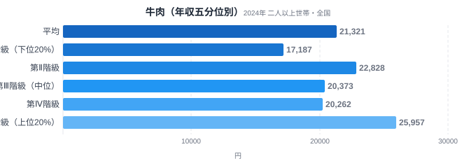
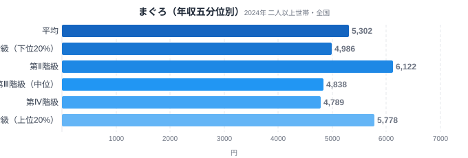
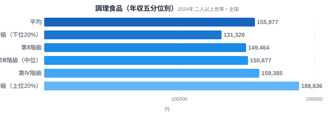
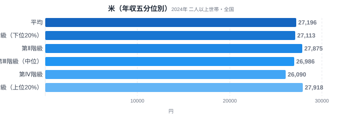
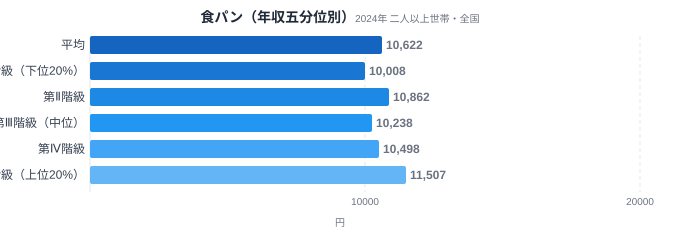
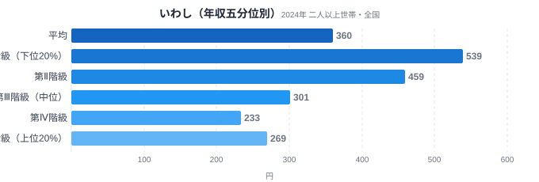

「食費」という一つの言葉でくくられていても、その中身は世帯の年収によって大きく違います。総務省の家計調査には、全国の二人以上世帯を年間収入で5つのグループに等分した「年収五分位階級」というデータがあります。下位20%を第Ⅰ階級、上位20%を第Ⅴ階級として、食料の中の品目別支出を比べると、同じ「食料費」という枠の中にはっきりとした濃淡が見えてきます。

この記事の核心は単純です。牛肉や調理食品のような品目は年収が上がるほど支出が伸びる一方、米のような主食はほとんど動かず、いわしのような大衆魚に至っては下位階級のほうが多く買っているという「逆転現象」が起きています。同じ食卓の上でも、何を選ぶかで所得差の出方がまったく違うのです。

> [!NOTE]
> 本記事のデータは総務省「家計調査」の「年間収入五分位階級別（全国・二人以上世帯）」です。都道府県別のランキングではなく、全国の世帯を年間収入の低い順に第Ⅰ〜第Ⅴ階級の5グループに等分し、各グループの平均支出額（1世帯あたり）を比較しています。第Ⅰ階級が下位20%、第Ⅴ階級が上位20%にあたります。

## 牛肉 — 所得が上がるほど食卓に増える一品

<source-link href="/category/economy">家計・経済カテゴリの他の記事を見る</source-link>

牛肉への年間支出は、第Ⅰ階級が17,187円、第Ⅴ階級が25,957円で、その差は1.51倍にのぼります。階級が上がるにつれて支出額もほぼ右肩上がりに増えており、所得と支出が連動している典型的な品目です。豚肉や鶏肉に比べて単価が高い牛肉は、家計に余裕があるほど選ばれやすい「上級財」的な性格を持っていると考えられます。

日常の食卓では、豚肉・鶏肉が主菜の中心を占める世帯が多い一方、牛肉はステーキやすき焼きなど特別な機会に登場することが多い食材です。第Ⅴ階級の世帯は牛肉をより頻繁に、あるいはより高価な部位を選んで購入していると推測されます。牛肉の消費量そのものの地域差を見たい方は、[牛肉消費量ランキング](/blog/beef-consumption-quantity)も参考になります。

## まぐろ — 意外と横ばいに近い高級魚

<source-link href="/category/economy">家計・経済カテゴリの他の記事を見る</source-link>

まぐろは第Ⅰ階級が4,986円、第Ⅴ階級が5,778円で、V/I比は1.16倍とわずかな差にとどまります。牛肉ほどの所得弾力性は見られず、刺身や寿司ネタとして日本の食卓に幅広く根付いている品目であることがうかがえます。まぐろは高級食材のイメージがある一方、スーパーの惣菜コーナーや回転寿司などを通じて所得階層を問わず一定量が消費される「準必需品」に近い立ち位置にあると考えられます。

興味深いのは、第Ⅱ階級が6,122円と全階級中もっとも高い点です。第Ⅰ階級より高く第Ⅲ・Ⅳ階級より高いこの動きは、単純な右肩上がりではなく、購買行動が所得だけで説明しきれないことを示しています。まぐろは刺身用の柵からツナ缶まで価格帯の幅が広く、同じ「まぐろ」という括りでも世帯によって選ぶ商品が違う可能性があります。第Ⅱ階級で支出が最も高い理由の一つとして、家族構成や子育て世帯の割合が階級ごとに異なることも考えられますが、これは家計調査の品目データだけでは特定できません。魚介類全体の消費傾向は[漁業種類別の産地特性](/blog/fishery-species-prefecture-specialty)でも取り上げているので、あわせて読むと地域差との関係が見えてきます。

## 調理食品 — 時間を買う支出は上位ほど厚い

<source-link href="/category/economy">家計・経済カテゴリの他の記事を見る</source-link>

弁当・惣菜・冷凍食品などを含む調理食品は、第Ⅰ階級131,320円に対し第Ⅴ階級188,836円と、1.44倍の開きがあります。金額の絶対値も大きく、6品目の中で最も家計への影響が大きいカテゴリーです。調理食品は「手間を省く」ための支出という性格が強く、共働き世帯や時間的余裕の少ない世帯ほど利用が増える傾向があると考えられます。

第Ⅴ階級で支出が突出して多い背景には、世帯の就業状況や外食に近い高付加価値な調理食品（デリカテッセン等）の選択肢の広さも関係していそうです。共働き世帯では自炊にかけられる時間が限られるため、所得に余裕があるほど「手間を買う」選択が積み重なりやすいと考えられます。逆に第Ⅰ階級では、調理食品よりも米や生鮮食品を自分で調理する比率が高い可能性があります。[食料消費の全国的な傾向](/blog/food-spending-pattern)と合わせて見ると、調理食品への依存度が家計全体の食生活をどう変えているかがより立体的に見えてきます。

## 米・食パン — 主食は所得差がほとんど出ない

<source-link href="/category/economy">家計・経済カテゴリの他の記事を見る</source-link>

米は第Ⅰ階級27,113円、第Ⅴ階級27,918円で、V/I比はわずか1.03倍とほぼ横ばいです。全6品目の中で所得による差が最も小さく、主食としての性格がはっきり表れています。米は炭水化物の摂取源として世帯構成やライフスタイルに関わらず一定量が必要とされるため、所得の増減が直接的に支出額を左右しにくいのだと考えられます。

<source-link href="/category/economy">家計・経済カテゴリの他の記事を見る</source-link>

食パンも第Ⅰ階級10,008円、第Ⅴ階級11,507円でV/I比1.15倍と、牛肉や調理食品に比べて格差が小さい品目です。米とパンはともに「毎日の食卓を支える基礎的な炭水化物」という共通点があり、所得の高低にかかわらず一定の需要が保たれる必需品としての特徴を強く示しています。

## いわし — 唯一の逆転、下位階級ほど多く買う

<source-link href="/category/economy">家計・経済カテゴリの他の記事を見る</source-link>

いわしは今回取り上げた6品目の中で唯一、所得と支出が逆方向に動く品目です。第Ⅰ階級が539円であるのに対し第Ⅴ階級は269円と、V/I比は0.50倍に落ち込みます。下位階級のほうが上位階級よりも2倍多くいわしを購入している計算になり、他の品目とは正反対の「逆進的」な傾向を示しています。

いわしは単価が安く、栄養価が高い大衆魚として長く庶民の食卓を支えてきました。所得が低い世帯ほどコストパフォーマンスを重視した食材選びをする傾向があり、その結果として牛肉やまぐろとは逆の消費パターンが生まれていると考えられます。第Ⅱ階級459円→第Ⅲ階級301円→第Ⅳ階級233円と階級が上がるごとに支出が減っていく様子からも、いわしが「下位階級ほど選ばれる」構造がはっきり読み取れます。

> [!WARNING]
> 家計調査のデータは「支出金額」であり「消費量」ではありません。単価の違いや世帯人数・世帯構成の差も支出額に影響するため、金額の増減がそのまま消費量の増減を意味するとは限りません。たとえば同じ牛肉でも、上位階級が高級な部位をより多く買っている可能性と、単純に量を多く買っている可能性の両方が考えられます。

## データが示すもの

6品目を並べてみると、食料の中にも「必需品」「贅沢品」「逆進財」という3つの異なる性格が同居していることが分かります。牛肉（1.51倍）と調理食品（1.44倍)は所得が上がるほど支出が伸びる贅沢品的な性格が強く、米（1.03倍）と食パン（1.15倍）は所得にかかわらず一定量が必要とされる必需品、そしていわし（0.50倍）だけは下位階級ほど支出が多い逆進財という珍しい位置づけです。まぐろ（1.16倍）は贅沢品と必需品の中間に近い、なだらかな傾きを見せています。

この違いを分けているのは、単価の高さだけではなさそうです。米や食パンのように「毎日欠かせない基礎食材」は所得に関わらず一定量が消費される一方、牛肉や調理食品のように「選択の余地がある」品目は、家計の余裕度に応じて量や質のグレードが変わりやすいと考えられます。いわしのような安価な大衆魚は、下位階級にとって「コストを抑えつつ栄養を確保する」合理的な選択肢になっている可能性があります。

> [!TIP]
> 「食料費全体」で見ると所得階層による差は緩やかに見えますが、品目を分解すると格差の出方は品目ごとに全く異なります。家計を分析する際は、総額だけでなく品目別の内訳まで見ることで、その世帯がどこにお金を配分しているかがより具体的に見えてきます。

## まとめ

- 牛肉は第Ⅰ階級17,187円→第Ⅴ階級25,957円でV/I比1.51倍、所得と支出が最も強く連動する品目
- 調理食品は第Ⅰ階級131,320円→第Ⅴ階級188,836円でV/I比1.44倍、金額の絶対差が最も大きい
- 米はV/I比1.03倍、食パンは1.15倍と、主食は所得階層を問わずほぼ一定の支出額
- いわしだけはV/I比0.50倍で唯一の逆転、下位階級のほうが多く購入する逆進的な品目
- 同じ「食料費」でも、贅沢品・必需品・逆進財という3つの性格が品目ごとに混在している

## データ出典

総務省統計局「家計調査（年間収入五分位階級別・全国・二人以上世帯）」2024年。e-Stat（政府統計の総合窓口）経由で取得。
