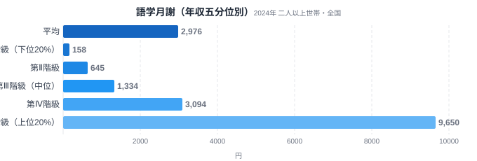
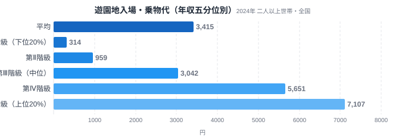
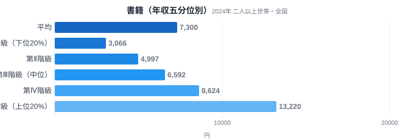

同じ日本に住んでいても、子どもに習い事をさせられるかどうかは家庭の年収で大きく変わります。総務省の家計調査には、全国の世帯を年収順に5つの層に分けて支出額を比較できるデータがあります。これを「年収五分位階級」と呼びます。

このデータで語学の月謝・遊園地の入場料・書籍代を比べると、同じ「子どものための支出」でも格差の大きさがまったく違うことがわかります。語学月謝は上位20%が下位20%の61倍を支出している一方、書籍は4.3倍にとどまります。なぜこれほど差が出るのか、品目ごとの性質から見ていきます。

> [!NOTE]
> このデータは総務省統計局「家計調査（年間収入五分位階級別・全国・二人以上世帯）」2024年分を、e-Stat経由で取得したものです。都道府県別の格差ではなく、全国の世帯を年収順に5等分した各層（第Ⅰ階級=下位20%〜第Ⅴ階級=上位20%）の平均支出額を示しています。

## 語学月謝 — 61倍という開き

<source-link href="/category/economy">家計・経済カテゴリの他の記事を見る</source-link>

語学月謝の月間支出額は、第Ⅰ階級（下位20%）が158円、第Ⅴ階級（上位20%）が9,650円です。差は61.08倍にのぼります。第Ⅰ階級の158円は、月謝というよりほぼ支出していない水準です。一方、第Ⅴ階級の9,650円は、子ども向け英会話教室の月謝1回分に相当する金額です。

語学月謝は「なくても生活できる」典型的な選択的支出です。必需品ではないため、家計に余裕がある世帯ほど積極的に選び、余裕がない世帯はまず削られる項目になります。さらに階級ごとの伸び方を見ると、第Ⅰ〜第Ⅲ階級までは緩やかな増加ですが、第Ⅳ階級から第Ⅴ階級にかけて3,094円から9,650円へと3倍以上に跳ね上がっています。これは、一定以上の年収層になって初めて「複数の習い事をかけ持ちさせる」「月謝の高い教室を選ぶ」という選択肢が現実的になることを示しています。

## 遊園地入場・乗物代 — 22.6倍の体験格差

<source-link href="/category/economy">家計・経済カテゴリの他の記事を見る</source-link>

遊園地の入場料・乗り物代は、第Ⅰ階級が314円、第Ⅴ階級が7,107円で、差は22.63倍です。語学月謝ほどの開きではありませんが、それでも20倍を超える大きな格差です。

遊園地は語学教室と違い、日常的に継続する支出ではなく「イベント的な体験」です。それでも格差が大きいのは、入場料自体が数千円単位と高額で、家族全員分となると一回の出費が家計に与える影響が大きいためと考えられます。第Ⅰ階級の314円は、年に1回どこかへ行くかどうかという水準です。対して第Ⅴ階級の7,107円は、家族での日帰り遠出を年に何度か楽しめる金額に相当します。習い事のような「能力への投資」だけでなく、「思い出づくりの機会」も所得によって回数が変わってくることがこの数字から読み取れます。

## 書籍 — 4.3倍にとどまる理由

<source-link href="/category/economy">家計・経済カテゴリの他の記事を見る</source-link>

書籍への支出は、第Ⅰ階級が3,066円、第Ⅴ階級が13,220円で、差は4.31倍です。語学月謝の61倍、遊園地の22.6倍と比べると、格差はかなり小さく収まっています。

書籍は1冊あたりの単価が数百円から千円台と低く、図書館という無料の代替手段も存在します。そのため、年収が低い層でも支出をゼロにはしにくく、下支えが働きます。また、階級が上がるごとの増え方も他の2品目と違って比較的なだらかです。第Ⅰ階級3,066円から第Ⅱ階級4,997円、第Ⅲ階級6,592円、第Ⅳ階級8,624円、第Ⅴ階級13,220円と、階段状にほぼ一定の割合で増えています。これは、書籍が「余裕があれば買い足す」性質の支出であり、語学月謝のように「一定の年収を超えないと始められない」性質とは異なることを示しています。書籍のような教育費の全体像は[公立小の教育費は県で1.7倍違う](/blog/education-cost-per-child)でも都道府県別に見ることができます。

> [!WARNING]
> 家計調査は「支出金額」を集計したものであり、購入した回数や量そのものではありません。単価の高い品目を選んでいるのか、頻度が多いのかは、この数字だけでは区別できません。また世帯人数や子どもの人数の違いも支出額に影響するため、1人あたりの体験機会の差はこの数字よりも大きい可能性があります。

## データが示すもの

3つの品目を並べると、格差の大きさは「必需品か贅沢品か」という単純な軸だけでは説明しきれません。語学月謝は継続的な投資型の支出で、一定の年収を超えないと始めにくいため格差が最大化します。遊園地はイベント型の体験支出で、単価の高さが格差を広げます。書籍は単価が低く代替手段もあるため、年収差の影響を受けにくい構造です。

言い換えると、格差が大きい品目ほど「参入障壁がある支出」であり、格差が小さい品目ほど「誰でも少しずつ手が届く支出」だといえます。子どもの体験や学びの機会は、この参入障壁の高い順に、家庭の年収によって選べる選択肢の幅が狭まっていくことを、この3品目の比較は示しています。教育費全体の地域差は[教育費は岩手147万円 vs 埼玉82万円](/blog/education-expenses-gap)でも取り上げています。

> [!TIP]
> 語学月謝や遊園地のような「参入障壁型」の支出は、年収の中位層(第Ⅲ階級)でもまだ低い水準にとどまっています。格差は上位20%と下位20%の間だけでなく、中位層と上位層の間でも大きく開いていることに注意が必要です。

## まとめ

- 語学月謝の格差は61.08倍（第Ⅰ階級158円 vs 第Ⅴ階級9,650円）と3品目中で最大
- 遊園地入場・乗物代の格差は22.63倍（第Ⅰ階級314円 vs 第Ⅴ階級7,107円）
- 書籍の格差は4.31倍（第Ⅰ階級3,066円 vs 第Ⅴ階級13,220円）と最も小さい
- 継続的な投資型の支出ほど格差が大きく、単価が低く代替手段のある支出ほど格差が小さい
- 家庭の年収差は、都道府県別の[食文化の違い](/blog/tokyo-food-culture)以上に、子どもの体験機会の幅を左右している可能性がある

## データ出典

総務省統計局「家計調査（年間収入五分位階級別・全国・二人以上世帯）」2024年。e-Stat（政府統計の総合窓口）経由で取得。
