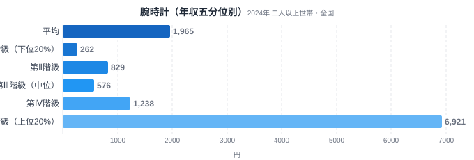
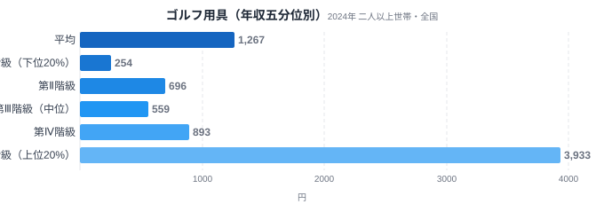
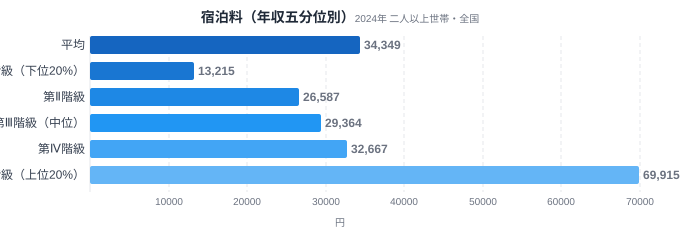
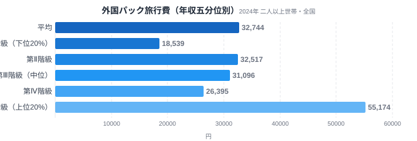

同じ「1ヶ月の支出額」でも、年収による差が5倍で収まる品目と、26倍にまで開く品目があります。年収五分位とは、全国の二人以上世帯を年間収入の低い順に5等分し、下位20%を第Ⅰ階級、上位20%を第Ⅴ階級として支出額を比較する家計調査の分類です。

この記事では腕時計・ゴルフ用具・宿泊料・外国パック旅行費という4つの「贅沢財」を年収階級別に並べ、なぜ腕時計だけが26倍もの格差を生み、旅行費は3〜5倍程度にとどまるのかを見ていきます。結論を先に言うと、格差の大きさを決めているのは「支出の単価が青天井かどうか」でした。

> [!NOTE]
> データは総務省統計局「家計調査」の年間収入五分位階級別（全国・二人以上世帯）です。都道府県別の地域差ではなく、全国の世帯を年収順に5等分した各層の平均支出額（1ヶ月あたり）を比較しています。第Ⅰ階級が年収下位20%、第Ⅴ階級が上位20%です。

## 腕時計 — 格差26.4倍で最大の贅沢財

<source-link href="/ranking/wristwatch-consumption-expenditure">腕時計支出の都道府県ランキングを見る</source-link>

腕時計への月間支出は、第Ⅰ階級が262円、第Ⅴ階級が6,921円で、V/I比は26.42倍に達します。全国平均は1,965円ですが、この平均値自体が上位階級の支出に強く引っ張られていることがわかります。第Ⅱ階級829円・第Ⅲ階級576円・第Ⅳ階級1,238円という中間層の推移を見ても、第Ⅲ階級でいったん下がってから第Ⅳ・第Ⅴで急伸する非線形なカーブを描いています。

なぜここまで開くのでしょうか。腕時計は「時刻を知る」という機能面では数千円のクオーツ時計で完結する一方、上位階級の支出には数十万円台の高級機械式時計が混じっている可能性が高い品目です。時間を知るための必需品部分と、資産性・ステータス性を持つ嗜好品部分が同じ統計項目に同居しているため、単価の上限がほぼ無いに等しく、平均支出額が上位層の少数の高額購入に大きく左右されます。必需品としての下限価格が低い一方、贅沢品としての上限価格に天井がないという構造が、26倍という突出した格差を生んでいます。

第Ⅲ階級で576円まで落ち込む動きも、この単価構造から説明できます。腕時計は毎月買うものではなく、各階級で調査期間中に実際に購入した世帯はごく一部です。たまたまその階級で高額な時計を買った世帯が数件あれば平均は跳ね上がり、無ければ低いままになるため、階級が上がるほど単調に支出が増えるとは限りません。したがって注目すべきは第Ⅱ・第Ⅲ・第Ⅳ階級の間の上下動そのものではなく、第Ⅰ階級262円と第Ⅴ階級6,921円という両端の水準差です。

腕時計だけが特別なのではなく、身につけて人目に触れる「外見に関わる」品目には同じ構造が広く見られます。装身具にあたるアクセサリーは第Ⅰ階級1,019円・第Ⅴ階級10,629円でV/I比10.43倍、ハンドバッグは第Ⅰ階級1,606円・第Ⅴ階級11,399円でV/I比7.10倍と、いずれも後述する宿泊料（5.29倍）や外国パック旅行費（2.98倍）を上回る格差を示しています。実用品としての下限価格がある一方、ブランド品としての上限価格に天井がないという腕時計と同じ構図が、身につける嗜好品全体で繰り返されていると読み取れます。

> [!WARNING]
> 腕時計は購入する世帯が限られる低頻度品目のため、五分位ごとの平均値は各階級で実際に購入した少数世帯の金額に強く左右されます。倍率は年による振れが大きく、ここで示した26.42倍という2024年の値を、変動しない恒常的な格差として読まないでください。

## ゴルフ用具 — 参加率格差がそのまま支出格差に

<source-link href="/ranking/golf-equipment-consumption-expenditure">ゴルフ用具支出の都道府県ランキングを見る</source-link>

ゴルフ用具は第Ⅰ階級254円、第Ⅴ階級3,933円で、V/I比は15.48倍です。全国平均は1,267円で、第Ⅱ階級696円・第Ⅲ階級559円・第Ⅳ階級893円と、こちらも腕時計と同じ理由（低頻度品目のため平均が各階級の少数の購入世帯に左右されること）で中間階級が上下しています。

ゴルフは競技を始めるための初期費用（クラブセット・シューズ・ウェア）がまとまった金額になり、継続するにも用具の買い替えや上級モデルへの更新コストがかかります。そもそも「ゴルフをするかどうか」という参加のハードルが年収と結びつきやすく、参加率の格差が支出額の格差にそのまま反映される構図は、必需品にはない贅沢財特有の性質です。なお、これとは別の軸として、[ゴルフ実施率には都道府県ごとの地域差](/blog/golf-participation-prefecture-gap)もあります。

## 宿泊料 — 旅行系では最大格差、しかし腕時計の5分の1

<source-link href="/ranking/accommodation-consumption-expenditure">宿泊料支出の都道府県ランキングを見る</source-link>

宿泊料は第Ⅰ階級13,215円、第Ⅴ階級69,915円で、V/I比は5.29倍です。全国平均34,349円に対し、第Ⅱ階級26,587円・第Ⅲ階級29,364円・第Ⅳ階級32,667円と、腕時計やゴルフ用具とは違って各階級がほぼ単調に増加しています。階級を追うごとになだらかに支出が増える点が特徴です。

宿泊料は「旅行に行くかどうか」自体は所得によらず一定程度発生する支出である一方、宿泊施設のグレード（ビジネスホテルか高級旅館か）によって単価が大きく変わります。上位階級ほど1泊あたりの単価が高い宿を選ぶ傾向が支出額の差として表れていると考えられますが、腕時計のように「数千円のものと数十万円のものが同一統計項目」というほどの単価の開きはなく、格差は5倍台にとどまっています。旅行そのものへのアクセスは比較的所得によらず広がっている一方、宿の選び方に所得差が出るという構図です。

## 外国パック旅行費 — 4品目中もっとも格差が小さい

<source-link href="/ranking/overseas-package-tour-consumption-expenditure">外国パック旅行費支出の都道府県ランキングを見る</source-link>

外国パック旅行費は第Ⅰ階級18,539円、第Ⅴ階級55,174円で、V/I比は2.98倍です。全国平均32,744円に対し、第Ⅱ階級32,517円・第Ⅲ階級31,096円・第Ⅳ階級26,395円と、腕時計と同じ理由（低頻度品目のため平均が少数の購入世帯に左右されること）で、中間階級から第Ⅳ階級にかけていったん支出が下がり、第Ⅴ階級で再び上昇するという動きを見せています。

4品目のうち唯一、第Ⅰ階級の支出が1万円台後半とそれなりの水準にあることが、格差を相対的に小さくしています。外国パック旅行は旅行会社が組んだ定額プランという性質上、宿泊料のように単価が青天井にはなりにくく、また複数年に一度のまとまった支出として下位階級でも計画的に積み立てて実行されている可能性があります。生活必需の支出には[月の生活費が県で1.4倍違う](/blog/household-spending-prefecture-gap)という都道府県ごとの地域差がありますが、これは所得階級とは別の軸の格差です。パック旅行という「非日常のイベント消費」は、所得階級による支出額の差で見ると相対的に小さい部類に入るということです。

> [!WARNING]
> 家計調査の数値は世帯あたりの支出金額であり、購入した個数や利用回数（消費量）ではありません。単価の高いものを少ない頻度で買う世帯と、単価の低いものを頻繁に買う世帯を区別できず、また世帯人数や年齢構成の違いも支出額に影響します。腕時計やゴルフ用具のように単価の分散が大きい品目では、平均値が一部の高額購入世帯に引っ張られやすい点に注意が必要です。

## データが示すもの

4品目を並べると、格差の大きさは「必需品的な下限があるかどうか」と「単価に天井がないかどうか」で決まっていることが見えてきます。

- **単価青天井型（腕時計26.4倍・ゴルフ用具15.5倍）**: 最低限の機能を満たす価格帯と、資産性・ステータス性を持つ高額帯が同一統計項目に同居し、上位階級の一部の高額購入が平均を押し上げる
- **なだらか増加型（宿泊料5.3倍）**: 支出の有無自体は所得によらず一定程度発生し、宿泊施設のグレード選択に所得差が反映される
- **計画消費型（外国パック旅行費3.0倍）**: 定額プランという性質上、単価の上限が事実上決まっており、下位階級でも計画的な支出として実行されやすい

教育費も「必需品と選択的支出が混在する」品目です。ただしこちらは都道府県という別の軸で、[公立小の教育費は県で1.7倍の差](/blog/education-cost-per-child)が出ています。今回の4品目に共通するのは、単価のばらつきが大きい品目ほど所得階級による格差が開きやすいという傾向です。

格差倍率が大きい品目ほど、全国平均は自分の世帯の支出の基準にならないという点は、生活の指標としても押さえておきたいところです。腕時計の全国平均1,965円は上位20%の第Ⅴ階級6,921円に引き上げられた値で、下位80%の世帯はこれより低い支出にとどまっています。自分の支出額を全国平均とだけ比べて「平均より低いから贅沢をしていない」と判断するのは早計で、まずは自分の世帯がどの年収階級に近いかを踏まえて読む必要があります。

> [!TIP]
> 品目の格差倍率を見るときは、平均支出額の絶対水準も同時に確認すると読み違いを防げます。腕時計は絶対額が小さい（全国平均1,965円）ため倍率が大きく出やすく、宿泊料は絶対額が大きい（全国平均34,349円）ため同じ「格差」でも倍率としては小さく表れます。倍率だけで「格差が深刻」と判断せず、絶対額とセットで見ることが大切です。

## まとめ

- 腕時計はV/I比26.42倍（第Ⅰ階級262円→第Ⅴ階級6,921円）で4品目中もっとも所得格差が大きい
- ゴルフ用具はV/I比15.48倍（第Ⅰ階級254円→第Ⅴ階級3,933円）で、参加率格差がそのまま支出格差に表れている
- 宿泊料はV/I比5.29倍（第Ⅰ階級13,215円→第Ⅴ階級69,915円）で、階級を追うごとになだらかに増加する
- 外国パック旅行費はV/I比2.98倍（第Ⅰ階級18,539円→第Ⅴ階級55,174円）で4品目中もっとも格差が小さい
- 格差の大きさは単価の上限が青天井かどうかで決まり、必ずしも「贅沢財=高格差」ではない
- 腕時計と同じ「外見に関わる」品目では、アクセサリー（装身具）がV/I比10.43倍、ハンドバッグが7.10倍と、実用品と嗜好品が同居する構造が支出格差の大きさに表れている

## データ出典

総務省統計局「家計調査（年間収入五分位階級別・全国・二人以上世帯）」2024年。e-Stat経由で取得しています。
