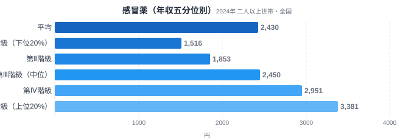
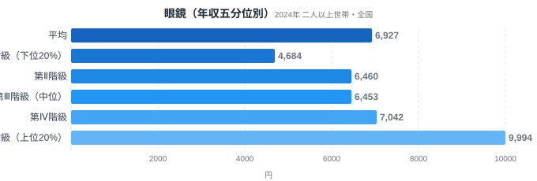
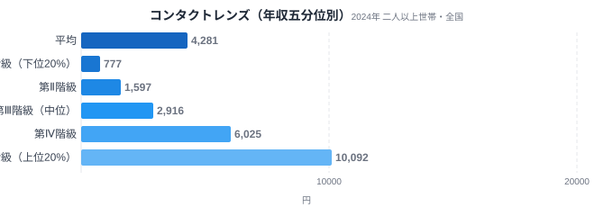
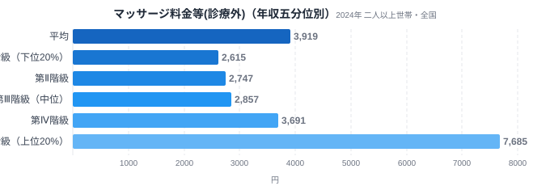
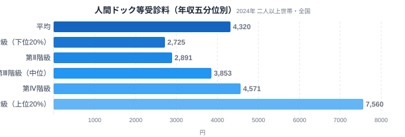

体調を崩したときに飲む感冒薬(風邪薬)には、年収が上がってもさほど追加でお金をかけない人たちが、視力矯正のためのコンタクトレンズには年収に応じて10倍以上も支出を増やしています。総務省「家計調査」の年収五分位データ(全国の二人以上世帯を年間収入で5等分した階級別支出)を見ていくと、同じ「医療・健康」というくくりの中でも、所得によって支出の伸び方がまったく違う品目が浮かび上がります。

この記事では、感冒薬・マッサージ料金等(診療外)・眼鏡・コンタクトレンズ・人間ドック等受診料の5品目を取り上げ、[消費支出全体のV/I比2.10倍](/blog/income-quintile-overview)という基準線と比べながら、どの品目が所得なりに伸び、どの品目が所得以上に伸びるかを見ていきます。結論を先に言うと、症状を治す感冒薬は基準線に近いペースでしか増えないのに対し、同じ視力矯正でもコンタクトレンズはV/I比12.99倍というかけ離れた伸びを見せます。高所得層が医療・健康にかけるお金は、機能の高さではなく感情的な満足に向かっているという構図です。

> [!NOTE]
> このデータは総務省統計局「家計調査(年間収入五分位階級別・全国・二人以上世帯)」2024年分です。**都道府県別ではなく**、全国の世帯を年収の低い順から高い順に並べて5等分した各階級の平均支出額を示しています。第Ⅰ階級=年収下位20%の世帯層、第Ⅴ階級=年収上位20%の世帯層です。なお本文中の「〇〇消費支出額ランキングを見る」リンク先は都道府県庁所在市の二人以上世帯を対象にした別集計で、本記事の全国五分位データとは集計対象・集計単位が異なります。

## 感冒薬 — 症状を治す支出は、所得が上がっても基準線並みのペースでしか増えない

<source-link href="/ranking/cold-medicine-consumption-expenditure">感冒薬消費支出額ランキングを見る</source-link>

感冒薬消費支出額は、第Ⅰ階級が1,516円、第Ⅴ階級が3,381円で、V/I比は2.23倍です。消費支出全体のV/I比2.10倍とほぼ同水準にとどまっており、第Ⅱ階級1,853円→第Ⅲ階級2,450円→第Ⅳ階級2,951円→第Ⅴ階級3,381円と、階級が一つ上がるごとに数百円ずつ積み上がる、ほぼ均等な右肩上がりです。

風邪という症状は所得の高低にかかわらず誰にでも起こり、治すために必要な薬の量や種類にも大きな差は生まれにくいと考えられます。この伸びは全体の消費水準が上がることに連動した価格帯・購入頻度の変化を映しているにすぎず、高所得層が感冒薬そのものに特別なプレミアムを求めているようには見えません。これから見ていく眼鏡やマッサージ料金等とは対照的な、機能に忠実な伸び方だといえます。

## 眼鏡とコンタクトレンズ — 同じ視力矯正なのに、なぜこれほど差がつくのか

<source-link href="/ranking/eyeglasses-consumption-expenditure">眼鏡消費支出額ランキングを見る</source-link>

眼鏡消費支出額は、第Ⅰ階級4,684円→第Ⅱ階級6,460円→第Ⅲ階級6,453円→第Ⅳ階級7,042円→第Ⅴ階級9,994円で、V/I比は2.13倍です。消費支出全体の2.10倍とほぼ同じ水準にとどまっており、感冒薬と同じく所得なりの伸びといえます。ただし伸び方の形は感冒薬とは異なります。第Ⅱ階級から第Ⅲ階級にかけてはむしろわずかに減っており(6,460円→6,453円)、大きく動くのは第Ⅰ階級から第Ⅱ階級への+1,776円と、第Ⅳ階級から第Ⅴ階級への+2,952円の2か所だけです。眼鏡は一度買えば数年使い続けられるため、買い替えのタイミングが世帯ごとにずれ、中位の階級ではその年に買い替えた世帯が少ないぶん支出額が横ばいになりやすく、最上位の第Ⅴ階級だけ単価の高いフレームやレンズを選ぶ余地が支出額を押し上げていると考えられます。

<source-link href="/ranking/contact-lens-consumption-expenditure">コンタクトレンズ消費支出額ランキングを見る</source-link>

一方でコンタクトレンズ消費支出額は、第Ⅰ階級777円→第Ⅱ階級1,597円→第Ⅲ階級2,916円→第Ⅳ階級6,025円→第Ⅴ階級10,092円と、階級が一つ上がるたびにおおむね1.7〜2.1倍ずつ膨らみ(最後の第Ⅳ階級→第Ⅴ階級だけやや伸びが鈍り1.68倍)、V/I比は12.99倍に達します。同じ視力矯正でも、眼鏡の伸び方(2.13倍)とは6倍以上も開きがある計算です。

視力を矯正するという機能は眼鏡もコンタクトレンズもまったく同じです。それでもこれほど差がつく理由として考えられるのは、眼鏡が数千円台のフレームからでも選べる「必需品」としての性格を保っているのに対し、コンタクトレンズは使い捨てタイプの本数・ブランド・カラーコンタクトなど、選択肢の幅そのものが価格帯を押し上げやすい構造になっている点です。眼鏡は一度買えば数年使えますが、コンタクトレンズは日常的に消費し続けるため、より上質なもの・より快適なものを選ぶ余地が支出額に直接反映されやすいとも考えられます。選択肢の幅が広いほど、機能としては同じでも「より快適に感じられるもの」を選ぶ余地が生まれやすく、これが所得に応じた支出の伸びとして表れていると考えられます。ただし、家計調査の品目別支出額は購入した世帯だけでなく全世帯の平均であるため、所得階級によってコンタクトレンズを使う世帯の割合自体が異なれば、価格差や選択の余地の違いを検証しなくても同じような支出額の差が生まれます。したがって、V/I比12.99倍という数字だけから、価格差・利用量差・利用者比率の差のどれが主因かを支出額から切り分けることはできません。

## マッサージ料金等(診療外) — 「スッキリ感」に一番大きい財布を開ける層

<source-link href="/ranking/massage-fee-consumption-expenditure">マッサージ料金等(診療外)消費支出額ランキングを見る</source-link>

マッサージ料金等(診療外)消費支出額は、第Ⅰ階級2,615円→第Ⅱ階級2,747円→第Ⅲ階級2,857円→第Ⅳ階級3,691円ときて、第Ⅴ階級で7,685円へと跳ね上がります。V/I比は2.94倍ですが、注目すべきは伸び方の形です。第Ⅰ階級から第Ⅳ階級までは緩やかにしか増えないのに、最上位の第Ⅴ階級だけが突出し、第Ⅳ階級から第Ⅴ階級への1段階だけで2.08倍に達しています。

治療目的の医療行為ではないマッサージは、疲れを取りたい・体をほぐしたいという感覚的な満足を買うサービスです。感冒薬や眼鏡のように階級を追うごとに少しずつ増えるのではなく、最も所得に余裕のある層だけがまとまった金額を投じる構造は、この支出が「必要」だから使うのではなく「余裕があるから使う」感情的な満足を買う支出であることを示しています。

## 人間ドック等受診料 — 「治療」ではなく「安心」を買う

<source-link href="/ranking/health-checkup-consumption-expenditure">人間ドック等受診料消費支出額ランキングを見る</source-link>

人間ドック等受診料消費支出額は、第Ⅰ階級2,725円→第Ⅴ階級7,560円で、V/I比は2.77倍です。第Ⅲ階級3,853円から第Ⅳ階級4,571円、第Ⅴ階級7,560円と、階級が上がるにつれて伸び幅そのものも大きくなる形をしています。

人間ドックは病気を治すための診療とは違い、症状が出る前に自主的に受ける検査です。感冒薬のように「症状が出たら誰でも同じように使う」支出ではなく、健康であることを確かめて安心を得るための、いわば予防的な支出です。所得に余裕のある層ほど「まだ病気ではないが調べておきたい」という将来への安心にお金をかけやすく、これも治療の機能ではなく心理的な満足を買う支出の一例といえます。

> [!WARNING]
> 家計調査のデータは「支出金額」であり、購入した回数や利用量そのものではありません。マッサージや人間ドックのように利用が任意の品目では、価格の高いサービスを選んでいるのか、利用回数自体が多いのかを支出額だけから区別することはできません。特にコンタクトレンズのV/I比12.99倍のように突出した差は、単価の高いものを選んでいるからなのか、階級によってそもそも利用している世帯の割合が違うからなのかを、支出額だけから切り分けることはできません。また階級間の差には世帯人数や年齢構成の違いも影響しています。

## データが示すもの

5品目のV/I比を並べると、消費支出全体の基準線(2.10倍)を挟んで明確な序列が見えます。感冒薬(2.23倍)・眼鏡(2.13倍)は基準線とほぼ同水準にとどまるのに対し、人間ドック等受診料(2.77倍)・マッサージ料金等(2.94倍)は基準線を上回り、コンタクトレンズ(12.99倍)は他のどの品目とも比較にならないほど突出しています。

この序列は、支出が「症状を治す機能」に向いているか「感情的な満足」に向いているかという軸でおおよそ説明できます。感冒薬は治すべき症状がはっきりしており、価格による効能の違いを消費者自身が判別しにくいにもかかわらず、支出は所得なりにしか伸びません。一方、眼鏡と機能面ではまったく同じはずのコンタクトレンズ、必須ではないマッサージ、症状が出る前の安心を買う人間ドックは、いずれも所得が上がるほど「もっと良いもの」「もっと快適なもの」への支出が膨らんでいきます。

所得が上がるほど支出が増えるのは今回の5品目に共通していますが、逆に所得が低いほど支出が多い「逆進的支出」も家計調査には存在します。[低所得ほど払う品目があるのはなぜ?](/blog/income-quintile-regressive)では灯油・プロパンガス・介護サービスの例を扱っており、同じ生活必需品でも「選択肢の狭さ」によって逆向きの構造が生まれることを確認できます。

ここからは推測ですが、人間ドックの受診率や支出額の差には、勤務先が提供する法定健診の手厚さ(福利厚生)の違いも影響している可能性があります。ただし、家計調査の支出データだけではこの要因を切り分けて検証することはできません。

今回取り上げた品目以外の医療・健康関連の指標は[医療・健康テーマ](/themes/healthcare)でまとめて確認できます。家計調査に基づく他の家計・経済カテゴリの記事は[家計・経済カテゴリ](/category/economy)から探せます。

> [!TIP]
> 家計調査で公表される「全国平均」は五分位階級のちょうど中位(第Ⅲ階級)の値とは一致しません。感冒薬は全国平均2,430円に対し第Ⅲ階級2,450円とほぼ近い一方、コンタクトレンズは全国平均4,281円に対し第Ⅲ階級はわずか2,916円です。全国平均だけを見ると、実際の中位世帯より高所得層寄りの数字に引っ張られている品目があることに注意が必要です。

## まとめ

- 感冒薬はV/I比2.23倍で消費支出全体(2.10倍)とほぼ同水準にとどまり、所得が上がっても症状を治す支出は基準線並みのペースでしか増えません
- 眼鏡は2.13倍ですが、同じ視力矯正のコンタクトレンズは12.99倍に達し、機能が同じでも支出の伸び方はまったく違います
- マッサージ料金等(診療外)は第Ⅳ階級から第Ⅴ階級への1段階だけで2.08倍に跳ね上がり、最上位層だけがまとまった金額を投じる構造です
- 人間ドック等受診料は2.77倍で、治療ではなく将来への安心を買う予防的な支出としての性格が数字に表れています
- 5品目を通じて、高所得層が医療・健康関連の支出で払っているのは「機能」よりも「感情」的な満足であるという構図が見えてきます

## データ出典

総務省統計局「家計調査(年間収入五分位階級別・全国・二人以上世帯)」2024年分。e-Stat(政府統計の総合窓口)経由で取得しました。
