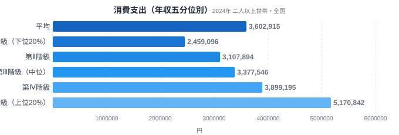
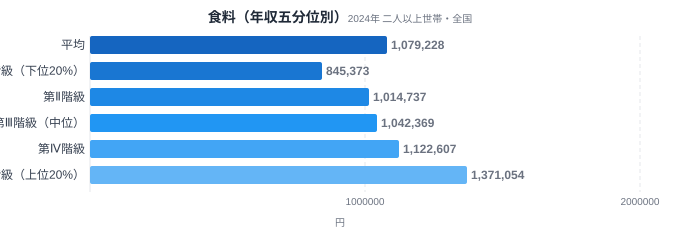
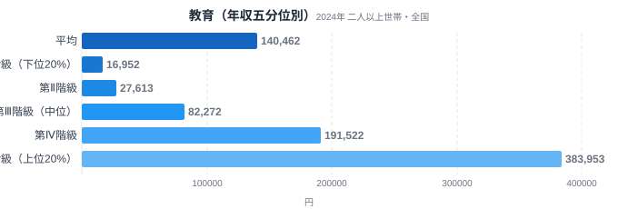
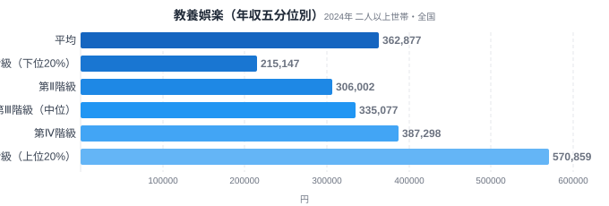

「年収が上がれば、生活費もその分だけ増える」——そう思われがちですが、実際のデータを見ると品目ごとにまったく違う姿が浮かび上がります。総務省「家計調査」では、全国の二人以上世帯を年間収入で5つの階級に分けた「年収五分位階級」というデータが公表されています。第Ⅰ階級が下位20%、第Ⅴ階級が上位20%の世帯を表す区分です。

この記事では、消費支出全体・食料・教育・教養娯楽の4つの品目について、第Ⅰ階級と第Ⅴ階級の支出額を比較します。結論を先に言うと、消費支出全体は2.10倍の差にとどまるのに対し、教育費は22.65倍という大きな開きが出ます。同じ「年収が上がったときに増える支出」でも、必需品に近い品目と選択的な品目とでは伸び方がまったく違うのです。あわせて、食料費が消費支出に占める割合である「エンゲル係数」を第Ⅰ階級・第Ⅴ階級それぞれで計算し、所得が上がるとなぜこの割合が下がるのかも見ていきます。

> [!NOTE]
> このデータは総務省「家計調査」の「年間収入五分位階級別（全国・二人以上世帯、2024年）」です。**都道府県別ではなく**、全国の世帯を年間収入の低い順から高い順に並べ、5等分した各層の平均支出額を示しています。第Ⅰ階級=年収下位20%の世帯層、第Ⅴ階級=年収上位20%の世帯層です。以下の支出額はすべて**年額**（1年間の合計）で表記しています。

## 消費支出全体 — 増えるが、2倍どまり

消費支出全体で見ると、第Ⅰ階級は年額245万9,096円、第Ⅴ階級は年額517万842円です（1か月あたりに直すとそれぞれ約20万5,000円・約43万1,000円）。V/I比は2.10倍にとどまります。全国平均は360万2,915円で、第Ⅲ階級（中位、337万7,546円）に近い水準です。

年収が5等分されるほどの差があっても、消費支出そのものは2倍程度にしか開かないというのがまず押さえるべき事実です。高所得世帯であっても、住居や食料など日々の暮らしに欠かせない支出の絶対量には限りがあり、収入の増加分すべてを消費に回すわけではないためです。貯蓄や資産形成に回る分が増えることも、この「支出の頭打ち」を生む一因と考えられます。あわせて見る: [家計・経済カテゴリ](/category/economy)の他の記事。

## 食料 — 必需品ゆえに伸びが緩やか

食料費は第Ⅰ階級が84万5,373円、第Ⅴ階級が137万1,054円で、V/I比は1.62倍です。4品目のなかで最も所得差の影響を受けにくい品目でした。

食料は生きていくうえで欠かせない必需品であり、所得がどれだけ増えても食べる量そのものには上限があります。高所得世帯では外食や高級食材への支出が増える傾向はあるものの、それでも支出額の伸びは消費支出全体の伸び（2.10倍）よりもさらに緩やかです。これは19世紀にドイツの統計学者エルンスト・エンゲルが提唱した「所得が上がるほど食費の割合は下がる」という法則、いわゆるエンゲルの法則と整合する結果です。[47都道府県のエンゲル係数ランキング](/blog/engel-coefficient-prefecture-ranking)では地域差を扱っていますが、今回は同じ法則を年収階級というもうひとつの軸で確認したことになります。

## 教育 — 22.65倍、最大の格差品目

教育費は第Ⅰ階級がわずか1万6,952円であるのに対し、第Ⅴ階級は38万3,953円。V/I比は22.65倍と、4品目のなかで突出した格差になっています。全国平均は14万462円で、第Ⅲ階級（8万2,272円）と第Ⅳ階級（19万1,522円）の間に位置します。

教育費がここまで大きく開く背景には、子どもの有無や人数、進学先の選択といった世帯属性の違いが強く影響していると考えられます。高所得世帯ほど私立校や学習塾、習い事に多くの支出をする傾向があり、教育は「選択できる支出」の代表例です。ただし、この差のどこまでが世帯構成の違いによるもので、どこからが支出の抑制によるものかは、五分位別の平均支出だけでは切り分けられません。

## 教養娯楽 — 全体並みの2.65倍

<source-link href="/category/economy">家計・経済カテゴリの他の記事を見る</source-link>

教養娯楽費は第Ⅰ階級が21万5,147円、第Ⅴ階級が57万859円で、V/I比は2.65倍です。消費支出全体の2.10倍よりやや大きいものの、教育費の22.65倍と比べればずっと緩やかな格差にとどまっています。

教養娯楽には旅行・趣味・レジャー・書籍・スポーツ用品など幅広い支出が含まれます。高所得世帯ほど余暇にお金をかける余裕がある一方、教育費のように「進学先を選ぶ」といった非連続な支出の飛躍が生じにくいため、格差の度合いは消費支出全体に近い水準にとどまっていると考えられます。

> [!WARNING]
> 家計調査のデータは「支出金額」であり「消費量」ではありません。同じ食料でも高所得世帯が高級な食材を選んでいる可能性があり、金額差がそのまま量の差を意味するわけではない点に注意が必要です。また世帯人数や世帯主の年齢構成の違いも、階級間の支出差に影響を与えます。五分位は所得だけで区切った層であり、世帯人数・子どもの有無・世帯主年齢が層ごとに異なるため、品目差の一部は所得ではなく世帯構成の差を映しています。

## データが示すもの

4品目のV/I比を並べると、格差の大きさには明確な序列があることがわかります。食料（1.62倍）＜消費支出全体（2.10倍）＜教養娯楽（2.65倍）＜教育（22.65倍）という順です。

この序列は、品目が「必需品」か「選択的支出」かという軸でおおむね説明できます。食料のように誰もが一定量を必要とする必需品は、所得が変わっても支出の伸びが緩やかです。逆に教育のように「私立に通わせるか公立にするか」「塾に通わせるかどうか」といった選択の余地が大きい品目は、所得の高低によって支出額が跳ね上がりやすい構造になっています。教養娯楽はその中間に位置し、消費支出全体とほぼ同じペースで伸びていました。

[仮説] 教育費の格差が世代を超えて所得格差を再生産する経路になっている可能性がありますが、これは家計調査の支出データだけでは検証できません。教育投資と将来所得の関係を追跡するには、別の縦断調査データが必要です。

> [!TIP]
> 品目別のV/I比を比べるときは「全国平均からどれだけ離れているか」も合わせて見ると理解しやすくなります。消費支出全体の2.10倍を基準線とすると、教育のように基準線を大きく上回る品目は「所得によって選択の余地が大きい支出」、食料のように基準線を下回る品目は「所得によらず一定量が必要な支出」と大まかに区分できます。

## エンゲル係数で見る所得と食費の関係

食料費と消費支出全体の数値から、エンゲル係数（消費支出に占める食料費の割合）を計算できます。第Ⅰ階級では食料費84万5,373円÷消費支出245万9,096円で**34.38%**、第Ⅴ階級では食料費137万1,054円÷消費支出517万842円で**26.52%**となり、両者には7.86ポイントの差があります。

所得が低い階級ほどエンゲル係数が高いという結果は、エンゲルの法則が年収五分位という切り口でもはっきり成立していることを示しています。消費支出全体は2.10倍にしか増えないのに食料費は1.62倍にとどまるため、食料費が占める割合そのものが下がっていく計算です。[47都道府県別のエンゲル係数](/blog/engel-coefficient-prefecture-ranking)を見ると地域による差も確認できますが、今回のデータはそれとは別の軸、つまり同じ「全国」の中での所得階級差を映し出しています。

支出額の差だけでなく、消費支出全体に占める「シェア」で捉えると、それぞれの品目が高所得世帯にどれだけ食い込んでいるかがより明確になります。教育費が消費支出全体に占める割合は、第Ⅰ階級の**0.69%**から第Ⅴ階級の**7.43%**へと約10.8倍に拡大しており、支出額そのものの伸び（22.65倍）と同じように、消費支出全体のなかで占める重みが所得とともに急激に高まっていることがわかります。一方、教養娯楽費のシェアは第Ⅰ階級の**8.75%**から第Ⅴ階級の**11.04%**への緩やかな上昇にとどまり、支出額の伸び（2.65倍）ほど劇的な変化ではありません。食料のシェアが所得とともに下がり、教育のシェアが所得とともに上がるという対照的な動きは、被服（衣料品）のようなほかの選択的支出を読み解くときにも応用できる、基本的な視点です。

自分の家計にこの見方を当てはめることもできます。毎月の食費を毎月の消費支出合計で割れば、12倍せずに同じエンゲル係数が出せるため、全国のどの階級に近い支出構造かの目安になります。また教育費が家計に占める割合は、子どもの有無や年齢によって層ごとに大きく異なるため、他世帯と自分の家計を比べる際には、まず世帯構成が近いかどうかを確認しておくことが欠かせません。

> [!TIP]
> 「高所得世帯によく売れている」品目かどうかを支出額だけで判断すると見誤りやすい点に注意してください。年収が上がれば消費に回すお金全体も増えるため、多くの品目で支出額そのものは自然に伸びます。本当に高所得世帯への浸透度が高いといえるのは、消費支出全体に占めるシェアが所得とともに上がる品目です。さらに、支出額は「数量×価格」に分解して考えることもできます。家計調査では多くの品目で購入数量と平均購入価格も公表されており、支出額の伸びが「たくさん買うようになった」ためなのか「同じ量でもより価格の高いものを選ぶようになった」ためなのかを見分けると、より踏み込んだ読み方ができます。

## まとめ

- 消費支出全体は第Ⅰ階級年額245万9,096円→第Ⅴ階級年額517万842円でV/I比2.10倍
- 食料費は1.62倍にとどまり、必需品としての性格が数字に表れている
- 教育費は22.65倍と突出しており、選択的支出の代表例といえる
- 教養娯楽費は2.65倍で消費支出全体とほぼ同水準の伸び
- エンゲル係数は第Ⅰ階級34.38%・第Ⅴ階級26.52%で7.86ポイントの差があり、所得と食費割合の逆相関が確認できる
- 教育費が消費支出全体に占めるシェアは第Ⅰ階級0.69%→第Ⅴ階級7.43%で約10.8倍に拡大し、支出額ではなくシェアで見ても選択的支出であることが裏づけられる

## データ出典

総務省統計局「家計調査（年間収入五分位階級別・全国・二人以上世帯）」2024年。e-Stat（政府統計の総合窓口）経由で取得しました。
