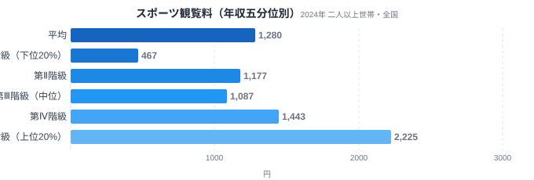
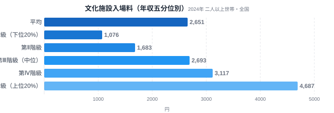
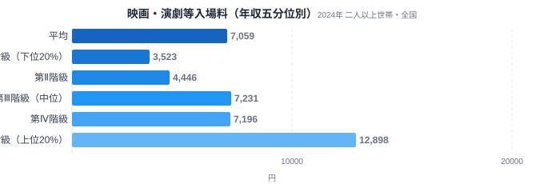
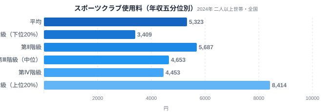
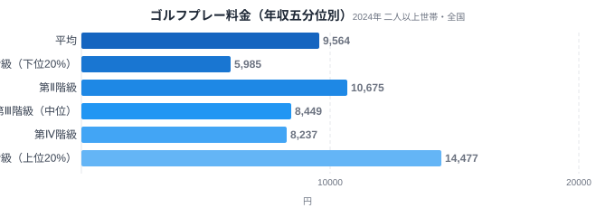

「ゴルフは金持ちの趣味」というイメージを持つ人は多いはずです。総務省の家計調査には、全国の世帯を年収順に5つの層(五分位階級)に分け、品目ごとの支出額を比較できるデータがあります。教養娯楽サービスのうち5品目についてこのデータを見ると、意外な事実が浮かび上がります。上位20%の世帯が下位20%の世帯の何倍を支出しているかを見ると、スポーツ観覧料は4.76倍もの差がある一方、ゴルフプレー料金の差は2.42倍にとどまり、5品目のなかでもっとも小さいのです。「見る・鑑賞する」娯楽と「自分で体を動かす」娯楽とで、なぜこれほど格差の大きさが違うのか、品目ごとに見ていきます。

> [!NOTE]
> このデータは総務省統計局「家計調査（年間収入五分位階級別・全国・二人以上世帯）」2024年分を、e-Stat経由で取得したものです。都道府県別の地域差ではなく、全国の世帯を年収順に5等分した各層（第Ⅰ階級=下位20%〜第Ⅴ階級=上位20%）の1か月あたり平均支出額を示しています。

## 「見る」娯楽ほど所得差が大きい

まず、上位と下位の差がもっとも大きい2品目から見ていきます。どちらも自分で体を動かすのではなく、誰かのプレーや作品を「鑑賞する」ための支出です。

<source-link href="/ranking/sports-spectating-consumption-expenditure">スポーツ観覧料の都道府県別ランキングを見る</source-link>

スポーツ観覧料の1か月あたり支出額は、第Ⅰ階級（下位20%）が467円、第Ⅴ階級（上位20%）が2,225円で、差は4.76倍にのぼります。5品目のなかで最大の格差です。プロ野球やJリーグ、大相撲などの観戦チケットは、同じ試合でも座席の位置によって価格が数倍から数十倍変わります。さらに遠方の会場まで足を運ぶ場合は交通費や宿泊費も上乗せされるため、支出に上限を作りにくい構造です。第Ⅰ階級の467円は、年に数回テレビ観戦の延長でチケットを買うかどうかという水準ですが、第Ⅴ階級の2,225円は、良い席のチケットを継続的に買い続けられる水準に達しています。なお、第Ⅱ階級（1,177円）は第Ⅲ階級（1,087円）よりわずかに高く、階級順にきれいには並んでいません。第Ⅰ階級から第Ⅱ階級だけで約2.5倍に跳ね上がっており、5品目中最大の4.76倍という格差は、この最下層の低さに強く依存した数字だともいえます。実際、第Ⅱ階級から第Ⅴ階級までの4階級だけで比べると、格差は1.89倍にとどまります。

<source-link href="/ranking/cultural-facility-admission-consumption-expenditure">文化施設入場料の都道府県別ランキングを見る</source-link>

文化施設入場料（美術館・博物館・動物園・水族館などの入場料）は、第Ⅰ階級が1,076円、第Ⅴ階級が4,687円で、差は4.36倍です。この品目は第Ⅰ階級から第Ⅴ階級まで、1,076円→1,683円→2,693円→3,117円→4,687円ときれいな右肩上がりで、階級が上がるにつれて支出が滑らかに増えていく特徴があります。美術館や博物館へ足を運ぶには、入場料そのものに加えて移動時間や事前の情報収集など、お金だけでなく時間的・文化的な余裕も必要になります。所得が上がるほど、こうした余裕も同時に確保しやすくなることが、滑らかな増加曲線として表れていると考えられます。

> [!WARNING]
> このデータは世帯単位の平均支出額であり、その品目をまったく利用していない世帯も含めた全体の平均です。世帯人数や家族構成によっても支出額は変わるため、個人1人あたりの利用回数や体験機会の差は、この数字が示す倍率よりも大きい可能性があります。

## 映画・演劇等入場料は中間の格差

映画やコンサート、演劇のチケット代はどうでしょうか。同じ「観る」娯楽でも、スポーツ観覧や文化施設とは違う特徴が見えてきます。

<source-link href="/ranking/movie-theater-consumption-expenditure">映画・演劇等入場料の都道府県別ランキングを見る</source-link>

映画・演劇等入場料（映画館・コンサート・歌舞伎・落語などの入場料を含む）の支出額は、第Ⅰ階級が3,523円、第Ⅴ階級が12,898円で、差は3.66倍です。スポーツ観覧料や文化施設入場料ほどではありませんが、それでも3倍を超える開きがあります。特徴的なのは、第Ⅰ階級3,523円から第Ⅱ階級4,446円まではゆるやかな伸びにとどまる一方、第Ⅲ階級で7,231円へと一気に跳ね上がり、その後は第Ⅳ階級7,196円までほぼ横ばい、第Ⅴ階級で12,898円へ再び大きく伸びる、という2段階の伸び方をしている点です。映画自体は1本1,000円台からと参入障壁が低い一方、コンサートや演劇、ミュージカルといった単価の高いチケットは、ある程度の年収層にならないと定期的には手が届きにくい、という構造がこの2段跳びに表れているのかもしれません。

## 「する」娯楽は所得差が小さい

ここからは、観るのではなく自分で体を動かす2品目を見ていきます。5品目のなかでもっとも格差が小さいのはこちらのグループです。

<source-link href="/ranking/sports-club-fee-consumption-expenditure">スポーツクラブ使用料の都道府県別ランキングを見る</source-link>

スポーツクラブ使用料は、第Ⅰ階級が3,409円、第Ⅴ階級が8,414円で、差は2.47倍です。ここまでの3品目に比べると、かなり格差が小さく収まっています。フィットネスジムやスイミングスクールの月会費は、利用回数にかかわらずおおむね定額であり、通う頻度を増やしても追加費用が発生しにくい料金体系が一般的です。そのため、いったん入会を決めた世帯にとっては、所得の高さが支出額を大きく押し上げる要因になりにくいと考えられます。また、第Ⅱ階級の支出額は5,687円で、実は第Ⅲ階級の4,653円や第Ⅳ階級の4,453円よりも高くなっています。年収の中位層より下位に近い層でスポーツクラブ利用が伸びているのは、時間に余裕のある年金生活の高齢世帯が第Ⅱ階級に相当数含まれている可能性を示しているのかもしれません。

<source-link href="/ranking/golf-green-fee-consumption-expenditure">ゴルフプレー料金の都道府県別ランキングを見る</source-link>

そしてゴルフプレー料金です。第Ⅰ階級が5,985円、第Ⅴ階級が14,477円で、差は2.42倍。5品目のなかでもっとも小さい格差です。「ゴルフは富裕層の趣味」というイメージからすると、スポーツ観覧料と同じくらい、あるいはそれ以上の格差があってもおかしくないように思えますが、実際のデータは逆の結果を示しています。

> [!TIP]
> このデータをよく見ると、第Ⅱ階級が10,675円で、中位の第Ⅲ階級（8,449円）や第Ⅳ階級（8,237円）より高くなっている点が目を引きます。年収の順に並べても支出額がきれいには並ばない、こうした「へこみ」がある品目は、単純な所得階級だけでは説明しきれない別の要因（年齢構成や仕事の性質など）が絡んでいる可能性を示すサインとして読むと発見があります。

## なぜゴルフだけ格差が小さいのか

5品目を並べると、格差の大きさは「見る」娯楽（スポーツ観覧4.76倍・文化施設4.36倍・映画演劇3.66倍）と「する」娯楽（スポーツクラブ2.47倍・ゴルフ2.42倍）できれいに分かれます。なかでもゴルフは、世間のイメージと実際の支出格差がもっとも大きく食い違う品目だといえます。

ただし、この倍率の並びをそのまま「見る/する」の構造差だけで読むのには注意が必要です。スポーツ観覧料の第Ⅰ階級は467円、ゴルフプレー料金の第Ⅰ階級は5,985円と、もともとの支出水準に12.8倍もの開きがあります。支出額そのものが小さい品目ほど、同じ金額差でも倍率としては大きく出やすい構造があるため、4.76倍と2.42倍の差の一部は、この絶対額の非対称性によるものである可能性があります。

**[仮説]** 理由の一つとして考えられるのは、ゴルフのプレー料金には、個人の可処分所得とは別の資金源が混ざっている可能性です。取引先との接待や社内の懇親を目的にしたゴルフでは、会社の交際費や福利厚生費からプレー代の一部または全部が支払われるケースがあります。この場合、実際にプレーする人の個人年収と、支払われる金額は必ずしも比例しません。もう一つの仮説として、ゴルフ場の利用料金自体が、コースやプランごとにほぼ一律で設定されており、スポーツ観覧のように「良い席ほど高い」という価格の幅が生まれにくい構造も影響していると考えられます。いずれも家計調査のデータだけでは検証できないため、あくまで仮説として扱う必要があります。

> [!TIP]
> 「格差が小さい」ことは「誰にでも身近」を意味するとは限りません。ゴルフを一度もプレーしたことがない世帯の割合(参加率)と、実際にプレーした世帯がいくら使うか(条件付き支出額)は別の指標です。今回の五分位データは後者しか示していないため、参加のハードル自体の高さは、この倍率だけでは判断できない点に注意が必要です。

自分で体を動かす趣味への支出は、所得が上がっても大きくは増えにくい一方、観戦や鑑賞といった「特別な体験」への支出は、所得の余裕次第で大きく開くという傾向は、家計を考えるうえでのヒントにもなります。可処分所得が増えたときにどの娯楽費から増やすか、あるいは減らすかを考える際、「する」娯楽よりも「見る」娯楽のほうが、所得の変化に敏感に反応しやすい支出だといえそうです。ゴルフ実施率やスポーツ施設数の都道府県別の違いは、[ゴルフ実施率の都道府県差](/blog/golf-participation-prefecture-gap)や[スポーツ施設数の地域差](/blog/sports-facility-regional-divide)でも扱っています。映画館への支出額に見られる地域差は[映画館支出額の都道府県差](/blog/movie-theater-expenditure-ranking)、子どもの習い事や体験にかかる支出の年収格差は[習い事・体験支出の年収格差](/blog/income-quintile-lesson)で取り上げています。

## まとめ

- スポーツ観覧料の格差は4.76倍（第Ⅰ階級467円 vs 第Ⅴ階級2,225円）と5品目中もっとも大きい
- 文化施設入場料の格差は4.36倍（第Ⅰ階級1,076円 vs 第Ⅴ階級4,687円）、階級ごとに滑らかに増加
- 映画・演劇等入場料の格差は3.66倍（第Ⅰ階級3,523円 vs 第Ⅴ階級12,898円）、第Ⅲ階級で一段跳ね上がる
- スポーツクラブ使用料の格差は2.47倍（第Ⅰ階級3,409円 vs 第Ⅴ階級8,414円）と小さめ
- ゴルフプレー料金の格差は2.42倍（第Ⅰ階級5,985円 vs 第Ⅴ階級14,477円）と5品目中もっとも小さく、「富裕層の趣味」というイメージとは逆の結果になった
- 「見る」娯楽（観覧・鑑賞）は所得の変化に敏感に反応して支出額が大きく開き、「する」娯楽（自分で体を動かす）は所得が変わっても支出額が大きくは動かない、という傾向が5品目を通じて見えた

## データ出典

総務省統計局「家計調査（年間収入五分位階級別・全国・二人以上世帯）」2024年。e-Stat（政府統計の総合窓口）経由で取得。
