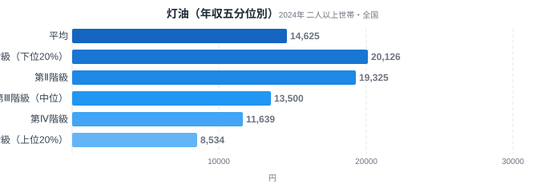
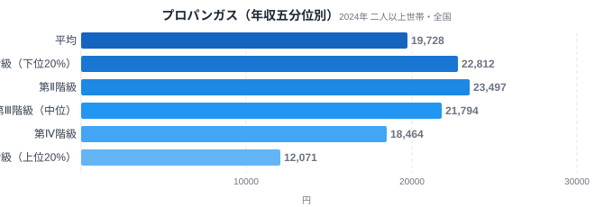
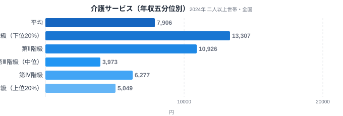
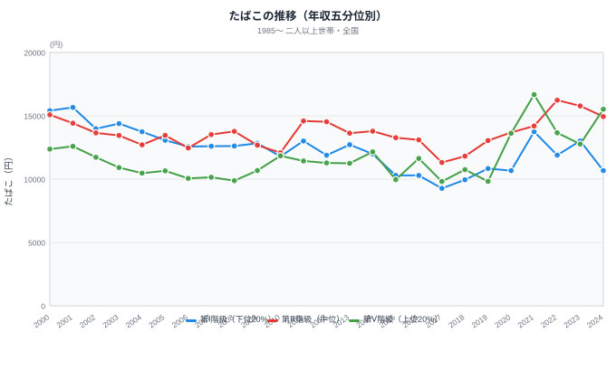

年収が上がるほど支出額が増える。多くの品目ではそれが当たり前です。しかし総務省の家計調査を年収別に見ていくと、この常識が逆転する品目が存在します。年収が低い世帯ほど多く払っている「逆進的支出」です。

灯油・プロパンガス・介護サービスは、いずれも年収が低い層ほど支出額が大きくなっています。特に注目すべきはたばこです。2000年には高所得層より低所得層のほうが支出が少なかったのに、2024年には完全に立場が逆転し、今度は高所得層のほうが多く払うようになりました。この記事では、なぜ品目によって「所得と支出の関係」がここまで違うのかを見ていきます。詳しい所得の格差そのものは[県民所得は東京521万 vs 沖縄217万](/blog/per-capita-income-gap)でも確認できます。

> [!NOTE]
> このデータは総務省統計局「家計調査（年間収入五分位階級別・全国・二人以上世帯）」2024年分を、e-Stat経由で取得したものです。都道府県別の格差ではなく、全国の世帯を年収順に5等分した各層（第Ⅰ階級=下位20%〜第Ⅴ階級=上位20%）の1世帯あたり年間支出額を示しています。金額は品目を利用していない世帯の0円も含めた階級平均のため、階級差の多くは単価差ではなく利用している世帯の割合の差を反映しています。

## 灯油 — 低所得層が2.4倍近く支払う

<source-link href="/ranking/kerosene-consumption-expenditure">灯油消費支出額ランキングを見る</source-link>

灯油の年間支出額は、第Ⅰ階級（下位20%）が20,126円、第Ⅴ階級（上位20%）が8,534円です。上位層が下位層の0.42倍しか支払っておらず、逆に言えば下位層は上位層の2.36倍を灯油に費やしています。多くの品目とは真逆の傾向です。なお、上のランキングは家計調査が対象とする都道府県庁所在市の値を比較したもので、本記事の全国五分位とは集計軸が異なります。

灯油は暖房の燃料として使われますが、暖房方式そのものが所得によって分かれます。所得が高い層は電気やガスによる高効率な冷暖房設備(エアコン等)を選びやすく、灯油ストーブへの依存度が下がります。一方、所得が低い層ほど灯油ストーブなど初期費用の低い暖房機器に頼らざるを得ず、結果として年間の燃料支出がかさみます。第Ⅲ階級13,500円から第Ⅳ階級11,639円、第Ⅴ階級8,534円と、階級が上がるにつれて着実に支出が減っていく形は、暖房設備の選択肢の広さが所得によって変わることを示唆します。ただし灯油消費は寒冷地(北海道・東北)ほど多い傾向があり、その地域の平均所得が相対的に低いという地域要因が重なっている可能性もあります。

## プロパンガス — 都市ガスに切り替えられない層

<source-link href="/ranking/propane-gas-consumption-expenditure">プロパンガス消費支出額ランキングを見る</source-link>

プロパンガスの年間支出額は、第Ⅰ階級が22,812円、第Ⅴ階級が12,071円で、上位層は下位層の0.53倍にとどまります。灯油ほど極端ではありませんが、やはり低所得層ほど多く払う逆進的な構造です。

プロパンガスは都市ガスより単価が高いことで知られていますが、都市ガス管が整備されていない地域や、賃貸物件でプロパンガスが指定されている場合、住人は選択の余地なくプロパンガスを使い続けることになります。持ち家を選べる層やガス管の整備された都市部に住める層は都市ガスへ切り替えやすく、結果として料金の高いプロパンガスの利用者は所得の低い層に偏りやすくなります。第Ⅱ階級23,497円が全階級中の最高値になっている点も特徴的で、下位から中位にかけての層で特にプロパンガス依存度が高いことがうかがえます。生活コストの地域差については[移住で生活コストは本当に下がるか](/blog/consumer-price-regional-gap)で費目別に詳しく見ることができます。

## 介護サービス — 所得と反比例する福祉的支出

<source-link href="/ranking/nursing-care-consumption-expenditure">介護サービス消費支出額ランキングを見る</source-link>

介護サービスの年間支出額は、第Ⅰ階級が13,307円、第Ⅴ階級が5,049円で、上位層は下位層の0.38倍という、今回取り上げた3品目の中で最も逆進性の強い数字です。第Ⅱ階級も10,926円と高水準にとどまり、下位2階級が突出して高い構造になっています。

介護サービスの支出は、世帯の年齢構成や介護の必要度に強く左右されます。高齢の親と同居する世帯や、年金収入が中心で現役時の所得が低かった高齢世帯は、第Ⅰ・第Ⅱ階級に集まりやすい傾向があります。介護保険制度の自己負担分は所得に応じて増減しますが、それでも介護そのものの必要性は年収の高低とは別の要因(要介護度・世帯構成)で決まるため、結果として所得の低い階級で支出額が高止まりする構造が生まれます。第Ⅲ階級が3,973円まで下がったあと、第Ⅳ階級6,277円・第Ⅴ階級5,049円と上下しています。介護サービスは支出のある世帯自体が少数のため、階級間の細かい上下は標本のばらつきである可能性が高く、ここでは下位2階級が突出して高い点だけを読み取ります。

## たばこ — 24年で立場が完全に逆転した品目

<source-link href="/ranking/tobacco-consumption-expenditure">たばこ消費支出額ランキングを見る</source-link>

たばこ支出の時系列を見ると、他の品目とは異なる劇的な変化が起きています。2000年時点では、第Ⅰ階級（下位20%）が年15,409円、第Ⅴ階級（上位20%）が12,374円と、低所得層のほうが多く支出していました。ところが2024年には、第Ⅰ階級が10,671円まで減少する一方、第Ⅴ階級は15,522円まで増加し、順位が完全に入れ替わっています。かつて逆進品目だったたばこが、24年かけて通常の(所得が高いほど支出も多い)品目へと姿を変えたのです。

この逆転の背景には、喫煙率そのものの構造変化があると考えられます。たばこ税の度重なる引き上げで単価が大きく上昇し、低所得層ほど価格上昇の影響を受けて禁煙・節煙に動きやすかった可能性があります。一方、高所得層は価格上昇の影響を相対的に受けにくく、喫煙習慣を維持しやすかったとも考えられます。第Ⅲ階級(中位)は2000年15,076円から2024年14,938円とほぼ横ばいで推移しており、両極の階級が動く中で中間層だけが変化していない点も特徴的です。たばこの都道府県別の格差は[たばこ支出、なぜ鳥取が突出](/blog/tobacco-expenditure-ranking)で確認できます。

> [!WARNING]
> 家計調査は「支出金額」を集計したものであり、購入した量や本数そのものではありません。たばこの場合は税制改正による単価上昇と、喫煙者の実数変化の両方が支出額に影響するため、この数字だけで喫煙率の変化を断定することはできません。また灯油・プロパンガスの支出額は世帯の地域・住宅形態・世帯人数によっても左右されるため、所得だけが要因とは限りません。

## データが示すもの

今回見た4品目を整理すると、支出の性質によって所得との関係がまったく異なることがわかります。

灯油・プロパンガスは「生活インフラの選択肢の狭さ」が低所得層の支出を押し上げています。所得が高ければ都市ガスやオール電化など効率の良い設備に切り替えられますが、所得が低いとその選択肢自体が限られ、結果的に割高な燃料への依存が続きます。介護サービスは所得ではなく世帯の年齢構成・要介護度という別の要因が支出を決めており、たまたま高齢世帯が低所得階級に多く分布するために逆進的に見えている構造です。

たばこは最も特殊な例です。もともとは低所得層に多い嗜好品でしたが、税制による単価上昇という外的要因が、所得層ごとに異なる反応(節煙・維持)を引き起こし、24年かけて逆進から順進へと構造そのものが変わりました。[生活費が高い県は埼玉・最下位は沖縄](/blog/household-consumption-expenditure-ranking)で見られるような都道府県間の生活費格差とは別の軸で、「同じ国の中でも品目によって所得と支出の関係が正反対になる」という構造があることが、この4品目から見えてきます。

品目ごとの逆進性は、さらに「価格の安さ」が主因のものと「生活習慣」が主因のものに分けて読むことができます。たとえば酒類のなかで、ビールより単価の低い発泡酒や焼酎が低所得層に選ばれやすいという傾向は一般に指摘されていますが、本記事のデータでは確認していません。もしこの傾向が事実であれば、支出を抑えるために単価の低い代替品へ乗り換えるという、はっきりとした価格要因の逆進性の例といえます。一方でたばこの逆進性は単価差だけでは説明しにくく、2000年時点で低所得層のほうが多く支出していたのは、価格の違いというより所得層によって喫煙する人の割合そのものが違っていたためだと考えるほうが自然です。つまりたばこはもともと「生活習慣」の逆進性を映す品目で、そこに税制による単価上昇という価格要因が加わったことで、24年かけて順進的な構造へと押し戻されたと整理できます。

> [!NOTE]
> このデータの対象は二人以上の世帯で、高齢単身世帯や低所得の単身世帯は含まれていません。介護サービスや灯油の逆進性は、単身世帯を含めると見え方が変わる可能性があります。

> [!TIP]
> ある品目が逆進的かどうかを見分ける手がかりは「代替手段の有無」です。灯油やプロパンガスのように、所得が上がれば別の選択肢(都市ガス・電化)に切り替えられる品目は逆進的になりやすく、逆に嗜好品でも税制などの外的圧力が加わると、たばこのように数十年単位で逆進から順進へ構造が変わることもあります。

## まとめ

- 灯油は第Ⅰ階級20,126円 vs 第Ⅴ階級8,534円で、上位層は下位層の0.42倍しか支払っていません
- プロパンガスも上位層が下位層の0.53倍、介護サービスは0.38倍と、いずれも低所得層ほど支出が多い逆進的な構造です
- たばこは2000年の逆進的分布(下位15,409円>上位12,374円)から2024年には順進的分布(下位10,671円<上位15,522円)へと完全に逆転しました
- 逆進性の背景は品目ごとに異なり、灯油・プロパンガスは「生活インフラの選択肢の狭さ」、介護サービスは「世帯の年齢構成」、たばこは「税制による価格変化への反応差」が主な要因と考えられます

## データ出典

総務省統計局「家計調査（年間収入五分位階級別・全国・二人以上世帯）」2024年分（たばこの時系列は2000年〜2024年）。e-Stat（政府統計の総合窓口）経由で取得。
