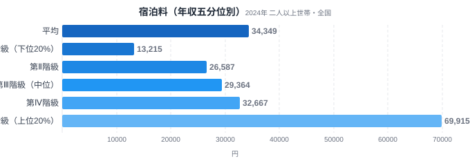
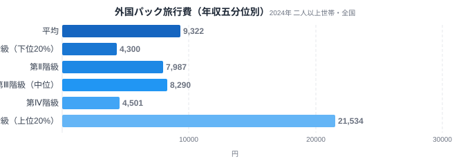
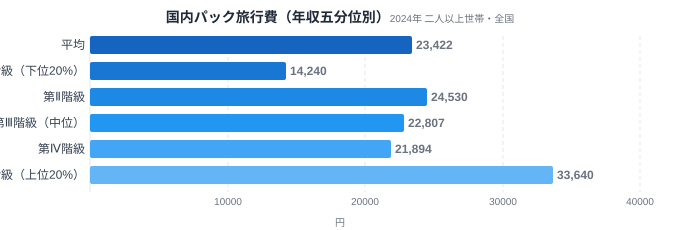

外国パック旅行こそ、高所得世帯にいちばん「売れている」旅行商品だと思われがちです。海外に行けるだけの余裕がある世帯ほど、パッケージツアーに大きなお金を使う——そんなイメージを持つ人は多いのではないでしょうか。総務省の家計調査には、全国の世帯を年間収入で5つの階級に分けて支出を比較する「年間収入五分位階級」というデータがあります。これを使って宿泊料・国内パック旅行費・外国パック旅行費の3つを比べると、意外な結果が見えてきます。

結論から言うと、2024年のデータで年収による格差が最も大きかったのは宿泊料でした。上位20%世帯の年間支出は下位20%世帯の5.3倍にのぼり、外国パック旅行費の5.0倍をわずかに上回ります。一方、国内パック旅行費の格差は2.4倍にとどまり、3指標の中で最も小さい結果でした。[海外旅行行動者率の都道府県格差](/blog/overseas-travel-gap)や[パスポート発行件数の地域差](/blog/passport-issuance-prefecture-gap)は住む場所による違いを扱いましたが、同じ「海外へのアクセス」でも、世帯年収という軸で見るとまた違う姿が浮かび上がります。

> [!NOTE]
> このデータは総務省統計局「家計調査（年間収入五分位階級別・二人以上の世帯）」の2024年分です。都道府県別の統計ではなく、全国の二人以上世帯を年間収入で低い方から高い方へ5等分し、各階級（第Ⅰ階級=下位20%〜第Ⅴ階級=上位20%）の1世帯当たり年間の平均支出額（年額。支出のない世帯も含めた全世帯の平均です）を比較しています。宿泊料・パック旅行費は年間を通じても購入する世帯が少ない「ロットの大きい」費目のため、日用品よりも階級間の振れ幅が大きく出やすい点を踏まえて読んでください。たとえば宿泊料の第Ⅴ階級69,915円は、月あたりに換算すると約5,800円です。e-Stat（政府統計の総合窓口）経由で取得しました。

## 宿泊料 — 高所得層だけが跳ね上がる

<source-link href="/ranking/accommodation-consumption-expenditure">宿泊料消費支出額ランキングを見る</source-link>

家計調査の宿泊料消費支出額を年収五分位別に見ると、第Ⅰ階級（下位20%）が13,215円、第Ⅱ階級が26,587円、第Ⅲ階級（中位）が29,364円、第Ⅳ階級が32,667円、第Ⅴ階級（上位20%）が69,915円です。第Ⅰ階級から第Ⅳ階級までは着実に増えていきますが、第Ⅳ階級から第Ⅴ階級にかけては倍以上に跳ね上がっており、上位20%だけが別次元の支出をしていることが分かります。V/I比（第Ⅴ階級の支出額÷第Ⅰ階級の支出額）は5.29倍で、今回比べた3指標の中で最大の格差でした。

宿泊料には、素泊まりのビジネスホテルから1泊数万円の温泉旅館や高級ホテルまで、施設と部屋によって料金の幅が非常に大きいという特徴があります。同じ「1泊」でも選べる価格帯の上限がまったく違うため、所得に余裕がある世帯ほど高価格帯の宿を選びやすく、支出額の差が開きやすい構造だと考えられます。ホテルや旅館の側が、支払い能力の高い客層に向けて高単価の部屋やサービスを用意してきた結果とも言えるでしょう。

## 外国パック旅行費 — 第Ⅳ階級でいったん沈む

<source-link href="/ranking/overseas-package-tour-consumption-expenditure">外国パック旅行費消費支出額ランキングを見る</source-link>

外国パック旅行費消費支出額は第Ⅰ階級4,300円、第Ⅱ階級7,987円、第Ⅲ階級8,290円、第Ⅳ階級4,501円、第Ⅴ階級21,534円という、単純な右肩上がりにはならない形をしています。第Ⅳ階級はほぼ第Ⅰ階級と同じ水準まで落ち込み、第Ⅱ・第Ⅲ階級よりも低いのです。ところが第Ⅴ階級だけは一気に21,534円へ跳ね上がり、第Ⅳ階級の4.78倍に達します。V/I比は5.01倍で、宿泊料に次いで大きい格差でした。

[仮説] 第Ⅳ階級での落ち込みは、外国パック旅行費という支出単価が大きく、購入する世帯が少数派である品目特有のブレの可能性があります。この数値は毎月の家計簿を12か月分積み上げた年間値ですが、外国パック旅行費は年間を通じても購入する世帯が少数派で、1回あたりの金額も大きいため、たまたまその階級に何世帯の購入世帯が含まれたかによって階級平均が振れやすいと考えられます。この点は単年のデータだけでは断定できず、複数年の推移を確認する必要があります。いずれにせよ際立っているのは中間層の動きではなく、第Ⅴ階級だけが突出して支出している構図です。

## 国内パック旅行費 — 格差は3指標で最小

<source-link href="/ranking/domestic-package-tour-consumption-expenditure">国内パック旅行費消費支出額ランキングを見る</source-link>

国内パック旅行費消費支出額は第Ⅰ階級14,240円、第Ⅱ階級24,530円、第Ⅲ階級22,807円、第Ⅳ階級21,894円、第Ⅴ階級33,640円です。第Ⅰ階級から第Ⅱ階級にかけて大きく増えたあと、第Ⅲ・第Ⅳ階級はむしろやや減り、第Ⅴ階級で再び増えるという波型の推移になっています。中間層である第Ⅱ階級の支出が、より上の第Ⅲ・第Ⅳ階級を上回っているのが目を引きます。V/I比は2.36倍で、宿泊料や外国パック旅行費と比べると格差はかなり小さめです。

国内パック旅行には、新幹線や特急とホテルがセットになったプランや、近場の温泉地への1〜2泊ツアーなど、比較的手が届きやすい価格帯の商品が多く流通しています。行き先の選択肢も幅広いため、所得の水準にかかわらず「予算に合わせて旅行先を選ぶ」余地が大きく、支出額の差が開きにくい費目だと考えられます。

## 旅行費で格差が一番大きいのはどれか

3指標のV/I比を並べると、宿泊料5.29倍、外国パック旅行費5.01倍、国内パック旅行費2.36倍という順になります。「高所得世帯にいちばん売れている旅行商品は外国パック旅行だ」というイメージに反して、2024年のデータでは宿泊料の方がわずかに格差が大きいという結果でした。ただし両者の差は0.28ポイントとそれほど大きくなく、宿泊料と外国パック旅行費はほぼ並んで「高所得層に強く偏る旅行費目」と言ってよいでしょう。両者に共通するのは、価格帯の上限が高く、上位20%だけが際立って支出を伸ばしている点です。

対照的に、国内パック旅行費だけが2倍台にとどまっているのは、旅行そのものへの支出意欲というより、選べる価格帯の幅の違いを反映していると考えられます。国内では手頃な価格の旅行商品が広く流通している一方、宿泊施設のグレードや海外への渡航には、上位層だけが選べる高価格帯の商品がより明確に存在するということです。

この違いは、旅行の予算配分を考えるときのヒントにもなります。国内パック旅行は所得の水準によらず選べる価格帯が広いため、限られた予算でも旅行先を選びやすい費目です。一方で宿泊のグレードアップや海外への渡航は、上位層向けの高価格帯商品が明確に存在するぶん、家計に占める重みが所得によって大きく変わってきます。同じ「旅行に行く」でも、費目によって家計に効いてくるレバーの大きさが違う、という視点で予算配分を考えると実感が持ちやすいでしょう。

> [!WARNING]
> ここでの数値は世帯あたりの「支出金額」であり、旅行の回数や日数、満足度を示すものではありません。宿泊料の支出額が大きいからといって快適な旅行をしているとは限らず、外国パック旅行費が伸びているからといって渡航回数が多いとも限りません。また五分位間の所得差と支出差の関係は相関であり、所得が高いこと自体が支出を押し上げる直接の原因かどうかは、この記事のデータだけでは判断できません。さらに、宿泊料（5.29倍）と外国パック旅行費（5.01倍）の差は0.28ポイントとわずかで、いずれも単年の標本調査に基づく値です。年による振れの範囲に収まっている可能性があり、別の年で集計すれば両者の順位が入れ替わることも十分に考えられます。

> [!TIP]
> 所得階級別の支出データを読むときは、V/I比という「両端の比較」だけでなく、第Ⅰ階級から第Ⅴ階級までの推移の形にも注目すると発見があります。宿泊料のように単調に増える品目もあれば、外国パック旅行費のように途中で沈む波型の品目もあり、後者は少数の高額購入世帯に支出が集中していることを示唆しています。

## まとめ

- 宿泊料と外国パック旅行費のV/I比（5.29倍・5.01倍）はほぼ並んでおり、単年のデータだけで「最大」を断定しすぎない方がよい
- 国内パック旅行費のV/I比2.36倍は、幅広い所得層が選べる価格帯の広さを映した結果と考えられる
- 支出額はあくまで年間の平均金額であり、旅行の回数・満足度・購入の有無を示すものではない
- V/I比という両端の比較だけでなく、第Ⅰ〜第Ⅴ階級までの推移の形（単調増加か波型か）を見ると、少数の高額購入世帯の影響が見えてくる
- 予算配分を考えるときは、所得によらず選びやすい費目（国内パック旅行）と、上位層向けの高価格帯が明確な費目（宿泊・海外旅行）の違いを意識するとよい

家計・経済に関する他のデータは[経済カテゴリ一覧](/category/economy)でも確認できます。

## データ出典

総務省統計局「家計調査（年間収入五分位階級別・全国・二人以上世帯）」2024年。e-Stat（政府統計の総合窓口）経由で取得。
