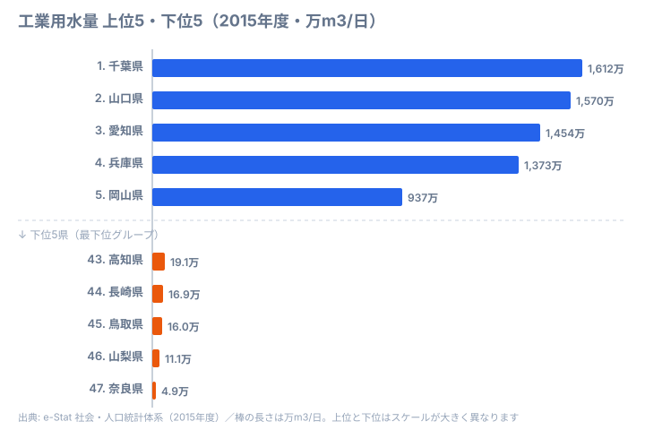

半導体ウエハー1枚の洗浄に必要な超純水は約30リットルといわれます。TSMC熊本工場では1日あたり約8,500m3、Rapidus北海道では将来的に1日1万m3超の工業用水が必要とされています。水が潤沢でなければ、最先端の製造業は成り立ちません。

都道府県別の工業用水量を見ると、工場が「どこに、なぜ集まるのか」が見えてきます。出荷額が大きいのに水をあまり使わない県もあれば、出荷額の割に大量の水を消費する県もあります。データから浮かび上がるのは、製造業の「業種構成」が水消費を決定づけるという構造です。本記事では、その地理的な偏りと、なぜ上位・下位がこの顔ぶれになるのかを掘り下げていきます。

## 工業用水量ランキング──千葉・山口・愛知が突出する

最も工業用水を使うのは[千葉県](/areas/12000)で、約1,612万m3/日です。京葉工業地域に集中する石油化学コンビナートや製鉄所が、大量の冷却水・工程水を消費しています。続く山口県は約1,570万m3/日で、周南・下松地区の石油化学コンビナートが寄与し、千葉とほぼ並ぶ水使用量です。3位の[愛知県](/areas/23000)は約1,454万m3/日、4位の[兵庫県](/areas/28000)は約1,373万m3/日、5位の岡山県は約937万m3/日と続きます。

上位に並ぶのは、いずれも臨海工業地帯を抱える県です。冷却水として海水を含む大量の水を必要とする重化学工業が集積しているため、水消費が突出します。上位5県（千葉・山口・愛知・兵庫・岡山）だけで、全国の工業用水量の約44.7%を占めます。戦後の高度経済成長期に臨海部へ立地したコンビナート群が、現在も大量の工業用水を消費し続けている構図です。

一方、最も水を使わないのは奈良県で、わずか約4.9万m3/日です。これは千葉県の約330分の1にすぎません。山梨県（約11.1万m3/日）、鳥取県（約16.0万m3/日）、長崎県（約16.9万m3/日）、高知県（約19.1万m3/日）も下位に並びます。いずれも内陸県や人口の少ない県で、大量の水を必要とする重化学工業がそもそも立地していないため、水使用量が極端に小さくなります。下位グループの顔ぶれは、臨海コンビナートの「不在」をそのまま映しているといえます。

> [!NOTE]
> ここでいう工業用水量は、海水を含む工業用の取水量（補給水）の集計です。地域内で循環利用される回収水は含みません。素材産業は海水を冷却に使うため、臨海県の数値が大きく出る点に注意してください。

<source-link href="/ranking/industrial-water-usage">47都道府県の工業用水量ランキングをもっと見る</source-link>

## なぜ「出荷額トップの愛知」が水使用量で千葉に及ばないのか

工業用水量の順位は、製造業の規模の順位とは一致しません。ここに、この指標を読むうえで最も大切なポイントがあります。

象徴的なのが愛知県です。愛知の製造品出荷額は約58兆円で全国でも群を抜く規模ですが、工業用水量では千葉・山口に届きません。自動車産業を中心とする組立加工型の製造業は、部品の加工と組み立てが中心で、素材産業ほど水を消費しないためです。逆に山口県は、製造品出荷額の規模では中位ながら、工業用水量では2位に食い込みます。石油化学コンビナートが原料を加工する過程で、冷却・洗浄に膨大な水を使うからです。

つまり、同じ「製造業の集積地」でも、業種が「素材産業」なのか「組立加工型」なのかで水の使い方が大きく変わります。水を大量に使う千葉・山口は石油化学・鉄鋼などの川上（素材）を、水をあまり使わない愛知は自動車という川下（組立）を、それぞれ担っているわけです。サプライチェーン上の位置づけの違いが、そのまま工業用水量の順位に表れています。

> [!TIP]
> 工業用水量の順位を見るときは、その県の主力産業が「素材系（化学・鉄鋼・パルプ）」か「組立系（自動車・機械・精密）」かを合わせて思い浮かべると、数字の意味が立体的に見えてきます。出荷額ランキングと並べて読むと、業種構成の違いが一目でわかります。

<source-link href="/ranking/manufacturing-shipment-amount">47都道府県の製造品出荷額ランキングをもっと見る</source-link>

## 太平洋ベルトと瀬戸内に帯のように集中する

工業用水量を地図に落とすと、その分布の偏りはさらにはっきりします。上位の千葉・愛知・兵庫・岡山・山口を結ぶと、太平洋ベルト（千葉から愛知・三重・大阪へ続く帯）と、瀬戸内海沿岸（兵庫・岡山・広島・山口）という二つの軸が浮かび上がります。臨海部に立地した重化学工業のコンビナート群が、現在も大量の工業用水を消費し続けているためです。

対照的に、内陸の奈良・山梨・鳥取や、人口の少ない県では水使用量が極めて小さくなります。これらの県には大規模な臨海コンビナートが存在せず、立地しているのは精密機械・電子部品・食品加工・印刷業など、もともと大量の水を必要としない業種が中心です。「水を使わない製造業」が主体だからこそ、工業用水量は下位にとどまります。地理的に見れば、工業用水量の地図は「臨海の素材産業がどこに集まっているか」の地図とほぼ重なります。

> [!WARNING]
> 工業用水量が少ない県を「製造業が弱い県」と読み違えないよう注意が必要です。奈良・山梨のように水使用量が下位でも、精密機器や電子部品で高い付加価値を生む県があります。順位が低いのは「水をあまり使わない業種が主体」だからで、製造業の生産性が低いことを意味するわけではありません。

## 半導体時代に「水」が立地条件になる

ここまで見てきた工業用水量のデータは2015年度時点のものですが、2020年代に入り状況は大きく変わりつつあります。半導体製造の拡大が、水資源の地図に新しい線を引き始めているからです。

TSMC熊本工場（JASM）の第1工場は2024年末に稼働を開始し、1日あたり約8,500m3の工業用水を消費します。第2工場が完成すれば合計で1日約1.3万m3に達する見込みです。北海道千歳市に建設中のRapidus（ラピダス）は、2027年の量産開始時に1日1万m3超の超純水を必要とする計画です。北海道は地下水が豊富で工業用水量も全国上位に入りますが、千歳周辺の取水能力が新たなボトルネックになる可能性があります。

半導体製造は、通常の工業用水をさらに精製した「超純水」を使います。不純物を1兆分の1レベルまで除去した水は、ウエハー洗浄だけでなく薬液の希釈や装置の冷却にも欠かせません。超純水の製造過程では原水の30〜50%が排水となるため、実際の取水量は使用量の2倍近くになります。従来、工場立地の条件は「労働力」「交通アクセス」「用地」の3要素で語られてきましたが、半導体・データセンターの時代には「水」と「電力」がこれに加わります。水資源の豊富さは、今後の製造業誘致における決定的な差別化要因になりうるのです。

## まとめ

都道府県別の工業用水量から、製造業の立地と水資源の関係を整理すると、次のことが見えてきます。

- 工業用水量が最も多いのは千葉県で約1,612万m3/日、山口・愛知・兵庫・岡山が続きます。
- 最も少ないのは奈良県で約4.9万m3/日、千葉とは約330倍もの開きがあります。
- 上位5県だけで全国の工業用水量の約44.7%を占め、いずれも臨海工業地帯を抱えています。
- 出荷額で全国トップの愛知が水使用量では千葉・山口に及ばないのは、組立加工型が素材産業ほど水を使わないためです。
- 工業用水量の地図は太平洋ベルトと瀬戸内に帯状に集中し、「臨海の素材産業」の分布とほぼ重なります。

工業用水は目に見えにくいインフラですが、製造業の血液ともいえる存在です。太平洋ベルト・瀬戸内海沿岸に集中する素材産業は、大量の工業用水なしには成り立ちません。一方、内陸の組立加工型・精密機器型の製造業は少ない水で稼いでいます。半導体の新工場立地が加速する2020年代、水資源の確保は「あって当たり前」から「戦略的に確保すべき資源」へと位置づけが変わりつつあります。

## データ出典

本記事のデータはe-Stat（政府統計の総合窓口）の社会・人口統計体系を基に作成しています。

- 工業用水量: 2015年度
- 製造品出荷額: 2023年度（業種構成の比較に使用）
