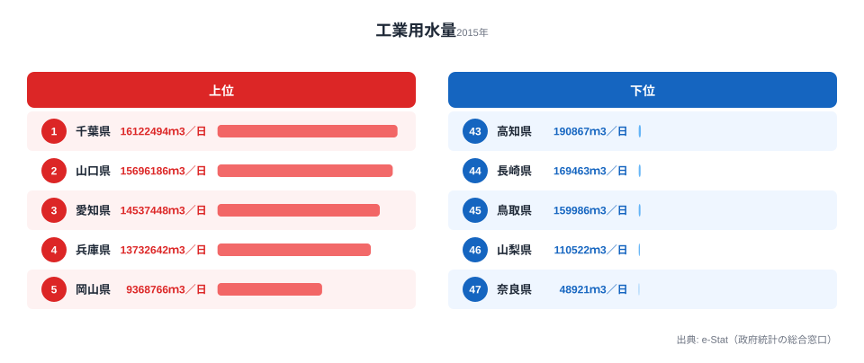
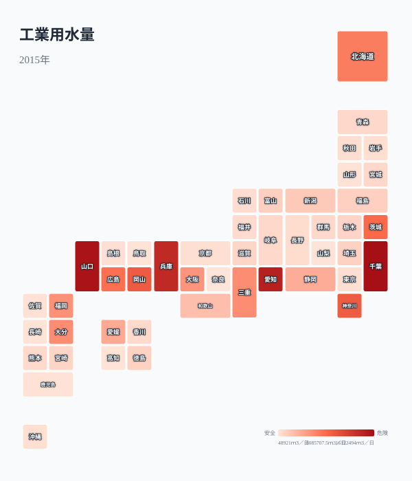
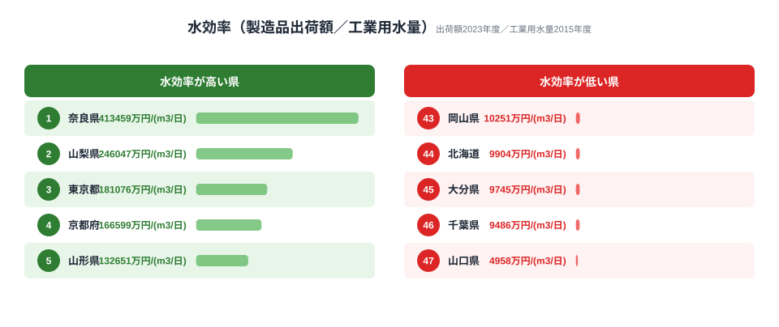
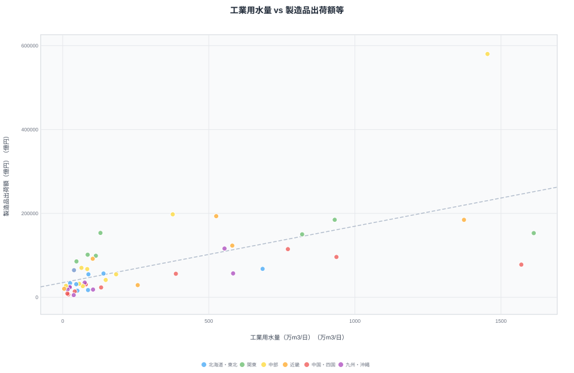
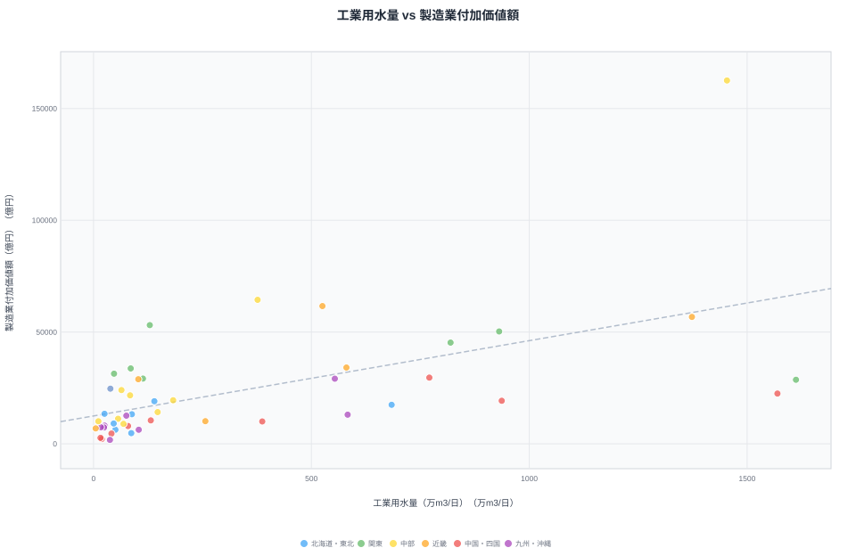
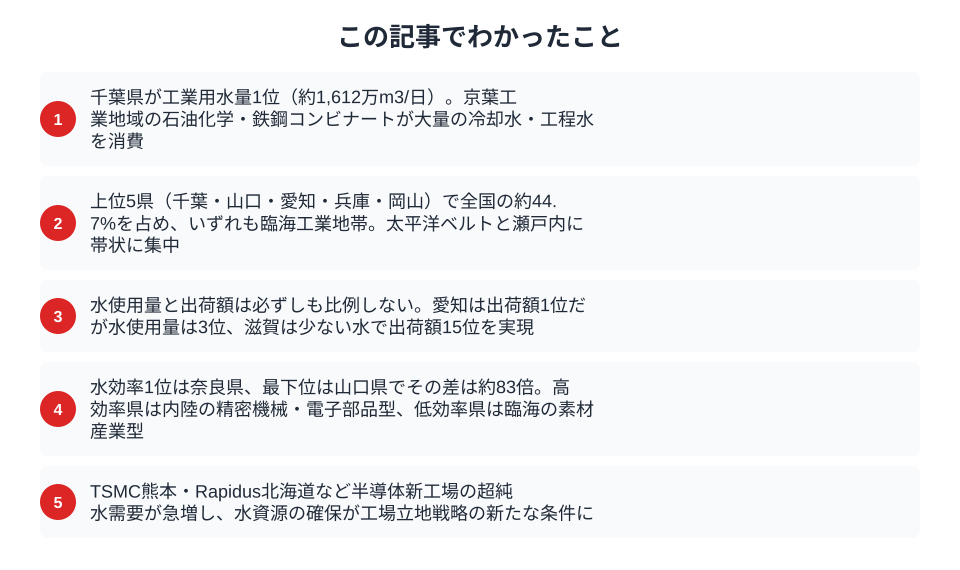

半導体ウエハー1枚の洗浄に必要な超純水は約30リットル。TSMC熊本工場では1日あたり約8,500m3、Rapidus北海道では将来的に1日1万m3超の工業用水が必要とされています。水が潤沢でなければ、最先端の製造業は成り立ちません。

ここで一つ意外な事実があります。製造品出荷額が全国1位の愛知県は、工業用水量では3位にとどまります。逆に、出荷額が中位の山口県は水使用量で2位です。「製造業が盛んな県ほど水を多く使う」という直感は、データを見ると半分しか当たっていません。都道府県別の工業用水使用量を見ると、工場が「どこに、なぜ集まるのか」が見えてきます。データから浮かび上がるのは、製造業の「業種構成」こそが水消費を決定づけるという構造です。

## 工業用水量ランキング──千葉・山口・愛知がTOP3

<data-source url="https://www.e-stat.go.jp/dbview?sid=0000010103" label="e-Stat 社会・人口統計体系"></data-source>

1位は[千葉県](/areas/12000)で約1,612万m3/日です。京葉工業地域に集中する石油化学コンビナートや製鉄所が、大量の冷却水・工程水を消費しています。2位の山口県（約1,570万m3/日）は周南・下松地区の石油化学コンビナートが寄与しており、製造品出荷額では全国17位にもかかわらず、水使用量ではほぼ千葉と並びます。

3位は[愛知県](/areas/23000)（約1,454万m3/日）です。製造品出荷額では全国1位の約58兆円を誇りますが、水使用量では千葉・山口に及びません。自動車産業を中心とする組立加工型の製造業は、素材産業ほど水を消費しないためです。

上位5県（千葉・山口・愛知・兵庫・岡山）で全国の工業用水量の約44.7%を占めます。いずれも臨海工業地帯を抱える県であり、冷却水として大量の水を必要とする重化学工業が集積しています。対照的に最下位は[奈良県](/areas/29000)の約5万m3/日で、千葉県の約330分の1にすぎません。山梨・鳥取・長崎・高知といった内陸県や人口の少ない県が下位に並びます。

> [!NOTE]
> 工業用水量は事業所が1日に使用する水量（淡水・回収水を含む）で、海水は対象外です。同じ「水」でも上水道・農業用水とは別系統で、ここでは製造業の生産工程で使う水だけを集計しています。

<source-link href="/ranking/industrial-water-usage">47都道府県の工業用水量ランキングをもっと見る</source-link>

## 工業用水量の地域分布──太平洋ベルトと瀬戸内に集中

<data-source url="https://www.e-stat.go.jp/dbview?sid=0000010103" label="e-Stat 社会・人口統計体系"></data-source>

タイルグリッドマップで工業用水量を可視化すると、太平洋ベルト（千葉・神奈川・愛知・三重・大阪）と瀬戸内海沿岸（兵庫・岡山・広島・山口）に濃い暖色が帯状に続きます。戦後の高度経済成長期に臨海部へ立地した重化学工業のコンビナート群が、現在も大量の工業用水を消費し続けている構図です。臨海部に集中する理由は、原料の輸入・製品の輸出に港湾が不可欠であること、そして冷却に大量の水を使う素材産業が取水と排水のしやすい沿岸を選んできたことにあります。

対照的に、奈良県（約5万m3/日）、山梨県（約11万m3/日）、鳥取県（約16万m3/日）など内陸県や人口の少ない県は水使用量が極めて少なくなっています。色の濃淡がそのまま「どの地域に素材産業が集まっているか」を映し出しており、地図は産業構造の縮図ともいえます。

<ad-slot></ad-slot>

## 水効率ランキング──少ない水で高い出荷額を実現する県

工業用水量が多い県が、必ずしも製造業の「生産性」が高いわけではありません。製造品出荷額を工業用水量で割った「水効率」（出荷額 / 水量）を計算すると、水の使い方に業種構成の違いが如実に表れます。

> [!NOTE]
> 水効率は、製造品出荷額（2023年度）を工業用水量（2015年度）で除して算出した派生指標です。年度が異なるうえ、出荷額には原材料費が含まれるため、純粋な「水の生産性」ではなく業種構成を読むための参考値としてご覧ください。

水効率が高い上位は奈良県、山梨県、東京都、京都府、山形県です。いずれも精密機械・電子部品・印刷業など、大量の水を必要としない組立加工型や知識集約型の製造業が主体です。

一方、水効率が低い下位は岡山県、北海道、大分県、千葉県、山口県です。石油化学・鉄鋼・パルプといった素材産業が集積する県は、冷却や洗浄のプロセスで大量の水を消費するため、出荷額あたりの水消費が大きくなります。水効率1位の奈良県と最下位の山口県では、その開きは約83倍にのぼります。

注目すべきは滋賀県です。工業用水量は約103万m3/日で全国24位と中位ですが、製造品出荷額は約9.2兆円で全国15位です。電子部品・デバイスや化学工業が立地しつつも、琵琶湖という豊富な水源を背景に効率的な水利用が行われています。

<source-link href="/ranking/manufacturing-shipment-amount">47都道府県の製造品出荷額ランキングをもっと見る</source-link>

## 工業用水量 vs 製造品出荷額──水と生産の関係

> [!WARNING]
> 工業用水量は2015年度、製造品出荷額は2023年度のデータで、調査年度が8年ずれています。両者の散布は「水を多く使う県・少ない県」の構造的な傾向を読むためのもので、厳密な相関係数の議論には使えません。あくまで業種構成の違いを示す図としてご覧ください。

散布図の右上（水使用量が多く出荷額も大きい）に位置するのは愛知県・神奈川県・兵庫県などです。これらは大規模な製造業が集積し、相応の水資源を消費している「大量生産・大量消費」型といえます。

興味深いのは右下に外れる山口県と千葉県です。水使用量はトップクラスですが、出荷額は中位にとどまります。これは石油化学・鉄鋼コンビナートのような素材産業が主体で、原料を加工して出荷するまでの付加価値が組立加工型に比べて小さいことを反映しています。

逆に左上に位置する埼玉県・東京都・群馬県は、水使用量が少ないにもかかわらず出荷額が大きくなっています。これらの県は、食品加工・精密機器・印刷業など水消費の少ない業種が中心であり、「水を使わない製造業」の典型といえます。

<ad-slot></ad-slot>

## 工業用水量 vs 製造業付加価値額──真の生産性はどこに

<data-source url="https://www.e-stat.go.jp/dbview?sid=0000010103" label="e-Stat 社会・人口統計体系"></data-source>

製造品出荷額には原材料費が含まれるため、より「真の生産性」に近い付加価値額で見ると、出荷額の散布図との差が際立ちます。出荷額の散布図では愛知・神奈川・兵庫が右上に固まっていましたが、付加価値額の散布図では愛知の突出がより明確になる一方、埼玉・静岡・群馬など内陸製造業の県が左上（少ない水で高い付加価値）寄りに移動します。山口県は出荷額・付加価値額いずれの散布図でも右下（大量の水・相対的に小さい出荷額／付加価値額）に位置し、素材産業の特性が一貫して現れます。

愛知県は付加価値額でも断トツの1位（約16.3兆円）ですが、水使用量は千葉・山口より少なくなっています。自動車産業の組立工程は水消費が比較的少なく、部品の加工精度と人的技能で高い付加価値を生み出す構造です。

山口県は付加価値額が約2.2兆円（全国18位）にとどまるのに対し、水使用量は全国2位です。素材産業は「大量の水を使って大量の素材を生産するが、1トンあたりの付加価値は相対的に低い」という特性を持ちます。これは良し悪しではなく、サプライチェーンの川上を担うという産業構造上の位置づけの違いです。

<source-link href="/ranking/manufacturing-industry-added-value">47都道府県の製造業付加価値額ランキングをもっと見る</source-link>

## 半導体時代の工業用水問題

工業用水量のデータは2015年度時点のものですが、2020年代に入り状況は大きく変わりつつあります。

TSMC熊本工場（JASM）の第1工場は2024年末に稼働を開始し、1日あたり約8,500m3の工業用水を消費します。第2工場が完成すれば合計で1日約1.3万m3に達する見込みです。熊本県の2015年時点の工業用水量は約75万m3/日（全国30位）であり、TSMC単独の水需要は県全体の約1.7%に相当します。

北海道千歳市に建設中のRapidus（ラピダス）は、2027年の量産開始時に1日1万m3超の超純水を必要とする計画です。北海道は工業用水量も全国9位（約684万m3/日）と多いですが、千歳周辺の取水能力が新たなボトルネックになる可能性があります。

半導体製造は通常の工業用水をさらに精製した「超純水」を使います。不純物を1兆分の1レベルまで除去した水は、ウエハー洗浄だけでなく薬液の希釈や装置の冷却にも不可欠です。超純水の製造過程では原水の30〜50%が排水となるため、実際の取水量は使用量の2倍近くになります。

> [!TIP]
> 工場立地の条件は従来「労働力・交通アクセス・用地」の3要素で語られてきました。半導体・データセンターの時代には、ここに「水」と「電力」が加わります。新工場の進出ニュースを見たら、その県の工業用水量と取水余力を合わせて見ると、立地戦略の本質が見えてきます。

<ad-slot></ad-slot>

## まとめ

都道府県別の工業用水量から、製造業の立地と水資源の関係を分析しました。

工業用水は目に見えにくいインフラですが、製造業の血液ともいえる存在です。太平洋ベルト・瀬戸内海沿岸に集中する素材産業は、大量の工業用水なしには成り立ちません。一方、内陸の組立加工型・精密機器型の製造業は、少ない水で高い出荷額を実現しています。半導体の新工場立地が加速する2020年代、水資源の確保は「あって当たり前」から「戦略的に確保すべき資源」へと位置づけが変わりつつあります。

## データ出典

本記事のデータはe-Stat（政府統計の総合窓口）社会・人口統計体系を基に作成しています。工業用水量は2015年度、製造品出荷額・製造業付加価値額は2023年度の値です。
