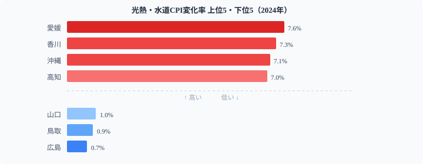

「全国の消費者物価は前年比2.8%上昇」──ニュースではこう一括報道されるが、この数字に隠れた地域差が問題だ。2024年の都道府県別CPI変化率を見ると、最高の[奈良県](/areas/29000)（3.5%）と最低の福井県（2.2%）では1.3ポイントの開きがある。年間消費支出300万円の世帯なら、この差が**約3.9万円**の負担差となって現れる。

さらに費目別に分解すると、地域差はより鮮明になる。光熱・水道では愛媛7.6%に対し広島0.7%と**約6.9ポイント差**。食料では奈良6.3%に対し茨城2.9%と**3.4ポイント差**。「何が上がっているか」が県によってまったく異なるため、家計防衛の優先順位も変わる。

本記事では費目別の構造差・食料×光熱の相関・50年間の時系列を通じ、あなたの県のインフレ「型」を判定する。

> [!NOTE]
> 消費者物価指数（CPI）の対前年変化率は、前年と比べて物価がどれだけ変動したかを示す指標。プラスならインフレ、マイナスならデフレ。総務省「消費者物価指数」をもとに、総合・食料・光熱水道・住居の4費目を分析している。都道府県データは各地方局・都市の調査値を都道府県単位に集約したもの。

## 総合ランキング──地方が上位、首都圏が下位の構造

<data-source url="https://www.e-stat.go.jp/dbview?sid=0000010212" label="e-Stat 社会・人口統計体系"></data-source>

**1位は奈良県の3.5%**。47都道府県で唯一の3.5%台。2位には山形県・宮崎県・[沖縄県](/areas/47000)が3.4%で並び、5位タイに宮城県・佐賀県（3.2%）が続く。

**最も低いのは福井県と和歌山県の2.2%**。[東京都](/areas/13000)も2.3%で43位タイと、大都市圏は意外に低い水準に収まっている。

上位10県のうち9県が地方圏というパターンには、構造的な理由がある。地方は食費の消費支出に占める割合（エンゲル係数）が高く、食料品値上げの影響を直撃されやすい。また生鮮食品の流通コストが長距離輸送で上乗せされるため、食料インフレが総合を押し上げる。

### 全国マップ──東北・九州・四国に集中する高インフレ

<data-source url="https://www.e-stat.go.jp/dbview?sid=0000010212" label="e-Stat 社会・人口統計体系"></data-source>

マップで見ると、東北・九州・四国・近畿内陸部に濃い色（高い上昇率）が集中する。首都圏から北関東にかけては穏やかな色合いだ。物価上昇率の高低は「北 vs 南」ではなく、「大都市圏 vs 地方」の軸で分かれている。

<source-link href="/ranking/cpi-change-rate-total">47都道府県のCPI変化率ランキングをもっと見る</source-link>

## 費目別に見る「インフレの型」──3つのパターン

総合の物価上昇率が同じ3%でも、何が値上がりしているかは県によってまったく異なる。食料が上がっている県と、電気・ガスが上がっている県では、家計防衛の方法も変わる。

### 食料──奈良6.3%がダントツ、茨城2.9%は半分以下

食料CPI変化率は**奈良県が6.3%で圧倒的1位**。2位の鹿児島（5.8%）、3位の岐阜（5.5%）を引き離している。最も低い茨城は2.9%で、奈良との差は3.4ポイント。総合の地域差1.3ポイントの2倍以上に拡大する。

北関東〜首都圏近郊の農業県（茨城・群馬・千葉）は地産地消の恩恵で上昇率が抑制されている。大消費地から離れた地域ほど流通コストの上昇が食料品価格に転嫁されやすいことがうかがえる。

### 光熱・水道──愛媛7.6% vs 広島0.7%の衝撃

光熱・水道は**地域差が最も激しい費目**だ。愛媛7.6%に対し広島0.7%で、同じ中国・四国でありながら**6.9ポイント差**がある。四国勢（愛媛・香川・沖縄・高知）が上位を独占し、中国電力エリアの広島・鳥取・山口は低い水準に収まる。

この地域差の主因は**電力会社の料金改定タイミングと燃料費調整の違い**。四国電力エリアでは値上げ幅が大きく、中国電力エリアでは相対的に抑制された結果、隣り合う県でも大きな差が生じた。

### 住居──宮崎2.8%が1位、福井は-1.0%のマイナス

住居CPI変化率は**宮崎2.8%が全国トップ**。大都市圏は東京0.7%、大阪0.8%と低い。**福井は-1.0%と47都道府県で唯一の1%以上のマイナス**。人口減少が続く地域では空室増加が家賃の下落圧力になっていると考えられる。

> [!TIP]
> 「何が上がっているか」は県によって大きく違う。食料が高い県では食費の見直し、光熱費が高い県では省エネ対策・電力会社の切り替えと、**インフレの「型」に合わせた家計防衛が重要**。

<ad-slot></ad-slot>

## 食料 × 光熱水道──2軸散布図で見るインフレの「型」

<data-source url="https://www.e-stat.go.jp/dbview?sid=0000010212" label="e-Stat 社会・人口統計体系"></data-source>

食料と光熱・水道のCPI変化率を散布図にプロットすると、各都道府県のインフレ「型」が4象限で整理できる。

**右上：ダブルパンチ型**──沖縄・鹿児島・佐賀・熊本など九州勢が集中。食料も光熱も高い変化率で、家計への負担が最も重いグループ。

**左上：エネルギー主導型**──愛媛・香川・高知・徳島の四国勢。光熱・水道が6〜7%台と突出し、食料はやや穏やか。電力料金の改定が直撃している。

**右下：食料主導型**──奈良・岐阜・山口など。食料変化率が5%以上と高い一方、光熱・水道は比較的低い。食品流通コストの上昇が主因。

**左下：全般的に穏やか**──東京・埼玉・千葉・茨城など首都圏。大消費地としてのスケールメリットが効いている。

相関係数はr=0.14と弱く、食料の上昇率と光熱の上昇率は**ほぼ独立した要因で動いている**。同じ都道府県でも費目ごとに異なる経路でインフレが進む、というのがこのデータの重要な発見だ。

<source-link href="/ranking/cpi-change-rate-food">食料CPI変化率の47都道府県ランキングを見る</source-link>
<source-link href="/ranking/cpi-change-rate-utilities">光熱・水道CPI変化率の47都道府県ランキングを見る</source-link>

## 50年の歴史で見るCPI変化率──「本物のインフレ」が戻った2022〜

<data-source url="https://www.e-stat.go.jp/dbview?sid=0000010212" label="e-Stat 社会・人口統計体系"></data-source>

1975〜2024年の50年間で、日本の物価上昇率は劇的に変化した。

**1975年：11.3%（オイルショック後のピーク）**。「狂乱物価」と呼ばれた時代。その後は2%前後に落ち着き、1990年代後半〜2010年代前半は「失われた20年」のデフレ期に入る。1995年に初のマイナスを記録して以降、物価上昇率はゼロ近辺を長期間推移した。

**2022〜2024年：約30年ぶりの「本物のインフレ」**。ウクライナ情勢・円安・原材料高を背景に、2022年は2.4%、2023年は3.3%（約40年ぶりの高水準）。2024年は2.8%とやや落ち着いたが、デフレ時代とは明確に異なるインフレ基調が定着しつつある。

> [!WARNING]
> 2024年のCPI変化率2.8%は日銀の物価安定目標2%を上回り続けている。複利で積み上がる性質があるため、2%台が数年続くだけでも実質購買力は大きく低下する。特に食料・光熱費の比率が高い地方世帯には影響が大きい。

<ad-slot></ad-slot>

## 地域インフレ指数──絶対水準の差も見逃せない

CPI変化率（前年比）とは別に、**消費者物価地域差指数**（全国平均＝100）も重要な視点だ。物価変化「速度」ではなく「水準」の地域差を示す。

<source-link href="/ranking/cpi-regional-difference-index-total-tokyo100">消費者物価地域差指数（東京＝100）のランキングを見る</source-link>
<source-link href="/ranking/consumer-price-difference-index-overall">消費者物価地域差指数（全国平均＝100）のランキングを見る</source-link>

東京を基準にした地域差指数と変化率を組み合わせると、「もともと物価が高い地域がさらに上昇しているか」「もともと安い地域のほうが上昇率が高いか」を判断できる。2024年のデータでは後者の傾向が見られ、**地方の物価水準が全国平均に近づく「収斂」の動きがある**可能性も指摘されている。

## まとめ──「型」を知れば家計防衛の優先順位が変わる

2024年のインフレを費目別に分解すると、3つの「型」が見えてくる。

1. **食料主導型**（奈良・鹿児島・岐阜など）: 地方の食品流通コスト上昇が直撃。スーパーの特売活用・ふるさと納税による食費軽減が有効。
2. **エネルギー主導型**（愛媛・香川・四国など）: 電力料金の地域差が主因。電力会社の新プランへの切り替え・省エネ家電導入の投資対効果が高い。
3. **穏やか型**（東京・埼玉・千葉など）: 大消費地のスケールメリットで全費目が低水準。ただし絶対物価水準（地域差指数）は高いため、総合的には決して楽ではない。

50年の時系列で見れば、現在のインフレは約30年ぶりの「本物」だ。デフレが常態だった時代に比べ、物価上昇を前提とした家計管理・資産形成がより重要になっている。自分の住む県のインフレ「型」を知り、費目に応じた対策を取ることが家計防衛の第一歩だ。

> [!TIP]
> 消費支出の中で食料・光熱費の比率が高い「エンゲル係数」の高い世帯ほど、地方型インフレの影響を強く受ける。エンゲル係数も都道府県別に確認しておくと、自分の生活コスト構造の把握に役立つ。

## データ出典

- 総務省「消費者物価指数」2024年（e-Stat 社会・人口統計体系）
- CPI対前年変化率（総合・食料・光熱水道・住居）、都道府県別
- 取得先：[e-Stat 政府統計の総合窓口](https://www.e-stat.go.jp/dbview?sid=0000010212)

