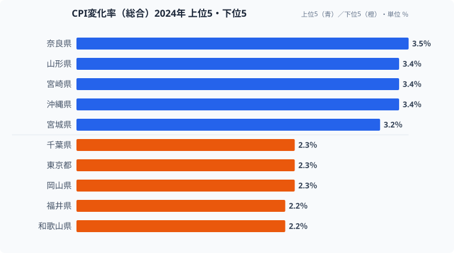
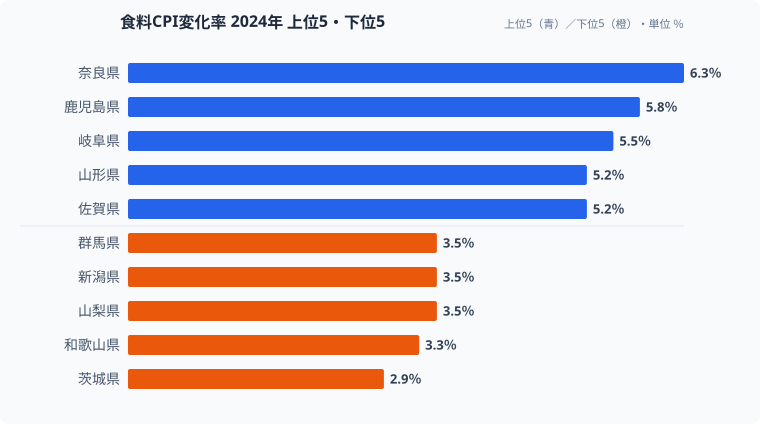
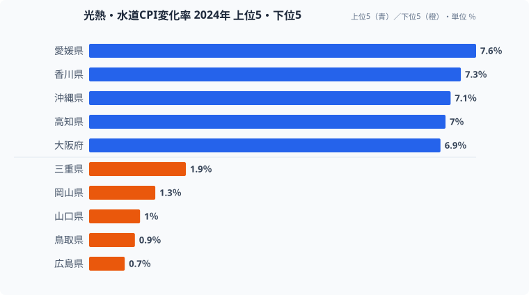
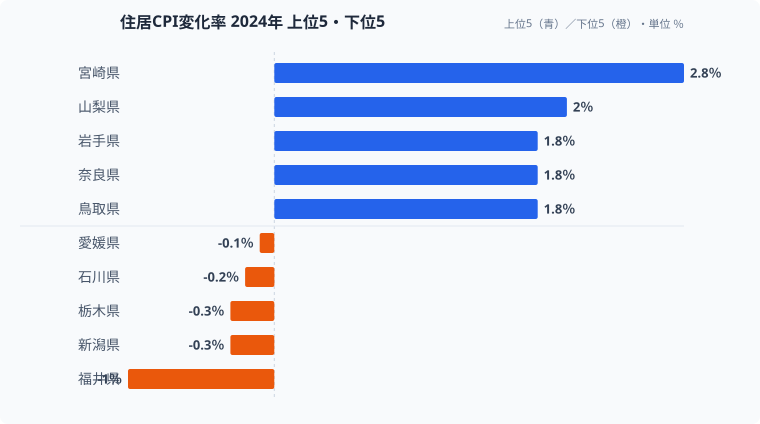

「全国の消費者物価は前年比2.8%上昇」──ニュースではこう一括で報じられますが、この数字に隠れた地域差こそが問題です。2024年の都道府県別CPI変化率を見ると、最高の[奈良県](/areas/29000)（3.5%）と最低の福井県（2.2%）では1.3ポイントの開きがあります。年間消費支出300万円の世帯なら、この差はおよそ**3.9万円**の負担差となって家計に効いてきます。

しかも費目別に分解すると、地域差はもっと鮮明になります。光熱・水道では愛媛7.6%に対し広島0.7%と**約6.9ポイント差**、率にすればおよそ10倍の開きです。食料では奈良6.3%に対し茨城2.9%と**3.4ポイント差**で、総合の1.3ポイント差の2倍以上に広がります。「何が上がっているのか」が県ごとにまるで違うため、家計防衛の優先順位も県ごとに変わってくるのです。

本記事では、総合・食料・光熱・住居の4費目を上位5・下位5で分解し、あなたの県のインフレ「型」を見極めていきます。

> [!NOTE]
> 消費者物価指数（CPI）の対前年変化率は、前年と比べて物価がどれだけ動いたかを示す指標です。プラスならインフレ、マイナスならデフレを意味します。総務省「消費者物価指数」をもとに、総合・食料・光熱水道・住居の4費目を分析しています。都道府県データは各地方局・都市の調査値を都道府県単位に集約したものなので、市町村単位の体感とはずれる場合があります。

## 総合ランキング──地方が上位、首都圏が下位の構造

<source-link href="/ranking/cpi-change-rate-total">47都道府県のCPI変化率ランキングをもっと見る</source-link>

**1位は奈良県の3.5%**で、47都道府県のなかで唯一の3.5%台です。2位には山形県・宮崎県・[沖縄県](/areas/47000)が3.4%で並び、5位タイに宮城県・佐賀県（3.2%）が続きます。一方で**最も低いのは福井県と和歌山県の2.2%**でした。[東京都](/areas/13000)も2.3%で43位タイにとどまり、大都市圏は意外に低い水準に収まっています。

上位に地方圏が並び、首都圏が下位に沈むパターンには構造的な理由があります。地方は消費支出に占める食費の割合（エンゲル係数）が高く、食料品の値上げを家計の比率としてより重く受けます。さらに生鮮食品の流通コストが長距離輸送で上乗せされやすいため、食料インフレが総合の数字を押し上げます。逆に首都圏は大消費地としてのスケールメリットが効き、流通コストが分散されるため上昇率が抑えられます。物価上昇率の高低は「北 vs 南」ではなく、「大都市圏 vs 地方」という軸で分かれているのが2024年の特徴です。

> [!WARNING]
> 総合の上昇率が低い県が「物価が安い県」とは限りません。ここで見ているのは前年比の「変化率（速度）」であって、物価の「絶対水準」ではないからです。東京は変化率こそ2.3%と低いものの、もともとの物価水準は全国で最も高く、上昇のベースが大きい点には注意が必要です。

## 費目別に見る「インフレの型」──3つのパターン

総合の物価上昇率が同じ3%台でも、何が値上がりしているのかは県によってまったく異なります。食料が上がっている県と、電気・ガスが上がっている県では、打つべき家計防衛の手も変わってきます。ここからは費目ごとに上位5・下位5を並べ、地域差の正体を確かめていきます。

### 食料──奈良6.3%がダントツ、茨城2.9%は半分以下

<source-link href="/ranking/cpi-change-rate-food">食料CPI変化率の47都道府県ランキングを見る</source-link>

食料CPI変化率は**奈良県が6.3%で圧倒的な1位**です。2位の鹿児島県（5.8%）、3位の岐阜県（5.5%）を引き離しています。最も低いのは茨城県の2.9%で、奈良との差は3.4ポイントにもなります。総合の地域差1.3ポイントが、食料に絞ると2倍以上に拡大するのです。

下位を見ると、茨城（2.9%）・群馬（3.5%）といった北関東の農業県が並びます。これらの地域は地産地消の恩恵を受けやすく、生鮮食品の輸送距離が短いため値上げ幅が抑えられていると考えられます。逆に大消費地から離れた内陸の奈良や岐阜では、流通コストの上昇が食料品価格に転嫁されやすく、上昇率が跳ね上がります。同じ「食料」でも、産地に近いか・大消費地に近いかで痛み方がここまで分かれるのが食料インフレの構造です。食費の比率が高い世帯ほど、この差を生活実感として強く受けることになります。

### 光熱・水道──愛媛7.6% vs 広島0.7%の衝撃

<source-link href="/ranking/cpi-change-rate-utilities">光熱・水道CPI変化率の47都道府県ランキングを見る</source-link>

光熱・水道は**地域差が最も激しい費目**です。愛媛7.6%に対し広島0.7%で、同じ中国・四国地方でありながら**6.9ポイント差**、率にしておよそ10倍の開きがあります。上位は四国勢（愛媛・香川・高知）に沖縄を交えて占め、下位は広島・鳥取（0.9%）・山口（1.0%）と中国電力エリアが固めています。

この地域差の主因は、**電力会社ごとの料金改定タイミングと燃料費調整の違い**にあると考えられます。四国電力エリアでは値上げ幅が大きく、中国電力エリアでは相対的に抑えられた結果、隣り合う県でも大きな差が生まれました。電気・ガスは生活に不可欠で節約しにくい固定的な支出なので、上位の四国勢では家計への打撃が直接的です。同じ「光熱費が上がった」というニュースでも、愛媛の世帯と広島の世帯では受ける衝撃がまるで違う、というのがこの費目のリアルな姿です。

> [!TIP]
> 「何が上がっているのか」は県によって大きく違います。食料が高い県では食費そのものの見直しが効きますが、光熱費が高い県では省エネ家電への買い替えや電力会社の料金プラン切り替えのほうが投資対効果は高くなります。自分の県のインフレ「型」に合わせて対策を選ぶことが、家計防衛では重要です。

### 住居──宮崎2.8%が1位、福井は-1.0%のマイナス

<source-link href="/ranking/cpi-change-rate-housing">住居CPI変化率の47都道府県ランキングを見る</source-link>

住居CPI変化率は**宮崎県の2.8%が全国トップ**です。一方で大都市圏は東京0.7%、大阪0.8%と低水準にとどまります。最も特徴的なのは**福井県の-1.0%**で、47都道府県のなかで唯一、住居費が1%以上下落しています。

住居費が下がる背景には、人口減少にともなう空室の増加があると考えられます。借り手が減れば家賃には下落圧力がかかり、福井のように住居費がマイナスに沈みます。総合で福井が最下位（2.2%）だった一因も、この住居費のマイナスが全体を押し下げているためです。逆に大都市圏では住居費の変化率自体は小さいものの、もともとの家賃水準が高いため、わずかな上昇でも金額としての負担は重くなります。住居費は総合ランキングの順位を左右する隠れた主役であり、「総合の上昇率が低い県＝住みやすい県」と単純には言えないことを示しています。

<ad-slot></ad-slot>

## 3つの「型」が浮かぶ──食料と光熱は別経路で動いている

ここまでの4費目を重ねると、地域インフレには大きく3つの「型」が見えてきます。注目すべきは、食料が高い県と光熱が高い県がほとんど一致しない点です。奈良は食料6.3%で全国1位ですが光熱はそれほど高くなく、愛媛は光熱7.6%で全国1位ですが食料は上位ではありません。食料の上昇と光熱の上昇は、流通コストと電力料金という**それぞれ独立した要因**で動いているのです。

だからこそ、同じ「総合3%台」の県でも中身はまったく異なります。九州勢のように食料も光熱も高い「ダブルパンチ型」、四国勢のように光熱が突出する「エネルギー主導型」、奈良・岐阜のように食料が主役の「食料主導型」、そして首都圏のように全費目が穏やかな「穏やか型」です。自分の県がどの型かを知らないまま一律の節約をしても、効果の薄いところに労力を割いてしまいかねません。

> [!WARNING]
> 費目別の順位は、その県の家計負担の「大きさ」とは別物です。たとえば住居費がマイナスの福井でも、食料は3%台で上がっています。「住居が下がったから安心」と総合だけで判断すると、上がっている食料・光熱の対策を取り逃します。家計防衛では、総合の順位ではなく自分の支出構成で重い費目がどう動いたかを見るのが正解です。

## 50年の歴史で見るインフレ──「本物」が30年ぶりに戻った

費目別の地域差は、そもそも日本に「本物のインフレ」が戻ってきたからこそ問題になっています。1975年の物価上昇率は11.3%（オイルショック後のピーク）で、「狂乱物価」と呼ばれた時代でした。その後は2%前後に落ち着き、1990年代後半から2010年代前半は「失われた20年」のデフレ期に入ります。1995年に初のマイナスを記録して以降、物価上昇率はゼロ近辺を長く推移してきました。

流れが変わったのは2022年からです。ウクライナ情勢・円安・原材料高を背景に、2022年は2.4%、2023年は3.3%（約40年ぶりの高水準）まで上昇しました。2024年は2.8%とやや落ち着いたものの、デフレ時代とは明確に異なるインフレ基調が定着しつつあります。デフレが常態だった時代には地域差を気にする必要すらありませんでしたが、物価が動く時代に戻ったいま、どの費目がどの県でどれだけ上がるかが家計に直結するようになりました。

> [!TIP]
> CPI変化率（前年比）とは別に、物価の「絶対水準」を比べる消費者物価地域差指数（全国平均＝100）という指標もあります。変化率は「上がる速度」、地域差指数は「もともとの高さ」を示すので、両方を合わせて見ると「もともと高い県がさらに上がっているのか」「安い県のほうが速く上がっているのか」が判断できます。2024年は後者の傾向が見られ、地方の物価水準が全国平均へ近づく動きも指摘されています。

## まとめ──「型」を知れば家計防衛の優先順位が変わる

2024年のインフレを費目別に分解すると、3つの「型」が見えてきます。

1. **食料主導型**（奈良・鹿児島・岐阜など）── 地方の食品流通コスト上昇が直撃します。スーパーの特売活用やふるさと納税による食費軽減が効きます。
2. **エネルギー主導型**（愛媛・香川・高知など四国勢）── 電力料金の地域差が主因です。電力会社の新プランへの切り替えや省エネ家電の導入が投資対効果の高い対策になります。
3. **穏やか型**（東京・埼玉・千葉など首都圏）── 大消費地のスケールメリットで全費目が低水準です。ただし絶対物価水準は高いため、総合的に楽というわけではありません。

50年の時系列で見れば、現在のインフレは約30年ぶりの「本物」です。デフレが常態だった時代に比べ、物価上昇を前提とした家計管理・資産形成がより重要になっています。自分の住む県のインフレ「型」を知り、重い費目に絞って対策を取ることが、家計防衛の第一歩になります。

## データ出典

- 総務省「消費者物価指数」2024年（e-Stat 社会・人口統計体系）
- CPI対前年変化率（総合・食料・光熱水道・住居）、都道府県別
- 取得先：[e-Stat 政府統計の総合窓口](https://www.e-stat.go.jp/dbview?sid=0000010212)
