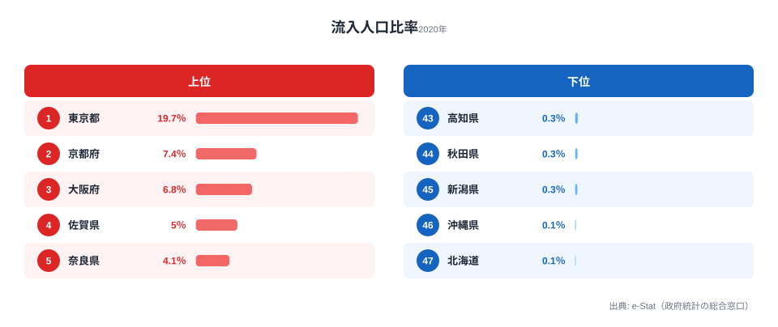

「東京は人を吸い上げる」とよく言われますが、それはどれくらいの規模なのでしょうか。2020年の国勢調査で、常住人口に対して「他県から通勤・通学で流入してくる人」の比率を計算すると、最も高いのは東京都の **19.67%** でした。東京に住民票を置いている人の数に対して、その約2割に相当する人数が、毎朝ほかの県から東京に流れ込んでいる計算になります。

ところが最下位の北海道はわずか **0.07%** で、その差は **281倍**。この極端な開きは「どの県が魅力的か」を測っているのではありません。流入人口比率が映し出しているのは、**県境が通勤圏の一部としてつながっているか、それとも海や距離で断ち切られているか** という地理構造そのものです。だからこそ、地方県のはずの佐賀が4位に食い込むという一見不可解な現象が起きます。本記事では2020年国勢調査をもとに、都市圏が人を吸い上げる重力と、島嶼性がもたらす孤立の対比を読み解いていきます。

> [!NOTE]
> 流入人口比率は「常住人口（夜間人口・その県に住んでいる人）に対して、他都道府県から通勤・通学で入ってくる人の数の割合」です。住所はA県にあるが勤務先・学校がB県にある人は、B県の「流入」としてカウントされます。あくまで日常的な移動（通勤・通学）が対象で、観光客や転入者は含まれません。つまりこの指標は「どれだけ人を惹きつけるか」ではなく「日常の生活圏が県境をまたいでいるか」を測るものです。

## 上位5県は三大都市圏だが、東京だけが桁違い

流入人口比率の上位5県と下位5県を1枚にまとめると、上位の中でも東京だけが突き抜けていることが一目で分かります。

上位は1位東京都19.67%、2位京都府7.36%、3位大阪府6.82%、4位佐賀県5.04%、5位奈良県4.07%という並びです。2位の京都ですら東京の半分以下、3位大阪は約3分の1で、東京19.67%がいかに突出しているかが分かります。これは、東京が「周辺の県から人を吸い上げる中心」として、京阪神圏のどの都市よりも強い重力を持っていることを示しています。神奈川・埼玉・千葉に住みながら東京の都心へ通う人の規模が、この数字に直接表れているわけです。

上位陣の顔ぶれをもう少し細かく見ると、流入比率が「三大都市圏の地図」とほぼ重なることが分かります。京阪神圏では大阪・京都を中心に、5位の奈良（4.07%）、9位の滋賀（3.01%、グラフ外）がベッドタウンとしてその外周に並びます。首都圏側でも、6位埼玉（3.5%）、7位神奈川（3.44%）、8位群馬（3.2%）、10位茨城（3.0%）が、東京への通勤者を抱える周辺県として続きます。流入比率の高さは、その県が単独で完結しているのではなく、より大きな都市圏の一部として人の流れにつながっていることの証拠なのです。

<source-link href="/ranking/inflow-population-ratio">流入人口比率ランキングの全47都道府県を見る</source-link>

## 地方県・佐賀が4位に食い込む「行政県と生活圏のずれ」

上位の中で最も意外なのが、4位の **佐賀県5.04%** です。三大都市圏のどれにも属さない地方県が、大阪に次ぎ奈良を上回る順位に入っています。なぜでしょうか。

答えは、佐賀県東部の鳥栖・基山エリアが **福岡都市圏に組み込まれている** ことにあります。鳥栖はJR鹿児島本線・長崎本線が交わる交通の要衝で、博多まで快速で20分前後。佐賀県に住みながら福岡市内に通勤・通学する人が非常に多く、それが佐賀全体の流入人口比率を押し上げています。佐賀の高順位は「佐賀が栄えている」のではなく、**福岡都市圏という生活圏が行政上の県境を越えて広がっている** ことを示す典型例です。

同じ構図は京阪神圏の奈良・滋賀にも当てはまります。どちらも単独の経済中心ではありませんが、大阪・京都への通勤者を多数抱えるベッドタウンとして上位に入ります。流入人口比率は、行政区画の地図ではなく、人々が毎日どこへ移動しているかという「生活圏の地図」を描き出す指標だといえます。

> [!TIP]
> 流入比率の高い県を「住みやすさ」と読み違えないことが大切です。むしろこの指標が高い県の多くは、中心都市（東京・大阪・福岡）に通勤者を「供給する側」です。県の経済的な強さを知りたいなら、逆向きの「流出人口」や昼間人口比率と合わせて見ると、その県が都市圏の中心なのか周辺なのかが立体的に見えてきます。

## 最下位グループを決めるのは経済力ではなく「海」

下位5県は、43位高知県0.33%、44位秋田県0.29%、45位新潟県0.27%、46位沖縄県0.09%、47位北海道0.07%です。この中でも、北海道と沖縄は他の3県を大きく引き離して低い水準にあります。

両県に共通するのは、**海によって本州・他県と物理的に隔てられている** ことです。日常の通勤圏は鉄道や道路でつながった範囲に形成されますが、津軽海峡や東シナ海で区切られた北海道・沖縄では、他都道府県と陸続きの通勤圏が成立しません。だから、どれだけ経済規模があっても他県からの「日常的な流入」はほぼゼロに近づきます。北海道0.07%・沖縄0.09%という数字は、経済の弱さではなく、地理が通勤の流れを物理的に断ち切った結果なのです。

> [!WARNING]
> 流入人口比率の低さを、その県の人口減少や経済停滞と短絡しないよう注意が必要です。北海道は人口500万人超を抱える大きな経済圏ですが、流入比率は最下位です。これは「他県から人が来ない＝衰退」ではなく、「県境の向こう側に陸続きの通勤先がない」という地理的条件の問題です。同じ低い数字でも、島嶼性による北海道・沖縄と、距離による高知・秋田・新潟では、背景にある原因がまったく異なります。

下位の残り3県、高知・秋田・新潟は陸続きではあるものの、隣県の中心都市までの距離が遠く、県境を越えて毎日通うほどの近接した都市が存在しません。高知は四国山地に囲まれ、秋田・新潟も隣県の主要都市まで距離があります。これらの県では、県境が「行政の線」であると同時に「通勤圏が届かない壁」として機能しているのです。

## 流入人口比率が映す3つの構造

ここまでの上位・下位の対比から、流入人口比率という指標が何を測っているのかを整理します。なお下記は本データから読み取れる傾向の解釈であり、因果の厳密な検証には通勤流動の個票データが必要です。

- **[仮説A] 流入比率は都市圏の中心性を測る代理指標** — 東京19.67%が他県を圧倒し、京都7.36%・大阪6.82%が続く構図は、流入比率が「どれだけ周辺県から人を吸い上げる中心になっているか」を反映していることを示します。検証には昼間人口比率・流出人口との突き合わせが有効です。
- **[仮説B] 行政県と生活圏はしばしばずれる** — 佐賀が4位に入るのは佐賀東部が福岡都市圏に取り込まれているため。奈良・滋賀の高順位も京阪神圏のベッドタウン化を反映しており、流入比率は行政区画ではなく生活圏の広がりを描きます。検証には市区町村単位の通勤流動が必要です。
- **[仮説C] 島嶼性が流入を物理的に遮断する** — 北海道・沖縄の極端な低さは経済要因ではなく海による分断の結果。陸続きなら隣県との通勤圏が形成され、海で区切られればそれが断たれる、という地理の制約が数字に直接表れています。

## まとめ

- 1位は東京都19.67%、最下位は北海道0.07%で、その差は **281倍** という極端な格差があります。
- 上位5県のうち4県（東京・京都・大阪・奈良）は三大都市圏に属し、残る佐賀も福岡都市圏の一部で、流入比率は都市圏の中心性を映します。
- 4位佐賀県は福岡都市圏（鳥栖・基山）への通勤者を反映した「行政県と生活圏のずれ」の典型例です。
- 最下位の北海道・沖縄は経済要因ではなく **島嶼性** が流入を物理的に遮断しています。
- 流入人口比率は「県境が通勤圏の壁になっているかどうか」を可視化する、都市圏構造の地理的な指標です。

東京を中心とした人口集中を別の角度から見るなら、[人口・世帯カテゴリ](https://stats47.jp/category/population)の各指標が役立ちます。1位の[東京都プロフィール](https://stats47.jp/areas/13000)と最下位の[北海道プロフィール](https://stats47.jp/areas/01000)を見比べると、流入を生む都市構造と、それを遮る地理的条件の違いがより立体的に見えてきます。

## データ出典

- 総務省「令和2年国勢調査」（2020年）
- e-Stat（政府統計の総合窓口）／社会・人口統計体系：従業地・通学地集計
- 集計：常住人口に対する他都道府県からの流入人口比率（％）
