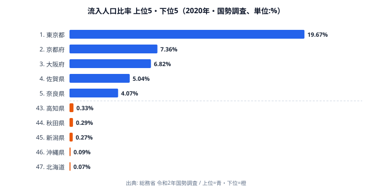

「毎朝、自分の県には他県から何人が流れ込んでいるのか」──普段あまり意識しない問いですが、その答えは都道府県によって桁が変わります。常住人口に対して「他県から通勤・通学で流入してくる人」の比率が最も高いのは東京都で **19.67%**。常住人口のおよそ 2 割に相当する数の人が、毎日他県から東京に流れ込んでいる計算になります。

一方で最下位の北海道はわずか **0.07%**。その差は **281倍** にもなります。注目したいのは、この差が「経済力の差」では説明しきれないことです。北海道も沖縄も県内に大都市を抱えていますが、それでも数字は底に沈みます。流入人口比率が本当に映しているのは、その県が「都市圏として隣県と一体化しているか」「海で隔てられた閉じた経済圏か」という地理構造そのものなのです。

この記事では、2020 年国勢調査をもとに上位 5 県・下位 5 県を並べ、なぜ東京が突出し、なぜ北海道が底に沈むのか、そして佐賀県が上位に食い込む意外性をどう読むのかを掘り下げていきます。

> [!NOTE]
> 流入人口比率は「常住人口に対する、他都道府県からの流入人口（通勤・通学者）の割合」です。県内移動（同一県内の市町村間通勤）は含まず、あくまで県境を越えた流入のみを数えます。そのため県の面積や人口規模ではなく、「県境がどれだけ通勤圏で結ばれているか」が数字を左右します。

## 上位5県と下位5県 — 都市圏の重力と島嶼の孤立

まずは上位 5 県と下位 5 県を 1 枚の図で見比べてみましょう。上位（青）と下位（橙）でバーの長さが文字どおり桁違いになっている点が、この指標の特徴です。

上位 5 県は、東京都 19.67%、京都府 7.36%、大阪府 6.82%、佐賀県 5.04%、奈良県 4.07% と続きます。1 位の東京は 2 位京都の 2.7 倍近くあり、頭一つどころか胴体ごと抜け出している格好です。これは東京が、埼玉・神奈川・千葉・茨城・群馬といった広大な周辺県から通勤者を一手に引き受ける「首都圏の中心」だからです。流入比率は、その県が周辺からどれだけ人を吸い上げる重心になっているかを測る代理指標として機能していると言えます。

京都・大阪が続くのも同じ理屈で、京阪神という巨大都市圏の核に当たります。これらの都市は昼間に周辺府県から大量の通勤者を受け入れるため、常住人口に対する流入の比率が高く出ます。流入人口比率の上位は、地図の上に都市圏の「核」を打点していく作業に近いのです。

下位 5 県は、高知県 0.33%、秋田県 0.29%、新潟県 0.27%、沖縄県 0.09%、北海道 0.07% と並びます。上位とは比べものにならないほど数字が小さく、特に北海道と沖縄は他を引き離して低い水準です。これらの県では「他県から日常的に通勤してくる」という生活パターンがほとんど成立していません。なぜそうなるのかは、後半で地理の側から読み解きます。

<source-link href="/ranking/inflow-population-ratio">流入人口比率ランキングをもっと見る</source-link>

## なぜ佐賀県が上位に食い込むのか

上位 5 県のなかで、ひときわ目を引くのが 4 位の **佐賀県 5.04%** です。三大都市圏の中心が並ぶ顔ぶれのなかに、一見すると地方県が混ざっているように見えます。しかしこれは偶然でも誤差でもありません。

佐賀県東部の鳥栖・基山周辺は、行政区分こそ佐賀県ですが、生活圏としては福岡都市圏に組み込まれています。JR 鹿児島本線・長崎本線が博多方面と直結しており、毎朝多くの通勤・通学者が県境を越えて福岡へ向かいます。つまり佐賀の高い流入比率は、佐賀県内へ「福岡側から人が来る」のではなく、佐賀が福岡都市圏という大きな生活圏の一部として県境をまたいだ人の往来を抱えていることの裏返しなのです。

同じ構図は 5 位奈良県 4.07%、9 位滋賀県 3.01% にも当てはまります。いずれも京阪神圏のベッドタウンとして県境を越えた通勤が常態化しているため、流入比率が高く出ます。これらの例が示すのは、行政区画と人々の実際の生活圏は必ずしも一致しないということです。流入人口比率は、県境という「行政の線」ではなく、人の動きから浮かび上がる「生活圏の地図」を描き出しているのです。

> [!TIP]
> 流入比率の高い県を見るときは、「その県が都市圏の核か、それとも核に隣接するベッドタウンか」を区別すると読みやすくなります。東京・京都・大阪は核として周辺を吸い上げる側、佐賀・奈良・滋賀は隣の核へ人を送り出しつつ県境往来を抱える側、という非対称な構造が同じ指標のなかに同居しています。

## なぜ北海道・沖縄が底に沈むのか — 島嶼性という壁

下位グループに目を移すと、北海道 0.07% と沖縄 0.09% が他の 3 県をさらに引き離して低い点が際立ちます。この 2 県に共通するのは「海によって本州・他県と物理的に隔てられている」ことです。

日常の通勤圏は、徒歩・自転車・鉄道・自動車で片道おおむね数十分から 1 時間圏内に収まります。陸続きの県であれば、県境付近に住む人が隣県の中心都市まで通うことは珍しくありません。ところが北海道と沖縄は、隣の都府県との間に海があります。海を越えて毎朝通勤するという生活は現実的に成り立たないため、他県からの流入はほぼゼロに近づきます。これは経済的な魅力の有無ではなく、地理がそのまま数字を決めている例です。

陸続きの新潟 0.27%、秋田 0.29%、高知 0.33% も低い水準にとどまります。これらの県は海では隔てられていないものの、隣県の中心都市までの距離が遠く、県境を越える日常通勤が成立しにくい立地です。つまり「陸続きか島嶼か」だけでなく、「隣の核都市がどれだけ近いか」も流入比率を左右します。県境が単なる行政の線ではなく、通勤圏が途切れる「壁」になっているかどうかが、ここに表れているのです。

> [!WARNING]
> 流入比率が低いことは「人が来ない、魅力がない県」を意味するわけではありません。北海道・沖縄はいずれも県内に大都市と多くの観光・経済活動を抱えています。この指標が測っているのはあくまで「県境を越えた日常通勤の量」であり、観光客や転入者の多寡とは別物です。低順位を「衰退」と読み替えると、地理的要因を見落とします。

## まとめ

- 1 位東京都 19.67%、最下位北海道 0.07%、その差 **281 倍** という極端な格差が存在します。
- 上位は東京・京都・大阪という三大都市圏の核に、その周辺県・ベッドタウンが続く構成で、流入比率は都市圏の中心性を映します。
- 4 位佐賀県は福岡都市圏（鳥栖・基山）への通勤を反映した「行政県と生活圏のずれ」の典型例で、奈良・滋賀も同じ構図です。
- 最下位の北海道・沖縄は経済要因ではなく、海による **島嶼性** が日常通勤を物理的に遮断しています。
- 流入人口比率は「県境が通勤圏の壁になっているかどうか」を可視化する、都市圏構造の地理的指標と言えます。

より詳しい順位や全 47 都道府県の数値は、ランキングページで確認できます。あわせて、人口・世帯まわりの統計は [人口カテゴリ](https://stats47.jp/category/population) から、上位・下位の県そのものの姿は [東京都プロフィール](https://stats47.jp/areas/13000) や [北海道プロフィール](https://stats47.jp/areas/01000) からたどれます。

## データ出典

- 総務省「令和2年国勢調査」（2020年）
- e-Stat（政府統計の総合窓口）：常住人口および従業地・通学地集計
- 集計：常住人口に対する他都道府県からの流入人口比率（％）
