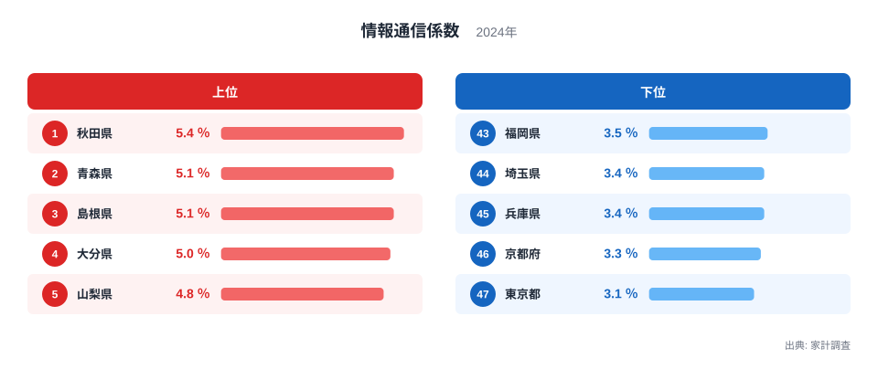
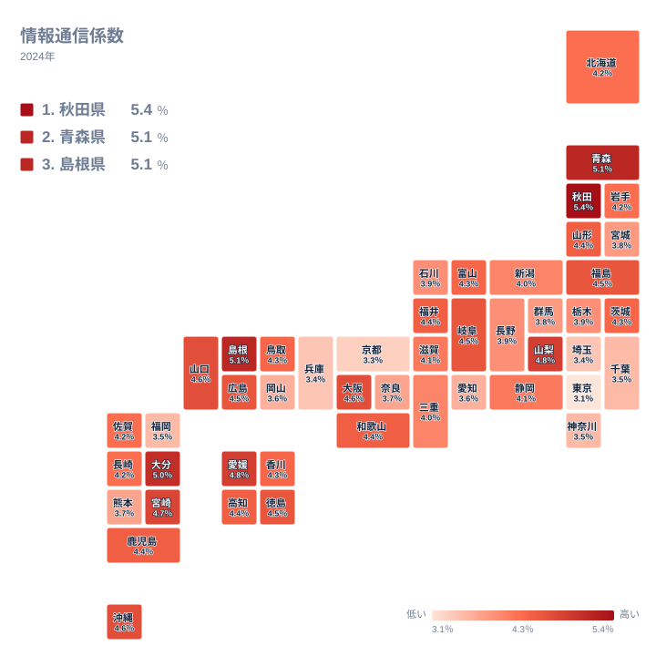
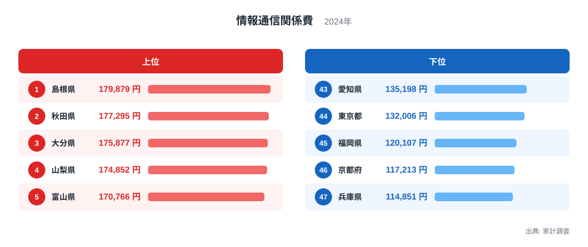
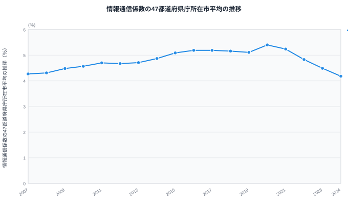

「エンゲル係数だけでは、いまの日本の生活水準は測れない」という指摘を踏まえ、代わりの物差しとして注目されているのが「情報通信係数」です。消費支出に占める通信料・放送受信料の割合を示すこの指標を、総務省「家計調査」の2024年データで47都道府県に当てはめると、1位は[秋田県](/areas/05000)で5.4%、最下位は[東京都](/areas/13000)で3.1%となり、その差は1.7倍に達します。

ただし、この記事の核心は「秋田は通信費が高い」という単純な話ではありません。情報通信関係費の実額を見ると、上位の秋田・島根・大分は実額でもそれぞれ2位・1位・3位に入っており、通信費そのものが高いことが係数を押し上げています。一方で東京都は実額でも47都道府県中44位と低い部類に入り、そこに消費支出全体の大きさも重なって最下位になります。つまり分子（通信費の実額）と分母（消費支出全体）の両方が効いており、47都道府県のデータで確かめると、実は分子の効き方のほうが大きいことがわかります。ランキング・地図・時系列という3つの角度から、この構造を読み解いていきます。

## 情報通信係数が高い県・低い県

> [!NOTE]
> 情報通信係数は、固定電話通信料・移動電話通信料・NHK放送受信料・ケーブルテレビ受信料・他の受信料という5品目を合算した「情報通信関係費」を消費支出で割った指標です。インターネット接続料は含みません。家計調査は都道府県庁所在市の二人以上世帯を対象にしているため、ここで示す値は各県の全域ではなく県庁所在市の平均だと理解してください。

2024年のランキングで最も情報通信係数が高いのは秋田県で5.4%です。2位は青森県、3位は島根県で、どちらも5.1%となっています。4位の大分県は5.0%、5位の山梨県と6位の愛媛県はともに4.8%と続きます。上位の秋田・島根・大分は、後述する情報通信関係費の実額ランキングでもそれぞれ2位・1位・3位に入っており、通信費そのものが高いことが係数を押し上げる主因になっています。上位県の多くは消費支出の総額も47都道府県平均（363万円）より小さい傾向がありますが、5位の山梨県は総額約367万円と平均を上回っており、「消費支出が小さいから係数が高い」だけでは説明しきれません。一方、下位は東京都が最下位で3.1%、京都府が3.3%、兵庫県が3.4%と続きます。政令指定都市や大都市圏の中心都市が並ぶ構図は、家計調査の他の費目でもよく見られるものです。ただし、大阪府は4.6%で上位10県に入っており、これは通信費の実額も20位（15万5,344円）とやや高めであるためで、単純な「大都市はすべて低い」では説明しきれない例外です。

地図で見ると、情報通信係数が高い地域は東北から山陰・四国・九州にかけて散らばっており、特定の地方だけに固まっているわけではありません。上位に並ぶ県の多くは政令指定都市を持たない地方県で、消費支出全体が47都道府県平均より小さい傾向もありますが、47都道府県のデータで確かめるとそれ以上に効いているのは通信費の実額そのものです。情報通信係数と情報通信関係費の実額の相関係数は+0.78、情報通信係数と消費支出総額の相関係数は-0.59で、地図の色の濃淡は「消費支出全体が小さい地域」よりも「通信費そのものが高い地域」を映している度合いのほうが強いといえます。

情報通信関係費の内訳は、固定電話通信料・移動電話通信料・NHK放送受信料・ケーブルテレビ受信料・他の受信料の5品目です。[仮説] 地方の県で実額が高くなりやすい一因として、固定電話を維持する世帯の割合が都市部より高いことや、地上波の受信環境からケーブルテレビ受信料が発生しやすい地域があることが考えられます。NHK放送受信料は世帯単位で定額のため、世帯人数が多い世帯ほど1人当たりの負担は下がりますが、家計調査は世帯単位で集計するため、この効果はランキングにそのまま表れます。ただし今回のデータには品目別の内訳がなく、検証するには家計調査の費目別詳細を別途確認する必要があります。

<source-link href="/ranking/information-communication-coefficient">情報通信係数ランキングをもっと見る</source-link>

## 通信費の実額で見ると――東京はむしろ多い

では、情報通信係数が最下位の東京都は、通信費そのものが安く済んでいるのでしょうか。情報通信関係費の実額ランキングを見ると、答えは「いいえ」です。

最も多く支払っているのは島根県で17万9,879円です。2位は秋田県で17万7,295円、3位は大分県で17万5,877円と続きます。一方、最も少ないのは兵庫県で11万4,851円、次いで京都府が11万7,213円、福岡県が12万107円です。東京都は13万2,006円で47都道府県中44位、下から4番目にとどまり、実額でも兵庫県・京都府・福岡県よりは多いものの、全国的には低い部類に入ります。それでも情報通信係数が最下位になるのは、この実額の低さに加えて消費支出総額の大きさが重なるためです。総務省の別統計によると、東京都の二人以上世帯の消費支出総額は421万1,608円で47都道府県中2位（1位は埼玉県で429万4,300円）、47都道府県平均の363万円を上回ります。分子の通信費が下から4番目まで下がっている上に、分母の消費支出全体が上位2位まで押し上がっているため、割合はその両方の効果を受けて最下位に沈む仕組みです。

> [!WARNING]
> 「情報通信係数が低い都市は通信費を切り詰めている」と読むと誤読します。東京都は通信費の実額こそ47都道府県中44位と低い部類ですが、それでも兵庫県・京都府・福岡県より多く払っており、消費支出全体の大きさも重なって係数だけが低く出るケースです。割合(％)と実額(円)の両方を確認すると、通信費そのものの高低と生活コスト全体の高低のどちらが効いているかを切り分けられます。

この構造は、[エンゲル係数の都道府県ランキング](/blog/engel-coefficient-prefecture-ranking)と並べるとさらに際立ちます。エンゲル係数で全国トップの兵庫県は、情報通信係数では下から3番目に位置し、食費の負担は重い一方で通信費の負担は軽いという、指標によって評価が正反対になる典型例です。なお、自動車の維持費まで含めた「[交通・通信費](/blog/communication-cost-burden)」という家計調査の区分は、この情報通信係数とはまったく別物です。あちらは地方ほど自動車費用の比重が大きくなる構造を持ち、通信料だけに絞った情報通信係数とは逆の地域パターンを示します。

> [!TIP]
> 情報通信係数は、エンゲル係数とセットで見ると読み方が深まります。どちらも「消費支出に占める必需品的な費目の割合」ですが、対象品目がまったく違うため、片方だけで生活水準を判定すると兵庫県のような矛盾に突き当たります。複数の係数を横断的に確認する視点が欠かせません。

<source-link href="/ranking/information-communication-expenditure">情報通信関係費ランキングをもっと見る</source-link>

## 発見――かつて上がり続けた係数が、いま下がり始めている

情報通信係数を47都道府県庁所在市の平均の推移で見ると、興味深い変化が起きています。この平均は総務省が公表する全国集計値ではなく、47都道府県の値を単純に算術平均したものです。

2007年の4.27%から緩やかに上昇を続け、2020年には5.40%とピークを迎えました。ここまでは、通信サービスの普及とともに家計の通信費負担が増え続けてきた歴史そのものです。ところが2021年以降は一転して下降に転じ、2022年には4.83%、2023年には4.49%、2024年には4.18%まで落ち込みました。わずか4年で1.22ポイント下がった計算になり、2007年から2020年までの13年間で積み上げた上昇分（+1.13ポイント）をすべて失った上、2007年の水準（4.27%）をわずかに下回るところまで戻っています。

> [!WARNING]
> 情報通信係数は「時系列で比較するのに向かない指標」だという点に注意してください。47都道府県平均は2007年から2020年にかけて基調としては上昇しましたが、2012年・2018年・2019年には前年を下回る年もあり、一本調子の上昇ではありません。2021年以降は下降に転じ、2024年には2007年の水準を下回っています。異なる年のデータを単純に比べると、生活水準が急に改善・悪化したように誤読しかねません。年ごとの都市間比較には使えても、経年変化の解釈には慎重さが必要です。

[仮説] 2021年以降の下降は、政府が主導した携帯電話料金の引き下げ要請と、格安SIM・オンライン専用プランの普及が影響している可能性があります。大手携帯電話会社が低価格プランを相次いで導入したのが2021年前後であり、下降への転換点と時期が重なるためです。ただし今回のデータだけでは料金プラン別の内訳までは分からず、因果関係を断定することはできません。検証するには、携帯電話通信料の物価指数など別の統計と突き合わせる必要があります。

## まとめ

- 情報通信係数の1位は秋田県で5.4%、最下位は東京都で3.1%、その差は1.7倍です。
- 上位の秋田・島根・大分は通信費の実額でもそれぞれ2位・1位・3位に入っており、係数を押し上げる主因は消費支出全体の小ささよりも通信費そのものの高さです（相関係数は実額+0.78、消費支出総額-0.59）。
- 東京都は情報通信関係費の実額でも47都道府県中44位と低い部類で、それに加えて消費支出総額の大きさ（2位）が重なり係数は最下位になっています。
- エンゲル係数で全国トップの兵庫県は情報通信係数では下位に近く、単一指標で生活水準を測る限界を示しています。
- 47都道府県平均は2020年の5.40%をピークに下降へ転じ、2024年には2007年の水準を下回っており、時系列比較には向きません。

## データ出典

- 総務省「家計調査」（二人以上の世帯、都道府県庁所在市別）2024年
- 総務省「家計調査」二人以上の世帯の消費支出総額（都道府県庁所在市別）2024年
- e-Stat経由で取得・加工（[家計調査データ一覧](https://www.e-stat.go.jp/stat-search/files?page=1&layout=datalist&toukei=00200561)）
