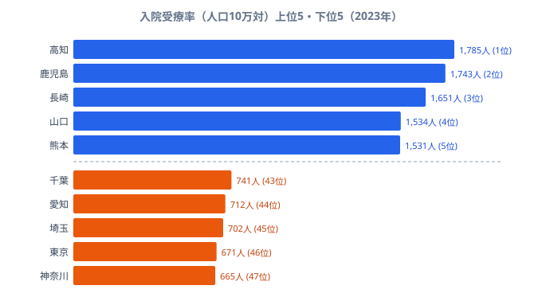

「同じ日本でも、住んでいる県によって入院している人の割合がこれほど違うのか」──そう感じさせるのが入院受療率のデータです。**入院受療率**とは、ある時点で入院している人が人口10万人あたり何人いるかを示す指標で、厚生労働省の患者調査で3年ごとに集計されています。

2023年の都道府県別データを見ると、最も高い[高知県](/areas/39000)は人口10万人あたり**1,785人**、最も低い神奈川県は**665人**です。その差は約2.7倍にのぼります。そして高い県を並べると、高知・鹿児島・長崎・山口・熊本と、見事に西日本・九州に集中しています。一方で低い県は神奈川・東京・埼玉・愛知・千葉と、大都市圏が並びます。

なぜ「西高東低」がこれほど鮮明に出るのでしょうか。この記事では、高齢化率・病床数・医療慣行という3つの角度からその構造を読み解きます。先に結論を言えば、入院受療率は病気のなりやすさそのものではなく、その地域の人口の高齢化と医療提供体制を映す鏡になっています。

> [!NOTE]
> 入院受療率は「調査日に入院していた患者数 ÷ 推計人口 × 10万」で算出される。病気のなりやすさだけでなく、その地域に病床がどれだけあるか、入院という選択がどれだけ取られるかといった医療提供体制の差も色濃く反映する点に注意。

## 全体像 — 全国平均は10万人あたり約1,087人

2023年の入院受療率の全国平均は、人口10万人あたり**約1,087人**です。つまり全国では常時およそ100人に1人が入院している計算になります。

ただしこの平均値は県ごとの大きなばらつきを覆い隠しています。最上位の高知県（1,785人）と最下位の神奈川県（665人）の間には1,120人もの開きがあり、上位は平均を大きく上回り、下位の大都市圏は平均を大きく下回ります。中央付近には和歌山県（1,105人）や福井県（1,082人）が位置し、全国平均はおおむね中位の県の水準と一致します。県によって入院という現象の起こり方がこれほど異なる、という事実をまず押さえておきたいところです。

<source-link href="/ranking/inpatient-rate-per-100k">入院受療率(人口10万対)ランキングをもっと見る</source-link>

> [!TIP]
> 入院受療率は「外来受療率」とセットで見ると医療需要の全体像がつかめる。入院が多い県は必ずしも外来が多いわけではなく、入院に偏る地域・外来で完結する地域という医療パターンの違いも読み取れる。

## 上位と下位 — 西日本・九州 vs 大都市圏

入院受療率の上位5県と下位5県を並べると、地域の偏りが一目でわかります。

上位は高知（1,785人）・鹿児島（1,743人）・長崎（1,651人）・山口（1,534人）・熊本（1,531人）と、四国・中国・九州が独占しています。さらに6位以下も大分・佐賀・徳島と続き、北海道（9位、1,326人）を除けば上位10県のほぼすべてが西日本です。これらの県は若年層の流出が長く続き、人口に占める高齢者の比率が高い地域でもあります。入院患者の多くが高齢層であることを踏まえると、高齢化の進んだ県が上位を占めるのは半ば必然の構図だと言えます。

対して下位は神奈川（47位、665人）・東京（46位、671人）・埼玉（45位、702人）・愛知（44位、712人）・千葉（43位、741人）と、首都圏と中京圏の大都市が並びます。これらは進学・就職で若年人口が流入し続けてきた地域で、相対的に高齢化率が低く、外来や在宅で完結させる医療体制も整っています。人口規模は大きくても、入院という形で表面化する医療需要は低く抑えられているのです。上位の高知と下位の神奈川を比べると、同じ国の中で約2.7倍もの開きがあることになります。

> [!WARNING]
> この「西高東低」は、西日本の人が病気にかかりやすいことを直接意味するわけではない。入院受療率には地域の年齢構成・病床数・退院のさせ方といった供給側の要因が混じる。順位の高さを「不健康さ」と読み替えないこと。

<source-link href="/ranking/inpatient-rate-per-100k">入院受療率の都道府県別ランキングを見る</source-link>

## なぜ西日本で高いのか — 高齢化・病床数・医療慣行

西日本で入院受療率が高くなる背景には、少なくとも3つの構造的な要因が重なっていると考えられます。

**1つ目は高齢化率の高さです。** 入院する人の多くは高齢者であり、人口に占める高齢者の割合が高い県ほど入院受療率は底上げされます。高知・鹿児島・長崎といった上位県は、いずれも高齢化が進んだ地域として知られています。年齢構成を揃えない「粗い」受療率では、高齢者の多い県が自動的に高く出やすくなります。

**2つ目は人口あたり病床数の多さです。** 西日本は歴史的に病院・病床が多く整備されてきた地域で、特に高知県や鹿児島県は人口あたり病床数が全国でも上位にあります。

> [!NOTE]
> 病床が多い地域ほど入院という選択が取られやすく、入院受療率が押し上げられる関係は[仮説]として有力。検証コマンドにあたる作業は、入院受療率と人口10万人あたり病床数の相関を都道府県単位で取ること。本記事のデータだけでは因果は確定できないため、病床数指標との突き合わせが次のステップになる。

**3つ目は医療慣行の地域差です。** 同じ病態でも、入院で対応するか外来・在宅で対応するかは地域の医療文化によって差があります。長期療養型の病床が多い地域では、社会的入院も含めて入院が長引きやすくなります。こうした慣行の差が、大都市圏との開きの一因になっていると見られます。

逆に大都市圏で低いのは、若年人口の流入で高齢化率が相対的に低いこと、そして外来や在宅で完結させる医療体制が整っていることが大きいです。神奈川・東京・埼玉といった首都圏は、人口は多くても入院受療率では下位に沈んでいます。医療アクセスの地域差については[医療アクセスの地域格差を扱った記事](/blog/medical-access-regional-gap)も参照してください。

## 高齢化との関係 — 受療率は「人口構造の鏡」

入院受療率を読み解くうえで最も重要なのが、高齢化との関係です。入院患者は高齢層に偏るため、入院受療率は実質的に「その県の人口がどれだけ高齢化しているか」を映す鏡になっている側面があります。

上位を占める高知・鹿児島・長崎・山口・大分などは、いずれも若年層の流出と高齢化が長年進んできた県です。一方で下位の神奈川・東京・埼玉・愛知・千葉は、進学・就職で若年層が流入し続けてきた地域です。**つまり入院受療率の「西高東低」は、高齢化率の地理的パターンとほぼ重なっています。**

> [!TIP]
> 入院受療率を地域間で公平に比べたいときは、年齢構成の違いを取り除いた「年齢調整受療率」を見るのがよい。粗い受療率では高齢県が高く出るのは半ば必然で、本当に「医療のかかり方」が違うのかは年齢調整後に初めて見えてくる。

社会保障の観点では、入院受療率の高い県ほど高齢者医療費の負担が重くなりやすくなります。今後、全国的に高齢化がさらに進めば、現在は下位にある大都市圏でも入院受療率がじわじわ上昇していく可能性が高いでしょう。地域差の構造を今のうちに把握しておくことは、医療提供体制を設計するうえで欠かせません。社会保障全体の地域差は[社会保障カテゴリ](/category/socialsecurity)からまとめて確認できます。

## まとめ

- 入院受療率(人口10万対)の1位は**高知県の1,785人**、最下位は**神奈川県の665人**で、その差は約2.7倍です。
- 上位は高知・鹿児島・長崎・山口・熊本と西日本・九州が独占し、下位は神奈川・東京・埼玉・愛知・千葉と大都市圏が並ぶ「西高東低」が鮮明です。
- 全国平均は人口10万人あたり**約1,087人**で、中位の県の水準とおおむね一致します。
- 西日本で高い背景には、高齢化率の高さ・人口あたり病床数の多さ・長期療養を含む医療慣行の差が重なっていると考えられます。
- 入院受療率は実質的に「人口構造の鏡」であり、地域間比較には年齢調整後の指標を併用するのが望ましいです。

### データ出典

- 厚生労働省「患者調査」2023年（e-Stat 経由で整備、出典: 政府統計の総合窓口 e-Stat、CC BY 4.0）
- 入院受療率は人口10万人あたりの推計入院患者数。値は調査日時点の推計に基づく。
