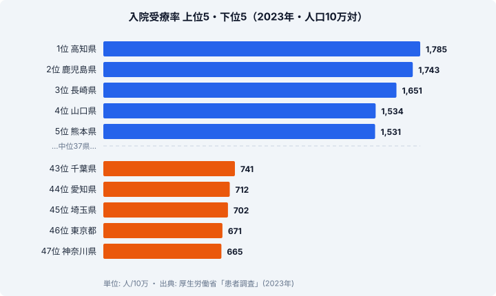

「入院受療率」とは、**人口 10 万人あたり、ある時点で医療機関に入院している患者数** を表す指標です。厚生労働省の患者調査（3 年に一度）で集計され、地域の医療需要・病床供給・高齢化の影響を総合的に反映します。同じ国民皆保険制度のもとにありながら、この「入院している人の割合」は都道府県でくっきりと分かれます。

本記事では、厚労省「患者調査」（2023 年）をもとに、47 都道府県の人口 10 万対入院受療率を整理しました。最も高いのは **高知県（1,785 人）**、最も低いのは **神奈川県（665 人）** で、その差は **2.68 倍** にのぼります。先に結論を述べると、上位は四国・九州に集中し、下位は首都圏・中京圏の大都市に集中する「**西高東低**」の構造がはっきりと表れています。なぜ西日本でこれほど入院している人が多いのか、その背景を病床数と高齢化の視点から読み解いていきます。

## 入院受療率の上位5県と下位5県（2023年）

> [!NOTE]
> 入院受療率は「入院している患者数 ÷ 人口 × 10 万」で算出される断面の指標です。1 年間に何回入院したかではなく、調査日時点で入院している人の密度を表します。そのため、入院の頻度が同じでも入院期間が長い地域ほど数値は大きくなります。「病気がちな県」とそのまま読み替えられない点に注意が必要です。

入院受療率が最も高いのは **高知県（1,785 人/10 万）** です。2 位の鹿児島（1,743 人）、3 位の長崎（1,651 人）、4 位の山口（1,534 人）、5 位の熊本（1,531 人）と続き、上位は四国・九州・中国地方の西日本勢で占められています。一方で下位 5 県は神奈川（665 人）・東京（671 人）・埼玉（702 人）・愛知（712 人）・千葉（741 人）と、首都圏 4 都県に中京圏の愛知が加わった顔ぶれです。

上位を見ると、1 位の高知県は人口約 67 万人の小県ですが、2 位の鹿児島を 42 人上回って全国最多となっています。九州 7 県のうち、福岡を除く 6 県（鹿児島・長崎・熊本・大分・佐賀・宮崎）が上位 10 県に入り、福岡も 11 位につけています。四国でも徳島が 8 位に食い込んでおり、四国・九州が上位を厚く固めている構図です。これらの地域に共通するのは、人口あたりの病床数が全国でも多い県が並ぶことで、入院の「受け皿」が大きいことが数値の高さに結びついている可能性があります。

下位 5 県は、いずれも人口が多く若年層の比率も比較的高い大都市圏です。最下位の神奈川（665 人）は 1 位の高知の **37%** にすぎません。これらの地域では病床の供給がタイトで、急性期医療を中心とした短期入院型の運用が進んでいます。「入院する人が少ない」というより、「入院しても期間が短く、外来で完結させる比率が高い」という運用上の差が、断面の入院受療率を押し下げている可能性が高いと考えられます。

<source-link href="/ranking/inpatient-rate-per-100k">入院受療率ランキングをもっと見る</source-link>

## 「西高東低」の地理パターンと逆順位の注意

入院受療率の上位・下位を地域でまとめると、おおむね 3 つのまとまりが見えてきます。

- **四国・九州クラスター（上位）**: 高知（1 位）、鹿児島（2 位）、長崎（3 位）、熊本（5 位）、大分（6 位）、佐賀（7 位）、徳島（8 位）、宮崎（10 位）
- **中国地方・北海道クラスター（上位）**: 山口（4 位）、北海道（9 位）
- **首都圏・中京圏クラスター（下位）**: 千葉（43 位）、愛知（44 位）、埼玉（45 位）、東京（46 位）、神奈川（47 位）

このように、西日本と地方圏で高く、首都圏・中京圏で低いという「西高東低」の傾向がはっきりと表れています。ただし上位 10 県のなかには北海道（9 位）も含まれており、「東日本がすべて低い」と単純に整理できるわけではありません。広い面積に医療資源が点在し高齢化も進む北海道は、地理的には東日本ですが入院受療率は高い側に位置します。あくまで「西日本＋高齢化の進んだ地方圏で高い」という読み方が実態に近いといえます。

> [!WARNING]
> 入院受療率が高いことは、必ずしも「住民の健康状態が悪い」ことを意味しません。むしろ病床が多く入院しやすい環境があるほど数値は高くなる傾向があります。逆に最下位の神奈川や東京は、外来・在宅で対応する比率が高く入院に頼らない運用が進んでいる側面もあります。順位の高低をそのまま医療の優劣や健康度に読み替えないよう注意してください。

背景として、いくつかの仮説が考えられます。第一に、**病床数の地域差** です。厚労省「医療施設調査」で人口あたり病床数が多い県（高知・鹿児島・徳島など）は伝統的に入院受療率でも上位に並びます。供給が需要を生む構造が働いている可能性があります。第二に、**高齢化率の差** です。上位の四国・九州・北海道には高齢化率が全国平均を上回る県が多く、入院需要そのものが大きい可能性があります。第三に、**医療運用文化の差** です。西日本は伝統的に病院完結型、首都圏は外来・在宅型という運用の違いが反映されているとも考えられます。

> [!TIP]
> 入院受療率は「外来受療率」とあわせて見ると地域の医療の使われ方が立体的に見えてきます。入院が多い県でも外来が少ないとは限らず、両方を重ねることで「病院に頼る地域」と「在宅・外来で支える地域」のコントラストが浮かび上がります。健康寿命のデータと並べると、入院の多寡と住民の健康度が必ずしも一致しないことも確認できます。

これらはいずれも本データ単体では断定できない仮説です。ランキングの数字そのものは、「医療需要が高い県」なのか「病床供給が多い県」なのかを区別しません。入院受療率を読むときは、需要側（高齢化・疾病構造）と供給側（病床・医療機関の密度）の両面から解釈する姿勢が欠かせません。

<source-link href="/ranking/outpatient-rate-per-100k">外来受療率ランキングをもっと見る</source-link>

## まとめ

- 最も高いのは **高知県（1,785 人/10 万）**、次いで鹿児島（1,743 人）、長崎（1,651 人）です
- 最も低いのは **神奈川県（665 人）** で、高知との差は **2.68 倍** にのぼります
- 上位 10 県は **四国・九州の 8 県に山口・北海道** が加わり、西日本に大きく偏っています
- 下位 5 県は **神奈川・東京・埼玉・愛知・千葉** と、首都圏・中京圏の大都市に集中しています
- 背景には病床数・高齢化率・医療運用文化の差が複合的に影響している可能性があります

患者調査は **3 年に一度** の集計のため、2023 年値が現時点で最新の確定値です。次回の調査結果が出るまでは、この西高東低の構造が当面の基準となります。健康寿命との関係を知りたい場合は、[男性 健康寿命ランキング](https://stats47.jp/ranking/healthy-life-expectancy-male)や[女性 健康寿命ランキング](https://stats47.jp/ranking/healthy-life-expectancy-female)も合わせてご覧ください。医療・社会保障に関するほかの指標は[社会保障カテゴリ](https://stats47.jp/category/socialsecurity)からたどれます。

## データ出典

- 厚生労働省「患者調査」（2023 年・人口 10 万対入院受療率）
- e-Stat 経由で都道府県別に整備
