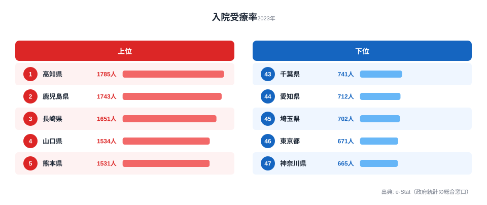

「同じ日本に住んでいるのに、入院している人の割合が県によって2.7倍も違う」──そう聞くと驚くかもしれません。厚生労働省の患者調査(2023年)によれば、ある時点で入院している患者数は、人口10万人あたりで見ると高知県の1,785人から神奈川県の665人まで大きく開いています。しかもこの差は、上位が四国・九州、下位が首都圏という、地図に重ねると一目でわかる「西高東低」のかたちで並んでいるのです。

「入院受療率」とは、**人口10万人あたり、ある時点で医療機関に入院している患者数**を表す指標です。地域の医療需要・病床供給・高齢化の影響を総合的に映し出します。本記事では、この西高東低がなぜ生まれるのか、そして「西日本の人は病気がちなのか」という素朴な疑問が当たっているのかを、データに即して読み解いていきます。先に結論を言えば、この差は「病気の多さ」だけでは説明できず、病床の供給量や医療の運用文化が深く絡んでいる可能性が高いのです。

> [!NOTE]
> 入院受療率は「調査日に入院していた人の数」を人口で割った値であり、「年間に何人が入院したか」とは別物です。短期間で退院する急性期中心の地域では、年間の入院経験者が多くても、ある一日を切り取った受療率は低く出ます。本記事の数字を「入院しやすさ」とそのまま読み替えないよう注意してください。

## 上位は四国・九州、下位は首都圏に集中する

入院受療率の1位は**高知県(1,785人/10万)**。続いて鹿児島(1,743人)、長崎(1,651人)、山口(1,534人)、熊本(1,531人)と、**四国・九州勢が上位をほぼ独占**しています。一方、最下位は**神奈川県(665人)**で、東京(671人)、埼玉(702人)、愛知(712人)、千葉(741人)と、**首都圏4都県と中京圏の愛知**がきれいに下位5を占めています。

上位10県のうち**8県が九州・四国**で、残る2県も山口(中国地方西端)と北海道です。**東日本の県はTOP10にひとつも入っていません**。1位の高知県は人口の少ない小県ですが、2位の鹿児島県を2.4%上回って全国最多となりました。九州は福岡を除く6県すべてが上位グループに名を連ね、地理的な偏りがきわめて強い指標であることがわかります。

<source-link href="/ranking/inpatient-rate-per-100k">入院受療率ランキングの全47都道府県を見る</source-link>

最下位の神奈川県(665人)は、1位高知県のわずか37%にとどまります。下位グループは人口が多く若年層比率も高い大都市圏で占められており、ここに西高東低の核心が隠れています。「大都市圏の人が入院しない」のではなく、「入院期間が短く、外来で完結する割合が高い」という運用上の差が大きく影響している可能性があるのです。

> [!TIP]
> 下位グループを「医療が手薄」と読むのは早計です。首都圏は高度急性期病院が密集し、短期入院・外来完結型の医療が発達しています。受療率が低いことは、必ずしも医療の質や量が劣ることを意味しません。むしろ病床回転の速さの裏返しとも読めます。

## 「西日本は病気がち」ではない──供給が需要を生む構造

ここで多くの人が抱く疑問は「西日本の人は本当に病気がちなのか」というものでしょう。しかし、データを丁寧に追うと、その単純な読み方は成り立ちにくいことがわかります。

入院受療率の地域差を説明する要因として、まず注目すべきは**病床数の地域差**です。厚労省の医療施設調査では、人口あたり病床数が多い県(高知・鹿児島・徳島など)が、入院受療率でも伝統的に上位に並びます。病床が多いと、その分だけ入院という選択が取られやすくなる──いわゆる「供給が需要を生む」構造が働いている可能性があります。高知県は人口あたり病床数でも全国トップクラスであり、入院受療率1位という結果と整合します。

次に**高齢化率の差**です。上位を占める四国・九州・北海道は、高齢化率が全国平均を上回る県が多く、入院需要そのものが大きい地域です。一方、下位の首都圏は若年層の流入が続き、人口構成が相対的に若いため、入院を必要とする年齢層の比率が低くなります。

そして**医療運用文化の地域差**も無視できません。西日本は伝統的に病院完結型の医療が根づいているのに対し、首都圏は外来と在宅を組み合わせる運用が進んでいるとされます。同じ症状でも、入院で対応するか外来で済ませるかという判断の傾向が、地域によって異なる可能性があるのです。

- **病床供給** — 人口あたり病床数の多い高知・鹿児島・徳島が受療率でも上位。供給が入院という選択を後押ししている可能性
- **高齢化率** — 上位の四国・九州・北海道は高齢化が進み、入院を要する年齢層が厚い
- **医療文化** — 西日本は病院完結型、首都圏は外来・在宅型という運用傾向の差

> [!WARNING]
> ランキングの数字そのものは、「医療需要が高い県」なのか「病床供給が多い県」なのかを区別しません。上に挙げた3つはいずれも本データ単体では断定できない[仮説]です。例えば「病床が多いから受療率が高い」のか「需要が高いから病床が整備された」のかは因果が逆向きにもなり得ます。検証には医療施設調査(人口あたり病床数)や高齢化率との突き合わせが必要で、相関と因果を取り違えないことが重要です。

## 健康寿命との関係から見えること

入院受療率が高い県は「不健康な県」なのでしょうか。これも単純には言えません。健康寿命のランキングと照らし合わせると、必ずしも入院受療率の高い県が健康寿命が短いわけではなく、両者は別の側面を測っていることがわかります。入院受療率は「ある時点での入院患者の多さ」であり、健康寿命は「日常生活に制限なく過ごせる期間」です。病床が充実し、必要な人がきちんと入院できる地域は、結果として健康寿命の維持につながっている可能性さえあります。

つまり、入院受療率を地域の医療の良し悪しの単一指標として使うことはできません。病床数・高齢化・医療文化・健康水準といった複数の指標を重ねて初めて、その地域の医療の姿が立体的に見えてきます。健康寿命や外来受療率と合わせて読むことで、入院受療率という数字の意味がより正確に理解できるはずです。

## まとめ

- 1位は**高知県(1,785人/10万)**、2位**鹿児島(1,743人)**、3位**長崎(1,651人)**
- 最下位の**神奈川(665人)**は1位高知の37%にとどまり、上下で約2.7倍の開き
- TOP10は**四国・九州8県+山口・北海道**と西日本に偏在し、東日本はゼロ
- 下位5は**神奈川・東京・埼玉・愛知・千葉**と大都市圏に集中
- 背景には病床数・高齢化率・医療運用文化の差が複合的に絡んでいる可能性があり、「西日本は病気がち」という単純な読み方は成り立ちにくい

入院受療率の県差を理解するには、[外来受療率ランキング](https://stats47.jp/ranking/outpatient-rate-per-100k)で外来との対比を見たり、[男性 健康寿命ランキング](https://stats47.jp/ranking/healthy-life-expectancy-male)や[女性 健康寿命ランキング](https://stats47.jp/ranking/healthy-life-expectancy-female)と重ねて読むのがおすすめです。同じ[社会保障カテゴリ](https://stats47.jp/category/socialsecurity)の指標と合わせれば、地域医療の全体像がより鮮明に見えてきます。

## データ出典

- 厚生労働省「患者調査」(2023年・人口10万対入院受療率)
- e-Stat 経由で都道府県別に整備
