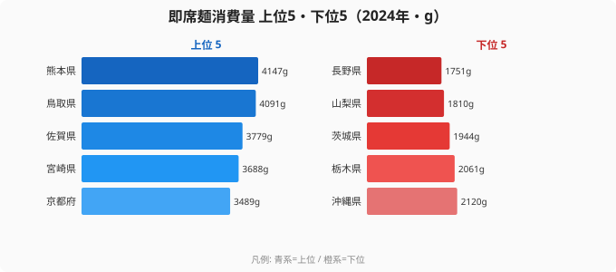

「即席麺をいちばん食べる県は、たぶん九州でしょう」──そう思って2024年の家計調査を開くと、半分は当たっていて、半分は外れます。

即席麺消費量とは、都道府県庁所在市の二人以上世帯が1年間に買う袋麺・カップ麺の合計重量（家計調査ベース、単位はグラム）です。2024年の最多は[熊本県](/areas/43000)の4,147g、最少は[長野県](/areas/20000)の1,751gで、その差は約2.37倍になります。たしかにトップには九州勢が並びます。

ところが上位を眺めると、5位に「京都府」が顔を出します。一方、人口が圧倒的に多いはずの東京都は37位、神奈川県は40位です。即席麺は人が多い都市でこそ売れそうなのに、大都市の中で京都だけが突出しているのです。この記事では、47都道府県の即席麺消費量を並べ、「九州が強い理由」と「都市と即席麺の意外なズレ」を読み解きます。

> [!NOTE]
> 本データは総務省「家計調査」の品目「即席めん」を集計したものです。各都道府県の県庁所在市における二人以上世帯の年間購入量（g）で、世帯員1人あたりではなく1世帯あたりの値である点に注意してください。袋タイプとカップタイプの両方を含む合計値で、商品単体ではなく購入重量で比較しています。

## 即席麺消費量ランキング TOP10 と最下位

まず2024年の上位5県と下位5県を見てみましょう。

トップ10のうち、熊本(1位)・佐賀(3位)・宮崎(4位)・福岡(6位)・大分(7位)と、実に5県を九州が占めています。さらに高知(8位)・島根(9位)を含む西日本が強く、東日本からは北海道(10位)が10位に滑り込むのみです。九州・中国・四国の「西高東低」が即席麺消費の基本構造になっています。チャート左側の上位5を見ると、熊本・鳥取・佐賀・宮崎・京都と、京都を除けば西日本の県がずらりと上位を固めているのがわかります。

そしてランキング全体を貫くのが約2.37倍の格差です。1位熊本(4,147g)と最下位長野(1,751g)では、同じ「日本の食卓」でも年間で2,400g近い差がつきます。なぜ九州本土がこれほど即席麺を買うのか。明確な単一要因を断定するデータはありませんが、もともと豚骨ラーメンに代表される「麺をスープで食べる」外食文化が根づいた地域であり、家庭でも即席麺という形で麺食が日常に組み込まれている可能性が読み取れます。九州の高消費が単発の年ではなく、後述するように長年にわたって続いている点も、食習慣として定着していることを示唆しています。

<source-link href="/ranking/instant-noodles-consumption-quantity">即席麺消費量ランキングの全47都道府県を見る</source-link>

## なぜ長野・山梨が最下位なのか

下位5県を抜き出すと、ある共通点が見えてきます。上のチャート右側（下位5）が示す通り、最下位は長野県(1,751g)、続いて山梨県(1,810g)、茨城県(1,944g)、栃木県(2,061g)、沖縄県(2,120g)と並びます。下位には長野・山梨・栃木・茨城と、内陸の関東甲信が固まっています。即席麺消費が少ないグループには、生鮮野菜の自家生産・地場流通が盛んな農業県が多いという特徴があります。

最下位の長野・山梨は、いずれも内陸で果樹・高原野菜の産地として知られる県です。家庭菜園や直売所が日常に組み込まれ、「手早い加工食品より、家庭で素材から調理する」食卓が相対的に多いと考えられます。即席麺は保存性と手軽さが武器ですが、自家野菜や地場の生鮮品が手に入りやすい環境では、その手軽さの優先度が下がるのでしょう。茨城・栃木も同じく農業の盛んな北関東で、内陸×農業県という共通項が下位グループにくっきりと現れています。これはあくまで消費量データから読める傾向であって、因果を証明したものではありません。

> [!TIP]
> 長野県は健康寿命や野菜摂取量でも上位の常連県です。即席麺の少なさは「手早い加工食品より、家庭での調理に時間と素材をかける」という食習慣の一面を映している可能性があります（あくまで消費量データから読める傾向で、因果の証明ではありません）。

注目したいのは、最下位グループに「沖縄県(43位)」が入っている点です。九州に近い地理的イメージとは裏腹に、沖縄の即席麺消費は下位にとどまります。九州の高消費は単なる「南国だから」ではなく、九州本土に固有のパターンであることがわかります。沖縄には独自の麺文化（沖縄そば）が根強く、即席麺が食卓で占める位置が本土とは異なる可能性もあります。

## 発見1: 都市のはずの東京は37位、でも京都は5位

即席麺は保存がきき、調理も手軽で、忙しい都市生活と相性がよさそうに思えます。ところがデータは逆を示しています。

- 東京都: 37位(2,382g)
- 神奈川県: 40位(2,209g)
- 静岡県: 38位(2,358g)

人口が密集する首都圏は、軒並みランキング下位です。外食・中食(惣菜・弁当)の選択肢が豊富で、「家で即席麺を買って食べる」という行動がそもそも少ないことが背景にあると考えられます。コンビニや飲食店が高密度で点在する都市では、麺を食べたいときに「買って茹でる」より「外で済ませる」「弁当を買う」選択肢に流れやすく、二人以上世帯の購入量という指標には表れにくいのでしょう。

> [!WARNING]
> 家計調査は「世帯が購入した量」を測るものです。コンビニで買ったカップ麺を職場や外で食べる分は購入元世帯の消費として計上されるため、単身世帯の多い東京のような地域では二人以上世帯の購入量が実態より低く出る可能性があります。本ランキングは二人以上世帯ベースである点に注意が必要です。

その中で異彩を放つのが京都府の5位(3,489g)です。大阪府も11位(3,115g)と関西は健闘しており、関西は「大都市圏なのに即席麺消費が多い」という、首都圏とは逆の特徴を持っています。同じ大都市圏でも東京圏と関西圏でこれだけ傾向が割れるのは、外食・中食の構成や世帯あたりの調理スタイルの違いを映しているのかもしれません。京都には学生が多く、自炊と手軽な即席麺が共存しやすい土壌があることも、上位入りの一因として読み解けます。

## 発見2: 京都は17年で消費量が約1,000g増えた

京都の上位入りは一過性の偶然ではありません。同じ家計調査の過去データと比べると、京都の伸びが際立ちます（2007年→2024年の消費量と増減）。

- 京都府: 2,486g → 3,489g（+1,003g）
- 熊本県: 3,450g → 4,147g（+697g）
- 鳥取県: 3,115g → 4,091g（+976g）
- 長野県: 2,261g → 1,751g（−510g）

2007年の京都府は2,486gと、47都道府県の中ほど（25位）に過ぎませんでした。それが17年で約1,000g増え、2024年は3,489gの高消費県へと変わっています。一方、熊本や鳥取はもともと多かった消費量をさらに伸ばし、長野はむしろ500gほど減らしました。京都の「中位から上位へ」という変化幅の大きさは、上位グループの中でも目を引きます。多くの上位県が「もともと高くて微増」なのに対し、京都だけが「中位からの急上昇」という別の経路で上位に到達している点が特徴的です。

京都の上昇が、世帯構成の変化(単身・共働き世帯の増加)によるものか、それとも特定商品の浸透によるものかは、このデータだけでは断定できません。ただ、17年で約4割増という伸びは、年ごとの誤差では説明しにくい持続的な変化であり、京都の食卓で即席麺の存在感が構造的に高まったことをうかがわせます。

> [!NOTE]
> **[仮説]** 京都の即席麺消費の伸びは、学生・単身世帯の多さや調理時間の短縮志向と関連する可能性があります。**検証方法**: 京都府の世帯人員構成・共働き率の推移と、即席麺消費量の年次推移を重ねて相関を見ます。単年の順位だけでは因果は示せないため、複数指標との突合が必要です。

鳥取県の存在も見逃せません。人口最少県でありながら一貫して上位で、2024年は2位(4,091g)です。即席麺消費が人口規模とは無関係に、地域の食習慣で決まることを示しています。

<source-link href="/ranking/instant-noodles-consumption-quantity">京都・鳥取の年次推移を即席麺消費量ランキングで確認する</source-link>

## まとめ

- 2024年の即席麺消費量1位は**熊本県(4,147g)**、最下位は**長野県(1,751g)**で約**2.37倍**の差です
- 上位は**九州勢が独占**(熊本・佐賀・宮崎・福岡・大分)し、西日本が全体に強い「西高東低」になっています
- 下位は**長野・山梨・栃木・茨城**など内陸の農業県が並びます
- 大都市は基本的に下位(**東京37位・神奈川40位**)ですが、**京都府は5位**、大阪府も11位と関西は例外的に多いです
- 京都府は2007年の**25位から5位**へ急上昇しており、即席麺消費は人口規模より地域の食習慣で決まることがうかがえます

詳しい順位は[即席麺消費量ランキング](/ranking/instant-noodles-consumption-quantity)や[経済カテゴリ](/category/economy)で確認できます。

## データ出典

総務省統計局「家計調査」（品目: 即席めん／二人以上世帯・都道府県庁所在市）。e-Stat（政府統計の総合窓口）経由で取得・整備。集計年は2024年。
