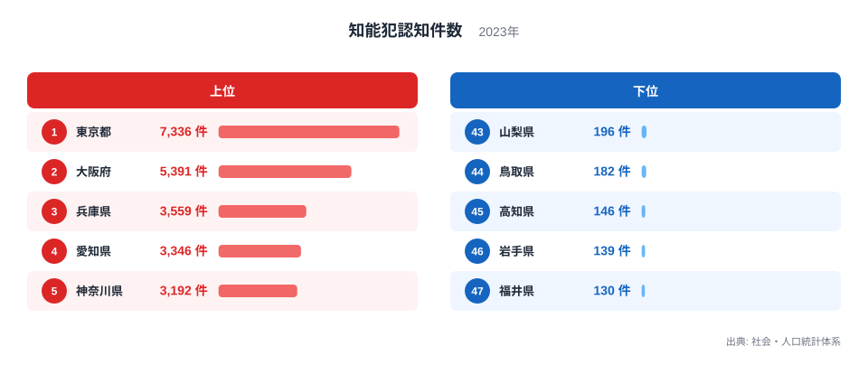
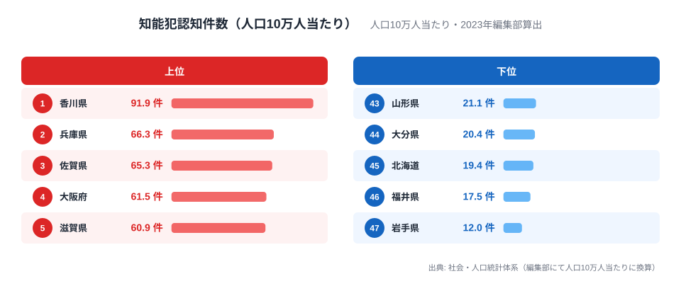

引っ越し先を選ぶとき、「この県は治安が大丈夫だろうか」と気になる方は少なくないはずです。家族や公的機関を装って現金をだまし取る特殊詐欺のニュースを見るたびに、自分や親の住む地域は大丈夫かと不安になることもあるでしょう。警察の犯罪統計では、詐欺・横領・偽造・背任などをまとめて「知能犯」と呼び、特殊詐欺もこの分類に含まれます。

2023年度の知能犯認知件数を都道府県別に見ると、1位は東京都の7,336件で、最下位の福井県130件との差は56.4倍にのぼります。件数だけを見れば「都会は危ない」という直感が裏付けられたように見えるかもしれません。しかしこの記事では、件数を人口で割った「人口10万人当たり」の値もあわせて算出しました。その結果、1位は東京都ではなく香川県に入れ替わります。件数ランキングと人口当たりランキング、どちらで治安リスクを判断すべきかを47都道府県のデータで見ていきます。

## 件数で見る上位と下位

知能犯認知件数の1位は東京都7,336件、2位は大阪府5,391件、3位は兵庫県3,559件でした。4位愛知県3,346件、5位神奈川県3,192件と続き、上位10県の内訳は南関東4県・近畿2県・東海2県・九州1県・山陽1県です。南関東・近畿・東海という日本の三大都市圏に加えて、福岡県や広島県のような地方の中心都市が並んでおり、知能犯の認知件数は人口や経済活動が集中する地域ほど多くなる傾向が読み取れます。詐欺や横領は取引や人間関係を前提とする犯罪であり、人口が多く商取引が活発な地域ほど事件として認知される母数そのものが増えると考えられます。

> [!NOTE]
> 警察の犯罪統計で「知能犯」に分類されるのは詐欺・横領・偽造・背任などです。オレオレ詐欺や還付金詐欺といった特殊詐欺は「詐欺」の一部として知能犯に計上されており、知能犯認知件数には特殊詐欺以外の詐欺・横領・偽造も含まれている点にご注意ください。

<source-link href="/ranking/intellectual-crime-per-100k">知能犯認知件数ランキングをもっと見る</source-link>

## 最下位グループ、人口の少ない地域に集中

最も少ないのは福井県の130件で、46位岩手県139件、45位高知県146件、44位鳥取県182件、43位山梨県196件と続きます。下位10県の内訳は北陸2県・山陰2県・四国2県・東北2県・九州1県・甲信越1県で、いずれも人口規模の小さい地方県です。人口そのものが少なければ、詐欺や横領の対象となる取引や資産の総量も少なくなるため、認知件数の絶対数が小さくなるのは自然な結果といえます。窃盗犯を含めた都道府県別の治安傾向全体については、[窃盗犯は大阪が長崎の4倍](/blog/crime-rate-regional-gap)でも詳しく解説しています。

> [!WARNING]
> ここまでの件数ランキングは、あくまで都道府県ごとの認知件数の絶対数です。人口が多い県ほど件数が大きくなりやすいため、件数の順位をそのまま「住民1人あたりの被害リスク」の順位として読むと実態とずれます。次の章で人口当たりに換算した値を見ていきます。

## 発見: 人口で割ると1位が変わる

知能犯認知件数を人口10万人当たりに換算すると、1位は香川県の91.9件でした。2位は兵庫県66.3件、3位は佐賀県65.3件、4位は大阪府61.5件、5位は滋賀県60.9件と続きます。件数で1位だった東京都は人口10万人当たり52.1件で7位まで後退し、香川県の値は東京都の1.8倍近くにのぼります。一方、人口当たりで最も低いのは岩手県の12.0件で、福井県17.5件、北海道19.4件、大分県20.4件、山形県21.1件が続きました。件数ランキングの下位とはやや顔ぶれが異なり、北海道や大分県のように件数自体は中位でも人口当たりでは低い県があることがわかります。この人口当たりの値は公式のランキングページではなく、知能犯認知件数と人口の統計を編集部が突き合わせて算出した参考値です。あわせて見る: [都道府県別の人口ランキング](/ranking/total-population)

> [!TIP]
> [仮説] 香川県のように人口規模が小さい県では、同じ1件の増減でも人口10万人当たりの値が大きく動きます。香川県の人口は東京都の約15分の1しかないため、件数がわずかに変動するだけで人口当たりの順位が入れ替わる可能性があります。今回の1位が構造的な傾向なのか、2023年度に限った一時的な増加なのかは、複数年分のデータを比較しないと判断できません。

[香川県](/areas/37000)や[兵庫県](/areas/28000)は件数ランキングでは10位圏外でしたが、人口当たりでは上位に入りました。逆に[東京都](/areas/13000)は件数こそ突出していますが、人口当たりで見ると必ずしも際立って高いわけではありません。引っ越し先の治安を件数だけで判断すると、人口の多い都市部を実態以上に「危険」と感じてしまう可能性がある一方、人口当たりで見ると香川県や兵庫県のように件数ランキングでは目立たない県が上位に来ることもあります。

人口当たりの上位5県の顔ぶれも興味深く、香川県・兵庫県・佐賀県・大阪府・滋賀県と近畿・瀬戸内地方が目立ちます。件数ランキングで上位を占めていた南関東勢(神奈川県・埼玉県・千葉県)は、人口当たりで見ると軒並み上位から姿を消しました。人口当たりの値だけで「近畿・瀬戸内は危ない」と結論づけるのは早計ですが、件数ランキングとは異なる地域像が浮かぶこと自体は、治安を1つの指標だけで判断すべきでない理由のひとつといえます。

## まとめ

- 知能犯認知件数（2023年度）の1位は東京都7,336件、最下位は福井県130件で56.4倍差
- 上位10県は南関東・近畿・東海など三大都市圏と福岡・広島など地方中心都市に集中
- 下位10県は北陸・山陰・四国・東北など人口規模の小さい地方県に集中
- 人口10万人当たりに換算すると1位は香川県91.9件に入れ替わり、東京都は7位に後退
- 件数だけでなく人口当たりの値もあわせて見ることで、実際の発生率に近い比較ができる

## データ出典

本記事の知能犯認知件数は総務省統計局「社会・人口統計体系」（e-Stat）の2023年度データを基に作成しています。人口10万人当たりの値は、同統計の人口データを用いて編集部が算出した参考値であり、公式に公表されているランキングではありません。治安や安全に関する他の指標は[環境・安全カテゴリ](/category/safetyenvironment)でまとめて確認できます。出典: https://www.stat.go.jp/data/ssds/index.htm
