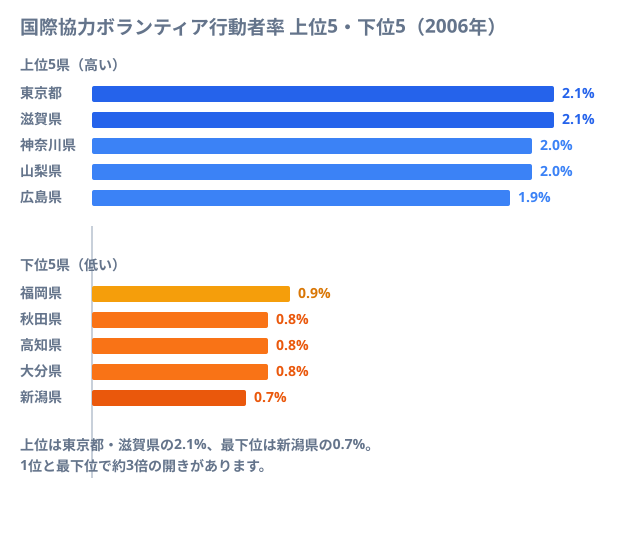
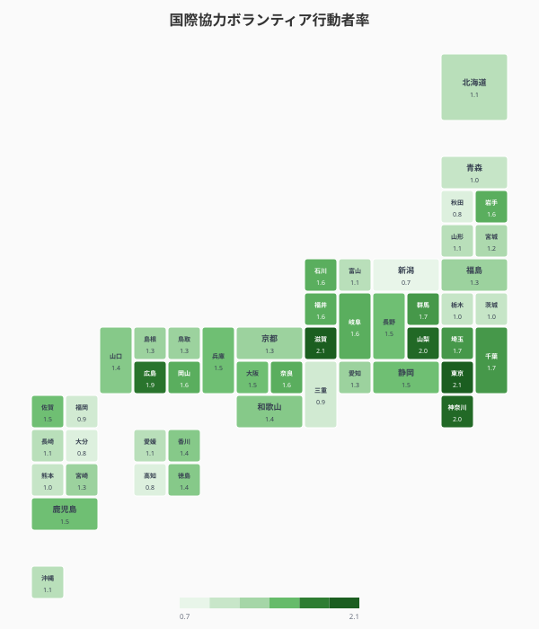
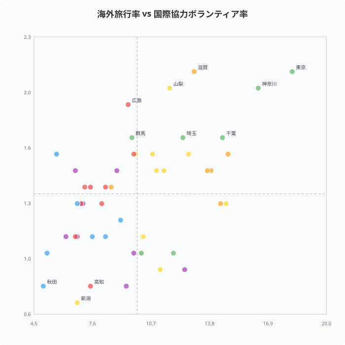
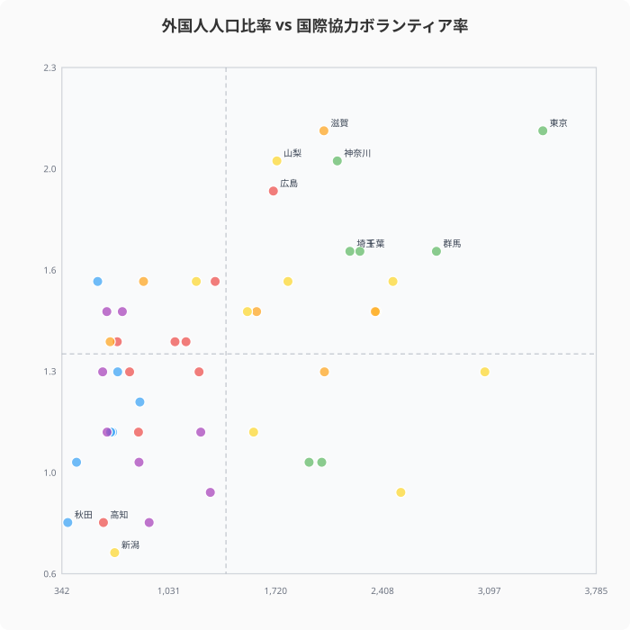
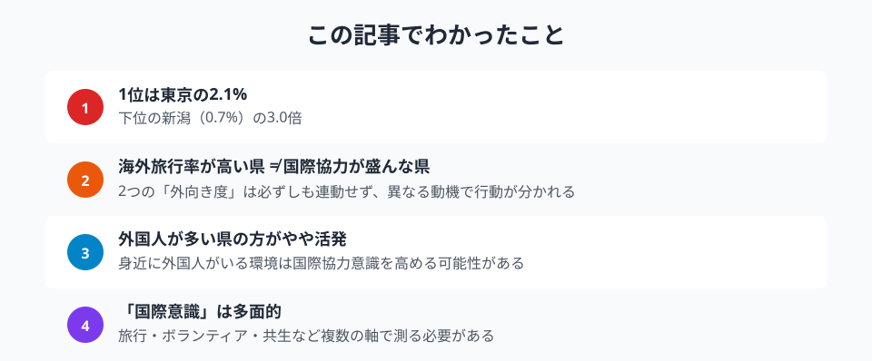

国際協力のボランティアに参加する人の割合は、都道府県によって大きな差がある。海外旅行が多い県が国際協力にも熱心とは限らず、意外な県が上位に食い込む。社会生活基本調査のデータから、日本の「国際意識」の地域差を多角的に分析する。

## 国際協力ボランティア行動者率ランキング──1位は東京と滋賀の2.1%

2006年の社会生活基本調査による国際協力ボランティア行動者率（15歳以上人口のうち国際協力に関係したボランティア活動をした人の割合）を見ると、1位タイで[東京都](/areas/13000)と[滋賀県](/areas/25000)が2.1%。3位は[神奈川県](/areas/14000)と山梨県が2.0%で並ぶ。

滋賀県や山梨県が上位に入っているのは意外かもしれないが、国際交流団体の活動が活発な地域や、大学・研究機関の集積が影響している可能性がある。下位は[新潟県](/areas/15000)（0.7%）、大分県・高知県・秋田県（0.8%）が並ぶ。1位と最下位では約3倍の格差がある。

> [!NOTE]
> このデータは2006年の社会生活基本調査に基づく。都道府県別の国際協力ボランティア行動者率はこの年が最新であり、現在の水準とは異なる可能性がある。

<source-link href="/ranking/volunteer-activity-international-cooperation-15plus">47都道府県の国際協力ボランティア率ランキングをもっと見る</source-link>

## 全国マップで見る「国際貢献意識」の分布

タイルグリッドマップで見ると、首都圏・中京圏に加え、滋賀県や広島県といった独自の国際交流拠点がある地域でも比較的高い率を示している。東北・北陸は総じて低い傾向にある。国際協力NPOや国際協力機構（JICA）の地方拠点が集中する都市部では、ボランティア活動への参加機会が多く、行動者率の高さに反映されている。

<ad-slot></ad-slot>

## 海外旅行率が高い県 ≠ 国際協力が盛んな県

海外旅行行動者率と国際協力ボランティア率の散布図を見ると、緩やかな正の相関はあるものの、両者が一致しない県が少なくない。

例えば、奈良県は海外旅行率が14.8%と全国3位だが、国際協力ボランティア率は中位にとどまる。逆に、滋賀県は海外旅行率では上位10に入らないが、ボランティア率ではトップタイだ。

「海外に行く」という個人的な行動と「国際協力に参加する」という社会的な行動は、必ずしも同じ動機で駆動されていないことがわかる。

> [!NOTE]
> 海外旅行率は2001年、ボランティア率は2006年のデータ。年次が異なるため傾向の参考として読むこと。

<source-link href="/ranking/overseas-travel-activity-rate-15plus">47都道府県の海外旅行行動者率ランキングをもっと見る</source-link>

## 外国人が多い県ほど国際協力に関心がある？

外国人人口（10万人あたり）と国際協力ボランティア率の散布図を見ると、やや正の相関が見られる。東京・愛知・群馬のように外国人が多い県ではボランティア率もやや高い傾向がある。

ただし、群馬県は外国人比率が全国3位（2,756人/10万人）でありながらボランティア率は中位であるなど、外国人の多さが直接的に国際貢献意識に結びつくわけではない。身近に外国人がいる環境は「きっかけ」にはなりうるが、実際の行動につながるには別の要因（情報・ネットワーク・教育）も必要ということだろう。

> [!NOTE]
> 外国人比率は2020年国勢調査、ボランティア率は2006年のデータ。14年の時差があるため、相関の解釈は慎重に行う必要がある。

<ad-slot></ad-slot>

## まとめ

国際協力ボランティアのデータから見える「国際意識」の地域差を整理する。

「国際意識」を測る指標は一つではない。海外旅行に行くこと、外国人と共生すること、国際協力に参加すること。それぞれ異なる動機と環境要因で成り立っており、どの県が「国際的」かは問いの立て方次第で答えが変わる。ボランティア率のデータは、画一的な「国際化」のイメージに頼らず、多面的に地域の国際性を評価することの重要性を示している。

**データ出典:**
- [社会生活基本調査（e-Stat）](https://www.e-stat.go.jp/stat-search/files?stat_infid=000001027478)（2006年・ボランティア）
- [社会生活基本調査（e-Stat）](https://www.e-stat.go.jp/stat-search/files?stat_infid=000001017814)（2001年・海外旅行）
- [社会・人口統計体系 都道府県データ（e-Stat）](https://www.e-stat.go.jp/regional-statistics/ssdsview)（2020年・外国人人口）

## データ出典

本記事のデータはe-Stat（政府統計の総合窓口）を基に作成しています。

本記事の対象データ: [関連カテゴリ](/category/international)
