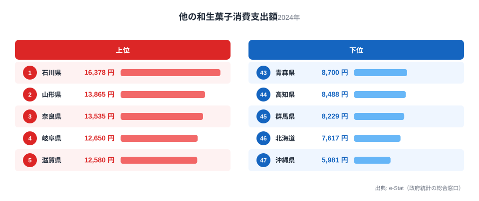
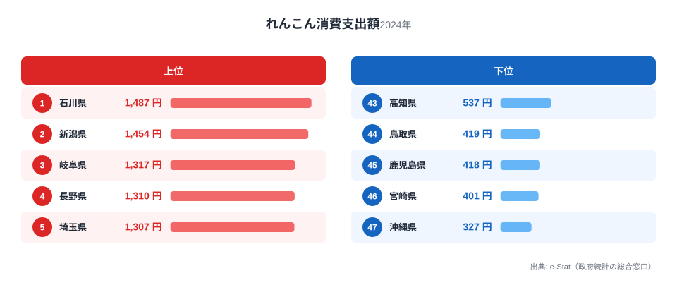
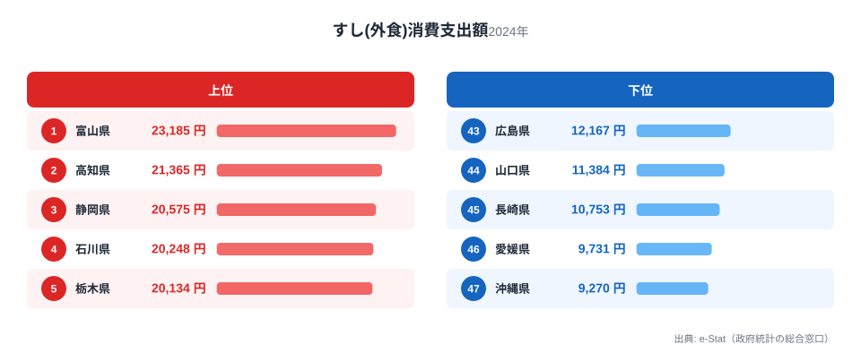
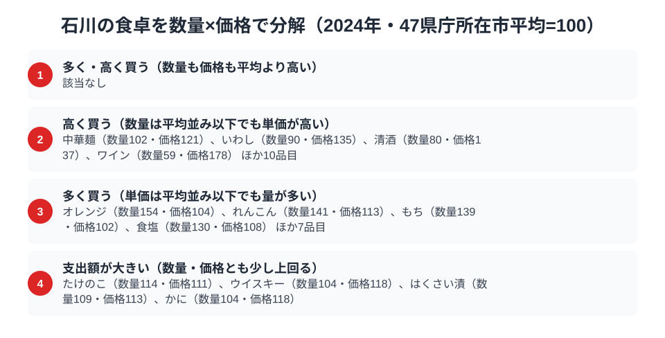

金沢の茶屋街を歩くと、和菓子屋の看板がやけに目につきます。実はこれ、雰囲気だけの話ではありません。総務省「家計調査」2024年のデータを見ると、石川県（金沢市）の和生菓子消費支出額は年間16,378円で全国1位。同じ加賀野菜の代表格である「れんこん」の消費支出額も1,487円で全国1位です。

さらに、すし（外食）の消費支出額は20,248円で全国4位。1位の富山県は23,185円で、石川はこれにわずかに届きませんが、隣県同士で北陸の食卓が上位を占めている点が目を引きます。この記事では、この3品目のデータから、石川県民の食卓に流れる一本の軸を探ります。なぜ石川は「甘いもの」と「根菜」と「魚」のいずれでも上位に来るのか。答えは、加賀百万石が育てた「手間を惜しまない食文化」にありそうです。

> [!NOTE]
> 本記事のデータは総務省「家計調査（品目別）」2024年、都道府県庁所在市（石川県は金沢市）の二人以上世帯の年間消費支出額です。世帯単位の支出額であり、消費量そのものではありません。なお「和生菓子」の指標名は正式には「他の和生菓子消費支出額」で、家計調査ではようかんなどが別区分で個別集計されており、それらを除いた残余区分を指します（後述する福井県の「羊羹」は別指標です）。

## 和生菓子 — 全国1位16,378円、2位山形県との差はわずか

<source-link href="/ranking/other-japanese-sweets-consumption-expenditure">和生菓子消費支出額ランキングをもっと見る</source-link>

石川県の他の和生菓子消費支出額は16,378円で全国1位です（ようかんなど個別集計される品目を除いた残余区分）。2位の山形県は13,865円で全国2位となっており、石川との差は2,513円、比率にして1.18倍です。3位の奈良県は13,535円で全国3位、ここまで含めても、上位3県はいずれも1万3千円台後半から1万6千円台に集中しており、石川の1位は突出しているというより「僅差の首位」という性格が強いデータです。

金沢には江戸時代から続く茶の湯文化があり、加賀藩の茶道奨励策の影響で和菓子文化が発達しました。俳句にも詠まれる「金花糖」や、五色生菓子などの儀礼菓子が今も冠婚葬祭で使われています。日常的にお茶とともに和菓子を口にする習慣が、支出額の高さに表れていると考えられます。最下位の沖縄県は5,981円で、石川の値はその2.7倍にあたります。

## れんこん — 全国1位1,487円、加賀野菜の代表格

<source-link href="/ranking/lotus-root-consumption-expenditure">れんこん消費支出額ランキングをもっと見る</source-link>

れんこんの消費支出額も石川県が1,487円で全国1位です。2位の新潟県は1,454円で全国2位、石川との差は33円とごくわずかで、事実上の僅差首位です。3位の岐阜県は1,317円、4位の長野県は1,310円と続き、上位は北陸から中部にかけての県が並びます。

石川のれんこんは「加賀れんこん」として知られるブランド野菜です。金沢市小坂・打木地区周辺の粘土質の土壌が、もっちりと粘り気の強いれんこんを育てます。かつては年に一度しか収穫しない栽培法が主流で、いまも「じゅんさい鉢」に盛る郷土料理「はす蒸し」など、れんこんを使った料理が金沢の家庭料理に根付いています。最下位の沖縄県は327円で、石川はその4.5倍の支出です。

## すし(外食) — 全国4位20,248円、北陸勢が上位を占める

<source-link href="/ranking/sushi-dining-consumption-expenditure">すし(外食)消費支出額ランキングをもっと見る</source-link>

すし(外食)消費支出額は石川県が20,248円で全国4位です。1位は富山県の23,185円、2位は高知県の21,365円、3位は静岡県の20,575円で、石川はこれらに次ぐ位置につけています。1位の富山県との差は2,937円、比率で1.15倍です。

金沢は日本海に面し、金沢港や近隣の漁港から新鮮な魚介が集まる土地です。のどぐろ・ガスエビ（甘えび）・香箱ガニなど、地元で「地物」と呼ばれる高級食材が回転寿司から高級店まで幅広い層に浸透しており、「金沢はどの価格帯でも寿司が旨い」という評判の土台になっています。隣県の富山も同じ日本海の恵みを受ける立地で、北陸勢がすし外食の上位を占めるのは地理的な必然といえるでしょう。最下位の沖縄県は9,270円で、石川の値はその2.2倍です。

> [!WARNING]
> 本データは支出額であり、消費量や購入頻度そのものではありません。単価の高い食材ほど支出額が押し上げられるため、「支出額が高い＝食べる量が多い」とは限らない点に注意が必要です。また、加賀野菜のうち「金時草」「打木赤皮甘栗かぼちゃ」など家計調査で個別集計されていない品目は本記事に含まれていません。

## 石川の食卓を貫くもの

和生菓子とれんこんが全国1位、すし外食が4位。この3品目に共通するのは、いずれも「手間のかかる素材を丁寧に扱う」という一本の軸です。和生菓子は茶の湯文化に支えられた儀礼と嗜好、れんこんは粘土質の土壌が育てる希少なブランド野菜、すしは日本海の地物を活かす職人技。加賀百万石が育んだ食への美意識が、現代の家計調査データにもそのまま表れています。

隣県の[富山県](/blog/toyama-food-culture)は、ぶり・いか・昆布・餅がいずれも全国1位という「日本海の恵みそのもの」を前面に出す食文化でした。同じ北陸でも、富山が「新鮮な魚介の量」で勝負するのに対し、石川は「素材への手間」で勝負します。隣り合う県でも支出構造の性格が異なる点が興味深いところです。同じく[福井県](/blog/fukui-food-culture)は羊羹とふりかけが全国1位で、北陸3県それぞれに異なる強みがあることが見えてきます。

> [!TIP]
> 和生菓子とれんこんの1位・2位差がいずれも僅差（和生菓子は2位山形県との差1.18倍、れんこんは2位新潟県との差1.02倍）である点は見逃せません。これは「石川だけが突出して食べている」のではなく、「茶の湯文化圏・北陸の粘土質土壌地帯」という広い地域で似た食文化が根付いていることを示唆します。石川の食卓データを読むときは、隣接県との差の大きさにも注目すると、その品目が石川固有の文化なのか、地域全体の傾向なのかが見えてきます。

石川県の地域プロフィールは[石川県の地域プロフィール](/areas/17000)で確認できます。他の家計調査データは[経済カテゴリ一覧](/category/economy)からたどれます。

## 数量×価格で分解する金沢市の食卓

<source-link href="/ranking/crab-consumption-quantity">かに消費量ランキングをもっと見る</source-link>

和生菓子とれんこんの支出額はいずれも全国1位でしたが、これだけでは「たくさん食べている」のか「高いものを買っている」のかを区別できません。総務省「家計調査」の品目データを数量と価格に分解し、47都道府県庁所在市の平均を100とした指数で見ると、石川の食卓が「量」と「単価」のどちらで動いているかが見えてきます。

単価が平均より高い品目には、中華麺（数量102・価格121）、いわし（数量90・価格135）、清酒（数量80・価格137）、ワイン（数量59・価格178）などが並びます。数量は平均並みかそれ以下なのに単価だけが上がっているのは、より上質な素材や銘柄を選んで買っている表れです。すし外食で見た「地物を活かす職人技」と同じ、素材への手間のかけ方がここにも表れています。

一方、数量が平均より多い品目は、オレンジ（数量154・価格104）、れんこん（数量141・価格113）、もち（数量139・価格102）、食塩（数量130・価格108）などです。単価は平均並みかそれ以下で、日常的に量を消費する食習慣を示しています。和生菓子の消費が毎日のお茶の時間に支えられているのと同じ、頻度の高さが数量指数に表れているタイプです。

かに消費量（数量指数104）は平均並みですが、価格指数は118とやや高めで、たけのこ（数量114・価格111）やウイスキー（数量104・価格118）も同様に、数量・価格のどちらも単独では突出しないまま、両方がわずかに上回ることで支出額指数を押し上げています。石川には「数量も価格もともに高い」品目はなく、量で勝負する食材と、単価で勝負する食材がはっきり分かれているのが特徴です。

> [!TIP]
> 支出額の順位だけを見ていると、たくさん食べているのか、高いものを買っているのかが分かりません。数量指数と価格指数に分解すると、和生菓子やれんこんのように「量」で支出額を押し上げるタイプと、いわしや清酒のように「単価」で支出額を押し上げるタイプを区別できます。石川の食卓データを読むときは、この2軸で見ると発見が増えます。

> [!NOTE]
> この指数は総務省「家計調査（品目別）」2024年、47都道府県庁所在市の単純平均を100とした相対値であり、家計調査の全国値そのものではありません。価格指数は支出額を数量で割った単価の相対値なので、買っている品種やブランドの違いも含まれており、純粋な地域の物価水準とは限りません。対象は二人以上世帯、金沢市の年間データです。

## まとめ

- 和生菓子消費支出額は16,378円で全国1位。2位の山形県は13,865円で僅差
- れんこん消費支出額は1,487円で全国1位。加賀れんこんのブランド力を反映
- すし(外食)消費支出額は20,248円で全国4位。1位の富山県は23,185円で、これに次ぐ北陸勢の一角です
- 3品目に共通するのは「手間のかかる素材を丁寧に扱う」加賀百万石由来の食文化
- 隣県の富山・福井とはそれぞれ異なる強みを持ち、北陸3県の食文化の多様性が見えてきます

## データ出典

総務省統計局「家計調査（品目別）」2024年、都道府県庁所在市（石川県は金沢市）二人以上世帯のデータをe-Stat（政府統計の総合窓口）経由で取得しています。
