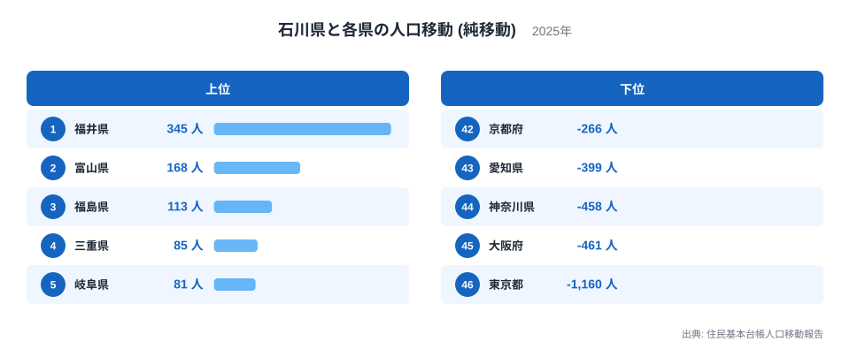
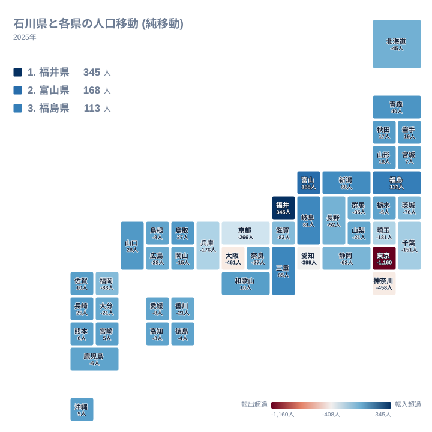
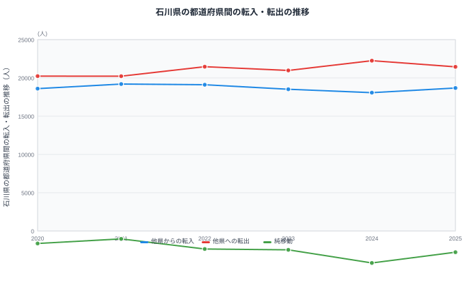

石川県は北陸地方に位置し、福井県、富山県、岐阜県という3つの県と陸で接しています。住民基本台帳人口移動報告の都道府県間の純移動データを見ると、石川県はこの3つの隣接県すべてから人を得ている一方、遠く離れた複数の大都市圏に対しては軒並みマイナスとなっています。

純移動とは、ある県から見て別の県との間で転入した人数から転出した人数を引いた差のことです。移動した人の総数そのものではなく、あくまで差し引きの値である点に注意が必要です。この記事では石川県と各県の純移動データをもとに、石川県がどの方向から人を集め、どの方向へ人を明け渡しているのかを見ていきます。

## 相手県別にみる純移動

<source-link href="/ranking/moving-in-excess-rate">転入超過率ランキング</source-link>

石川県が最も多くの人を得ている相手は福井県で、純移動は345人です。2位は富山県で168人、3位は福島県で113人、4位は三重県で85人、5位は岐阜県で81人と続きます。1位の福井県と2位の富山県は、いずれも北陸新幹線でつながる北陸3県の一角であり、県境を越えた通勤・通学圏としての結びつきの強さがうかがえます。全国の転入超過率ランキングと合わせて見ると、石川県が全国のどのあたりに位置しているのかもわかります。

一方で最も多くの人を失っている相手は東京都で、純移動はマイナス1,160人です。45位は大阪府でマイナス461人、44位は神奈川県でマイナス458人、43位は愛知県でマイナス399人、42位は京都府でマイナス266人と続きます。下位5県を見ると、東京都、大阪府、神奈川県、愛知県、京都府という関東・関西・中京の主要な都市圏がそれぞれ含まれており、石川県がひとつの方向だけでなく、複数の都市圏に対して同時にマイナスとなっている点が見えてきます。

> [!NOTE]
> 石川県が陸で接する福井県・富山県・岐阜県の3県は、いずれも純移動がプラスです。隣接3県すべてから人を集めている県は珍しく、石川県の人口移動を読むうえでの基本になります。

## 地図でみる純移動の広がり

地図の中で石川県自体のマスに色が付いていないのは、石川県から石川県への移動というデータがそもそも存在しないためです。この地図は石川県と、それ以外の46都道府県との関係だけを表しています。

地図全体を見渡すと、青みがかった色で示される純移動プラスの県は北陸から東北・北海道にかけて広がっている一方、赤みがかった色で示される純移動マイナスの県は関東・関西・中京の3つの大都市圏に集中していることがわかります。石川県が接する福井県、富山県、岐阜県の3県はいずれもプラスで、隣接県との関係だけを見れば石川県は人を集める側です。

ところが少し離れた京都府はマイナス266人で42位、大阪府はマイナス461人で45位、愛知県はマイナス399人で43位、神奈川県はマイナス458人で44位、東京都はマイナス1,160人で46位となっており、3つの大都市圏がそれぞれ石川県から人を引き寄せています。隣接県からは人を得ながら、より遠くの都市圏には人を明け渡すという二重の構造が、この地図から読み取れる石川県の特徴です。

> [!WARNING]
> マイナス幅が大きい相手は東京都・大阪府・神奈川県・愛知県で、中でも東京都はマイナス1,160人と最も大きく、いずれも石川県から離れた大都市圏です。地理的な近さだけでプラスマイナスを予想すると、この記事の下位県の並びを見誤ります。

## 北陸のつながりと3つの都市圏

[石川県のデータ](/areas/17000)と[福井県のデータ](/areas/18000)を見比べると、石川県が北陸地方の中でどのような役割を担っているかが見えてきます。石川県は福井県との間で345人、富山県との間で168人という、この記事で扱う46県の中でも上位2位までを占めるプラスの純移動を記録しており、北陸3県の中では人を集める側の県であることがわかります。

一方で石川県から人が流出する先は、首都圏の東京都だけにとどまりません。近畿地方の中心である大阪府や京都府、中京圏の中心である愛知県、そして首都圏の神奈川県まで、下位5県には3つの経済圏の中心的な県がそろって並んでいます。石川県が新幹線や高速道路を通じて複数の都市圏と接続されていることが、単一の方向ではなく複数方向への人口流出という結果につながっていると考えられます。

## 転入・転出の推移

この図は石川県と全国すべての県との間でやり取りされた転入・転出・純移動の推移を示しています。他県からの転入は2020年が18,596人、2021年が19,193人、2022年が19,105人、2023年が18,515人、2024年が18,071人、2025年が18,676人と推移しています。他県への転出は2020年が20,232人、2021年が20,226人、2022年が21,465人、2023年が20,976人、2024年が22,247人、2025年が21,450人です。

純移動は2020年がマイナス1,636人、2021年がマイナス1,033人、2022年がマイナス2,360人、2023年がマイナス2,461人、2024年がマイナス4,176人、2025年がマイナス2,774人となっています。6年間すべてでマイナスが続いており、2024年のマイナス4,176人がこの期間で最も大きな落ち込みです。2025年は転出が22,247人から21,450人へと減り、純移動のマイナス幅もやや縮小しましたが、2020年や2021年の水準までは戻っていません。

> [!TIP]
> 純移動のマイナス幅が年によって大きく変動する場合は、転入と転出のどちらが動いているかを見比べることが読み解きのコツです。石川県の場合、転入は18,000人台から19,000人台の間で比較的安定している一方、転出は20,000人台から22,000人台まで年ごとの振れ幅が大きく、この転出側の変動が純移動の増減を主に左右しています。転入・転出の合計が全国すべての県を相手にした値である一方、相手県別のランキングは1県ごとの値であるという違いも、あわせて確認しておくとよいでしょう。

## まとめ

- 石川県が最も人を得ている相手は福井県で、純移動は345人です。
- 石川県が最も人を失っている相手は東京都で、純移動はマイナス1,160人です。
- 石川県が接する福井県・富山県・岐阜県の3県はすべてプラスです。
- 下位5県には東京都・大阪府・神奈川県・愛知県・京都府という3つの都市圏の中心県がそろっています。
- 全国合計の純移動は2020年から2025年まで6年連続でマイナスで、2024年が最も大きなマイナス幅です。
- 6位は新潟県で68人、7位は青森県で40人と続き、上位には北陸以外の県も含まれています。

石川県の人口移動の全体像は、[人口動態のテーマ](/themes/population-dynamics)や[人口・世帯の統計一覧](/category/population)からも確認できます。

## データ出典

- 出典: 住民基本台帳人口移動報告
- 年: 2025年(相手県別の純移動)、2020年から2025年(転入・転出・純移動の推移)
