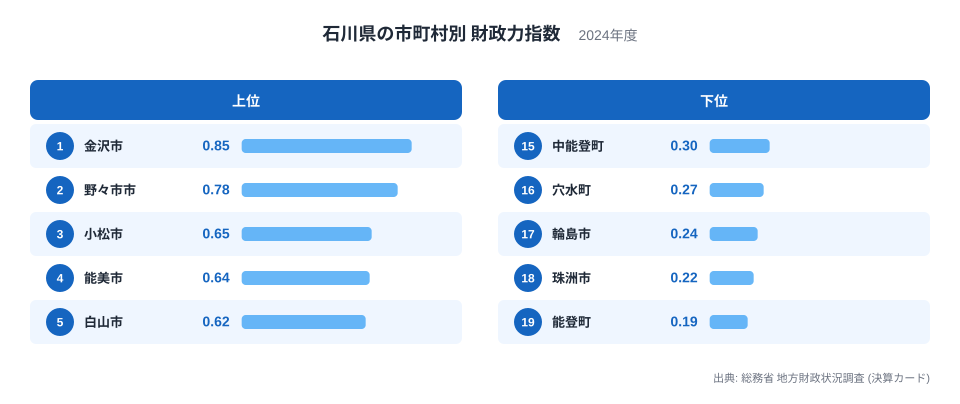
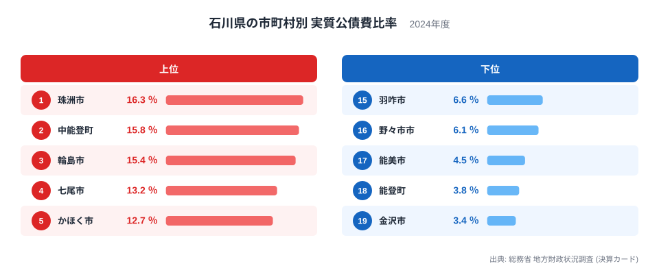
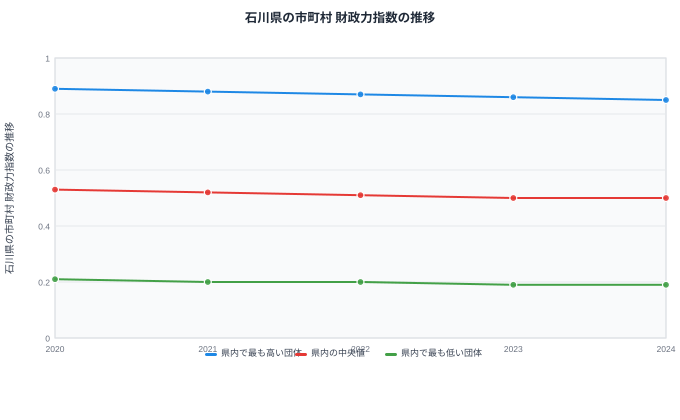

石川県には19の市町村があります。同じ県内にありながら、財政の体力を示す財政力指数は最も高い金沢市の0.85から最も低い能登町の0.19まで、4倍以上の開きがあります。借金の重さを示す実質公債費比率も、最も低い金沢市の3.4％から最も高い珠洲市の16.3％まで大きく分かれています。

都道府県単位の平均や全国順位だけを見ていると、この差は見えてきません。この記事では、石川県内の19市町村を対象に、財政力指数と実質公債費比率という2つの指標を並べ、どの市町村が財政的に厳しく、どの市町村が余裕を持っているのかを具体的に見ていきます。あわせて、この差が石川県だけの特殊な事情なのか、それとも同じ規模の自治体に共通して見られる傾向なのかという視点も持ちながら読み進めてください。

> [!NOTE]
> 財政力指数は、標準的な行政サービスを行うために必要な財政需要額に対して、自前の税収などでどれだけ賄えているかを示す指数です。1に近づくほど自主財源で運営できていることを意味し、1を下回る分は地方交付税などの国からの財源に頼っていることになります。数値が0.5であれば、必要な費用のおよそ半分を自前でまかなえている、という読み方になります。

## 財政力指数にみる市町村格差

財政力指数のランキングでは、金沢市が0.85で最も高く、県庁所在地として企業の集積や商業活動が多いことがうかがえます。2位には野々市市が0.78で続き、3位は小松市の0.65、4位は能美市の0.64、5位は白山市の0.62です。この上位5市町村には、金沢市に隣接する都市や工業関連の産業を持つ市が並んでいます。

一方で下位を見ると、19位の能登町が0.19、18位の珠洲市が0.22、17位の輪島市が0.24と続き、能登半島の先端に位置する市町村が並びます。16位の穴水町も0.27にとどまり、人口の少ない地域ほど自主財源だけでは行政サービスをまかないきれていない様子が数字に表れています。中央付近を見ると、11位の七尾市が0.45、12位のかほく市が0.42で、県全体の中では中位に位置しています。

この並びから読み取れるのは、金沢市とその周辺の都市部、工業集積のある地域は財政力指数が高く、能登半島の先端に近づくほど数値が下がっていく傾向です。これは石川県に限った現象ではなく、人口が少なく税収基盤の小さい町村ほど財政力指数が低くなりやすいという、全国の自治体にも共通して見られる構造だと考えられます。[仮説] ただし、これが石川県だけの事情なのか、同じ人口規模を持つ他県の町村にも共通する傾向なのかを確かめるには、類似の規模を持つ団体どうしの平均値と突き合わせて検証する必要があります。

## 実質公債費比率にみる借金の重さ

実質公債費比率は、借金の返済額が財政規模に対してどれだけの重さを持っているかを示す指標です。この比率が高いほど、新たな借り入れに慎重にならざるを得ない状況にあります。石川県で最も高いのは珠洲市の16.3％で、2位は中能登町の15.8％、3位は輪島市の15.4％です。4位の七尾市は13.2％、5位のかほく市は12.7％で、こちらも上位5市町のうち3市町が能登半島の中部から先端にかけての地域に位置しています。

反対に最も低いのは金沢市の3.4％で、19市町村の中で唯一一桁台前半にとどまっています。18位の能登町は3.8％、17位の能美市は4.5％で、この2つの町と市は下から数えて低い水準にあります。中央付近では、10位の加賀市が8.2％、11位の志賀町が7.7％となっており、多くの市町村が7％台から9％台に集まっています。

ここで注目したいのは、実質公債費比率と財政力指数の順位が必ずしも同じ並び方をしていない点です。珠洲市と輪島市は実質公債費比率が高く財政力指数も低いという、両方の面で厳しい状況にあります。一方で能登町は、財政力指数こそ県内で最も低い0.19ですが、実質公債費比率は3.8％と金沢市に次いで低い水準です。財政の基盤は弱いものの、借金を増やさずに慎重な財政運営を続けている自治体があることが、この数字の組み合わせから見えてきます。

> [!WARNING]
> 財政力指数と実質公債費比率は、どちらも2024年の決算カードにもとづく数値ですが、意味するものが異なります。財政力指数は税収などの自主財源の割合を示し、実質公債費比率は借金の返済負担を示します。財政力指数が低い自治体が必ず実質公債費比率も高いとは限らず、この記事の能登町のように、財政基盤が弱くても借金は少ない自治体もあります。ふたつの指標を混同せずに読むことが大切です。

## 5年間の推移で見える変化

財政力指数の5年間の推移を見ると、県内で最も高い値は2020年の0.89から2024年には0.85へと緩やかに下がっています。県内の中央値も2020年の0.53から2024年には0.5へと下がりました。県内で最も低い値も2020年の0.21から2024年には0.19へとわずかに低下しています。

この5年間で共通しているのは、最も高い水準の団体、中央値、最も低い水準の団体のいずれも、少しずつではありますが数値を下げている点です。突出して回復している団体や、急激に悪化した団体は見当たらず、石川県全体として緩やかに財政力指数が低下する傾向が続いています。県内の格差そのものは、最も高い値と最も低い値の差を見る限り、2020年も2024年もおおむね同じ幅で推移しており、この5年間で急に広がったわけではありません。

> [!TIP]
> 財政力指数の推移を読むときは、単年の数値だけでなく、県内の最高値・中央値・最低値がそれぞれどう動いているかをあわせて見ると、格差が広がっているのか縮まっているのかを判断しやすくなります。1年だけの変化に注目すると、たまたまその年の税収が増減しただけの一時的な動きを、長期的な傾向と取り違えてしまうことがあります。

## なぜここまで差が生まれるのか

これまで見てきた数字を重ねると、石川県内の市町村は大きく3つのグループに分けられそうです。ひとつめは金沢市、野々市市、小松市のように、財政力指数が高く実質公債費比率も低い、財政的に余裕のあるグループです。ふたつめは珠洲市、輪島市、中能登町のように、財政力指数が低く実質公債費比率も高い、両方の面で厳しいグループです。みっつめは能登町のように、財政力指数は低いものの実質公債費比率も低く抑えられている、財政基盤は弱いが借金には慎重なグループです。

この違いが生まれる背景には、人口の規模と産業構造の違いがあると考えられます。[仮説] 金沢市や野々市市、小松市は人口が多く、企業の立地や商業活動も活発なため、自主財源となる税収を確保しやすい環境にあります。一方で能登半島の先端に位置する珠洲市や輪島市、能登町は、人口減少が進み、税収の基盤となる産業の集積も限られています。ただし、実質公債費比率が高いか低いかは、税収の多さだけでなく、過去にどれだけ借り入れを行い、どのようなペースで返済しているかという、それぞれの自治体の財政運営の判断にも左右されます。この点は決算カードの内訳をさらに確認しなければ断定できない仮説です。

同じ人口規模の町村どうしを比較したとき、能登町のように財政力指数が低くても実質公債費比率を低く抑えている団体があるのに対し、中能登町のように実質公債費比率が県内で2番目に高い団体もあります。同じような立地や人口規模であっても、財政運営の結果には差が出ることがこの2つの町の数字から読み取れます。石川県だけの事情として片づけるのではなく、[石川県のデータ](/areas/17000)で他の指標もあわせて確認しながら、同じ規模の自治体との比較を続けていくことが必要です。

## まとめ

- 財政力指数は金沢市の0.85が最も高く、能登町の0.19が最も低く、19市町村の中で4倍以上の開きがあります。
- 実質公債費比率は珠洲市の16.3％が最も高く、金沢市の3.4％が最も低く、こちらもおよそ5倍の開きがあります。
- 金沢市、野々市市、小松市など県中央部の都市は財政力指数が高く実質公債費比率も低い傾向にあります。
- 珠洲市、輪島市、中能登町は財政力指数が低く実質公債費比率も高く、両方の面で厳しい状況にあります。
- 能登町は財政力指数こそ最も低いものの、実質公債費比率は県内で2番目に低く、財政基盤の弱さと借金の少なさが両立しています。

財政の状況をより広い視点で確認したい場合は、[地方財政のテーマ](/themes/local-finance)や[行政・財政カテゴリの統計一覧](/category/administrativefinancial)もあわせてご覧ください。石川県以外の都道府県でも、同じように市町村間の格差が存在するのかを比較する材料になります。

## データ出典

総務省 地方財政状況調査(決算カード)、2024年決算にもとづく財政力指数および実質公債費比率、ならびに2020年から2024年までの財政力指数の推移データを使用しています。
