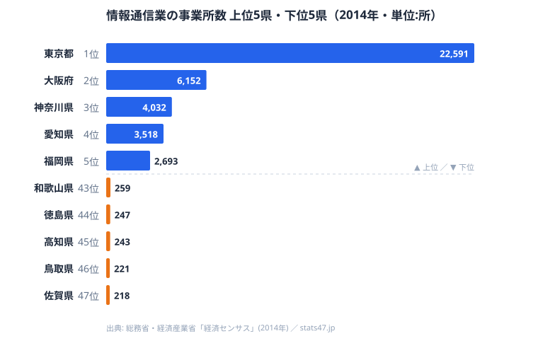

ITエンジニアが転職先を探すとき、選べる求人の数は「その地域にIT企業がどれだけあるか」に大きく左右されます。総務省・経済産業省「経済センサス」をもとにした情報通信業の事業所数を見ると、[東京都](/areas/13000)は22,591所で群を抜いています。一方、最下位の[佐賀県](/areas/41000)は218所で、その差は約103倍にのぼります。

求人の母数そのものが地域でこれだけ違えば、地元だけで転職活動をする限り、地方在住者の選択肢は構造的に狭まります。本記事ではIT企業（情報通信業の事業所）の地理的分布を可視化し、求人の偏りの中で地方エンジニアが取りうる戦略を考えます。

> [!NOTE]
> 「情報通信業」はソフトウェア開発・受託システム開発・Web 制作・通信・放送・出版などを含む産業分類で、いわゆる「IT 企業」より広い概念です。事業所数は本社・支社をそれぞれ1拠点として数え、企業規模（従業員数や売上）は反映しません。つまり東京の22,591所には小規模な支社や一人事業所も含まれており、「大企業がそれだけある」という意味ではない点に注意が必要です。

## 情報通信業の事業所数ランキング — 東京が突出

上位5県は東京都（22,591所）、大阪府（6,152所）、神奈川県（4,032所）、愛知県（3,518所）、福岡県（2,693所）です。2位の大阪府でさえ東京都の3割に届かず、首位との差は歴然としています。一方、下位5県は和歌山県（259所）、徳島県（247所）、高知県（243所）、鳥取県（221所）、佐賀県（218所）と並び、いずれも300所を割り込みます。全国平均は1,411所ですが、これは東京都が大きく押し上げた値であり、中位（24位）の栃木県は509所にとどまります。

上位に並ぶのは、東京・大阪・名古屋・福岡といった大都市圏を抱える府県です。情報通信業は、発注元となる大企業の本社・行政機関・メディアが集積する場所にこそ集まりやすく、需要が需要を呼ぶ形でいったん集積した地域に企業が引き寄せられます。とりわけ東京都は、上場企業本社・官公庁・主要メディアが一極集中しているため、システム開発の発注も Web 制作の依頼もここに流れ込みます。下位に並ぶ佐賀・鳥取・高知・徳島・和歌山は、いずれも人口規模が小さく、地元の発注元となる大企業や行政の規模も限られます。結果として、IT 企業が事業を成り立たせるだけの需要が地元で生まれにくく、事業所が育ちにくい構造になっています。中位県でも東京都とは2桁の差があり、求人の母数は上位数都府県へ極端に偏在しているのが実情です。地元の事業所数に依存する限り、多くの県のエンジニアは選べる求人の絶対数で不利を背負うことになります。

<source-link href="/ranking/number-of-establishments-information-communication">情報通信業の事業所数ランキングを詳しく見る</source-link>

## 求人の母数が100倍違うという意味

事業所数の差は、そのまま求人の母数の差につながります。地方の中核県を見ても、[京都府](/areas/26000)は13位（1,044所）、[沖縄県](/areas/47000)は18位（668所）と、東京都とは1桁から2桁の開きがあり、地元の求人だけを見れば選択肢は限られます。これは「自分の住む県にどれだけ求人があるか」という、エンジニア個人にとっては動かしにくい前提として効いてきます。

> [!WARNING]
> 求人の母数が少ない地域では、(1) 希望条件に合う求人に出会いにくい、(2) 年収交渉の比較対象が少ない、という二重のハンデが生じます。これは個人の能力の問題ではなく、市場の地理的な偏りによる構造的な制約です。事業所数が少ない＝働く人の質が低い、という誤読をしないよう注意してください。順位はあくまで「企業がどれだけ集積しているか」を示すもので、エンジニア個人のスキルとは無関係です。

しかも全国平均の事業所数は2009年の1,659所から2014年の1,411所へと減少しており、地方ほど統廃合の影響を受けやすい傾向があります。母数の少ない地域では、わずかな事業所の閉鎖や撤退でも地元の求人プールが目に見えて細るため、地元市場の縮小は地方エンジニアにとって無視できないリスクです。逆に言えば、首位の東京都は減少局面でも圧倒的な母数を維持しており、景気変動の影響を「数の厚み」で吸収できる立場にあります。この厚みの差こそが、地理によるキャリアの安定性の差として表れてくるのです。

## 受託中心の地方IT、その先のキャリア

地方の情報通信業は、東京の元請けから仕事を請ける「受託・下請け」の構造になりやすいと指摘されてきました。事業所数の少なさに加え、地元IT企業が二次・三次請けに置かれれば、扱える案件の単価や技術領域も限られがちです。母数が少ないということは、案件の種類や技術スタックの多様性も乏しくなりやすく、特定の技術を深めたいエンジニアにとっては選択肢が狭いという問題にもつながります。

> [!TIP]
> 事業所数のランキングは「物理拠点の地図」であって「働ける場所の地図」とは限りません。読み筋としては、母数の絶対値そのものより「自分がアクセスできる求人の範囲」に目を向けるのが実用的です。テレワークが普及した地域ほど、地元の事業所数に縛られずに都市部の求人へアクセスしやすくなります。

この構造から抜け出す道は2つあります。リモートで都市部の元請け・自社開発企業に直接所属して上流の案件に関わるか、特定技術への専門特化で地理に依存しない市場価値を築くか、のいずれかです。どちらも「地元の受託案件の枠内で消耗しない」ための戦略であり、事業所数という地理のハンデを、働き方の選択で打ち消そうとする発想に立っています。

## まとめ — 求人の地図を「全国」に塗り替える

情報通信業の事業所数が示すのは、IT求人の母数が極端に東京へ偏っているという事実です。ただし、これは2014年の物理拠点の分布であって、いまや「働ける場所」とは一致しません。その後の十年で自社開発企業やスタートアップを中心に居住地不問の採用が広がり、地方在住者が都市部の求人にアクセスできる度合いは当時とは比べものにならないほど広がりました。

つまり求人の絶対数という地理のハンデは、全国・フルリモートを射程に入れた瞬間に大きく薄まります。母数の少なさは「地元に閉じたとき」だけ効く制約なのです。重要なのは地元に何社あるかではなく、自分がアクセスできる求人が全国にいくつあるか──居住地を問わず全国・フルリモートの求人を比較できるエンジニア専門の転職エージェントは、その視野を一度に広げる手段になります。地理は変えられませんが、求人を探す範囲は自分で書き換えられます。

<source-link href="/ranking/telework-rate">都道府県別テレワーク実施率ランキングも見る</source-link>

## データ出典

- 総務省・経済産業省「経済センサス」（e-Stat 統計データ、2009年・2014年）
- 情報通信業の事業所数。本社・支社を含み、企業規模は反映しません
