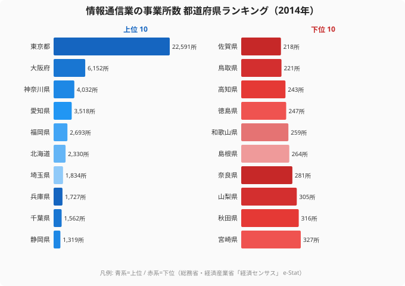
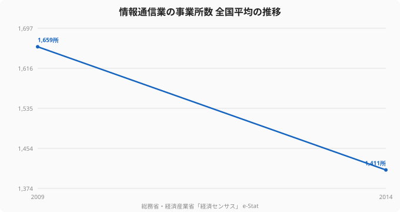

ITエンジニアが転職先を探すとき、選べる求人の数は「その地域にIT企業がどれだけあるか」に大きく左右される。総務省・経済産業省「経済センサス」をもとにした情報通信業の事業所数を見ると、東京都は22,591所で群を抜く。最下位の佐賀県は218所で、その差は約103倍にのぼる。

求人の母数そのものが地域でこれだけ違えば、地元だけで転職活動をする限り、地方在住者の選択肢は構造的に狭まる。本記事ではIT企業（情報通信業の事業所）の地理的分布を可視化し、求人の偏りの中で地方エンジニアが取りうる戦略を考える。

> [!NOTE]
> データは総務省・経済産業省「経済センサス」における情報通信業の事業所数（2014年）です。やや古い年次ですが、IT企業の地理的集中という構造を把握する目的で用います。事業所数は本社・支社を含み、企業規模は反映しません。この年次の古さに関する補足は本記事末尾でまとめて扱います。

## 情報通信業の事業所数ランキング — 東京が突出

上位は東京都（22,591所）、大阪府（6,152所）、神奈川県（4,032所）、愛知県（3,518所）、福岡県（2,693所）。2位の大阪でも東京の3割に満たない。下位は佐賀県（218所）、鳥取県（221所）、高知県（243所）。全国平均は1,411所だが、これは東京が大きく押し上げた値で、中位（24位前後）の栃木県は509所にとどまる。

中位県でも東京とは2桁の差があり、求人母数は上位数都府県へ極端に偏在している。地元の事業所数に依存する限り、多くの県のエンジニアは選べる求人の絶対数で不利を背負う。

<source-link href="/ranking/number-of-establishments-information-communication">情報通信業の事業所数ランキングを詳しく見る</source-link>

## 求人の母数が100倍違うという意味

事業所数の差は、そのまま求人の母数の差につながる。京都府は13位（1,044所）、沖縄県は18位（668所）と地方の中核県でも東京とは1桁から2桁の差があり、地元の求人だけを見れば選択肢は限られる。

> [!WARNING]
> 求人の母数が少ない地域では、(1) 希望条件に合う求人に出会いにくい、(2) 年収交渉の比較対象が少ない、という二重のハンデが生じる。これは個人の能力の問題ではなく、市場の地理的な偏りによる構造的な制約だ。

しかも全国平均の事業所数は2009年の1,659所から2014年の1,411所へと減少しており、地方ほど統廃合の影響を受けやすい。地元市場の縮小は、地方エンジニアにとって無視できないリスクだ。

## 受託中心の地方IT、その先のキャリア

地方の情報通信業は、東京の元請けから仕事を請ける「受託・下請け」の構造になりやすいと指摘されてきた。事業所数の少なさに加え、地元IT企業が二次・三次請けに置かれれば、扱える案件の単価や技術領域も限られがちだ。

> [!NOTE]
> 受託・下請け構造は本記事のデータ（事業所数のみ）からは直接読み取れない、業界で一般に語られる傾向です。事業所数の偏りがその一因と推測されますが、断定はできません。

この構造から抜け出す道は2つある。リモートで都市部の元請け・自社開発企業に直接所属して上流の案件に関わるか、特定技術への専門特化で地理に依存しない市場価値を築くか。いずれも「地元の受託案件の枠内で消耗しない」ための戦略だ。

## まとめ — 求人の地図を「全国」に塗り替える

情報通信業の事業所数が示すのは、IT求人の母数が極端に東京へ偏っているという事実だ。ただし、これは2014年の物理拠点の分布であって、いまや「働ける場所」とは一致しない。その後の十年で自社開発企業やスタートアップを中心に居住地不問の採用が広がり、地方在住者が都市部の求人にアクセスできる度合いは当時とは比べものにならない。

つまり求人の絶対数という地理のハンデは、全国・フルリモートを射程に入れた瞬間に大きく薄まる。母数の少なさは「地元に閉じたとき」だけ効く制約だ。重要なのは地元に何社あるかではなく、自分がアクセスできる求人が全国にいくつあるか──居住地を問わず全国・フルリモートの求人を比較できるエンジニア専門の転職エージェントは、その視野を一度に広げる手段になる。

<source-link href="/ranking/telework-rate">都道府県別テレワーク実施率ランキングも見る</source-link>

### 関連記事・次に読むデータ

- [IT産業が集積する県ランキング](/ranking/gross-prefectural-product-information-communication-h27) — 産業規模の一極集中
- [テレワークで働ける県・働けない県](/ranking/telework-rate) — リモートで求人を全国化する
- [ソフトウェアエンジニアの年収ランキング](/ranking/software-engineer-annual-income) — 年収の地域格差
- [労働・賃金カテゴリの統計一覧](/category/laborwage) — 産業・賃金の関連ランキング

## データ出典

- 総務省・経済産業省「経済センサス」（e-Stat 統計データ、2009年・2014年）
- 情報通信業の事業所数。本社・支社を含み、企業規模は反映しません
