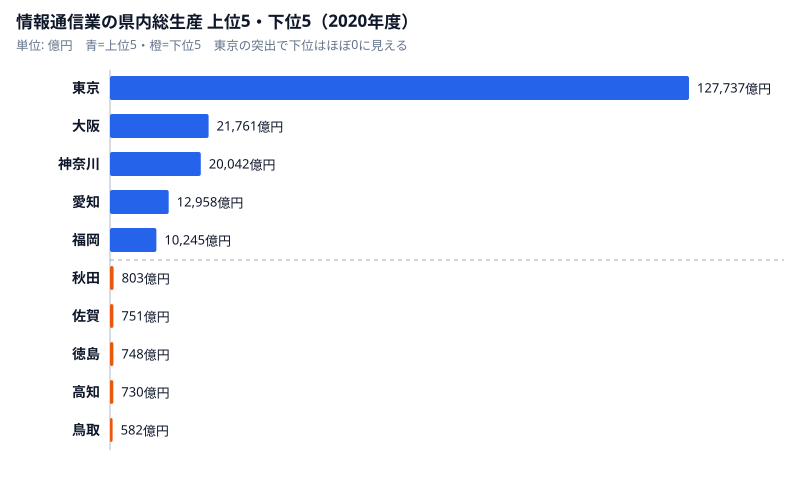

「ITエンジニアの求人は、結局のところ東京に集中している」——転職を考えたことがある人なら、一度は感じたことがあるはずだ。この実感は、産業規模のデータではっきりと裏づけられる。内閣府「県民経済計算」をもとにした2020年度の情報通信業の県内総生産を見ると、東京都は約12.8兆円（127,737億円）で群を抜く。最下位の鳥取県は582億円で、その差は実に約219倍にのぼる。

これは47都道府県の指標の中でも極端な一極集中だ。本記事では、IT産業がどれほど東京に偏っているのかを可視化し、その構造が地方在住エンジニアのキャリアにとって何を意味するのかを考える。

> [!NOTE]
> データは内閣府「県民経済計算」における情報通信業の県内総生産（名目、2020年度）です。県内で生み出された付加価値の総額で、企業の本社機能が東京に集中していることが数値に強く反映されます。

## IT産業の県内総生産ランキング — 東京が圧倒的

まず全体像を押さえる。上位は東京都（127,737億円）、大阪府（21,761億円）、神奈川県（20,042億円）、愛知県（12,958億円）、福岡県（10,245億円）。2位の大阪ですら東京の6分の1以下で、東京の突出ぶりが際立つ。一方、下位は鳥取県（582億円）、高知県（730億円）、徳島県（748億円）と続く。全国平均は5,903億円だが、東京が平均を極端に押し上げており、多くの県は平均を大きく下回る。分布の中位（24位前後）は栃木県の1,665億円で、上位・下位の極端さに比べ、多くの県は中央付近に集まっている。中位県ですら東京とは2桁の差があり、上位数県だけで全国の大半を占める典型的な一極集中型の分布だ。地元の市場規模を頼りにする限り、大多数の県のエンジニアは構造的に不利な側に置かれることになる。産業の集積地図と、エンジニアが実際に働ける場所の地図は、リモート前提なら一致させる必要はない。集積が東京にあっても、その仕事へアクセスする回線は全国どこにも引ける。

<source-link href="/ranking/gross-prefectural-product-information-communication-h27">情報通信業の県内総生産ランキングを詳しく見る</source-link>

## なぜここまで一極集中するのか — 本社機能と発注構造

IT産業が東京に集中する最大の理由は、企業の本社機能と発注元（クライアント）が東京に集まっているからだ。システム開発は発注元の近くに開発拠点を置く慣行が根強く、結果として大手IT企業・元請けが東京に集積する。地方の事業所は、その下請け・受託の位置に置かれやすい。

> [!WARNING]
> ただし「IT産業の規模が小さい県＝エンジニアが活躍できない県」ではない。県内総生産はあくまで“その県に立地する事業所”が生み出した付加価値であり、リモートワークで都市部の企業に所属すれば、住む県の産業規模とは無関係に働ける。一極集中は「物理的な勤務地」に縛られたときにだけ効く制約だ。

京都府は14位（2,897億円）、沖縄県は19位（1,844億円）と、地方の中核県でも東京とは2桁の差がある。地元の求人だけを見ていると、選択肢は驚くほど限られてしまう。

## 一極集中を「リモート」で乗り越える

IT産業の219倍という一極集中は、裏を返せば「地元の求人に頼る限り、地方エンジニアは構造的に不利」ということを意味する。だが、この不利は勤務地を前提にした場合の話だ。

<source-link href="/ranking/telework-rate">都道府県別テレワーク実施率ランキングも見る</source-link>

> [!TIP]
> フルリモート前提で求人を探せば、東京の企業に所属しながら地方に住むという働き方が選べる。IT産業の集積は東京にあっても、その仕事にアクセスする手段はリモートで全国に開かれている。「住む場所」ではなく「所属する企業」を変えることが、一極集中への現実的な答えになる。

## 産業の地図に縛られないキャリアへ

情報通信業の県内総生産が示すのは、IT産業の“物理的な地図”が東京に偏っているという事実だ。しかし、エンジニアの仕事はネット越しに完結できる。産業集積の地図と、自分が働ける場所の地図は、もはや一致しなくてよい。

地方に住みながら都市部水準の企業・年収を狙うなら、フルリモート求人に強い転職エージェントの活用が近道だ。エンジニア専門のエージェントなら、居住地不問・フルリモートの求人を条件に絞り込めるため、産業の一極集中というハンデを実質的に無効化できる。

## 集積のメリットを「リモートで取りに行く」

産業の一極集中には、本来メリットがある。企業・人材・情報・案件が一カ所に集まることで、知識の交換が活発になり、キャリアの機会も増える。問題は、そのメリットが「東京に物理的にいる人」だけのものだった、という点にある。

ところが、リモートワークの普及はこの前提を崩した。オンラインのコミュニティ、勉強会、業務のやり取りを通じて、東京に集積した情報や案件に地方からでもアクセスできるようになった。つまり、集積のメリットを「移住」ではなく「接続」で取りに行けるようになったのだ。

地方在住エンジニアにとっての最適解は、「東京に住む」ことでも「地元に閉じる」ことでもない。生活コストの低い地域に住みながら、東京の企業・案件にリモートで接続する——この“いいとこ取り”が、一極集中の時代における現実的な戦略になる。産業の地図が東京に偏っていても、その果実は全国から受け取れる。

この発想の転換は、地方創生の文脈でも意味を持つ。優秀なエンジニアが地方に住みながら都市部の高単価案件に従事すれば、その所得は居住地の地域経済に還流する。一極集中した産業の果実を、リモートを通じて全国へ再分配する——個人のキャリア選択が、結果として地域の経済循環にも貢献しうるのだ。

## 集積は「移住」では取り切れない

一極集中を前にすると「では東京へ移ればよい」と考えがちだが、移住の費用対効果はむしろ下がっている。都心の高い家賃、長い通勤、生活コストの上昇が、せっかくの年収増の多くを相殺してしまうからだ。一方で、産業集積の核心である案件・人脈・最新情報は、オンラインのコミュニティや勉強会、リモートの実務を通じて地方からでも十分に手が届くようになった。つまり集積のうち「物理的に東京にいないと得られないもの」は年々小さくなっている。移住という高コストな手段で集積を丸ごと取りに行くより、住む場所は最適化したまま、必要な接点だけをリモートで確保する方が、いまの時代には合理的だ。移住のコストとリターンを冷静に並べれば、いまの時代にわざわざ東京へ住まいを移す必然性は、以前よりずっと小さくなっていることがわかる。

### 関連記事・次に読むデータ

- [情報通信業の事業所が多い県](/ranking/number-of-establishments-information-communication) — IT企業の地理的分布
- [テレワークで働ける県・働けない県](/ranking/telework-rate) — リモートで集中を乗り越える
- [ソフトウェアエンジニアの年収ランキング](/ranking/software-engineer-annual-income) — 年収の地域格差
- [労働・賃金カテゴリの統計一覧](/category/laborwage) — 産業・賃金の関連ランキング

## データ出典

- 内閣府「県民経済計算」（e-Stat 統計データ、2020年度）
- 情報通信業の県内総生産（名目）。企業の本社機能の立地が数値に強く影響します
