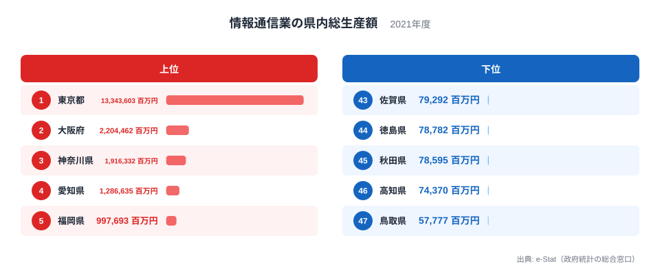
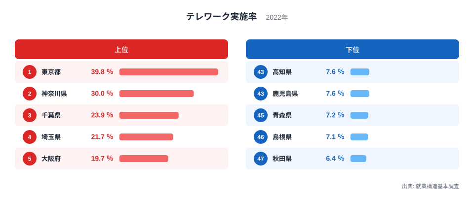

「ITエンジニアの求人は、結局のところ東京に集中している」——転職を考えたことがある人なら、一度は感じたことがあるはずです。求人の数そのものはこのデータにありませんが、IT産業の規模の偏りなら、県内総生産で確かめられます。2021年度の情報通信業の県内総生産は、[東京都](/areas/13000)が133,436億円（兆円に直すと約13.3兆円）で最も大きく、最下位の[鳥取県](/areas/31000)は578億円でした。その差は約231倍です。

東京都の値は、47都道府県の合計の約47％にあたります。一方、2021年の総人口で見ると、東京都は47都道府県の合計の約11％です。「東京は人が多いからIT産業も大きい」と考えたくなりますし、実際に人口の多い順とIT産業の大きい順はよく似ています。ただ、人口に比例するなら東京都の割合は約11％にとどまるので、実際の約47％は人口の違いだけでは説明できない大きさです。この記事では、東京都への偏りの大きさを確かめたうえで、人口との関係と、テレワーク実施率の地域差をデータで確かめます。そのうえで、東京都以外に住む人がこのデータをどう読めばよいかを整理します。

> [!NOTE]
> 情報通信業の県内総生産は、名目（2015年基準）の値で、情報通信業の生産額から中間投入を除いた付加価値です。年度計であり、企業の売上高ではありません。図の単位は百万円で、本文では100百万円を1億円として億円に直しています。

## IT産業の県内総生産ランキング — 東京都の割合は約47％

図は、2021年度の情報通信業の県内総生産額について、大きい上位5都道府県と、小さい下位5都道府県を示しています。上位は東京都が133,436億円、大阪府が22,045億円、神奈川県が19,163億円、愛知県が12,866億円、福岡県が9,977億円です。下位は鳥取県が578億円、高知県が744億円、秋田県が786億円、徳島県が788億円、佐賀県が793億円です。

東京都は2位の大阪府の約6倍、3位の神奈川県の約7倍、5位の福岡県の約13倍です。上位5都道府県の合計は47都道府県の合計の約70％を占め、6位以下の42道府県を合わせても約30％にとどまります。東京都ひとつで、残る46道府県の合計（147,554億円）の約90％に相当します。

分布の中位にあたる24位は三重県の1,630億円で、東京都はその約82倍です。1,000億円に届かない県は11県、2,000億円に届かない県は30県あり、47都道府県の半数を超える県が2,000億円未満に集まっています。上位の数都道府県だけで全体の大半を占める、偏りの大きい分布です。

下位は、値の差が小さいことが特徴です。秋田県・徳島県・佐賀県の3県は786億円から793億円に並び、最大と最小の差は1％未満です。下位5県をすべて合わせても3,688億円で、東京都の約36分の1にとどまります。下位の並びでは順位が一つ違うことに大きな意味はなく、東京都との差の大きさのほうが重要です。

<source-link href="/ranking/gross-prefectural-product-information-communication-h27">情報通信業の県内総生産額ランキングをもっと見る</source-link>

## 人口だけでは説明できない — 東京都の人口割合は約11％、IT産業の割合は約47％

都道府県を人口の多い順と、情報通信業の県内総生産の多い順に並べると、順位はよく似ています。47都道府県の順位相関係数は0.96で、東京都を除く46道府県でも0.96です。人口が多い県ほどIT産業が大きいという、素直な傾向があります。県内総生産は年度、総人口は暦年の値ですが、ここでは同じ2021年として比べています。

ただ、割合で見ると東京都だけが目立ちます。東京都の2021年の総人口は約1,401万人で、47都道府県の合計約1億2,550万人の約11％です。これに対して、IT産業では東京都が47都道府県の合計の約47％を占め、人口の割合の4倍を超えます。大阪府は、IT産業の割合が約7.8％、人口の割合が約7.0％でほぼ同じです。神奈川県・福岡県・愛知県は、IT産業の割合が人口の割合の0.8倍から0.9倍です。県内総生産は働く場所で、人口は住む場所で数えるため、他県に通勤する人が多い県では、この比が小さく出ます。IT産業の割合が人口の割合以上なのは、47都道府県のうち東京都と大阪府の2つだけです。

下位の県も、この見方で読み直せます。東京都を除く46道府県で「IT産業の割合÷人口の割合」を比べると、中央値は約0.5倍です。最下位の鳥取県は0.5倍、下位5県は0.4倍から0.5倍の範囲で、中央値とほとんど変わりません。最下位という順位は、IT産業が特に小さいからというより、人口が小さいことの影響が大きい可能性があります。ただし、人口以外の事情は、このデータだけでは分かりません。

では、東京都だけが人口の割合を大きく超える理由は何でしょうか。大手企業の本社や発注元が東京都に集まり、システム開発の拠点もその近くに置かれやすいことが、偏りの背景にある可能性があります。ただし、この記事で使っているデータは県ごとの付加価値の合計だけで、本社の所在地や発注先、事業所の数、従業者の数は含まれていません。このデータだけでは確かめられません。確かめるには、本社の所在地別の売上や、事業所数と従業者数を県ごとに比べるデータが別に必要です。

## テレワーク実施率も東京都が最も高い — 2位の神奈川県より約10ポイント上

IT産業が東京都に集まっていても、テレワークで東京の仕事に関われるなら、住んでいる県のIT産業が小さいことはそれほど問題にならないかもしれません。そこで、[労働・賃金カテゴリ](/category/laborwage)にあるテレワーク実施率（有業者のうちテレワークを実施した人の割合）を見ます。取得できる年が2022年だけなので、図は2022年の値です。

2022年のテレワーク実施率は、東京都が39.8％で最も高く、神奈川県が30.0％、千葉県が23.9％、埼玉県が21.7％、大阪府が19.7％と続きます。最も低いのは[秋田県](/areas/05000)の6.4％で、島根県が7.1％、青森県が7.2％、高知県と鹿児島県がそれぞれ7.6％です。東京都は2位の神奈川県より約10ポイント高く、秋田県の約6.2倍です。実施率が20％を超えるのは東京都・神奈川県・千葉県・埼玉県の4都県だけです。一方、20県は実施率が10％を下回ります。

> [!WARNING]
> テレワーク実施率は全業種の有業者が対象で、IT関連の職種に限った値ではありません。また、取得できる年が2022年だけのため、情報通信業の県内総生産の2021年度とは1年ずれています。IT職のテレワークの県別の差は、このデータでは確かめられません。

IT産業の県内総生産とテレワーク実施率を並べると、IT産業が大きい都道府県ほどテレワーク実施率も高い傾向があります。47都道府県の順位相関係数は0.73で、東京都を除く46道府県でも0.71なので、東京都ひとつが相関を作っているわけではありません。IT産業の県内総生産の上位5都道府県は東京都・大阪府・神奈川県・愛知県・福岡県で、実施率は福岡県の15.5％から東京都の39.8％の範囲にあります。下位5都道府県は鳥取県・高知県・秋田県・徳島県・佐賀県で、実施率は秋田県の6.4％から佐賀県の9.0％の範囲です。

ただし、この相関はIT産業に固有の関係とは言えません。IT産業は人口の多い都道府県ほど大きいため、人口が両方に共通する要因になっているからです。2021年の総人口とテレワーク実施率の順位相関も0.74（東京都を除く46道府県では0.73）で、IT産業との0.73とほぼ同じです。「IT産業が大きい都道府県ほどテレワークが高い」という傾向は、「人口の多い都道府県ほどテレワークが高い」という傾向とほとんど見分けがつきません。

また、この2つが並ぶことは因果関係を示しません。IT産業が大きいからテレワークが進む、あるいはその逆、と読むことはできません。人口のほかに、企業の規模や業種の構成のような別の共通の要因が、どちらにも影響している可能性がありますが、このデータだけでは確かめられません。

<source-link href="/ranking/telework-rate">テレワーク実施率ランキングをもっと見る</source-link>

## 東京都以外に住む人は、このデータをどう読むか

県内総生産は、県内の事業所で生み出された付加価値を集計した値で、そこで働く人がどの県に住んでいるかを示す値ではありません。したがって、住んでいる県のIT産業が小さいことが、そのままその県に住むエンジニアの選択肢の狭さを意味するとは限りません。

一方で、テレワークは東京都のIT産業に関わる道になりえますが、どの県でも同じように使える道ではありません。実施率が20％を超えた東京都、神奈川県、千葉県、埼玉県の外では、居住地を問わず働ける勤め先が見つけにくい可能性があります。ただし、IT職の求人や働き方のデータはこの記事にないため、確かめられません。

自分の場合を確かめる方法としては、居住地不問を明記した求人を数え、自分の住む県から応募できる件数を見ることが挙げられます。県内総生産の偏りの大きさと、自分が応募できる求人の数は別のものなので、どちらも見たうえで判断するのが現実的です。

## まとめ

- 2021年度の情報通信業の県内総生産は、東京都が133,436億円、最下位の鳥取県が578億円で、約231倍の差があります。
- 東京都の割合は47都道府県の合計の約47％で、上位5都道府県の合計では約70％に達します。
- 人口が多い県ほどIT産業が大きい傾向があります（順位相関係数は0.96）。ただ、IT産業の割合が人口の割合以上なのは東京都と大阪府だけで、東京都は人口割合の約11％に対してIT産業の割合が約47％と、4倍を超えます。
- 2022年のテレワーク実施率も東京都が39.8％で最も高く、秋田県の6.4％の約6.2倍です。IT産業が大きい都道府県ほど実施率が高い傾向がありますが、人口の多い都道府県ほど高い傾向とほぼ同じで、IT産業に固有の関係とは言えず、因果関係も示せません。
- 東京都以外に住む人が東京のIT産業に関われるかは、IT職に限ったデータがないため、この記事では確かめられません。

## データについて

- 情報通信業の県内総生産は、2021年度の名目値（2015年基準）で、単位は百万円です。本文の億円は百万円を100で割った値です。
- 割合は「その県の値÷47都道府県の値の合計」、県どうしの倍率は「東京都の値÷比べる県の値」で計算します。人口との比較の倍率は「その県のIT産業の割合÷その県の人口の割合」で、割合は整数か小数第1位、倍率は整数か小数第1位に丸めています。
- 総人口は[総人口ランキング](/ranking/total-population)の2021年の値で、人口推計（千人単位）です。県内総生産の年度とは期間が一致しません。テレワーク実施率は就業構造基本調査の2022年の値です。
- 順位相関係数は、値の大きい順に順位を付け、同じ値には平均順位を使って計算した、スピアマンの順位相関です。関係の強さの目安であり、原因を示すものではありません。
