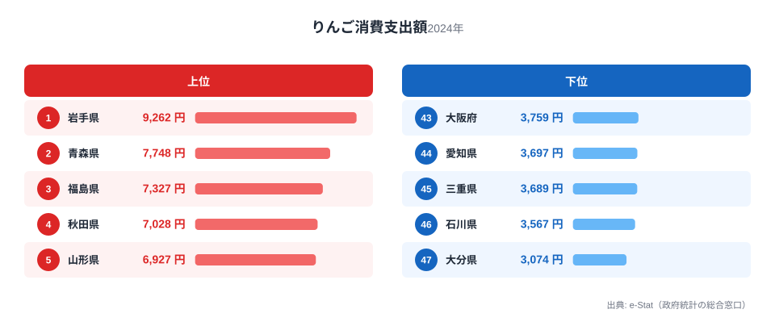
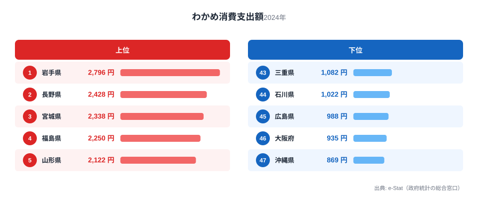
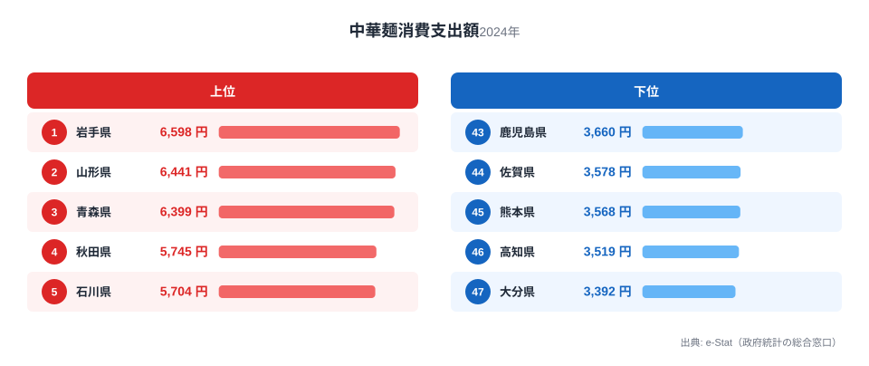

りんごといえば青森、と思われがちですが、家計調査の消費支出額で見ると首位は隣の岩手県です。総務省の家計調査（品目別）で盛岡市の二人以上世帯を見ると、りんご・わかめ・中華めんという3つの品目すべてで、岩手が全国1位に立っています。

青森を上回るりんご、三陸のわかめ、そして盛岡の麺文化を映す中華めん。北の大地と海、そして独自の食文化が、岩手の食卓を豊かにしています。この記事では、3つの全国1位品目を横断しながら、岩手県民の食卓を読み解きます。

> [!NOTE]
> 家計調査の都道府県データは、県庁所在市（岩手県は盛岡市）の二人以上世帯を対象にした年間支出額です。県全体ではなく盛岡市在住世帯の家計簿から見た傾向であり、支出「金額」であって消費「量」そのものではない点にご注意ください。

## りんご — 全国1位9,262円、青森を上回る

<source-link href="/ranking/apple-consumption-expenditure">りんご消費支出額ランキングをもっと見る</source-link>

岩手県のりんご消費支出額は9,262円で全国1位です。2位は生産量日本一で知られる青森県（7,748円）。生産量では青森が圧倒的ながら、消費支出額では岩手が首位という逆転が起きています。岩手も盛岡周辺や県北を中心にりんご栽培が盛んで、地元産の新鮮なりんごが手頃に手に入る環境があります。

生産量日本一の青森が消費で2位にとどまるのは、[青森県の食卓](/blog/aomori-food-culture)でも触れたように、産地では自家消費や贈与でお金を払わずに口に入るりんごが多く、家計調査の購入支出額に表れにくいためと考えられます。岩手は産地でありながら「購入して食べる」比重が高く、消費支出額で首位に立っています。

## わかめ — 全国1位2,796円、三陸の海の恵み

<source-link href="/ranking/wakame-consumption-expenditure">わかめ消費支出額ランキングをもっと見る</source-link>

海の幸ではわかめで全国トップです。わかめの消費支出額も岩手県が2,796円で全国1位。2位の長野県2,428円を上回ります。岩手の三陸海岸は、リアス式海岸の豊かな漁場で育つ「三陸わかめ」の一大産地です。肉厚で歯ごたえのある三陸わかめは全国的なブランドです。

岩手では、わかめの味噌汁や酢の物、めかぶなど、わかめを使った家庭料理が日常的に食卓に上ります。地元でとれた新鮮なわかめが身近にある環境が、わかめの全国一の支出額を支えています。三陸の海の恵みが、岩手の食卓を彩っています。

## 中華めん — 全国1位6,598円、盛岡の麺文化

<source-link href="/ranking/chinese-noodles-consumption-expenditure">中華めん消費支出額ランキングをもっと見る</source-link>

岩手は中華めん（ラーメン用の生めん）の消費支出額でも全国1位（6,598円）です。2位の山形県6,441円を上回ります。盛岡は「盛岡三大麺」（わんこそば・盛岡冷麺・じゃじゃ麺）で知られる麺文化の街で、なかでも盛岡冷麺やじゃじゃ麺は中華めん系の麺を使う名物です。

外食だけでなく家庭でも中華めんを買って調理する習慣が根づいており、寒冷地で温かい麺類の需要が高いことも東北各県が中華めん上位に並ぶ一因です。りんご・わかめ・中華めんと、大地・海・麺文化の3つで全国トップに立つのが岩手の食卓の特徴です。

> [!WARNING]
> 家計調査は支出金額の調査であり、消費量そのものではありません。物価や単価の違いも金額に影響します。特に産地では自家消費や贈与が支出額に表れにくいため、生産量の順位と消費支出額の順位がずれることがある点にご注意ください。

## 岩手の食卓を貫くもの

岩手県民の食卓を貫くのは、「北の大地と三陸の海、そして独自の麺文化」です。青森を上回るりんご、三陸わかめ、盛岡の麺文化を映す中華めん。広大な大地と豊かな三陸の海、そして盛岡三大麺という食文化が重なって、岩手ならではの食卓が形づくられています。

隣県の青森（りんご2位・ほたて1位・カップ麺1位）と並べると、同じ北東北でもりんごの消費支出額で岩手が青森を上回るという逆転が起きており、産地と消費地の関係の複雑さがうかがえます。県ごとの食文化の違いが、家計の数字に表れています。

> [!TIP]
> りんごのように「生産量1位の県と消費支出額1位の県が異なる」品目は、産地での自家消費・贈与が家計調査に表れにくいことが背景にあります。生産量と消費支出額の両方を見ると、その食材が「買って食べる」ものか「もらって食べる」ものかが見えてきます。

## まとめ

- りんご消費支出額は岩手県が全国1位（9,262円）、生産量日本一の青森を消費で上回る
- わかめも全国1位（2,796円）、三陸わかめの一大産地
- 中華めんも全国1位（6,598円）、盛岡三大麺に代表される麺文化
- 北の大地・三陸の海・盛岡の麺文化が、岩手の3品目全国1位の豊かな食卓を支える

岩手県の他の統計は[岩手県の地域プロフィール](/areas/03000)、食品・家計消費の地域差は[経済カテゴリ一覧](/category/economy)からご覧いただけます。

## データ出典

総務省統計局「家計調査（品目別）」（2024年、都道府県庁所在市 二人以上世帯）をもとに、e-Stat（政府統計の総合窓口）経由で整備したデータを使用しています。
