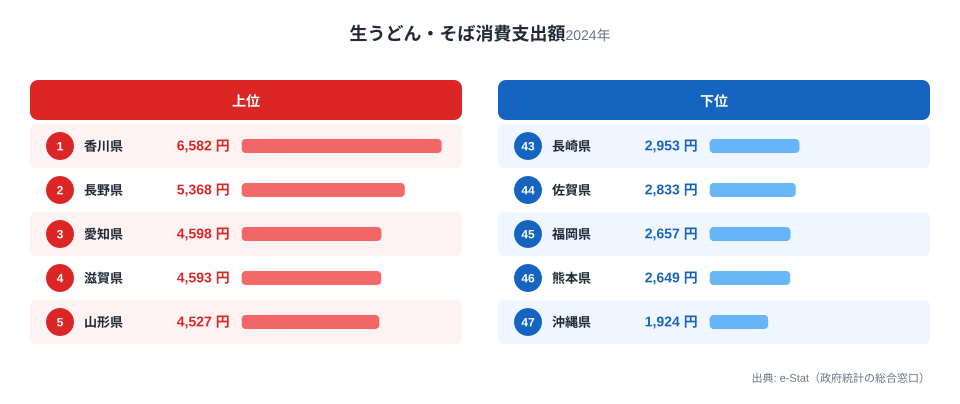
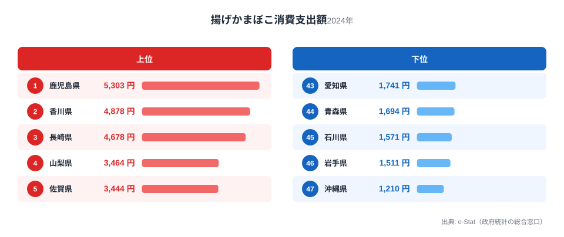
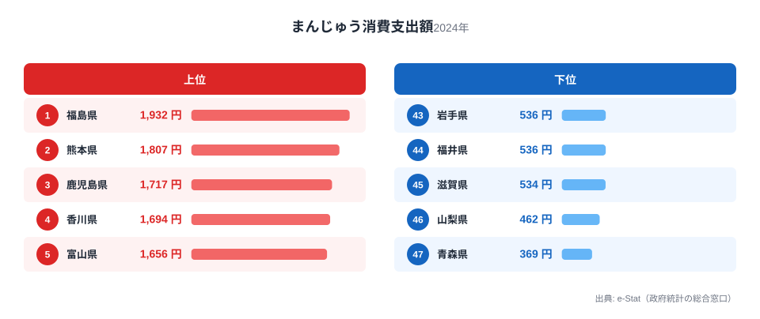
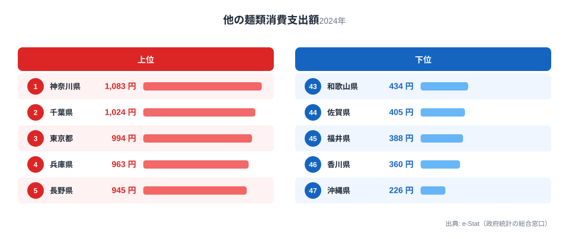

香川県は「うどん県」を公式に名乗る唯一の都道府県です。総務省の家計調査で生うどん・そばへの支出額を見ると、香川県は年間6,582円と全国1位。2位の長野県5,368円を1,000円以上引き離す独走ぶりです。

ところが同じ家計調査には、もう一つ気になる数字があります。うどん以外の麺類（そうめん・中華麺・パスタなど乾麺以外の「他の麺類」）への支出は年間360円で、全国46位。うどんに6,582円を使う県が、他の麺には360円しか使わない。この記事では、香川県の家計調査データから見える「うどん一極集中」の食卓を、揚げかまぼこ・まんじゅうという2つの上位品目とあわせて読み解きます。

> [!NOTE]
> 本記事の数値は総務省統計局「家計調査（品目別）」の**都道府県庁所在市・二人以上世帯**における年間支出額（2024年）です。香川県は高松市のデータが対象になります。消費量ではなく金額ベースの統計である点にご注意ください。

## 生うどん・そば消費支出額 — 全国1位6,582円、2位に1,000円以上の差

<source-link href="/ranking/fresh-udon-soba-consumption-expenditure">生うどん・そば消費支出額ランキングをもっと見る</source-link>

香川県の生うどん・そば消費支出額は6,582円で全国1位です。2位の長野県（全国2位・5,368円）や3位の愛知県（全国3位・4,598円）を大きく引き離しており、香川県だけが突出した数字を示しています。最下位は沖縄県（全国47位・1,924円）で、香川県との差は3.4倍にのぼります。

香川県は讃岐うどんの本場として知られ、県内には製麺所・うどん店が密集しています。セルフサービス形式の安価な店舗が生活動線に溶け込んでいることもあり、うどんは外食よりもまず「家庭で茹でて食べるもの」として定着しています。生麺タイプのうどんが日常的にスーパーや製麺所で手に入りやすい環境が、支出額を押し上げている一因と考えられます。長野県・愛知県・滋賀県など上位に並ぶ県も、そば処や独自の麺文化を持つ地域が多く、麺類消費に地域の食文化が色濃く反映されていることがわかります。

## 揚げかまぼこ消費支出額 — 全国2位4,878円、瀬戸内の練り物文化

<source-link href="/ranking/deep-fried-fish-cake-consumption-expenditure">揚げかまぼこ消費支出額ランキングをもっと見る</source-link>

揚げかまぼこの消費支出額では、香川県は4,878円で全国2位です。1位は鹿児島県（全国1位・5,303円）、3位は長崎県（全国3位・4,678円）と続き、上位は九州・瀬戸内といった沿岸部の県が占めています。

香川県は瀬戸内海に面し、小型底引き網漁などで水揚げされる小魚を練り物に加工する食文化が根付いています。うどんのだしやトッピングとして揚げかまぼこ（天ぷら・じゃこ天に類する練り物）が使われる場面も多く、うどん文化と練り物文化が食卓の中で結びついている点が特徴です。鹿児島や長崎も同様に、練り物を惣菜や酒の肴として日常的に消費する食文化を持つ地域であり、瀬戸内海・九州沿岸というエリアに共通する魚食文化の広がりがうかがえます。

## まんじゅう消費支出額 — 全国4位1,694円、和菓子どころとしての一面

<source-link href="/ranking/manju-consumption-expenditure">まんじゅう消費支出額ランキングをもっと見る</source-link>

まんじゅうの消費支出額は1,694円で全国4位です。1位の福島県（全国1位・1,932円）、2位の熊本県（全国2位・1,807円）、3位の鹿児島県（全国3位・1,717円）に次ぐ水準で、香川県も上位グループに入っています。

香川県は和三盆をはじめとする和菓子文化が古くから栄えた地域で、栗林公園周辺や高松市中心部には老舗和菓子店が多く残っています。冠婚葬祭や来客時に和菓子を用意する慣習が今も残っており、日常の茶請けとしてまんじゅうを購入する家庭が多いことが支出額に表れていると考えられます。上位に並ぶ福島・熊本・鹿児島もそれぞれ地元銘菓を持つ地域であり、まんじゅうの消費が地域の和菓子文化の厚みと連動している様子がうかがえます。

## 他の麺類消費支出額 — 全国46位360円、うどん一極集中の裏側

<source-link href="/ranking/other-noodles-consumption-expenditure">他の麺類消費支出額ランキングをもっと見る</source-link>

うどん以外の麺類（そうめん・中華麺・パスタなど）への支出を見ると、香川県は360円で全国46位です。1位の神奈川県（全国1位・1,083円）とは3倍以上の差があり、47位の沖縄県（全国47位・226円）に次いで低い水準です。

これは香川県の食卓が「麺類全般が好き」なのではなく、うどんに極端に特化していることを示しています。生うどん・そばへの支出が全国1位である一方、それ以外の麺類への支出が最下位クラスというのは、家庭の麺類予算がうどんにほぼ集中して配分されている可能性を示唆しています。都市部の神奈川・千葉・東京が上位に並ぶのは、中華麺やパスタなど多様な麺料理を取り入れる食文化が発達しているためと考えられ、香川県との対比が鮮明です。

> [!WARNING]
> 支出額は消費量そのものではありません。うどんの単価が安いことを踏まえると、香川県の実際の消費量は支出額の差以上に大きい可能性があります。また讃岐うどんの外食（うどん店での飲食）は別品目「そば・うどん外食」に分類され、本記事の数値には含まれていません。

## 香川の食卓を貫くもの

うどん・揚げかまぼこ・まんじゅう・他の麺類という4つのデータを並べると、香川県の食卓を貫く一本の軸が見えてきます。それは「うどんを軸にした麺類予算の一極集中」です。生うどん・そばに全国トップの支出をかける一方で、他の麺類にはほとんど予算を割かない。この対照は、うどんが単なる好物の一つではなく、香川県の食生活の中心に据えられていることを物語っています。

揚げかまぼこは瀬戸内の魚食文化とうどん文化が交差する品目として、まんじゅうは和菓子どころとしての一面として、それぞれ香川県の食卓を補強する形で上位に並んでいます。麺類にここまで極端な偏りを見せる県は珍しく、隣県の[徳島の食卓](/blog/tokushima-food-culture)がさつまいも・ちくわ・海苔と複数分野に強みが分散しているのとは対照的です。

> [!TIP]
> 「うどんに強い県=麺類全般に強い」と考えがちですが、香川県のデータはその逆を示しています。1つの品目への極端な集中は、むしろ他の同カテゴリ品目の順位を押し下げる要因になり得ます。ランキングを読むときは、隣接する品目もあわせて確認すると、その県の食文化の輪郭がより立体的に見えてきます。

## まとめ

- 生うどん・そば消費支出額は6,582円で全国1位、2位長野県（5,368円）を1,000円以上引き離す
- 揚げかまぼこは4,878円で全国2位、瀬戸内・九州沿岸に共通する練り物文化を反映
- まんじゅうは1,694円で全国4位、和三盆をはじめとする和菓子どころとしての一面
- 一方で他の麺類（そうめん・中華麺・パスタ等）は360円で全国46位と、うどんへの極端な偏りを示す

香川県の家計データをさらに詳しく見たい方は、[香川県の地域プロフィール](/areas/37000)や[経済カテゴリ一覧](/category/economy)もあわせてご覧ください。

## データ出典

総務省統計局「家計調査（品目別）」2024年、都道府県庁所在市・二人以上世帯（e-Stat 経由で整備）
