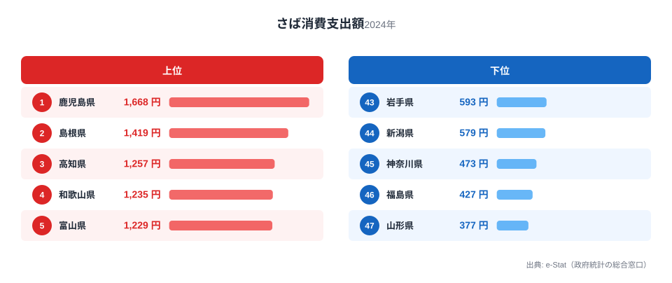
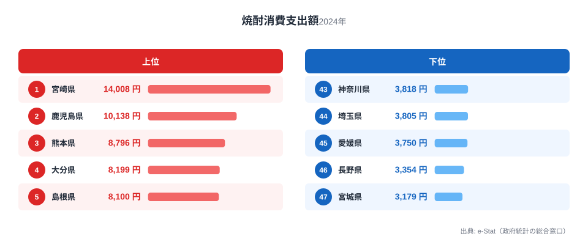
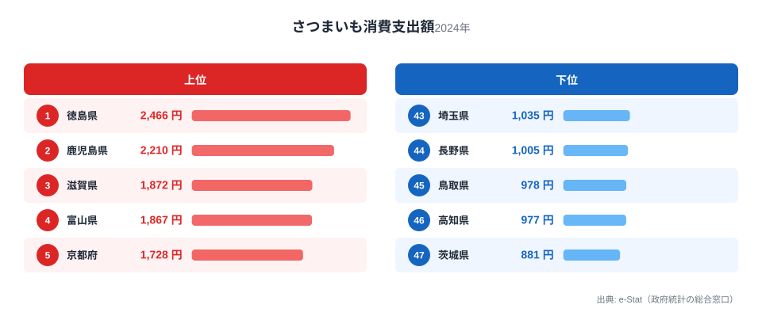

鹿児島県の食卓を家計調査で見ると、意外な形が浮かび上がります。さば消費支出額は1,668円で全国1位。ところが「鹿児島といえば」の代表格である焼酎は10,138円で宮崎県（全国1位・14,008円）に次ぐ2位、さつまいもも2,210円で徳島県（全国1位・2,466円）に次ぐ2位です。

つまり鹿児島の食卓は「圧倒的1位」と「僅差の2位」が同居しています。全国的な名産イメージが強い焼酎とさつまいもで、なぜ隣接県に首位を譲るのか。逆に、さばのようにイメージの薄い魚が、なぜ全国トップの支出額を記録するのか。総務省の家計調査（品目別）から、さば・焼酎・さつまいもという3つの品目を横断しながら、鹿児島の食卓の輪郭を読み解きます。

> [!NOTE]
> この記事のデータは総務省統計局「家計調査（品目別）」に基づく、都道府県庁所在市（鹿児島市）における二人以上世帯の年間消費支出額です。世帯単位の金額であり、消費量そのものではありません。

## さば — 全国1位1,668円、なぜ鹿児島が「さば県」なのか

<source-link href="/ranking/mackerel-consumption-expenditure">さば消費支出額ランキングをもっと見る</source-link>

鹿児島市の二人以上世帯は、さばに年間1,668円を支出しており、これは全国1位です。2位の島根県（全国2位・1,419円）、3位の高知県（全国3位・1,257円）と続きますが、鹿児島は突出した数字を残しています。最下位の山形県（全国47位・377円）と比べると、その差は4.4倍にのぼります。

鹿児島がさば消費で全国トップに立つ背景には、東シナ海に面した漁場の近さがあります。鹿児島県の枕崎港・山川港はさばやかつおの水揚げが盛んな漁業拠点で、新鮮なさばが日常的に食卓へ上りやすい流通環境にあります。焼き魚や煮付けとしてだけでなく、さば節などの加工品文化も根付いており、他の魚種以上にさばが「日常のおかず」として定着していると考えられます。

## 焼酎 — 全国2位10,138円、なぜ宮崎県（全国1位・14,008円）に届かないのか

<source-link href="/ranking/shochu-consumption-expenditure">焼酎消費支出額ランキングをもっと見る</source-link>

鹿児島は焼酎に年間10,138円を支出し、全国2位です。全国1位は宮崎県（全国1位・14,008円）で、その差は3,870円。3位の熊本県（全国3位・8,796円）を鹿児島は上回っており、南九州3県が上位を占める構図は明確です。最下位の宮城県（全国47位・3,179円）と比べると3倍を超える開きがあります。

鹿児島は芋焼酎の本場として全国的な知名度を持ちますが、支出額そのものでは宮崎県（全国1位・14,008円）に及びません。これは焼酎の「知名度」と「日常の消費量」が必ずしも一致しないことを示しています。宮崎県は麦焼酎や米焼酎など焼酎の種類が多様で家庭内消費の裾野が広いのに対し、鹿児島は芋焼酎という単一カテゴリでのブランド力が強い一方、県外への出荷・観光土産としての消費が家計調査の対象外（世帯の家計支出）になっている可能性があります。名産地としての存在感と、家計調査が捉える「家庭内消費額」は異なる指標であることに注意が必要です。

## さつまいも — 全国2位2,210円、徳島県（全国1位・2,466円）との僅差

<source-link href="/ranking/sweet-potato-consumption-expenditure">さつまいも消費支出額ランキングをもっと見る</source-link>

さつまいもの消費支出額は2,210円で全国2位。全国1位の徳島県（全国1位・2,466円）とは256円差という接戦です。3位の滋賀県（全国3位・1,872円）を鹿児島は上回っており、最下位の茨城県（全国47位・881円）とは2.8倍の差があります。

鹿児島県はさつまいもの作付面積・収穫量で全国トップクラスを誇る大産地です。名前の由来も鹿児島（薩摩）にあるとされるほど、地域と結びつきの強い作物です。それでも支出額で徳島県（全国1位・2,466円）にわずかに及ばないのは、鹿児島では収穫したさつまいもの多くが焼酎の原料や自家消費・贈答用に回り、店頭での購入という「家計支出」として計上されにくい構造があるためと考えられます。産地であることと、家計調査上の購入額の順位は必ずしも一致しません。

> [!WARNING]
> 家計調査の支出額は「購入した金額」であり、消費量そのものではありません。自家栽培・贈答・県外出荷分は集計に含まれないため、鹿児島のように焼酎・さつまいもの生産量が全国トップクラスでも、家計の購入額としては近隣県に届かないケースがあります。

## 鹿児島の食卓を貫くもの

さば・焼酎・さつまいもという3品目を通して見えるのは、「生産地であること」と「家計での購入額が全国1位になること」は別軸だという点です。さばは漁獲から食卓までの距離が近く直接消費に結びつきやすい一方、焼酎とさつまいもは加工・出荷・贈答という別の流通経路を持つため、生産量トップの実力がそのまま家計支出の首位には表れません。鹿児島の食卓は「産地の強さ」と「日常の購入行動」がずれる、南九州らしい二重構造を持っています。

同じ南九州でも[宮崎の食卓](/blog/miyazaki-food-culture)は焼酎で全国1位を守りながら、ほたてでは全国最下位という別の対比を見せています。焼酎という同じ品目でも、隣県同士でトップと2位が分かれる点は比較する価値があります。

> [!TIP]
> 焼酎・さつまいものように「産地としてのイメージが強いのに支出額では2位」という品目は、生産量ランキングと家計調査ランキングを見比べることで、地域内消費と県外出荷のバランスを読み解くヒントになります。鹿児島のように加工品・原料としての出荷が多い産地ほど、この二つの順位に差が出やすいと考えられます。

## まとめ

- さば消費支出額は1,668円で全国1位。2位の島根県（全国2位・1,419円）を大きく引き離す
- 焼酎は10,138円で全国2位。全国1位は宮崎県（全国1位・14,008円）で、南九州3県が上位を占める
- さつまいもは2,210円で全国2位。全国1位の徳島県（全国1位・2,466円）とは僅差の256円差
- 産地としての強さ（焼酎・さつまいも）と家計支出の順位が必ずしも一致しない、鹿児島特有の二重構造がうかがえる

鹿児島県の地域プロフィールは[鹿児島県のページ](/areas/46000)で確認できます。家計に関する他の指標は[経済カテゴリ一覧](/category/economy)からまとめて見られます。

## データ出典

総務省統計局「家計調査（品目別）」2024年、都道府県庁所在市（鹿児島市）二人以上世帯のデータを使用しています。e-Stat（政府統計の総合窓口）経由で取得しました。
