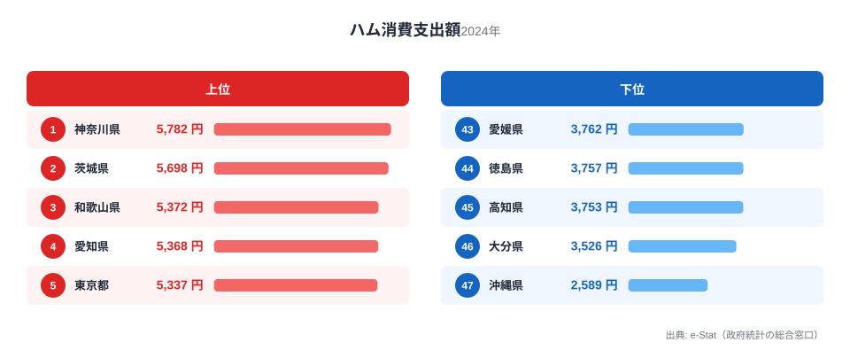
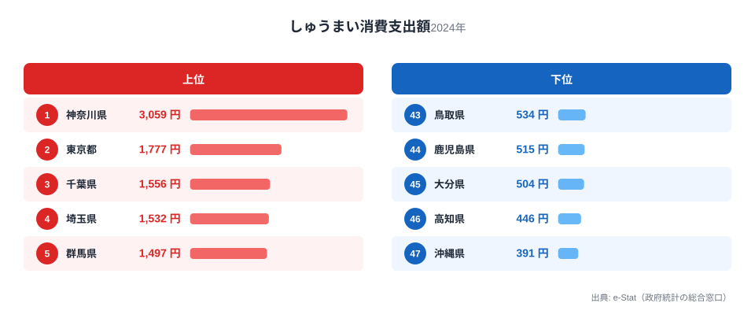
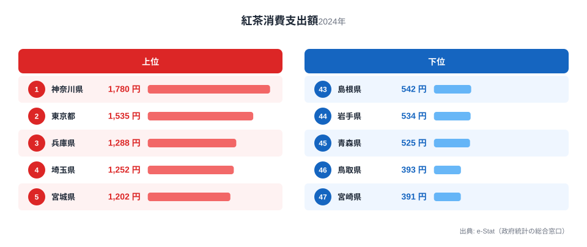
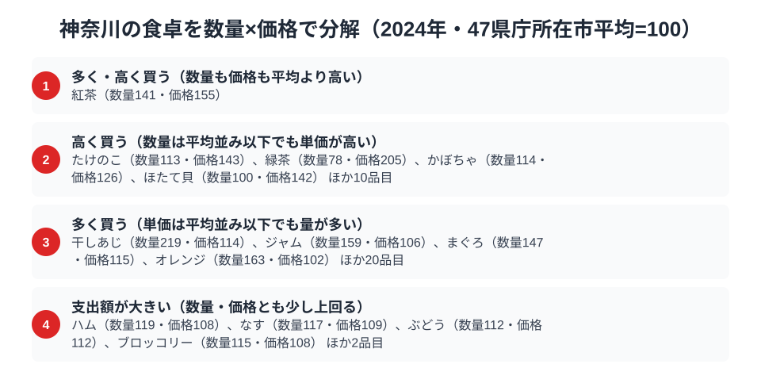

「シウマイ弁当」と聞いて崎陽軒を思い浮かべる人は多いはずです。実は神奈川県は、しゅうまいの消費支出額で全国1位というだけでなく、ハムと紅茶でも同時に全国トップに立っています。1つの県が異なる系統の食品で3冠を取るのは珍しく、家計調査の502品目を見渡してもそう多くはありません。

総務省「家計調査」の2024年データ（都道府県庁所在市、二人以上世帯）を確認すると、神奈川県（横浜市）はハム消費支出額5,782円、しゅうまい消費支出額3,059円、紅茶消費支出額1,780円でいずれも47都道府県中1位でした。ハムは洋食文化、しゅうまいは中華料理、紅茶は喫茶文化と、出自の異なる3つの食が同じ街で首位を取っているのがこの記事の出発点です。この記事では、それぞれの数字を見た上で、なぜ横浜という港町にこの組み合わせが根付いたのかを読み解きます。

> [!NOTE]
> 本記事の数値は総務省「家計調査（品目別）」2024年、都道府県庁所在市（神奈川県は横浜市）の二人以上世帯における年間消費支出額です。世帯当たりの支出額であり、購入量そのものではありません。県内の他都市を含む集計ではなく、県庁所在市の家計を代表値として扱っています。

## ハム — 全国1位5,782円、洋食文化の土台

<source-link href="/ranking/ham-consumption-expenditure">ハム消費支出額ランキングをもっと見る</source-link>

神奈川県のハム消費支出額は5,782円で全国1位でした。2位は茨城県で5,698円と僅差ですが、3位の和歌山県は5,372円、4位の愛知県は5,368円、5位の東京都は5,337円と続く上位グループの中でも頭一つ抜けています。最下位は沖縄県で2,589円にとどまり、神奈川県の半分以下でした。

横浜は明治期に開港した港町として、外国人居留地を通じて西洋の食肉加工技術が最も早く持ち込まれた土地の一つです。ハム・ソーセージの製造は横浜近郊で盛んになり、洋食店やパン食文化とともに家庭にハムを取り入れる習慣が根付きました。上位に茨城・愛知・東京といった大都市圏や食肉産業の集積地が並ぶ一方、沖縄県のように豚肉料理そのものは豊富でも加工ハムの消費が少ない地域とは対照的な結果です。

## しゅうまい — 全国1位3,059円、2位の1.7倍

<source-link href="/ranking/shumai-consumption-expenditure">しゅうまい消費支出額ランキングをもっと見る</source-link>

しゅうまい消費支出額は神奈川県が3,059円で圧倒的な全国1位です。2位の東京都は1,777円で1.7倍、3位の千葉県は1,556円で2倍近い差があり、ハムや紅茶よりも突出した独走ぶりが見て取れます。最下位は沖縄県で391円にとどまり、神奈川県の約8分の1という開きでした。

この結果を作っている最大の要因は横浜中華街の存在と、崎陽軒の「シウマイ弁当」に象徴される地元ブランドの浸透です。中華街での食事だけでなく、駅弁・惣菜・家庭の食卓にまでしゅうまいが定着している点が、他の大都市圏（東京・千葉・埼玉）を大きく引き離す差になっています。関東地方が上位を占める一方、しゅうまいが日常食として根付いていない沖縄県や西日本の一部地域では消費額が伸びていません。

## 紅茶 — 全国1位1,780円、港町の喫茶文化

<source-link href="/ranking/black-tea-consumption-expenditure">紅茶消費支出額ランキングをもっと見る</source-link>

紅茶消費支出額でも神奈川県は1,780円で全国1位でした。2位の東京都は1,535円、3位の兵庫県は1,288円と、ここでも港町・大都市圏が上位を占める構図です。最下位は宮崎県で391円、僅差の46位鳥取県も393円にとどまり、西日本・南九州で紅茶消費が伸びにくい傾向がうかがえます。

紅茶が神奈川・東京・兵庫という3つの開港都市圏で上位を占めるのは偶然ではありません。横浜・神戸はいずれも明治の開港場であり、西洋の喫茶文化やホテル文化が早期に定着した土地です。同じ枠組みで見ると、[紅茶支出、なぜ港町の県が強いのか](/blog/black-tea-expenditure-ranking) で扱った港町仮説と神奈川の結果は完全に整合しており、ハム・しゅうまいとは異なる角度からも横浜の「開港都市」という性格が数字に表れていることが分かります。

> [!WARNING]
> ここでの支出額は世帯単位の年間購入金額であり、外食・中食（弁当・惣菜）での消費や、崎陽軒のような駅弁として購入されるしゅうまいの一部は、家計調査の「しゅうまい」ではなく「調理食品」や「他の飲食」に計上されている可能性があります。統計上の「しゅうまい」は主に家庭内調理・小売購入分を捉えている点に注意してください。

## 神奈川の食卓を貫くもの

ハム・しゅうまい・紅茶という3つの品目に共通するのは、いずれも神奈川県が生み出した食文化ではなく「海外から持ち込まれ、横浜という開港都市で最初に根付いた食」だという点です。洋食のハム、中華のしゅうまい、喫茶の紅茶は出自も系統もばらばらですが、いずれも「港から入ってきた食を家庭の日常に取り込んだ土地」という一本の軸で説明できます。

これは他の食文化まとめ記事とは性格が異なります。[青森の食卓](/blog/aomori-food-culture) や [高知の食卓](/blog/kochi-food-culture) が地元産の農産物・水産物（りんご、かつお）の1位を軸にしているのに対し、神奈川県は「産地」ではなく「玄関口」としての強さが数字に表れているのが特徴です。[静岡の食卓](/blog/shizuoka-food-culture) がお茶とまぐろという地場産業の1位で構成されているのとも対照的で、神奈川県は地場産品ではなく舶来食の受け皿として全国1位を積み上げています。

> [!TIP]
> 3品目とも「2位以下との差」の大きさが異なる点にも注目してください。しゅうまいは2位の1.7倍という圧倒的な差がある一方、ハムは2位との差がわずか84円しかありません。同じ「全国1位」でも、しゅうまいのようにご当地ブランドが突出しているケースと、ハムのように大都市圏で横並びに高いケースがあり、背景にある事情は品目ごとに異なります。

## 数量×価格で分解する横浜市の食卓

<source-link href="/ranking/tuna-consumption-quantity">まぐろ消費量ランキングをもっと見る</source-link>

家計調査には、多くの品目で「消費数量」と「消費支出額」の両方が公表されています。支出額を数量で割ると単価の目安が求まり、同じ「支出額で全国1位」でも、たくさん買っているのか、単価の高いものを買っているのかで背景がまったく違って見えてきます。ここでは家計調査の食料品目のうち数量と支出額の両方がそろう125品目について、47都道府県庁所在市の単純平均を100とした数量指数と価格指数を作り、横浜市がどちらの方向で全国平均から離れているかを見ていきます。

横浜市で数量指数がとりわけ高いのは干しあじとまぐろです。干しあじは数量指数219と平均の2倍以上を買う一方、価格指数は114と平均よりわずかに高い程度にとどまり、量で支出額を押し上げているタイプだと分かります。背景には小田原に代表される神奈川の干物文化があります。まぐろも数量指数147と平均を大きく上回りますが、価格指数は115とほぼ平均並みで、高級なまぐろを選んでいるというより日常的によく食べている結果と読めます。三浦半島の三崎港が遠洋まぐろ漁業の一大基地であることと重ねると、横浜市のまぐろ消費量が全国平均を上回るのも、水揚げ地に近い土地ならではの結果と言えそうです。

一方、たけのこ・緑茶・ほたて貝は数量指数が平均並みかそれ以下なのに価格指数だけが高く、量ではなく単価の高いものを選ぶ傾向がうかがえます。たけのこは数量指数113・価格指数143、緑茶は数量指数78・価格指数205、ほたて貝は数量指数100・価格指数142で、いずれも「量は普通、単価は高い」という同じ形です。紅茶だけは数量指数141・価格指数155と両方が平均を上回る唯一の品目で、たくさん買った上にさらに高い紅茶を選んでいることになり、開港都市としての喫茶文化の厚みを裏づけています。ハムは数量指数119・価格指数108とどちらも平均を少し上回る程度で、突出はしていませんが支出額を押し上げる組み合わせになっています。

> [!TIP]
> 支出額の順位だけでは「たくさん食べている」のか「高いものを買っている」のか分かりません。まぐろと干しあじは主に量、たけのこ・緑茶・ほたて貝は主に単価、紅茶は量と単価の両方というように、品目によって支出額を押し上げている理由が違います。

> [!NOTE]
> ここでの指数は47都道府県庁所在市の単純平均を100とした相対値で、家計調査の全国平均そのものではありません。価格指数は支出額を数量で割った見なし単価の相対値なので、買っている品種やブランドの違いも含んでおり、純粋な価格水準を示すものではない点に注意してください。対象は二人以上世帯・都道府県庁所在市（神奈川県は横浜市）の年間値です。

## まとめ

- ハム消費支出額は神奈川県が5,782円で全国1位。2位の茨城県は5,698円で僅差
- しゅうまい消費支出額は神奈川県が3,059円で全国1位。2位の東京都は1,777円で1.7倍という突出した差
- 家計調査の数量×価格分解でみると、まぐろ・干しあじは「量」で、たけのこ・緑茶・ほたて貝は「単価」で、紅茶は両方で全国平均を上回る品目
- 紅茶消費支出額は神奈川県が1,780円で全国1位。港町・大都市圏（東京・兵庫）が上位を占める構図と一致
- 3品目に共通するのは「地場産品」ではなく「開港都市として舶来食を受け入れた土地」という軸

神奈川県のように[経済カテゴリ](/category/economy)の消費支出データで複数の全国1位を持つ県は、その土地の産業構造や歴史的背景を映し出しています。[神奈川県の地域プロフィール](/areas/14000) では、家計調査以外の指標も含めた地域の全体像を確認できます。

## データ出典

総務省統計局「家計調査（品目別）」2024年、都道府県庁所在市（横浜市）二人以上世帯のデータをe-Stat（政府統計の総合窓口）経由で取得・集計しています。
