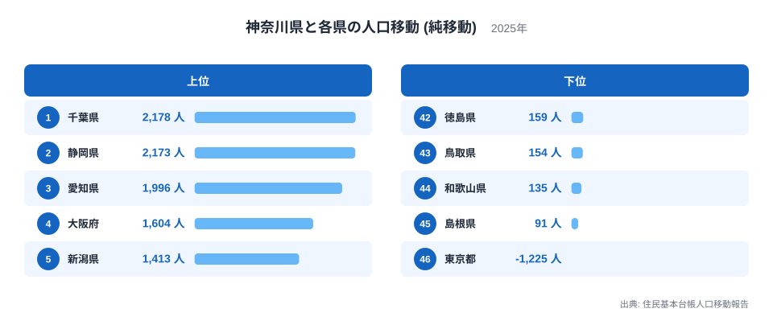
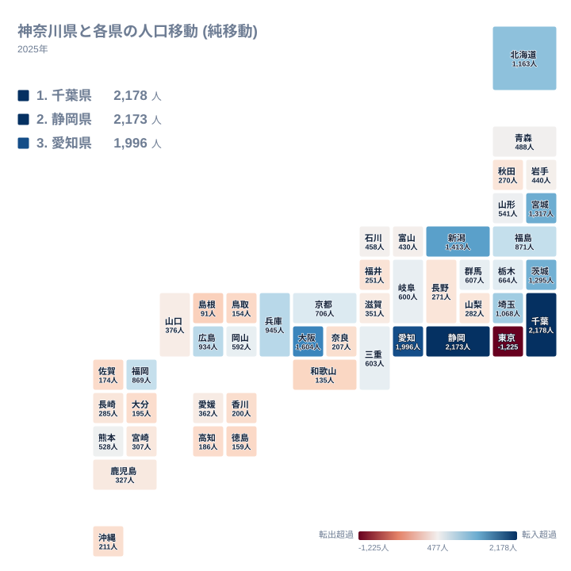
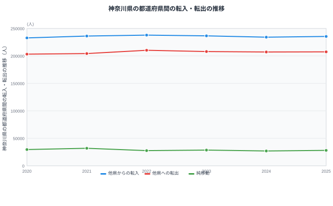

神奈川県は住民基本台帳人口移動報告の集計上、東京都・埼玉県・千葉県とともに首都圏を構成する県のひとつです。都道府県間の純移動データを見ると、神奈川県は全国46都道府県のうち45県との間で純移動がプラスになっています。全国のほとんどの県から人を集めている神奈川県ですが、唯一の例外が東京都です。

純移動とは、ある県から見て別の県との間で転入した人数から転出した人数を引いた差のことです。実際に移動した人の総数ではなく、あくまで差し引きの結果である点に注意してください。この記事では神奈川県と各県の純移動データをもとに、神奈川県がなぜ東京都に対してだけマイナスになるのかを見ていきます。

## 相手県別にみる純移動

<source-link href="/ranking/moving-in-excess-rate">転入超過率ランキング</source-link>

神奈川県が最も多くの人を得ている相手は千葉県で、純移動は2,178人です。2位は静岡県で2,173人、3位は愛知県で1,996人、4位は大阪府で1,604人、5位は新潟県で1,413人と続きます。上位には千葉県のような同じ首都圏の県だけでなく、静岡県や愛知県、大阪府といった他の大都市圏の県も並んでおり、神奈川県が全国のさまざまな地域から人を集めていることがわかります。この規模感は、転入超過率ランキングで見た神奈川県の全国的な位置づけとも重なります。

さらに6位は宮城県で1,317人、7位は茨城県で1,295人、8位は北海道で1,163人、9位は埼玉県で1,068人、10位は兵庫県で945人と続きます。上位10県だけを見ても関東・東北・北海道・関西に広く分散しており、神奈川県が特定の地方だけでなく、日本全国から幅広く人を集める県であることがわかります。

そして46位にあたる東京都は、純移動がマイナス1,225人です。これは全46県の中で唯一マイナスとなっている数値であり、45位までのどの県よりも際立って異質な結果です。神奈川県は全国のほぼすべての県から人を集める一方、東京都に対してだけは人を送り出す側に回っている構図がここに現れています。

> [!NOTE]
> 神奈川県が相手県別ランキングでマイナスとなっているのは、全46県のうち東京都1県だけです。2020年から2025年の6年間、県全体の純移動もすべてプラスで推移しており、特殊な例外は東京都だけだと押さえておくと以降の数字が読みやすくなります。

## 地図でみる純移動の広がり

地図の中で神奈川県自体のマスに色が付いていないのは、神奈川県から神奈川県への移動というデータがそもそも存在しないためです。この地図は神奈川県と、それ以外の46都道府県との関係だけを表しています。

地図全体を見渡すと、青みがかった色で示される純移動プラスの県が北海道から沖縄県まで日本全国に広がっている一方、赤みがかった色に染まっているのは東京都ただ1県だけです。他の記事で見るような「首都圏はプラス、遠方はマイナス」といった単純な地理的傾向は神奈川県には当てはまらず、東京都との関係だけが際立って別の性格を持っていることが地図から見て取れます。

神奈川県が陸で接する県は東京都、山梨県、静岡県の3県です。このうち山梨県は282人のプラスで32位、静岡県は2,173人のプラスで2位と、いずれも神奈川県が人を得ている相手です。隣接する3県のうち唯一マイナスなのが東京都であり、隣接関係の近さだけでは純移動の向きを説明できないことがここでも確認できます。

> [!WARNING]
> 神奈川県が陸で接しているのは東京都・山梨県・静岡県の3県だけですが、純移動が最も大きいのは陸続きではない千葉県で、プラス2,178人です。隣接しているかどうかと純移動の大きさは必ずしも一致しないため、地図上の近さだけで数値を予想しないよう注意してください。

## 東京都との非対称な関係

[神奈川県のデータ](/areas/14000)と[東京都のデータ](/areas/13000)を見比べると、神奈川県が45県との関係でプラスを保ちながら、東京都に対してだけマイナス1,225人という結果になっている理由の一端が見えてきます。神奈川県は横浜市や川崎市を中心に、東京都への通勤・通学圏として機能してきた歴史を持ち、同時に静岡県や愛知県、大阪府など他の大都市圏からも人を集める受け皿としての性格を併せ持っています。

一方で東京都は、神奈川県から見ても、静岡県や愛知県から見ても、さらに首都圏の他の県から見ても、人を引き寄せる力が最も強い存在です。神奈川県が全国の中では有数の「人を集める県」でありながら、東京都との関係だけは「人を送り出す県」に転じるという二面性は、都道府県間の人口移動が単純な都市規模の大小だけで決まるものではなく、より上位の中心地が存在することを示しています。

## 転入・転出の推移

この図は神奈川県と全国すべての県との間でやり取りされた転入・転出・純移動の推移を示しています。他県からの転入は2020年が232,772人、2021年が236,157人、2022年が237,839人、2023年が236,543人、2024年が234,079人、2025年が235,438人と推移しています。他県への転出は2020年が203,198人、2021年が204,313人、2022年が210,275人、2023年が207,937人、2024年が207,116人、2025年が207,386人です。

純移動は2020年が29,574人、2021年が31,844人、2022年が27,564人、2023年が28,606人、2024年が26,963人、2025年が28,052人となっています。6年間すべての年でプラスを維持していますが、2021年をピークにやや縮小傾向にあり、2024年にはこの期間で最も小さい26,963人まで落ち込んだあと、2025年に28,052人へとわずかに持ち直しています。

> [!TIP]
> 神奈川県の純移動が6年連続でプラスであることは、東京都との関係だけを見ていては気づけません。全国合計の推移と、東京都1県との個別の関係は別のグラフとして読み分ける必要があります。全体としては人を集めながら、特定の1県に対してだけは送り出す側に回るという構図は、都道府県間の人口移動を見るうえで見落としやすい視点です。

## まとめ

- 神奈川県が最も人を得ている相手は千葉県で、純移動は2,178人です。
- 神奈川県が唯一マイナスとなる相手は東京都で、純移動はマイナス1,225人です。
- 神奈川県が接する3県のうち、山梨県と静岡県はプラス、東京都だけがマイナスです。
- 全国合計の純移動は2020年から2025年まで6年連続でプラスを維持しています。
- 上位10県は関東・東北・北海道・関西に分散しており、特定の地方に偏らず全国から人を集めています。

神奈川県の人口移動の全体像は、[人口動態のテーマ](/themes/population-dynamics)や[人口・世帯の統計一覧](/category/population)からも確認できます。

## データ出典

- 出典: 住民基本台帳人口移動報告
- 年: 2025年(相手県別の純移動)、2020年から2025年(転入・転出・純移動の推移)
